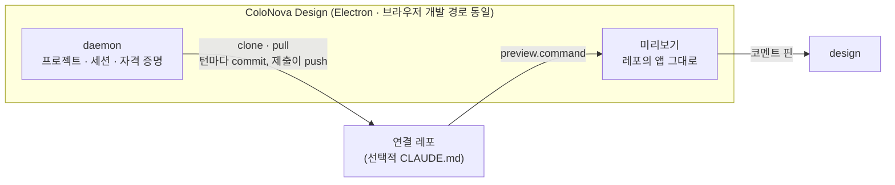

# ColoNova Design 개발자 · 운영자 안내

> 소스를 고치거나 배포하는 사람, 그리고 팀의 서비스를 ColoNova Design 에 연결하려는 개발자를 위한
> 안내다. 사용자 안내는 [README](../README.md) 와 [사용 설명서](GUIDE.md) 에 있다.

## 개발자라면 — 팀에 들이는 데 필요한 것

- **설정 파일은 없다** — `package.json` 에 `dev` 스크립트(없으면 `start` · `serve` · `preview`)와
  커밋된 락파일이면 된다. 포트도 적지 않는다 — 도구가 서버가 뜬 주소를 읽어 낸다.
- **결과는 평범한 풀 리퀘스트로 온다** — 이번 작업의 `colonova-design/<작성자>/<YYYYMMDD>-<n>-<작업ID>` 브랜치에서,
  제목에 작성자 이름을, 본문에 작성자 이름 · 코드는 AI 가 썼다는 줄 · 범위(의존성 · 설정 · CI 를 건드렸는가) · 바뀐 파일 · 사용자가 찍은 핀 · 자동 확인 결과 · 화면 사진을 적어서. 베이스 브랜치에는 절대 쓰지 않는다.
- **리뷰는 평소처럼** — 풀 리퀘스트에 코멘트를 남기면 AI 가 반영해 같은 요청에 다시 올린다.
- **초대는 파일 하나** — 소개 페이지의 [`초대장 만들기`](https://colosseumcoinckr.github.io/colonova-design/#invite)
  폼(연결 코드는 브라우저 메모리에만 있다)이나 `node scripts/make-invite.mjs` 로 만든다.
- **`CLAUDE.md` 다섯 줄이면 더 빨라진다** — 화면이 사는 곳 · 라우트 등록 · 목 데이터 · 자주 쓰는
  컴포넌트 · 검사 명령. AI 가 턴마다 반복하는 검색을 문서가 대신 답한다.
- **AI 도 못 푸는 문제만 개발자에게 온다** — 열린 요청이 있으면 거기에, 없으면 서비스 쪽 게시판에.

→ [연결 레포 만들기](#연결-레포-만들기) · [개발 실행](#개발-실행) · [전체 구조](#전체-구조)

## 개발 실행

```bash
pnpm install
pnpm build

# 터미널 1 — 토큰이 든 client url 을 인쇄한다
pnpm dev:daemon        # … client url: ws://127.0.0.1:7823?token=…

# 터미널 2
pnpm dev:web           # http://127.0.0.1:29173
```

client URL 을 한 번 붙여넣는다(`packages/web/src/ConnectScreen.tsx` — 개발자의 화면이다).
첫 접속은 처음 한 번의 체크리스트(`next/onboarding/FirstRun`)가 창을 쓴다 — 도구 준비 ·
AI 연결 · 초대 파일이 채워지면 저절로 작업 화면으로 넘어간다(`시작하기` 는 없다). 개발
실행도 같은 초대 파일로 시작한다 — `node scripts/make-invite.mjs --repo <GitHub
주소 또는 로컬 경로> --token <PAT> --author <이름>` 로 만들어 놓는다(가져오기는
연결 코드가 `whoAmI` 를 통과하고 푸시할 수 있는 레포가 하나 이상이어야 끝난다).
`pnpm doctor` 는 같은 검사와 활성 프로젝트의 레포 상태를 터미널에서 보고한다.

데스크톱 앱 자체를 고치거나 데스크톱 전용 면(safeStorage 키체인, 웹뷰 미리보기,
메뉴 단축키, 업데이트 다리, OS 알림·배지)을 눈으로 보려면 Electron 을 띄운다 — 위의
브라우저 경로에는 그 면들이 없다.

```bash
# 빠른 고리 — 웹은 vite 가 주고(HMR), 데몬은 앱 안에 그대로 있다.
# 이미 도는 dev:web 이 있으면 그 서버를 그대로 쓰고, 없으면 vite 를 띄운다.
pnpm dev:desktop

# 릴리스와 같은 코드 경로 — 전부 빌드해 web-dist 를 스테이징하고 띄운다
pnpm --filter @colonova-design/desktop dev
```

`pnpm dev:desktop` 은 웹 소스를 고치면 창이 즉시 바뀐다(타입 검사는 건너뛴다 —
`pnpm typecheck` 는 따로 돌린다). 데스크톱 메인 · 프리로드를 고치면 두 실행
경로 모두 다시 빌드해 앱을 재시작한다(빌드가 깨지면 지금 도는 앱을 그대로
둔다) — 데몬 · 프로토콜을 고치면 다시 실행해야 한다. 창이 다른 origin 을
여는 문은 `app.isPackaged` 가 아닌 실행에서만 열린다 — 패키징된 앱은
`COLONOVA_DESIGN_DEV_SERVER` 를 보지 않는다.

**요구 사항** — 로그인된 에이전트 CLI 하나 이상(Claude Code `claude /login` · Codex),
git, 그리고 Claude 를
쓸 때는 데몬 환경에 `ANTHROPIC_API_KEY` 가 없을 것. Node(22 이상) + pnpm 은 데스크톱
앱에 포함되어 나오고, 브라우저 개발 경로에서는 온보딩의 Node·pnpm 게이트가 검사한다.
연결 레포의 `.npmrc` 가 private 레지스트리를 가리키면 그것을 읽을 `read:packages`
인증이 기계에 필요하다 — 없으면 데몬 상태의 경고 줄이 한국어로 그렇게 말한다. 인증이 통하는지는
**그 레포가 그 스코프에서 가져오는 의존성 하나**로 시험한다(루트 `package.json` 에 그런 의존성이
없으면 시험도 경고도 없다) — 어느 레포에나 같은 패키지를 물으면 그 패키지를 안 쓰는 레포는
공개 레지스트리의 404 만 받아 거짓 경고를 얻고 제 진짜 401 은 가려진다.

**브라우저 도구 상자**(AI 에게 MCP 로 실린다)의 요약 — 스냅샷은 한 줄 표기로
읽고, 액션의 답은 바뀐 줄의 요약으로 오며, 같은 요소는 같은 ref 를 유지한다. 화면 전체를 다시 읽는 대신 찾기
(`browser_find`)로 좁히고 조사(`browser_inspect`)로 요소의 정체를 보며, 화면의
파일(`screen_files` — 레포의 파일 구조에서 주소와 같은 이름의 파일을 `(주소)` 줄로
먼저 내놓는다), 타입 진단(`repo_diagnostics`), 개발자 쪽지(`notify_developer`)도 같은
상자에 산다.

## 도구가 기계에 남기는 것

도구가 쓰는 모든 것은 홈의 숨은 폴더 하나 `~/.colonova-design/` 에 산다.

| 경로 | 무엇이 있는가 |
| --- | --- |
| `~/.colonova-design/config/` | `daemon.json` (host/port/token), `projects.json` (레지스트리) — 전부 0600, 비밀 없음(그건 OS 저장소로 간다) |
| `~/.colonova-design/logs/` | 데몬의 하루 로그(`daemon-YYYY-MM-DD.log`, 7일 보존) — 값과 문장(message) 모두에서 비밀·이메일·계정 경로를 `~/{path}` 따위로 눌러 닫는다(2026-10-02). 설정 → `개발자용` 의 `로그 폴더 열기`가 여기를 연다 |
| `~/.colonova-design/logs/turn-stats-YYYY-MM-DD.jsonl` | 턴 통계 — 한 턴의 종류(사람 말 · 핀 · 게이트) · 길이 · 도구 묶음별 호출 수 · 컨텍스트 토큰 · 첫 답까지(`firstDeltaMs`)·첫 편집까지(`firstEditMs`) · 실패 단계(`failure` — `length · auth · account · limit · stream · other`, `account` 는 2026-10-07) · 핀 턴의 payload 크기(`pinBytes`) · 핀 후보 적중 여부(`pinHit` — 파일 경로는 남기지 않는다) · 브라우저 도구에 쓴 시간(`browserMs`)과 op 실패 종류 수(`browserFail` — 낡은 ref · 시간 초과 · 거절 · 창 없음 · 그 밖, 0인 종류는 칸에서 뺀다)와 그 턴의 `screen_check` 가 만난 로그인 벽 수(`loginWall`, 없으면 칸이 없다). 게이트 행(`gateset`)은 판정 상세(빈 화면·휴대폰 폭 넘침(`overflow`)·새 접근성 문제(`a11y`)·콘솔 오류·실패한 요청 수, `rescued`)·로그인 화면으로 튕겨 확인한 화면으로도 문제로도 세지 않은 수(`loginWall` — 횟수만, 주소 · 경로는 남기지 않는다)와 돌지 못한 이유(`skipped`), 바뀐 파일에서 되짚은 화면 수(`fallback`)와 타입 검사(`typeErrors` · `typeMs` — 이번에 바뀐 파일의 오류 수와 검사 시간, 검사가 끝났으면 0도)를 더 남긴다. 턴 행은 그 턴의 토큰(`tokens` — 캐시를 뺀 새 입력 · 출력 · 캐시 읽기 · 캐시 쓰기) · 추정 비용(`costUsd`, 정가 기준 — Claude 만) · 캐시 적중률(`cacheHitRate`)도 싣는다(2026-10-02) — 프로바이더가 알려 주지 않은 턴은 null 이지 0 이 아니다. 무엇이 턴을 느리게 하고 비싸게 하는지 재는 잣자리로, 사용자의 말도 화면도 남기지 않는다(7일 보존) |
| `~/.colonova-design/projects/<slug>/screen-map.jsonl` | 라우트↔파일 관찰 지도 — 그 화면을 고친 커밋이 건드린 파일(sha 와 함께). 정체 검색이 빈손인 핀의 마지막 후보 길이다(500행 상한) |
| `~/.colonova-design/projects/<slug>/tsc.tsbuildinfo` | 증분 타입 검사(`tsc --noEmit --incremental`)의 빌드 정보 — 클론 밖에 두어 `git status` 를 깨끗하게 한다. 편집 사이사이의 몇 초 답(`repo_diagnostics`)과 게이트의 타입 절이 함께 쓴다 |
| `~/.colonova-design/projects/<slug>/cycle.json` | 사이클 원장 — 제출 의도 · 푸시 밀림 · 코멘트 장부 · 자동 검사 반영 장부(브리프한 head) · 예산 · 끝난 요청 · 반영된 일(`landed`, 최근 20건 — 사용자의 말(제목)이 담기는 곳이 이 원장이고 로그 · 통계에는 싣지 않는다). 어디서 끊겨도 다음 시작이 이어받는다 |
| `~/.colonova-design/projects/<slug>/repo/` | 그 프로젝트의 연결 레포 클론 |

`<slug>` 는 프로젝트 이름에서 만든 폴더 이름이다(2026-10-07) — 영숫자와 `-` `_` `.` 만으로 된 이름은 읽히는
그대로(`my-app`), 그 밖의 글자(한글 포함)가 하나라도 있으면 뒤에 이름의 해시 6자리가 붙는다(`결제-3f9a1c`).
화면의 이름은 그대로고 디스크 폴더에만 붙는다. 까닭은 「프로젝트와 목록」의 `폴더 이름(slug)`.

설정의 `개발자용` 쪽 → `폴더 열기` 가 이 폴더를 연다(F1) — 진단 도구는 왼쪽 목록의
맨 아래에 따로 앉아 있어 기본으로 열리는 쪽이 아니다.

데스크톱의 설정 → 연결 → `전체 초기화…`는 기본 확인 창의 동의를 받아 앱을 정상 종료하고, 다음 실행에서 데몬을 시작하기 전에 초기화한다. 지우는 것은 `~/.colonova-design/` 전체다 — 해당 클론의 Claude·Codex 대화, Electron의 설정·연결 코드·브라우저 저장 데이터를 포함한다. 원격 저장소·PR과 AI 로그인은 유지된다. 완료 전에는 `userData/reset-pending`을 남겨 실패한 정리를 다음 실행에 다시 시도한다. 별도 프로젝트 위치나 연결 정보를 환경 변수로 지정한 개발 실행은 초기화를 거절한다.

**0.4.0 의 개명은 완전 단절이다.** Colo Design(0.3.x)의 데이터를 읽거나 옮기지
않는다 — 데이터 폴더는 `~/.colonova-design/` 에서, userData 는 `…/ColoNova Design` 에서
새로 시작한다. Windows 설치 정체성(appId)이 바뀌므로 NSIS
include(`packages/desktop/build/installer.nsh`)가 옛 GUID 설치를 설치 맨 앞에서
지운다 — 병설이 아니라 정리된 교체다. 쓰기 값(마커 · 브랜치 · 키 · 채널 · 환경
변수)이 하나의 이름만 쓰는지는 `colonova-names` 시험이 지킨다.

* 초대 파일은 새 확장자 `*.colonova-invite` 만 받는다 — 옛 `*.colo-invite` 초대장은 다시 만들어 보내야 한다.

쓸 만한 환경 변수 오버라이드(모두 선택, 모두 테스트로 검증됨):

| 환경 변수 | 기본값 | 역할 |
| --- | --- | --- |
| `COLONOVA_DESIGN_DATA_DIR` | `~/.colonova-design` | 모든 데이터의 뿌리(2026-10-02 표에 더했다). 아래 대부분 기본값의 앞머리다 |
| `COLONOVA_DESIGN_PROJECTS_SETTINGS` | `~/.colonova-design/config/projects.json` | 프로젝트 레지스트리 파일 |
| `COLONOVA_DESIGN_PROJECTS_DIR` | `~/.colonova-design/projects` | 프로젝트 폴더의 위치 |
| `COLONOVA_DESIGN_REPO_DIR` | `<project>/repo` | **활성** 프로젝트의 클론 디렉터리 |
| `COLONOVA_DESIGN_REPO_URL` | 레지스트리 | **활성** 프로젝트의 레포 url(테스트는 fixture 원격을 쓴다) |
| `COLONOVA_DESIGN_OPEN_BIN` | `open`/`xdg-open`/`explorer` | 사이드바 프로젝트 카드의 `폴더 열기`가 쓰는 프로그램(테스트는 기록 스텁을 쓴다) |
| `COLONOVA_DESIGN_CLAUDE_BIN` · `…_CODEX_BIN` | 자동 탐지 | 구동할 각 에이전트 CLI 바이너리 |
| `COLONOVA_DESIGN_GITHUB_FIXTURE` | unset | 녹화된 GitHub REST 짝(오프라인 넘기기 테스트) |
| `COLONOVA_DESIGN_GITHUB_SLUG` | 레포 url 에서 | 넘기기가 겨눌 `owner/repo`; 테스트는 로컬 bare 원격을 클론하니 url 에 GitHub 프로젝트가 없다 |
| `COLONOVA_DESIGN_CREDENTIAL_STORE` | 플랫폼 기본 | `memory` (테스트) 또는 `keychain` |
| `COLONOVA_DESIGN_EXTRA_PATH` | unset | repo 명령의 PATH 접두어(데스크톱이 설정한다) |
| `COLONOVA_DESIGN_COMMAND_STALL_MS` | `300000` | 레포 명령이 아무 말도 하지 않아도 기다리는 시간(설치 정지 감시) |
| `COLONOVA_DESIGN_ENFORCE_REPO_SETTINGS` | unset(신뢰) | `1`(또는 `true`)이면 연결 레포가 실어 보낸 에이전트 설정(Claude Code)의 권한 확장 키를 절단하고 검역 기록과 함께 경고한다 — 외부 레포를 받는 배포용. 기본은 레포 파일을 그대로 두고 절단도 경고도 하지 않는다 |
| `COLONOVA_DESIGN_DEV_AGENTS` | unset(끔) | `1` 이면 개발 실행으로 선다(`DaemonStatus.dev` — 개발 전용 면). 프로바이더 목록과는 무관하다. `pnpm dev:daemon` 이 켜고, 데스크톱은 `app.isPackaged` 가 아닌 실행에서 스스로 켠다(패키징된 앱은 절대) |
| `COLONOVA_DESIGN_CLAUDE_INSTALL_CMD` | unset | 설치 스크립트 대신 이 명령을 셸로 돌린다 — 검증용(성공·실패·느린 진행을 흉내 낸다) |
| `COLONOVA_DESIGN_CODEX_RELEASE_API` | unset | Codex 릴리스 API 주소 — 검증용(로컬 서버가 JSON 을 내어 준다). 설치와 업데이트 확인이 함께 쓴다 |
| `COLONOVA_DESIGN_CLAUDE_LATEST_API` | downloads.claude.ai 의 `latest` | Claude Code 최신 버전을 읽는 주소 — 검증용(업데이트 줄의 `→ 새 버전 있어요`) |
| `COLONOVA_DESIGN_PORT` | 임시 포트 | 데몬이 들 포트 — 포트가 막혔을 때 데몬의 안내 문구도 이 이름을 말한다 |
| `COLONOVA_DESIGN_DEV_SERVER` | unset | 데스크톱 HMR 고리(`pnpm dev:desktop`)가 여는 vite 주소 — 패키징된 앱은 보지 않는다 |
| `COLONOVA_DESIGN_BENCH_ENDPOINT` | unset | 개발 실행의 데스크톱이 재생 벤치의 접속 파일(ws 주소 · pid)을 적는 자리 — 패키징된 앱은 절대 보지 않는다 |
| `COLONOVA_DESIGN_GIT_BIN` | 자동 탐지 | git 바이너리를 이 경로로 고정한다 — 탐색을 통째로 건너뛴다(테스트는 스텁을 겨눈다) |
| `COLONOVA_DESIGN_GIT_GUARD_DIR` | `~/.colonova-design/tools/git-guard` | git 쓰기 가드(hooks)의 설치 자리 — AI 의 git 쓰기를 막는다 |
| `COLONOVA_DESIGN_LANE_STRICT` | unset(경고) | `1` 이면 차선 밖 git 쓰기를 경고 대신 던진다(시험·개발) |
| `COLONOVA_DESIGN_REPO_PAT` | OS 저장소 | 기계 전체의 GitHub 토큰 — 자격 증명 저장소보다 앞선다 |
| `COLONOVA_DESIGN_GITHUB_API` | `https://api.github.com` | GitHub REST 주소(테스트는 로컬 서버로) — `scripts/make-invite.mjs` 의 사전 점검도 읽는다 |
| `COLONOVA_DESIGN_READY_TIMEOUT_MS` | `120000` | 미리보기가 준비될 때까지 기다리는 벽시계 상한 |
| `COLONOVA_DESIGN_LOG_DIR` | `~/.colonova-design/logs` | 하루 로그와 턴 통계가 적히는 폴더 |
| `COLONOVA_DESIGN_PIN_EFFORT` | unset(끔) | 핀으로 시작하는 턴의 첫 노력 자세 — 턴 통계가 재는 실험줄. 없으면 아무 일도 일어나지 않는다 |
| `COLONOVA_DESIGN_REPO_SETTINGS` · `…_NPMRC` · `…_RUN_DIR` · `…_UNDO_LOG` · `…_PERMISSION_LOG` · `…_PLAN_USAGE` | 기본 자리 | 각 저장 파일(repo.json · 사용자 `.npmrc` · run · undo · 권한 반복 · 계획 사용량)의 자리 — 테스트가 일회용 파일로 가리킨다 |

## 상세 동작

### 만들고 고치는 루프

화면을 만드는 것과 고치는 것은 같은 턴이다. 새 대화는 사이드바의 `새 대화` · 팔레트 ·
⌘T 어디로든 열린다. 코멘트 핀은 ⌥+클릭으로 언제든 찍고, 보낸 핀은 턴이 끝나면 화면을
떠난다. 사람이 누르는 배치 동작은 **제출** 하나다 — 보관(커밋)은 답을 낸 턴마다 도구가
스스로 한다. 제출 버튼은 상태 줄에 언제나 그려지고, 잠겼을 때 누르면 이유가 버튼 아래
한 줄로 선다(`journey.submit.reason`). 변경 건수는 클론 준비 · 화면 턴 종료 · 보관 완료
세 트리거로 갱신된다 — 폴링 없음.

대화 칸 맨 아래의 진행 줄(`chat/RunLine.tsx`, `role="status"`)은 단계 말 · `k/n 단계` · 시계를 싣는다(2026-10-06 UX 점검). 단계 말은 `lib/making.ts` 의
`makingPhase`(마지막 사용자 말 뒤에서 아직 도는 도구의 묶음 — 없으면 그 턴의 마지막 도구)가 고르고 `makingWordOf` 가 `L.journey.making*` 의 말로 옮긴다. 상태 줄의 알약과
같은 규칙이라 둘 다 `use-held-phase.ts` 의 `useHeldPhase` 를 쓴다 — 말은 `MAKING_HOLD_MS`(1.5초) 이상 살고, 시간이 차면 지금의 묶음으로 곧장 갈아입는다(그 사이는 건너뛴다).
꺼진 동안은 말을 얼려 두고(알약의 체크 600ms), 켜지는 렌더에서 곧장 비운다 — 지난 턴의 말이 새 턴의 첫 화면에 비치지 않는다.
`k/n` 은 `lib/todo-plan.ts` 의 `currentTodoProgress` 가 센다 — **마지막 사용자 말 뒤의 TodoWrite 만** 보고(지난 턴의 `5/5` 가 이번 턴에 서면 거짓), 하위 에이전트의 목록은 빼며
(제 일의 목록이라 숫자가 뒤로 간다), 새 목록의 입력이 덜 와서 읽히지 않으면 앞의 목록을 쓴다. 목록이 `MIN_TODO_STEPS`(2) 보다 짧으면 null — 단계로 말하지 않는다.
화면에는 숫자만 오고 항목의 글은 오지 않는다(AI 의 항목에는 개발 말이 섞이기 쉽다). 견본은 `thread-fixture.html?scene=working`.

답이 어긋나면 정산 줄의 `여기서 새 대화` 로 갈라 선다 — 이 답까지를 남기는 포크다.
절단 재개가 가능한 프로바이더(Claude · Codex)에서만 단추가 보이고, 원래 대화는
지워지지 않으며, 파일은 되돌리지 않는다(줄 위의 한 문장이 그렇게 말하고, 같은 줄의
`작업 기록에서 되돌리기` 가 화면을 되돌리는 문이다). 반영되면 그 사이클의 작업 기록은
사라진다 — 머지를 거슬러 되돌아갈 수 없으므로. 대화 내보내기(`lib/transcript-export.ts`의 markdown)는 사이드바 대화 행 메뉴에서 연다.
핀 질문과 자동 검사 요청도 원래 순서대로 함께 내보낸다.

**데몬이 대화에 내려놓는 알림(`kind: "notice"`)의 말투**(2026-10-08 베타 준비 분석). 읽는 사람이 셋이다 — 사용자(앞의 한
줄이 대화록에 그대로 선다 → 해요체 · 사용자의 어휘), AI(표식 턴의 몸 · 도구 결과), 개발자(로그 · 개발자 알림). 웹이 첫머리로
알아보고 제 문장으로 바꿔 그리는 **표식** 셋(`L.daemonNotice`: `일시적인 문제입니다` · `사용량이 다시 채워지는대로` ·
`AI 프로그램을 다시 켰어요`)은 한 글자도 바꾸지 않는다 — 어긋나면 데몬의 문장이 그대로 보인다. `notice-voice.test.ts` 가 표식의
일치와 나머지 알림의 말투를 지킨다. 모든 RPC 거절이 지나는 `asPlannerFacingError` 의 문장도 같다. 그 밖의 거절 문장
(`throw new Error("…습니다")` — 설정 · 로그인 · 분기 · 되돌리기의 거절 등)에는 합쇼체와 개발 어휘가 남아 있다 — 웹이 먼저 막는
길이라 보일 일이 드물고, 일괄 치환은 표식 · 시험을 건드릴 위험이 있어 고치지 않았다.

### 첨부

입력창은 그림 외의 파일도 받는다 — 한 건 8MB, 대기열 저장소의 항목 예산과 같은 값.
배달은 mediaType 이 정한다: `image/*` 는 비전 블록(그림은 디스크에도 적힌다 — 아래), 디코드되는 텍스트는 턴의 말에
`<attachment>` 섹션으로 인라인된다. 예산(256KB) 안이면 전문이고, 넘으면 앞부분만
실리고 `잘렸다 — 나머지는 이 경로의 파일로 이어 읽으라` 는 표식과 절대 경로가 함께
간다(모델이 스스로 파일을 열어 이어 읽게 하는 resultBudget 방식). 그 밖의 것
(PDF · 압축 파일)은 디스크에 적힌 뒤 절대 경로가 같은 섹션으로 건네진다 — 어느 SDK 도
임의 바이너리 블록을 받지 않으므로, 파일 도구를 가진 에이전트가 직접 읽는 길이 전
프로바이더에서 동작한다. 적히는 곳은 클론의 `.git` 안(`git status` 가 보지 않는 유일한
공간)이고, 적은 지 7일이 지난 파일은 다음 적기 때 거둔다. 대기줄과 잃어낸 보내기는
그림과 파일을 따로 세고(`이미지 2장 · 파일 1개`), 다시 보내는 턴은 첨부를 그대로
되살린다. 대화록 카드와 내보낸 markdown 은 파일 이름을 나열한다 — 그림 썸네일과 같은
자리다. 다시 연 대화의 재생은 벤더 대화록이 AI 가 받은 글 그대로라 말 끝의 `<attachment …>` 섹션(저장 경로 · 안내 문장 ·
텍스트 첨부의 본문)이 말풍선과 내보낸 글에 사용자의 말처럼 서던 것을 걷는다 — 보던 화면 꼬리(아래 「AI 가 읽는 글에는 보던 화면 한
줄이 붙는다」)를 떼는 자리와 같다(2026-10-08 검토 · F10). 첨부는 위의 칸(`images` · `files`)이 말한다.

**그림도 디스크에 놓인다**(2026-10-07 베타 준비 분석). 예전에는 그림이 비전 블록뿐이라 AI 는 그림을 볼 수는 있어도
파일을 줄 수 없었다 — `이 로고로 바꿔 줘` 가 안 됐다. 이제 사용자가 고른 그림은 비전 블록으로 가면서 같은 `.git` 안의
자리에 적히고, 경로가 말의 `<attachment name type path>` 섹션에 `이 이미지는 이 경로에 저장됐어요 — 사용자가 화면에
넣어 달라고 하면 이 파일을 레포의 에셋 자리로 복사해 쓰세요` 로 실린다(`prepareAttachments`, 섹션은 붙인 순서 그대로).
공통 규칙의 문서 파일 불릿(`읽는 용도로만 쓴다 — 레포에 복사해 남기지 않는다`)은 문서에 그대로이고 끝에 한 구절만
더했다 — 그림은 사용자가 화면에 넣어 달라고 한 것만 복사한다(새 불릿 없이 2,160 → 2,211자). AI 의 쓰기 울타리
(`write-guard.ts`)와는 부딪히지 않는다 — 이 자리는 읽기 · 복사의 원본이고 복사는 클론 안으로 쓴다. 놓지 않는 그림:
기계가 쓴 턴(화면 확인 · 오류 · 브리프 — `comments` 는 뺀다)이 실은 화면 사진과 핀의 크롭(`pin-<id>.jpg`)은 보기만
한다. 핀 옆에 새 로고를 붙이는 `comments` 턴의 로고는 놓인다. 붙여넣은 그림은 모두 `image.png` 라 이름이 겹쳐도
덮어쓰지 않게 적는 순서의 번호가 파일 이름에 든다. 적지 못해도(디스크 · 권한) 그림은 비전 블록으로 가고 턴은
막히지 않는다(문서 첨부와 달리). 거둠은 문서와 같다 — 7일이 지나면 다음 적기나 감독자의 하루 한 번 청소
(`pruneStagedAttachments`)가 지운다. 그림만 보낸 첫 턴의 글은 섹션뿐이라 제목 파생이 `<attachment` 여는 줄을
건너뛴다(`meaningfulFirstLine` · Claude 드라이버의 `presentableTitle`). 한계: 웹이 긴 변 1568px 를 넘는 그림은 줄여서
보내므로 저장된 파일도 줄어든 것이다. docx · hwp 같은 읽을 수 없는 문서는 이번 범위 밖이다 — 지금은 바이너리와 같이
`첨부 파일이 이 경로에 저장됐습니다 — 파일 도구로 읽어 주세요` 한 줄이 가고(AI 에게만 보이는 말), 사용자에게 읽지
못했다고 알리는 고정 문장은 없다 — AI 가 제 말로 밝힌다(추정, 베타에서 확인).

### 자동 보관 · 제출 · 반영됨

사용자가 읽는 말은 **제출**과 **반영됨** 둘이다. 브랜치, 커밋, 푸시, PR, 머지는
읽지 않는다 — `저장` · `넘기기` 라는 중간 단어도 없앴다.

- **자동 보관(커밋)** — 답을 낸 턴이 끝날 때마다 데몬이 스스로 커밋한다. 첫 커밋이
  이번 사이클의 `colonova-design/<작성자>/<YYYYMMDD>-<n>-<작업ID>` 브랜치를 만든다.
  작성자는 설정의 이름에서 금칙 문자를 정리한 값이고, 비면 `user`다. 작업ID는
  새 작업마다 생성하는 무작위 16자리 16진수로 동명이인과 동시 작업의 충돌 가능성을
  낮춘다. 날짜는 로컬 날짜이며, 번호는 로컬 · 원격에 같은 이름이 있으면 올린다.
  원격 조회가 실패하면 첫 후보를 건너뛰고 로컬만 확인한다. 이미 시작한 작업은
  기록된 이름으로 이어 간다. 베이스 브랜치에는 절대 쓰지 않는다. 커밋 제목은 **그 턴을 연
  사용자의 말** 첫 줄이다 — 제목을 받으려고 모델 턴을 하나 더 돌리지 않는다(매 턴
  돌리면 구독이 두 배로 탄다). 푸시는 백그라운드이고, 실패하면 30 초 간격 세 번 다시 민다(D6): 오프라인에서
  턴의 끝이 멈추지 않으면서 잠깐의 끊김은 스스로 아문다. 세 번 다 실패한 밀린 커밋은
  네트워크 동사(fetch · push · clone · pull · ls-remote)는 5 분의 침묵 예산을
  건다(2026-10-02) — 끊긴 소켓이 차선 전체를 영원히 붙잡지 않게. 진행
  출력(--progress)이 흐르는 동안에는 시계가 다시 찬다.
  화면 확인 게이트가 걸린 턴은 게이트의 판정이 끝난 **뒤**에 한 번만 커밋한다.
- **제출(개발자에게 넘기기)** — 남은 것까지 담고 푸시를 **기다린 뒤** 풀 리퀘스트를
  열어, 본문의 도구 구간에 작성자 이름 · 한마디 · AI 작성 줄 · 범위 · 바뀐 파일 · 사용자가 찍은 핀 · 자동 확인 결과 · 화면 사진을 적는다(아래). 푸시 실패를 게이트로
  올리는 길은 이것뿐이다. 이후의 보관은 같은 풀 리퀘스트에 쌓인다.
  새 PR의 제목은 `feat(members): 회원 목록에 이름 검색 추가 (작성: 김기획)`처럼 `type(scope): 변경 (작성: 이름)` 형식이다. scope는 생략할 수 있고, 설정에 이름이 없으면 작성자 표기도 생략한다. AI는 요청 메모와 파일 목록, 크기를 제한한 최종 diff를 읽어 변경 이유와 결과를 설명한다. 되돌린 작업과 근거 없는 테스트·배포 결과는 적지 않도록 지시한다. 초안을 만들지 못하면 첫 커밋 제목을 쓰고, 형식이 없으면 `chore:`를 붙인다. 작성자는 도구가 붙이며 전체 제목은 최대 72자다. 작성자 자리만큼 변경 제목을 줄이고, 이름이 32자를 넘으면 앞 31자와 `…`로 표시한다. 본문에는 이름 전체를 적는다. 다시 제출할 때는 기존 제목과 도구 구간 밖의 본문을 보존한다.
  본문의 도구 구간(`<!-- colonova-design:start/end -->`)은 작성자 줄(`> 작성:`)과 한마디(`> 한마디:`) 아래에 AI 작성 줄 → `### 범위` → `### 바뀐 파일` → `### 수정 요청`(핀 — 화면 id 와 메모, 요소 이름 · 경로는 쓰지 않는다 D38) → `### 확인한 것` → `### 화면 미리보기`(사진 링크) 순으로 서고, 비는 절은 없다. `### 확인한 것`(2026-10-07 UX 점검 3단계)은 이번 제출에 담긴 화면 작업(화면 지도의 보관 하나 — `summarizeChecks`)마다 그 턴의 자동 확인이 문제 없이 지났다는 기록(`GateChecked`)을 센다: 턴이 끝나 보관할 때 서버가 `autoSaveTurn` 으로 화면 지도 행(`screen-map.jsonl` 의 `checked`)에 적고, `CycleScreens` 가 `cycleScreens[].checked` 로 실어 `handoffToolBlock` 이 센다. 하는 말은 도구가 한 것(다시 열어 본 것)뿐이다 — 문제를 찾았거나 확인하지 못한 턴은 기록이 없고, 기록이 하나도 없으면 절이 없다. 접근성 · 대비는 지난번에 본 문제를 다시 말하지 않으므로 「새로 찾은 문제가 없었다」 고만 하고, 휴대폰 폭은 기록이 있는 작업이 모두 봤을 때만 말하며, 레포의 검사 · 빌드는 이 확인에 들어 있지 않다고 밝힌다. 화면 이름 · 요소 · 경로는 쓰지 않는다 — 숫자뿐이다(D38). 문제를 찾아 고침 턴이 열린 작업은 원래 턴의 보관에 기록이 없다 — 고침 턴의 보관이 따로 있으면 그것이 따로 한 건으로 세어진다(고침의 판정은 그 턴의 `requestId` 에 있고 원래 요청으로 이어 붙이지 않는다). 구간은 제출마다 새로 짜므로 기록이 없어지면 절도 거두어진다. 수정 전 사진을 본문에 싣는 일과 사진을 본문에 직접 그리는 일은 아직 하지 않는다 — 비공개 레포의 요청 본문에서 사진이 그려지는지 확인하지 못했고(깨진 그림이 모든 요청에 서는 위험), 수정 전 사진은 요청마다 따로 잡은 것이라(요청당 화면 4곳까지, 프로젝트당 40건 · 100MB 까지 두고 오래된 것부터 지운다) 비어 있을 수 있다.
  본문의 **범위 · AI 작성 줄 · 타입 검사**(2026-10-07 베타 준비 분석)는 개발자가 AI 가 만든 요청을 믿고 병합할지를 본문에서 정하게 하는 근거다. 하지 않은 것을 말하지 않는 원칙(`### 확인한 것` 과 같다)의 연장으로, 도구가 한 것과 아는 사실만 말한다.
  `### 범위`(`buildScopeSection`)는 `### 바뀐 파일` 이 읽는 같은 numstat 을 경로의 모양으로만 가른다 — 새 git 호출이 없고 파일 내용은 읽지 않는다. 분류 표는 `SCOPE_RULES` 한 곳이고 순서가 우선순위이자 본문에 서는 차례다: 락파일(`pnpm-lock.yaml` · `package-lock.json` · `yarn.lock` · `bun.lock` · `Cargo.lock` …) → 의존성 정의(`package.json` · `requirements.txt` · `pyproject.toml` · `Cargo.toml` · `go.mod` …) → CI · 배포(`.github/workflows/**` · `.github/actions/**` · `.gitlab-ci.yml` · `Jenkinsfile` · `.circleci/**` …) → 설정(`*.config.*` · `tsconfig*.json` · `.eslintrc*` · `biome.json` · `.env*` · `Dockerfile` · `vercel.json` · `netlify.toml` …). 표에 없는 파일은 `그 밖` 이다 — 모르는 것을 위험으로 몰지 않는다. 이름 바꿈(`a => b`)은 바뀌기 전 · 후의 두 경로를 모두 본다.
  위험 분류가 하나라도 있으면 머리줄에 ⚠ 를 세우고, 그 분류의 파일 이름만 다섯까지 늘어놓는다(넘으면 `외 N개`). 공통 규칙상 AI 는 락파일을 고치지 않으므로 락파일이 서 있는 것 자체가 신호라 표의 맨 앞이다. `package.json` 은 파일이 바뀐 것만 알고 어느 항목(의존성 · 스크립트)인지는 읽지 않는다고 밝힌다 — 그것까지 말하려면 diff 를 받아야 하고 아직 하지 않는다. `.env*` 도 내용이 아니라 파일이 건드려졌다는 사실뿐이다. 위험이 하나도 없으면 `의존성 · 설정 · CI 파일은 건드리지 않았습니다` 한 줄이 선다 — 개발자가 안심하는 근거다. 단 목록을 믿을 수 없으면 그 말을 하지 않는다: numstat 출력이 데몬의 git 출력 보관 상한(100만 글자 — `repo-core` 의 `capture` 가 뒤쪽만 쥔다)에 닿았거나 못 읽은 줄이 있으면 `잘려서 확인하지 못했습니다` 라고 하고, 그 안에서 찾은 위험은 `더 있을 수 있다` 는 말과 함께 말한다. 읽은 파일이 없으면 절이 없다.
  AI 작성 줄(`buildAiLine`)은 `코드는 AI 가 썼고, 요청한 사람은 코드가 아니라 화면으로 확인했습니다.` 한 줄이고 한마디의 인용 밖에 선다(인용 안에 두면 `readToolNote` 가 한마디로 되읽는다). 종류(`AI(Claude Code)`)는 이번 제출에 담긴 화면 작업이 **모두** 공급자를 알 때만 싣는다: `autoSaveTurn` 이 보관 때 세션의 공급자 id(`claude` · `codex`)를 화면 지도 행의 `provider` 에 적고, `CycleScreens` 가 `cycleScreens[].provider` 로 실어 `aiKindsOf` 가 이름으로 바꾼다. 하나라도 모르면(옛 행 · 이름을 모르는 공급자) 이름 없이 `AI 가 썼고` 로만 말한다. 되돌리기 · 병합은 도구가 한 일이라 세지 않고, 코멘트 반영은 AI 가 쓴 코드라 센다 — 이름은 알파벳순이다. 화면 지도에 행이 남지 않는 보관은 세지 않으므로 그 보관의 공급자는 알 수 없다. 모델 이름은 싣지 않는다 — 턴마다 달라질 수 있다.
  `### 확인한 것` 의 타입 검사 한 줄은 게이트가 이미 돌리는 증분 타입 검사의 결과다. 턴이 바꾼 TypeScript 파일이 있을 때만 `tsc --noEmit` 이 돌고 **그 파일들의** 오류만 센다(`typeErrors`) — 레포 전체의 타입 검사가 아니다. 오류 없이 지난 확인 기록에만 `GateChecked.types` 가 적히고(`server.ts` 의 `startGate` — 화면을 열어 본 작업에만 적히므로 화면 없이 타입만 본 턴은 기록이 없다), `summarizeChecks` 가 센 수(`HandoffChecks.types`)로 `타입 검사: 이번 제출에 담긴 화면 작업 N건 중 M건에서 바뀐 TypeScript 파일의 타입 오류가 없었습니다` 를 말한다. 돌지 못한 작업(바뀐 TypeScript 파일이 없음 · 예산 안에 끝나지 않음 · 레포에 타입 검사가 없음)은 `검사 기록이 없습니다` 이고, 하나도 돌지 않았으면 줄이 없다 — 돌리지 않은 검사를 통과라고 말하지 않는다. 레포의 검사 · 빌드는 이 확인에 들어 있지 않다는 문장은 그대로다.
  제출 확인 창은 같은 판정(`extras.scopeRisk`)을 `설정 파일도 함께 바뀌었어요` 한 줄로 말한다 — 사용자는 그 말을 몰라도 되지만 숨기지는 않는다(설정 파일이 화면을 고친 보관에 함께 담기면 `finalOutgoingChanges` 가 그 화면의 것으로 귀속해 `화면에 드러나지 않은 변경` 으로 세지 않는다 — 이 줄이 없으면 확인 창에서 보이지 않는다). 위험 분류가 없으면 줄이 없다. 이미 열린 요청에 더하는 제출은 초안을 읽지 않으므로 이 줄도 없다. 견본: `status-fixture` 의 `?draft=risk`.
  제출 확인 창은 **첫 제출에만** 이 제목과 AI 설명을 `개발자에게는 이렇게 보여요` 상자로 미리 보인다(2026-10-07 UX 점검 3단계). 재료는 `repo.handoffDraft`(짧은 AI 한 번, 8초 목줄, 보관의 끝 표식별 캐시 — 제출 때 감독자가 다시 불러도 같은 글이다)이고, 웹의 `lib/handoff-preview.ts` 가 종류 접두어 · 작성자 꼬리를 떼고 마크다운 기호를 걷어 한 덩이 글로 만든다. 읽기는 `useHandoffDraft` 가 따로 하므로 제출을 붙잡지 않고, 못 읽으면 상자가 서지 않는다. AI 가 제목을 못 쓴 초안은 데몬의 `pickHandoffTitle` 처럼 첫 보관의 제목을 대신 쓰고 그 사실을 말한다. 이미 열린 요청에 더하는 제출은 초안을 읽지 않고 `repo.handoff.title` 만 보인다(제목과 설명은 개발자의 것). 미리 본 글이 제출 때의 글과 같다는 보증은 캐시에 기댄다 — 데몬을 다시 켜면 초안이 다시 쓰여 낱말이 달라질 수 있다.
  영수증의 `보낸 화면`(2026-10-07 UX 점검 3단계)은 사용자가 제출을 누를 때 확인 창이 보인 목록이다 — `repo.submit.sent`(`screens` 1~999 · `titles` 많아야 셋, 각 60자; 선로가 막는다) → 원장의 제출 의도 `submit.sent`(`parseSent` 가 깨진 값을 버린다 — 재시작 뒤의 이어받기도 같은 영수증을 낸다) → 사건 `cycle.handed.sent` → 대화록의 영수증. 데몬은 최종 변경의 귀속(`finalOutgoingChanges`)을 몰라 웹이 정해 건넨다. 확인 창이 없는 대화 제출(`submit_for_review`)에는 이 값이 없고 영수증은 그 줄을 말하지 않는다. 도는 제출에 다시 누르면 의도는 하나 그대로 `sent` 만 새것으로 바뀐다. 막힌 제출이 길어져 그 사이 화면이 더 쌓이면 영수증은 누른 때의 목록을 말한다(실제로는 더 실렸을 수 있다). 기다림이 보이게(2026-10-07 UX 점검 3단계): 요청이 열린 때는 GitHub 의 `created_at` 이 `HandoffStatus.since`(선택 필드, ISO)로 서고 — `refOf`(읽히지 않는 값은 버린다) → 감독자가 요청을 만들 때 · 입양할 때의 `HandoffStatus` → 레지스트리(`projects.ts` 의 `parseHandoff` 가 왕복시킨다) → 선로. 이 변경 전에 열린 요청처럼 `since` 를 모르는 기록은 다음 관찰 틱이 `getPullRequest` 의 값으로 채운다(알고 있는 값은 건드리지 않는다). 웹의 `lib/waiting.ts` 가 `daysSince`(달력으로 센 날수 — 오늘이면 0, `startOfDay` 로 시간대와 서머타임을 따른다)를 계산하고, 오늘의 자정은 `useToday` 가 갈아 끼워 자정을 넘기면 숫자가 저절로 는다. 상태 줄은 `deriveJourney` 의 `waitingDays` 로 받아 **코멘트가 없고 요청이 `open` 일 때만** `· N일째`(N = 날수 + 1, 제출한 날은 붙이지 않는다)를 붙인다 — 코멘트가 오면 그 수가 더 급한 말이고(코멘트 수는 장부에 쌓여 줄지 않으므로 한 번이라도 코멘트가 온 요청은 날수를 말하지 않는다), `changes_requested` 는 공이 우리 쪽이다. 그래서 날수는 요청을 연 뒤 한 번도 말이 없던 기다림, 곧 요청의 나이가 기다린 시간과 같은 경우에만 선다. 홈은 `waitingRows` 가 `open` 인 프로젝트를 오래 기다린 순으로 `지금 진행 중` 에 한 줄씩 세운다(때를 모르면 날수 없이) — 눌러서 가는 줄이라 사용자의 손이 필요한 수(`waitCount` · 사이드바 배지)에는 세지 않는다. 견본: `home-fixture` 의 `?case=g,h`, `status-fixture` 의 `?case=q`.
  받을 개발자를 확인하지 못했다는 줄(`receiptFacts.nobody`)은 첫 제출의 영수증이 **지금의 요청**을 알고 `reviewers` 가 빈 배열일 때만 선다. 데몬이 아는 것은 요청을 만들 때 응답의 `requested_reviewers`(와 도구가 직접 요청한 리뷰어)뿐이고 이후 틱은 이 값을 새로 읽지 않는다 — 리뷰를 마친 개발자는 GitHub 이 이 목록에서 빼므로 새로 읽으면 「받은 사람이 없다」 로 바뀌기 때문이다. 팀 단위 코드 소유자(`requested_teams`)나 늦게 채워지는 지정은 닿지 않을 수 있어 문장은 「없다」 가 아니라 「확인하지 못했다」 를 말하고, 모르는 값(`undefined`)이나 옛 영수증에는 말하지 않는다.
- **반영됨** — 병합이다. 클론이 베이스 브랜치로 돌아오고, 다음 커밋이 새 사이클을 시작한다. 병합된 작업 브랜치는 기본적으로 자동 삭제하며, `lifecycle.deleteMergedBranches: false`이면 원격 브랜치를 남긴다. 이월할 커밋이 있으면 새 작업 브랜치의 푸시가 성공한 뒤 옛 원격 브랜치를 정리한다.

**반영된 일**(2026-10-08 베타 준비 분석 · 성취). 병합은 이 도구가 사용자에게 주는 가장 큰 보상(`내 말이 서비스가 됐다`)인데, 병합 뒤 사이클이 새로
시작되면 작업 기록이 비어 성취가 사라졌고 대화에는 얇은 한 줄(`cycle.merged`)만 남았다. 지금은 판정(`nextCycleAction`)이 병합을 **처음 본 순간**
(`ended` 가 같은 PR 의 재기록을 막는다) 세 곳에 싣는다. ① 대화록의 `cycle.merged` 사건에 선택 필드 `title` · `days` · `screens`(프로토콜 버전은
올리지 않는다 — 필드 없는 옛 사건은 얇은 한 줄로 읽힌다), ② 원장 `cycle.json` 의 `landed`(`{ at, pr, title?, days?, screens? }` 최근 스무 건, 맨 앞이
최신 · 같은 요청 번호는 한 줄 · 깨진 줄은 `parseLedger` 가 버리고 옛 원장에는 없다 · 반려(`closed`)는 쌓지 않는다), ③ OS 알림(`handoffEvents` 의
`title` → `DaemonNotice.handoff.title` → `desktop/copy.ts` 의 `mergedTitled`: `‘제목’ 일이 반영됐어요`). 재료는 이렇게 모은다 — `title` 은 등록부가 기억하는
요청 제목(제출 때 도구가 지은 말, 개발자가 GitHub 에서 고친 제목이 아니다)에서 `plainHandoffTitle` 이 종류 접두어(`feat(scope): `)와 작성자 꼬리(` (작성: 이름)`)를
떼고 80자에서 말줄임으로 닫은 말(도구의 기본 제목 `ColoNova Design 화면 전달` 은 일을 부르는 말이 아니라 싣지 않는다), `days` 는 요청이 열린 날
(`pr.since`)부터 GitHub 의 병합 시각(`pr.closedAt` — 앱이 꺼져 있던 동안의 병합을 지금 본 것으로 세지 않는다 · 모르면 지금)까지 **이 기계의
달력으로 센 차이**(0 = 같은 날 · 웹의 `N일째` 와 같은 잣대 · 제출한 때를 모르면 없다), `screens` 는 병합을 처음 본 틱이 `CycleScreens.read()` 로 **지금 읽은**
이번 사이클의 화면을 경로마다 하나로 센 수(합쳐 들인 기록 `kind: merge` 는 제외 · 읽은 목록이 비면 캐시의 마지막 값 · 합쳐 들이는 병합(`merge commit`)은 베이스가
사이클의 커밋을 삼켜 비므로 그때는 말하지 않는다). 감독자(`noteMergedWork`)가 이 재료를 스냅샷의 선택 필드 `work` 로 얹고 판정은 순수하게 남는다
(`landedWorkOf` · `landedDays` — `cycle-landed.test.ts`). 선로: `RepoStatus.landed`(선택 · `LandedWork[]` · 하나도 없으면 키가 없다 — fleet 의 `cycleView`
가 감독자의 `landedView()` 를 싣는다). 새 사이클이 시작돼도 지워지지 않고 데몬을 다시 켜도 원장에서 산다 — 대화록 사건은 붙을 대화가 하나도 없으면 서지 않지만 원장의 기억은 남는다. 로그에는 PR 번호만 남고 제목은 싣지 않는다.
웹: 대화의 `LandedCard`(제목 · 날수 · 화면 수 중 하나라도 있는 사건만 카드, 이번 창에서 막 도착한 카드에만 체크가 한 번 그려진다 — `backwards` 만 ·
`prefers-reduced-motion` 에서 멈춘다), 홈의 `반영된 일`(`landedLines` — 최신순 최근 여덟, 0건이면 묶음이 없고 지금 보는 프로젝트의 것만 안다).
**활성 프로젝트의 개발자 소식**: `otherProjects` 가 활성 프로젝트를 빼는 것은 결정 카드 · 진행 줄(살아 있는 세션이 있다)의 까닭이었고, 소식 줄만 활성에도 연다
(`activeNewsOf`). 「이미 봤는지」 의 잣대는 **같은 말이 홈의 다른 자리에 서 있는가** 다 — 병합 소식은 `반영된 일` 에 줄이 있으면 서지 않고, 코멘트 소식은
`답을 기다려요` 에 개발자 코멘트 카드가 서 있으면 서지 않고, 이틀이 지난 소식은 거둔다. 개발자 확인을 기다리는 줄(`waitingRows`)은 지금 보는 프로젝트의
같은 요청이면 부제가 승인(`개발자가 확인했어요 — 반영을 기다려요`)이나 통과하지 못한 자동 검사(`ciLine` 과 같은 판정 — AI 가 고치는 중 · 개발자에게 알림 ·
손이 닿은 곳 없음)를 말한다 — 이 신호(`RepoStatus.handoff.approved` · `ci` · `attention`)는 활성 프로젝트의 상태에만 있고 비활성 프로젝트의 줄은 늘 기본 문장이다.
견본: `thread-fixture` 의 `?scene=merged` · `?scene=merged-live`, `home-fixture` 의 `?case=m`(반영된 일) · `n`(활성 소식) · `o`(병합은 묶음이 대신) · `p`(묶음이 비었을
때의 병합 소식) · `q` · `r` · `s`(승인 · 검사 부제).

제출 화면의 캡처는 공용 `colonova-design-assets` 브랜치의 `shots/<작업 브랜치>/`에 올리고, PR 본문은 해당 캡처 커밋을 링크한다. 이 브랜치와 캡처는 작업 종료 후에도 자동 삭제하지 않는다. 용량은 기록만 하며, 보관 기한에 따른 정리는 아직 없다. 따라서 작업 브랜치가 지워져도 캡처는 별도로 남고, main에는 합치지 않는다.

**제출이 막히는 이유의 갈래**(2026-10-07 베타 준비 분석). GitHub 의 거절을 전부 `auth`(`연결 코드가 만료돼
제출이 막혔어요 — 새 초대 파일`)로 읽으면, 개발자가 연결 코드의 권한을 틀리게 만든 초대장에서 사용자가 새 초대
파일을 받아도 같은 문장이 나온다(진짜 이유는 권한 부족). 그래서 제출 단계(`classifySubmitError`)와 푸시
(`classifyPushError`)가 같은 잣대(`submit-state.ts` 의 `classifyGitHubFailure`)로 세 갈래를 가른다 —

| 갈래 | 신호 | 사람이 하는 일 | 도구의 행동 |
| --- | --- | --- | --- |
| `auth` | 401 · `Bad credentials` · `Authentication failed` · 토큰 만료/철회 | 새 초대 파일 | 첫 실패에 막힘(`blockedBy: auth`), 새 코드가 오면 곧바로 다시 제출(`retrySubmitNow`) |
| `permission` | 403 + `Resource not accessible …` · `must have …` · `denied to` · 조직 SAML · 비공개 레포의 404(`GitHub 404`) | 개발자가 코드의 권한을 고친다(같은 토큰의 권한을 고쳐도 바로 풀린다) | 첫 실패에 막힘(`blockedBy: permission`) + 개발자 알림 한 번(`submit:permission` · 푸시는 `push:permission` — 모자란 권한 `Pull requests`/`Contents: Read and write` 와 권한표 자리를 싣는다). `다시 연결이 필요해요` 는 말하지 않는다 |
| `limit` | 429 · 403 + `rate limit` · `secondary rate limit` · `abuse detection` | 없음 — 시간이 푼다 | **막힘이 아니다.** 국면은 `retrying`, 한 분에서 두 배로 최대 10분(`BUDGETS.limitRetry` — GitHub 문서의 「한 분 이상 기다리고 지수로 물러난다」. 푸시의 밀림 백오프(`recordPushResult`)도 한도면 같은 사다리다 — 다른 실패는 30초 시작: 2026-10-08 검토 · F14), 한 시간을 넘기면 그때 개발자에게 알린다 |

한도(403)를 먼저 가른다 — 한도의 403 은 권한 문장이 아니다. 분류기는 **이름을 지운 글**을 본다(2026-10-08 검토 · F11):
URL · 경로 · `owner/branch` · `owner:branch` · 공백 없는 따옴표 안의 글을 `<이름>` 으로 바꾼 뒤 낱말을 찾고, 상태 숫자(401 · 403 · 429)는
**상태 자리**(`GitHub 403:` 머리 · `returned error: 403` · `HTTP 403` · `status 403` · `(403)`)에서만 센다. 레포 · 브랜치 · 파일
이름의 `abuse-reports` · `app-429.git` · `fix/403-page` · `403.tsx` 가 한도나 권한으로 읽혀 첫 실패에 막히거나 한 시간 조용히
재시도하던 길을 막는다(`submit-state.test.ts` 의 이름 표). 자동 검사 읽기(`listCheckRuns` 의 `forbidden`)와 푸시 게이트의 인증
안내(`failGate` 의 `push-auth`)도 같은 분류기 한 곳을 쓴다(F12 · F13). `SubmitErrorKind`(원장 `submit.lastError` ·
`push.lastError`)와 선로의 `RepoStatus.submit.lastError` 가 같은 여섯 말(`auth` · `permission` · `limit` · `network` ·
`rejected` · `other` — 앞의 셋이 위의 GitHub 거절이고, `network` 는 이 기계의 인터넷, `rejected` 는 푸시가 밀린 것)을
쓰고, 원장을 읽을 때 모르는 분류는 버린다. 사용자에게 가는 `submit-blocked` 알림의 까닭은 이것과 따로 넷이다(`auth` ·
`permission` · `network` · `developer-notified` — 아래 「데스크톱」).
웹은 `permission` 을 `연결 코드의 권한이 모자라 제출이 막혔어요 — 개발자가 코드의 권한을 고치면 풀려요`
(`L.submit.whyPermission`)와 문제 문장 `L.problem.blockedPermission` 으로 말하고(`새 초대 파일` 이라고 하지
않는다), 한도에 걸린 재시도는 막힘이 아니라 `요청이 몰려 잠시 쉬는 중이에요` 로 말한다. 데스크톱 알림은
`NOTICE.submitBlocked.permission` 이 같은 말을 한다. 옛 `repo.save` · `repo.handoff` 길(`failGate`)도 같은 갈래를
쓴다 — 권한 부족은 `push-auth`(= `다시 연결`)가 아니라 개발자 알림이고, `push-auth` 는 `auth` 일 때만이다(옛 `PUSH_AUTH_FAILURE`
정규식은 `403` 만 있으면 한도 거절도 인증으로 읽어 걷었다: F12. 한도 거절이 이 옛 길에서는 아직 AI 의 과제로 간다 — 429 만 있는 거절이
원래 그랬고, 감독자의 제출 길은 한도를 조용히 다시 시도한다). 가져오기 확인 카드의 한 줄 경고
(`verifyPullRequestAccess` 호출)는 아직 짓지 않았다 — 사이트의 사전 점검이 먼저 잡는다.

레포의 `check` · `build` 는 이 중 어느 것도 막지 않는다 (실사: 레포 검사에 걸린
보관은 사용자가 올릴 수 없는 일감을 남겼다). 타입 오류도 같다 — 게이트가 고침
턴으로 AI 에게 돌려줄 뿐 보관 · 제출은 막지 않는다. 문제는 제출이 여는 풀
리퀘스트에서 개발자가 잡고, AI 는 턴 안에서 스스로 그 명령을 돌릴 수 있다 — 도구가
그 명령을 아는 이유는 둘이다: Bash 한 줄을 `레포 검사` 로 이름 붙이기 위해서, 그리고
그 이름이 확인 카드의 머리줄이 되기 위해서다.

### 제출 뒤의 시야 — 자동 검사 · 승인 · 앱의 코멘트

2026-10-07 베타 준비 분석(A2a). 감독자는 제출한 요청의 **자동 검사(CI) · 승인 · 코멘트의 주인**을 읽고, 자동 검사가 통과하지
못하면 AI 가 스스로 고치게 한다. 틀은 코멘트 반영(조정 표 14행)과 같다 — 관찰(`cycle-observe`) → 조정 표(`cycle-reconcile`,
순수) → 조치(`cycle-supervisor`). 새 폴러도 새 상태 기계도 없다.

**읽기와 권한.** `GitHubClient.listCheckRuns`(`GET /commits/{head}/check-runs`, 쪽당 100 · 3쪽까지)와 `listCheckAnnotations`
(실패한 검사의 `GET /check-runs/{id}/annotations`, 첫 쪽 50줄)는 던지지 않는다. 읽으려면 토큰에 `Checks: Read`(세밀한 토큰)나
클래식 `repo` 가 있어야 한다(권한표는 초대 사이트가 `권장` 으로 적는다). 없으면 403(클래식은 404)이라 `readable: false` 로
**조용히 물러난다**(한도의 403 · 429 는 `forbidden` 이 아니라 `unavailable` 이다 — 시간이 푼다, 같은 분류기: F13) — 스냅샷의 `pr.checks` 가 없고, 로그에는 종류만 한 줄 남는다(`읽지 못했습니다 — checks:forbidden` ·
`checks:unavailable`, 종류가 바뀔 때만 — 토큰 · 레포 이름 · 경로는 싣지 않는다). 읽는 양의 상한은 검사 20개 · 줄 단위 안내 합계 50줄 ·
요약 600자 · 브리프 6000자(`CI_LIMITS`)이고, 안내는 실패가 확정됐고 이 head 를 아직 브리프하지 않았을 때만 읽는다. 클래식 커밋 상태
(status API)만 쓰는 CI 는 읽지 않는다 — 그런 레포는 검사가 없는 것(`none`)으로 읽힌다.

**자동 검사 상태 읽기.** `mergeable_state` 는 있는 그대로 스냅샷에 싣되(`pr.mergeableState`) **어떤 행동도 켜지 않는다**
(11행의 `dirty` 만 예외 — 베이스를 합치는 것은 git 의 사실이다). AI 를 깨우는 것은 검사 목록이 `failing` 이라고 말할 때뿐이다.
`blocked` 는 필수 검사 · 필수 승인 · 규칙 중 하나가 모자란다는 뜻이라(리뷰 필수 규칙이면 검사와 무관하다) 곧바로 `자동 검사가
통과하지 못했어요` 라고 읽지 않는다.

| `mergeable_state` | GitHub 의 뜻 | 검사를 읽지 못함(권한 없음 · 닿지 못함) | 검사를 읽음 |
| --- | --- | --- | --- |
| `clean` | 병합할 수 있다 | 말하지 않는다 — 검사가 없는 레포도 `clean` 이라 「통과」 가 아니다 | `passing` 일 때만 `자동 검사를 통과했어요` |
| `unstable` | 필수가 아닌 검사가 실패했거나 도는 중이다 | 말하지 않고 움직이지 않는다 — 실패인지 대기인지 모른다 | `failing`(모두 끝난 뒤)이면 AI 가 고치고, `pending` 이면 기다린다 |
| `blocked` | 필수 검사 · 필수 승인 · 규칙 중 하나가 모자란다 | 말하지 않는다 | 검사 결과만 말한다 — 통과여도 `blocked` 일 수 있다(승인 대기) |
| `behind` · `dirty` | 베이스보다 뒤처졌다 · 충돌한다 | 11행이 git 으로 본다(`behindBase` · `dirty-pr` 로 베이스를 합친다) | 같다 |
| `draft` | Draft 요청이다(도구는 Draft 로 열지 않는다) | 말하지 않는다 | 검사 결과는 그대로 읽는다 |
| `has_hooks` · `unknown` · 없음 | GHE 훅 · 아직 계산 중 · 모름 | 말하지 않는다 | 검사 결과만 읽는다 |

**승인.** `getPullRequest` 가 리뷰 목록에서 리뷰어마다 마지막 판정을 읽어(철회 `DISMISSED` 는 앞의 판정을 덮는다) 한 사람이라도
`APPROVED` 이고 `CHANGES_REQUESTED` 가 없으면 `pr.approved` 로 싣는다. `collectNewReviews` 는 리뷰 행의 `state` 를 본다 —
`APPROVED` · `DISMISSED` · `PENDING` 은 개발자의 말이 아니라서 본문이 있어도(`LGTM`) AI 반영 턴을 열지 않고 라운드를 쓰지 않고 코멘트
수에도 들지 않는다(옛 코드는 승인의 본문을 코멘트로 읽어 5라운드 한도를 먹었다). `COMMENTED` · `CHANGES_REQUESTED` 의 본문은 코멘트다.
승인 리뷰에 딸린 줄 코멘트(인라인)는 그대로 코멘트다. **요청은 승인에 섞지 말고 코멘트나 변경 요청으로 남겨 주세요 — 승인에 달린 글은
AI 가 읽지 않아요**(`LGTM, 단 이름 바꿔 주세요` 는 조용히 사라진다 — 위의 의도된 설계이고 코드는 바꾸지 않았다. 대신 개발자가 읽는 곳,
이 절과 초대 사이트의 개발자 안내에 이 한 문장을 둔다: 2026-10-08 검토 · F16). 승인은 이름 없이 불리언만 선로에 오른다 — `RepoStatus.handoff.approved`(선택,
틱마다 새로 읽는 값이라 레지스트리에 남기지 않는다 — `RepoCore.setHandoffSignals`. 제출 단계가 `getPullRequest` 의 결과(승인을 단
객체)를 `setCycle` 로 맡길 때도 `withoutHandoffSignals` 가 `approved` · `ci` 를 떼어 저장한다 — 떼지 않으면 승인된 채 다시 제출한 뒤
승인이 철회(`DISMISSED`)돼도 옛 값이 남았다: 2026-10-08 검토 · F9, `handoff-signals.test.ts`). 새 사건 종류는 없다(OS 알림 · 홈 소식은 이 값을
읽는 쪽의 몫이다). 웹 여정은 승인이면 둘째 점이 지나온 점이 되어 `개발자가 확인했어요`, 셋째 점이 지금(`반영을 기다려요`)이 된다.

**앱의 코멘트와 토큰 주인.** 앱이 PR · 이슈에 남기는 글은 모두 토큰 주인의 이름으로 올라간다. 옛 감독자는 로그인명이 토큰 주인과 같은
코멘트를 통째로 건너뛰어 되먹임을 막았는데, 개발자가 자기 토큰을 그대로 쓴 연결에서는 개발자가 같은 계정으로 단 코멘트도 건너뛰어
반영 루프가 조용히 멈췄다. 이제 건너뛰는 것은 **토큰 주인이 썼고 앱이 쓴 글**뿐이다. 앱이 쓰는 곳을 전수 조사했다(`createIssue` 의
알림 이슈 본문은 PR 코멘트가 아니라 기존 표식 `colonova-design:problem` 을 쓴다):

| 쓰는 곳 | 어디에 | 표식 |
| --- | --- | --- |
| 개발자 알림(`developer-notice` — 서 있는 알림의 고쳐 쓰기 · 해결 표지 포함) | 열린 PR 의 코멘트 · 알림 이슈의 코멘트 | 클라이언트가 단다 |
| 코멘트 자동 답장(`settleReviewReplies`) | 인라인 스레드 답글 · PR 코멘트 | 〃 |
| 사용자의 `답하기` · `한마디 더`(`replyToReview` · `noteToDeveloper`) | 〃 | 〃 |
| 반려 이유 청구(`askRejectionReason`) | 닫힌 PR 의 코멘트 | 〃 |

표식은 본문 끝의 숨은 한 줄 `<!-- colonova-design:app -->`(`app-comment.ts`)이고, 코멘트를 쓰는 문 셋(`commentOnIssue` ·
`replyToPullComment` · `updateIssueComment`)이 한 곳에서 단다 — 이미 있으면 다시 달지 않고, 앞으로 코멘트를 쓰는 곳이 늘어도 빠지지
않는다. 읽는 쪽은 `isOwnAppComment(행, 토큰 주인)`: 관찰의 `collectNewReviews` · 상태 확인의 코멘트 목록(`withReviews`) · 반려 이유 읽기가
같은 규칙을 쓴다. 표식 없는 토큰 주인의 코멘트는 개발자의 말이고, 표식이 있어도 토큰 주인이 아닌 사람의 글(인용 · 복사)은 건너뛰지
않으며, 토큰 주인을 모르면(whoAmI 실패) 아무것도 건너뛰지 않는다. 앱이 쓴 어떤 코멘트도 AI 턴이 되지 않는다는 것이 이 변경의 안전성이라
시험이 증명한다(`cycle-observe.test.ts` — 앱이 클라이언트로 쓴 모든 코멘트가 다음 관찰에서 도착하지 않는다).
옛 앱이 표식 없이 남긴 코멘트(이 변경 전에 열린 요청에 남은 것)는 **앱만 쓰는 모양일 때만** 앱의 글로 읽는다(`looksLikeLegacyAppComment`):
개발자 알림은 `[ColoNova Design] ` 로 열고(해결되면 `[OK] 해결됨 — ` 이 앞에 붙는다), 자동 답장 · 한마디는
`— ColoNova Design 이 <이름> 님 대신 남김` 줄로 닫고, 반려 이유 청구는 고정 문장이다 — 둔 이유는 틀려도 비용이 라운드 한 번이고 사람이 이
모양으로 쓸 일이 없어서다. 한계: 사용자가 `답하기` 로 쓴 옛 글(표식도 대리 표기도 없다)은 가를 단서가 없어 개발자의 말로 읽힌다 — 요청 하나에
한두 줄, 라운드 한 번이다.

**자동 검사가 통과하지 못하면(조정 표 14c행, 2026-10-07).** 조건은 모두 같이 서야 한다 — 열린 PR(`open` · `changes_requested`),
`pr.checks.state === "failing"`(끝난 검사 중 `failure` · `timed_out` · `startup_failure` 가 있고 도는 검사가 없다. 취소 · 사람의 승인
대기는 실패가 아니다), 그 클론에서 턴이 돌지 않음(「턴 중 아니요」), 아직 브리프하지 않은 개발자 코멘트가 없음, 이 head 를 아직 브리프하지
않음, 예산 `ci:<pr>` 가 남음. 순서는 14행(코멘트)과 14b행(반려 이유) 뒤다 — **사람의 말이 먼저**이고, 14행이 라운드를 다한 뒤에도 개발자가
확인할 차례라 이 행은 서지 않는다. 아무것도 하지 않는 세계: 검사를 읽지 못함 · `none` · `pending` · `passing` · `unknown` · 연결 코드
만료 · GitHub 에 닿지 못함(거짓 실패로 AI 를 깨우지 않는다 — 시험이 이 경계를 고정한다).

판정이 장부 `cycle.json` 의 `ci[pr].briefed`(head sha 는 최근 10개 · PR 은 최근 20개)와 예산을 먼저 적고 `briefCiFailure` 를 낸다.
감독자가 `ciToTurn`(`ci-checks.ts`, 순수)으로 브리프를 쓴다 — 첫 줄 표식 `<!-- colonova-design:ci {"pr":N,"failing":n} -->`, 본문은
검사 이름 · 요약 · 줄 단위 안내(`경로:줄 — 메시지`; AI 에게 가는 글에만 있고 로그 · 턴 통계에는 수만 남는다), 상세가 하나도 없으면 그
사실과 「선언된 검사 명령을 직접 돌려 먼저 찾아 주세요」, 끝의 기준 한 줄(`레포가 선언한 검사 명령(package.json 의 lint · typecheck ·
test · build)을 돌려 확인해 주세요 — 검사와 무관한 변경은 하지 마세요`, 공통 규칙의 「레포가 선언한 명령만」 과 같은 범위)이다.
함께 만진 곳은 `turn-marker.ts`(종류 `ci`, 카드가 읽는 `pr` · `failing`), `turnSubjectOf`(기계 턴이라 커밋 제목이 되지 않는다),
웹의 `Thread` · `CiCard` · `SYSTEM_THREAD_TITLES`(`자동 검사 반영` 대화는 `도구가 한 일` 에 선다)다. fleet 의 `briefCiFor` 가 살아 있는
대화나 `자동 검사 반영` 대화에 보내고, 보내기가 거절되면 head 를 되감아 다음 틱이 다시 시도한다(라운드는 돌려주지 않는다).
고침의 길은 코멘트 반영과 같다: AI 의 답이 끝나면 자동 보관(`autoSaveTurn`)이 커밋하고 백그라운드 푸시 → PR 이 갱신 → 검사가 다시 돈다 →
새 head 가 또 실패하면 다음 라운드. 답장할 코멘트가 없어 `settleAutoSave` 의 정산은 걸지 않는다.

같은 head 는 두 번 브리프하지 않는다 — AI 가 하나도 고치지 못한 채 끝나도 마찬가지다. 브리프한 head 에서 AI 가 고치는 중이면(턴이 도는 중 ·
보관되지 않은 변경 · 올라가지 않은 커밋 · 원격 브랜치 끝 `remoteBranchSha` 가 PR 의 head 와 다름 = 올라갔지만 GitHub 의 head 가 아직 따라오지
않음) `ai-fixing` 만 말한다. 아무것도 올라오지 않았는데 브리프한 지 15분(`BUDGETS.ciStuckMs` — 턴이 아직 시작하지 못한 순간을 잘못 읽지
않는 말미)이 지나면 개발자에게 알린다.

**예산과 알림.** PR 당 3라운드(`BUDGETS.ciRounds`) — 새 head 가 또 실패하는 것이 한 라운드다. 다하면 개발자 알림 `ci:<pr>:rounds` 가
한 번 선다(예산 항목의 `escalated`). 문장은 `자동 검사가 계속 통과하지 못했습니다`, `자세히` 에 통과하지 못한 검사의 이름(개발자의
채널로만 간다)과 `Checks: Read` 권한 안내 한 줄이 든다. 검사가 통과하면 알림을 거두고(PR 코멘트에 해결 표지) 예산을 지운다 — 같은 PR 의
다음 실패는 새 사건이다. 검사를 못 읽는 틱에는 거두지 않는다.

**화면.** 주의의 `ai-fixing` 이 `key: "ci"` 를 갖고(`AttentionParts.aiFixingKey`) 서 있는 알림의 키가 `ci:` 로 시작하는
`developer-notified` 와 함께, 웹의 문제 문장이 `자동 검사가 통과하지 못해 AI가 고치고 있어요. 하실 일은 없어요.` ·
`자동 검사가 계속 통과하지 못해 개발자에게 알렸어요…` 를 말한다. 이 고치는 줄은 풀려도 `다 고쳤어요` 체크를 보이지 않는다
(`Problem.settles: false` — 검사가 다시 돌아 통과해야 끝난다). `HandoffStatus.ci`(`{ state: "passing" | "pending" | "failing", failing?: 수 }`,
선택 · 휘발 — 종류와 숫자만)는 `이번 작업` 팝의 제출 칸 한 줄(`lib/ci-line.ts`)이 읽는다: `자동 검사를 통과했어요` · `…가 돌고 있어요` ·
고치는 중 · 개발자에게 알림 · `…가 통과하지 못했어요`. 읽지 못했거나 검사가 없으면 줄이 없다 — 없다는 말이 통과도 실패도 아니다.
견본: `status-fixture` 의 `?case=r,s,t,u,v`(여정을 눌러 팝을 연다) · `?case=w,x`(제출이 막힘 — 연결 코드의 권한 부족 · GitHub 한도 재시도), `thread-fixture` 의 `?scene=ci|ci-live|ci-one`.
시험: 순수 `ci-checks.test.ts` · `app-comment.test.ts` · `github-ci.test.ts` · `cycle-reconcile.test.ts`(14c행) · 웹 `next-journey` ·
`next-problem` · `next-ci-line`, 로컬 `cycle-observe.test.ts` · `cycle-supervisor.test.ts`.

### 레포 최신화

개발자가 반영한 내용은 감독자가 받아 온다(E1) — 활성 프로젝트는 2 분, 그 외는
10 분 간격으로 관찰하고, 창이 앞으로 오면 그 자리에서 확인한다. 말이 나가기 직전에도
한 번 본다(20 초 안에 못 끝내면 말이 먼저 나가고 받아오기는 뒤에서 이어된다). 아직 커밋되지 않은 변경이 있으면 임시 보관한 뒤 클론을 최신으로 옮기고 그 위에
얹는다 — 겹치지 않는 편집은 git 의 기계적 병합이 혼자 합친다. git 이 혼자 못 합치는
진짜 충돌만 AI 의 첫 과제가 된다(게이트 카드로 대화에 떨어진다). 열린 대화가
없으면 한국어 이유가 재시도 패널에 남는다. 베이스 브랜치의 원격 기록과 갈라진 커밋은
절대 덮어쓰지 않고 이름을 밝힌다. 도구가 임시 보관과 얹기 사이에 죽어서 변경이
보관에 남았으면, 다음 시작이 그것을 저절로 클론에 되돌려 놓는다 — 그 사용자가 손으로
만든 stash 는 건드리지 않는다.

### 프로젝트와 목록

프로젝트는 연결 레포 하나다. 다른 모든 말이 여기에 묶인다 — AI 가 고치는 클론,
도는 미리보기 서버, 그리고(SDK 가 디렉터리별로 대화를 저장하므로) 세션 목록. 왼쪽
사이드바에 연결 레포가 줄을 서고, 하나를 고르면 그 레포의 대화 · 미리보기 · 변경
사항이 오른쪽에 뜬다. 한 대의 기계는 사용자가 작업하는 만큼 가지고, 정확히 하나가
활성이다. 미리보기 서버는 활성 프로젝트만 새로 띄울 수 있지만, 떠난 프로젝트의 서버는
따뜻하게 남는다 — 돌아오면 준비 단계 없이 곧바로 `ready` 고(레포 최신화는 서버를
건드리지 않는 조용한 pull), 데스크톱은 그 프로젝트의 페이지를 숨겨 두었다가 보던 자리
그대로 다시 보여 준다(reload 없음). 전환의 울타리는 하나다: 따뜻한 서버는 최근 두
개까지만 남고, 그 너머는 오래된 것부터 멈춘다. 들어오는 프로젝트의 개발 서버는 빈
포트를 스스로 고르므로 따뜻한 서버와 부딪히지 않는다. 페이지 쪽도 상한(여덟 장)을
두고, `RepoStatus.previewEpoch`(서버 시작마다 새 번호)가 바뀐 페이지는 낡은 앱을
보이지 않도록 돌아올 때 다시 읽는다.
사이드바 머리는 고르는 상자 하나(`ProjectSwitcher`)다 — 누르면 목록이 내려오고 프로젝트마다
상태 점 · 기다리는 숫자 · `처음 열 때 준비해요` 가 선다. 목록 맨 아래의 두 줄은 지금
프로젝트의 카드(`프로젝트 정보` — 저장소 · 미리보기 · `지켜 줄 것` · 삭제)와 새 프로젝트
들이기(`초대 파일로 프로젝트 추가…`, `requestInvitePicker`)다. 머리가 이름 누름(카드)과
셰브론 누름(목록)으로 갈라져 어느 쪽이 무엇을 여는지 겉으로 알 수 없던 것을 2026-10-06
하나로 합쳤다. 그 아래 **다른 프로젝트 줄**이 활성이 아닌 프로젝트마다 가장 급한 것 하나를
말한다(`projectNote`, 전부 `ProjectSummary` 에서). 브랜치와 클론 경로는 개발자의
어휘라 어디에도 서지 않는다(E10).

**첫 준비의 끝**(2026-10-07, 베타 준비 분석 · 첫 5분). 첫 프로젝트의 첫 준비(내려받기 → 설치 → 미리보기 켜기)는
3~5분이고 첫 프로젝트는 늘 활성이라 사용자는 그동안 홈에 있다(작업 보기는 마운트된 채 숨는다). 예전에는 홈의 준비
줄을 눌러도 아무 일이 없었고(`switchProject` 는 이미 활성인 프로젝트로는 아무 데도 가지 않는다) 끝나도 알림은
활성이 아닌 프로젝트에만 갔다(`보고 있는 프로젝트는 화면이 이미 말한다` — 홈에서는 화면이 말이 없다). 판정의
주인이 둘이다. **데몬**은 첫 준비를 안다 — `watchFirstPrep` 이 `nextReadyWatch(watching, phase)`(`ready-notice.ts`:
내려받기를 본 순간 켜지고 `ready` 에 닿으면 꺼지며 오류는 끄지 않는다, 재설치 · 최신화는 내려받기를 지나지 않아
알리지 않는다)로 판정해 `ready` 알림을 낸다. 이 판정은 활성 여부를 읽지 않는다(예전의 `active` 인자는 `activeSlug`
일 뿐이었다) — 데몬은 사용자가 홈을 보는지 작업 화면을 보는지, 창이 앞에 있는지를 모른다. 같은 표식이
`ProjectSummary.firstPrep`(선택 필드, 첫 준비 중에만 `true`)으로 웹에 간다: `phase` 만으로는 앱을 다시 켤 때의
준비와 갈리지 않고(손대지 않은 프로젝트는 준비된 것이어도 `missing` 으로 온다) 창이 준비 도중에 켜져도 놓치지
않게. **받는 쪽**이 자기가 아는 것으로 거른다. 데스크톱은 창이 앞에 있으면 OS 알림을 내지 않는다
(`notify-policy.ts` 의 `shouldInterrupt` — 알림을 내는 자리는 이 함수 하나를 지난다. `ready` 는 완료 알림의 시점
설정을 타지 않는다). 웹은 그 프로젝트의 작업 화면을 보고 있지 않을 때만(홈이거나 다른 프로젝트, 좁은 창이면 대화
탭도) 앱 안에서 말한다 — `lib/ready-watch.ts` 의 `stepFirstPrep` · `seesScreen` · `nextReady`(순수,
`next-ready-watch.test.ts`)를 `useShellNav` 가 부른다. 말은 둘이다: 단추(`화면 보기`)가 달려 8초 머무는 토스트
(`ToastNote.action` · `TOAST_ACTION_MS`)와, 입력창과 받은 편지함 사이의 줄(`HomeReady` — 그 프로젝트의 작업 화면을
보거나 서버가 다시 준비 중이면 거둔다, `useShellNav` 의 `ready`). OS 알림을 누르면 `onOpenProject` 가 그 프로젝트의 서비스 화면
(`nav.openProjectScreen` — 활성이 아니면 옮긴 뒤 `jump.screen`)으로 데려간다(`ready` 줄이 서 있지 않은 다른 소식은
그대로 홈). 홈의 `처음 켜는 준비` 줄은 활성 프로젝트면 `nav.showScreen`(작업 보기의 미리보기 쪽 — 좁은 창은 화면 탭,
`nav.ts` 의 `screen`)으로, 다른 프로젝트면 옮긴다(`HomeInbox`). `switchProject` 자체는 그대로다 — 입력창의 프로젝트
칩이 같은 길을 쓰므로 활성 프로젝트로의 전환이 화면을 바꾸면 안 된다.

**서비스의 첫 화면**(같은 날). 데몬은 `ready` 로 막 들어설 때마다(처음 · 재시작 · 최신화 뒤) 배경에서 미리보기 서버의
첫 주소를 한 번 받아 문서의 `<title>` 을 읽어 `RepoStatus.firstScreen { path, title }`(선택 필드)으로 싣는다
(`first-screen.ts` — 브라우저를 띄우지 않고 문서 머리 64KB 만 읽는다. 10초 제한, 이동이 다른 주인으로 넘어가면 버린다).
화면 지도(`screen-map`)는 고친 화면의 관찰이라 처음 켠 서비스에는 아는 것이 없고 웹이 아는 것도 `cycleScreens` 뿐이라
새 선택 필드를 더했다. 이 실행 동안만 산다 — 디스크에 남기지 않고 제목은 로그에 남기지 않는다. 날것을 다듬는 것은 웹의
몫이다: `home-starters.ts` 의 `firstScreenName` 이 `화면명 · 앱 이름` 의 첫 조각을 가져와 `usableScreen`(24자 · 따옴표 ·
한 줄)과 `looksLikeDevTrace`(스캐폴드 기본 제목 · 파일 · 주소 · 패키지 이름꼴 — 한글이 든 이름은 사람의 말로 본다)를
지킨다. 칩은 `recentScreenName(cycleScreens) ?? firstScreenName(firstScreen)` 이고 그것도 모르면 일반 문장 그대로다.

**첫 화면 사진**(같은 날). 완료 줄 위의 한 장은 웹이 `repo.firstLook`(`FirstLook { route, image }` — 선택 요청, 프로토콜
버전은 그대로)으로 부탁한다. 데몬의 `PreviewDrivers.captureFirstLook(route)` 가 격리된 숨은 창(`forIsolated` — 사용자가
보는 칸이 아니라서 미리보기가 숨어 있는 홈에서도 된다)으로 첫 화면의 주소(`firstScreen.path`, 모르면 `/`)를 열어 한 장
찍는다 — 긴 변 960px · 사진 하나 100만 글자 · 8초, 같은 서버 · 주소의 겹친 부름은 한 장을 나눠 갖는다. 다 로드되지
않았거나 비어 보이는 화면(`blank`) · 시간 초과 · 큰 사진 · 그릴 수 없는 형식은 `image: null` 이고 웹은 사진 없는 줄로
그린다 — 깨진 그림을 세우지 않는다(웹도 `Image` 로 풀리는지 확인한 뒤에 세운다, `home/use-first-look.ts`). 웹은 지금
프로젝트의 줄이 서 있고 서비스가 떠 있고 데몬이 첫 화면을 읽었을 때만 묻고(읽은 것이 없으면 서버가 첫 주소에 정상으로
답하지 못한 것이다) 같은 서버에서는 한 번만 묻는다(`askFirstLook`). 사진은 상태 방송에 싣지 않고 어디에도 남기지 않는다.
드라이버가 없는 브라우저 개발 경로는 늘 사진 없는 줄이다. 시험: `daemon/test/first-look.test.ts`(가짜 창) ·
`web/test/next-first-look.test.ts`. 실제 Electron 에서 찍히는지(처음 켠 서버의 컴파일 시간 · 한글 화면의 렌더)는 아직
눈으로 확인하지 않았다.

도구가 스스로 연 대화(연결 준비 · 리뷰 반영 · 최신화/저장/넘기기 문제 해결)는
목록 맨 아래 `도구가 한 일` 접힌 그룹에 산다 — 펼치면 보고, 누르면 열린다. 사람의
대화 목록이 도구의 작업 기록으로 덮이지 않는다(B7).
사람의 대화는 `lib/thread-groups.ts` 가 `오늘 · 어제 · 지난 7일 · 이전` 으로 묶는다 — 이 컴퓨터의
달력과 `ThreadSummary.updatedAt` 기준이고, 데몬이 새것부터 내려 주지만 같은 묶음이 두 번 서지
않게 한 번 더 정렬한다. 자정이 지나면 `useToday` 가 날짜를 갈아 끼워 묶음이 저절로 밀린다.
줄의 `···` 는 줄 위에 얹혀(`position: absolute`) 쉬는 동안 제목의 너비를 떼어 가지 않고, 손이
닿으면 제목의 오른쪽 끝이 마스크로 옅어진다. 메뉴는 `Popover float` 라 굴러가는 목록의 끝에
잘리지 않고, 우클릭 · 메뉴 키(`contextmenu`)도 같은 메뉴를 같은 자리에 연다. ↑ ↓ Home End 는
줄과 `도구가 한 일` 머리를 오가고(닫힌 묶음 안의 줄은 건너뛴다), 열린 대화가 목록 밖에 있으면
저절로 보이는 자리로 올라온다.
사이드바 폭은 설정의 `layout.sidebarWidth`(null 은 끌어 본 적 없음 = 264px)에 남고
`SIDEBAR_WIDTH_BOUNDS`(220~420)가 절대 한도다. `lib/shell-metrics.ts` 가 창 폭에 맞춘
상한(대화 칸 320 + 미리보기 360 이 쓸 자리를 뺀 만큼)을 재고, `lib/use-sidebar-width.ts` 가
끌기(놓을 때 한 번 저장) · 키보드 · 되돌림을 맡는다. 셸 뿌리의 `--nx-side-w` 가 열 폭과 사이드바
폭을 정하고, 경계는 대화 · 미리보기 사이와 같은 `Splitter` 다. 좁은 창의 서랍은 284px 로 고정이다.
서랍의 스크림은 늘 마운트돼 `.nx--drawer` 에서만 보이며(`--scrim` + 흐림) 닫힐 때 불투명도로 걷힌다 — ✕ 가 있고
설정을 열면 서랍이 먼저 닫힌다. `nav.switchProject` 는 옮겼는지(`Promise<boolean>`)를 돌려 줘 부르는
줄(전환기 · 찾기 · 홈 칩)이 도는 표시를 세운다. 다른 프로젝트 줄은 `pickOthers` 가 급한 셋으로 거르고 나머지는
전환기의 `더 보기` 가 연다. 대화 `···` 의 `Popover float` 는 우클릭 · 메뉴 키 · Shift+F10 에서 먼저 `···` 에
초점을 주고(키보드 진입이 앵커의 `:focus-visible` 일 때만 켜져서), 메뉴가 확인 카드로 바뀔 때 `resize`
로 다시 자리 잡는다. 찾기(`palette-match.ts`)는 마지막 글자를 조합 중으로 보고(`결ㅈ` → 결제 — 받침이
다음 글자의 초성으로 넘어가는 순간과 겹모음 · 겹받침이 자라는 순간까지) 홀로 선 자음은 초성으로 맞춘다
(`ㄱㅈ` → 결제). 한글 낱자는 `labels.ts` 밖에 한글 리터럴을 둘 수 없어 코드 포인트 표로 적고, 맞은 자리는
늘 글자 경계다.

홈(`next/home/`)의 받은 편지함은 `lib/home-feed.ts` 의 `buildHomeFeed` 한 곳에서 나온다 — 활성
프로젝트의 대화를 `visibleThreads`(지워 낸 대화를 데몬의 목록이 따라오기 전에도 거둔다)로 걸러
`asking` · `running` · `done` · `resume` 으로 접고, 제목은 사이드바와 같은 `titleFor`(사용자가 바꾼
이름)를 따른다. 도구가 스스로 연 대화(`SYSTEM_THREAD_TITLES`)가 조용히 끝난 것은 `done` 에 서지 않는다 —
`답이 왔어요 — 확인해 보세요` 가 거짓이 되고, 못 끝낸 것(`error`)만 남는다. `resume`(`lib/home-resume.ts`)은
새것부터 세 개이고 다른 묶음에 이미 선 대화 · 도는 중 · 답을 기다리는 대화 · 도구의 대화를 뺀 나머지다.
비어 있는 묶음은 그리지 않는다 — 빈 문장(`도는 작업이 없어요` · `아직 있던 일이 없어요`)은 지웠고, 모두
비면 `기다리는 일이 없어요` 한 줄만 남는다. 줄은 `Row`(앞 그림 · 제목 · 아래 한 줄 · 오른쪽 말) 하나로
그린다.
입력창 아래의 시작점 칩은 순수 모듈 `lib/home-starters.ts` 가 문장을 짓는다(`startersOf` — 이번 작업의
`cycleScreens` 중 가장 나중의 제목이 `recentScreenName` 으로 이름이 되고, 없으면 서비스의 첫 화면 이름이다 — 위
`서비스의 첫 화면`). 누름은 보내지 않고 `Composer` 의
`prefill` 로 담긴다. `prefill.select` 는 화면 이름 자리를 고르는데, 값을 쓰는 순간 브라우저가 커서를 끝으로
옮기므로 그림이 그려진 뒤의 layout effect 가 고른다(rAF 에서 고르면 지는 일이 있다). 입력창은
`onContentChange` 로 비었는지 알리고, 말이 생기면 칩이 접힌다(`inert` — 접힌 칩이 초점을 받지 않게). 파일
끌어다 놓기는 `HomeView` 가 홈 전체에서 받아 `Composer` 의 `registerHandle` 로 첨부한다 — 입력창 자신의
드롭 처리는 없앴다(둘이 함께 있으면 입력창 위에 놓은 파일이 두 번 붙는다). 글이나 링크를 끌 때는 덮개를
펴지 않는다(`dataTransfer.types` 에 `Files` 가 있을 때만).
홈 견본은 `dev/home-fixture.html` 이다 — 스크린샷 그대로 · 붐비는 홈 · 처음 · 연결 끊김 · 긴 글 · 이번 작업이
있는 홈의 여섯 상태에 더해 처음 켜는 중(`i` — 준비 줄을 누르면 로그에 작업 화면으로 감) · 서비스가 떴어요(`j` — 완료
줄과 첫 화면 이름으로 선 칩) · 개발 흔적 제목(`k` — 칩이 일반 문장 그대로) · 반영된 일(`m`) · 활성 프로젝트의 소식(`n` · `o` · `p`) · 승인과
자동 검사의 부제(`q` · `r` · `s`)를 가짜 데몬으로 그린다(`?case=b` ·
`?theme=dark` · `?w=420` · `?h=900`). `?case=journey&pause=1` 은 진짜 `useShellNav` 를 올려 준비 → 떴어요의
전이를 한 걸음씩 본다(`window.__readyJourney.set(i)` — 홈에서 끝남 · 작업 화면을 보며 끝남 · 좁은 창의 대화 탭 ·
다른 프로젝트가 끝남). 단추 달린 토스트는 `overlay-fixture.html?case=toast` 의 `단추 토스트`.

AI 세션은 죽지 않는다 — 다른 프로젝트에서 도는 턴은 끝까지 돌고, 다른 프로젝트
줄(`만드는 중`)과 OS 알림이 그것을 말한다. 소켓이 끊겨 다시 붙어도 잃는
것이 없다 — 대기 중이던 확인 카드는 새 소켓에만 다시 내려앉아 이중으로 쌓이지
않고, 멈춰 있던 턴의 상태도 그대로 돌아온다.

**지켜 줄 것** — 이 프로젝트에서 AI 가 늘 따랐으면 하는 규칙을 사용자의 말로 적는
상자다. 적은 내용은 `~/.colonova-design/config/projects.json` 의 그 프로젝트에 저장되고,
**새로 시작하는 대화부터** 세션의 시스템 프롬프트 끝에 붙는다. 프로젝트 정보 카드의 `지켜 줄 것`에서 편집한다.

**폴더 이름(slug)**(2026-10-07, 베타 준비 분석). 프로젝트의 폴더 이름은 `slugify`(`projects.ts`)가 이름에서
만든다. 영숫자와 `-` `_` `.` 만으로 된 이름은 그대로(`my-app`), 그 밖의 글자(한글 포함)가 하나라도 있으면
이름 뒤에 `-` 와 **정리하기 전 이름의 해시**(sha256 앞 6자리)가 붙는다 — `결제` → `결제-3f9a1c`. 같은 이름은
늘 같은 접미를 갖고(NFC 로 맞추고 앞뒤 공백은 뺀다), 32자 상한은 접미를 포함한다(이름 쪽을 줄인다).
끝의 점은 떼고(Windows 가 폴더 이름에서 떼어 버린다), Windows 장치 이름(`con` · `nul` · `com1` …)은 점 뒤를 떼고
접미로 푼다. 점 · 하이픈 · 밑줄뿐인 이름(`. .` · `-` · `_`)은 글자가 없는 이름이라 `-` 같은 폴더가 되지 않고 `project` 로 떨어진다
(2026-10-08 검토 · F15). 화면의 이름(`Project.name`)은 그대로다.

- **까닭**: Claude 는 대화 기록 폴더를 클론 경로에서 계산하며 영숫자가 아닌 글자를 모두 `-` 로 한 글자씩 바꾼다
  (`claudeProjectKey`). 그래서 글자 수가 같은 한글 이름 `결제` · `회원` 의 클론 경로는 같은 키가 되어 대화 폴더 하나를
  나눠 썼다. 폴더째 `rm -rf` 하던 옛 `deleteAll` 은 그 폴더의 이웃 대화까지 지웠다. 메커니즘은 실제 SDK 로
  재현해 확인했다(`project-slug.test.ts` · `claude-delete-all.test.ts`).
- **유일함은 폴더로 가린다**: `taken` 과 겨루는 것은 slug 문자열이 아니라 같은 대화 폴더(`folderKey` — 키를 소문자로
  접은 것)다. `my_app` · `my-app` · `my.app` 은 한 폴더라 둘째부터 `-2` 가 붙는다.
- **기존 프로젝트는 그대로, 새로 등록하는 것부터.** 마이그레이션은 없다 — 0.4.0 이 데이터 단절이라 가장 싸게 고칠 때였다.
  접미 이전에 만든 두 프로젝트가 이웃이면 폴더를 나눠 쓰는 채로 남는다(0.4.0 이 데이터 단절이라 그런 프로젝트는 이 변경
  앞의 빌드를 돌린 기계에만 있다). 그래서 Claude 의
  `deleteAll`(`agent/drivers/claude/driver.ts`)도 한 겹 더 안전하다: SDK 가 이 클론의 것으로 가려 주는 대화(대화에 기록된
  cwd 로 가른다 — 한 폴더 안에서도 `listSessions` 는 클론별로 나눈다)만 id 로 지우고, 폴더에 대화가 하나도 남지 않았을
  때만 폴더를(곁의 메모리 따위와 함께) 거둔다. O(1) 폴더 삭제를 내주고 대화 수만큼의 읽기·지우기를 낸다 — 부르는 쪽
  (`session.deleteAll`)이 이미 같은 목록을 한 번 읽으므로 내줄 만하다. 현재 UI 에는 한 프로젝트의 대화만 지우는 길이
  없다(`projectRemove` 는 `deleteFiles` 를 보내지 않고 `clearAll` 을 부르는 화면이 없다) — 닿는 길은 선로 메시지와 전체
  초기화(모두 지우므로 이웃 문제가 없다)뿐이다.
- **slug 가 쓰이는 곳**(접미가 새 문제를 만들지 않는 근거): 레지스트리 `projects.json` 의 키 · 데이터 경로
  (`projects/<slug>/…`) · 선로의 id(`slug` 상한 64칸 — 이름 32자 + `-N`) · 옛 자격 증명 항목 `pat:<slug>` · 웹의 키와
  색(`ProjectMark`) · 알림 라우팅. 모두 불투명한 id 로만 쓰고, 사용자 문장에는 서지 않는다(이름이 사라진 프로젝트의
  개발자 알림 · 로그 한 줄 · 개발자용 오류 문장이 slug 를 그대로 적는 정도). 초대장은 slug 가 아니라 레포 주소로 기존
  프로젝트와 짝짓는다. 접미는 32자 상한 안에 들어 경로가 길어지지 않는다.

### 코멘트 핀

도구의 미리보기 오버레이는 화면을 **가리키는** 도구다 — 핀 모드, 호버 강조(이름표
아래에 태그 · 크기 · 색 · 배경 · 글꼴 패널), 번호
배지. ⌥+클릭한 요소는 DOM 에서 정체(태그 이름, `body` 부터의 CSS 경로와 XPath,
React 파이버 owners — 개발 빌드, 자기 텍스트(요소의 직접 텍스트 노드만이고, 그 사이에 `<br>` 같은 요소가 끼면 띄어서 잇는다 — `서비스를<br>선택하세요` 는 `서비스를 선택하세요`, 2026-10-06), testid, 링크 · 입력 속성, 주변 글자,
rect)와 그 순간의 crop 을 실어 컴포저의
첨부가 된다. 핀의
상태는 웹이 쥔다 — 화면·라우트 전환과 새로 고침에 살아남고, 오버레이의 배지는 그
투영이다. 찍는 순간 앱 쪽 레이어에 말풍선이 뜨고(게스트 안에 입력칸을 두지 않는다 —
한글 입력과 포커스가 웹뷰로 넘어가지 않게), 적은 메모는 입력창의 같은 번호 칩에 비친다.
보내면 문장과 핀 목록이 구조화된 한국어 턴 하나가 되고, 핀은 입력창에서
비워지며 `comments.json` 에 전달 기록으로만 남는다. 전달이 곧 정리다(자동 정리) —
해결 토글 · 다시 요청 단추는 없다; 다음 요청은 대화에서 말하는 것이 다른 메시지와
같은 길이다. 저장소는 쓰기 전용이다 — 코멘트는 대화에서 소비되므로 도구는 그것을
다시 목록으로 그리지 않는다. 한 명의 독자만 남는다: 그 대화를 보지 못하는 개발자,
즉 넘긴 요청 본문의 `### 수정 요청` 절이다.
핀은 어느 페이지에나 찍힌다 — 이 도구로 만지지 않은 레포의 원래 화면에서도
⌥+클릭이 핀을 남기고, 그 페이지의 경로(앞 슬래시 없는 id, 루트는 `index`)가 화면
id 가 된다. 코멘트 → 수정의 고리는 처음부터 열려 있다.
⌥+클릭은 요소를, ⌥+드래그는 **영역**을 가리킨다(요소가 없는 빈 자리 · 여백도 짚을 수
있다). 핀 모드는 `⌘⇧P` 로도 켜고 끈다. 뜻은 문장이 정한다 — "고쳐 줘" 로 보내면
고치고 "이게 뭐야?" 로 보내면 설명이 온다. 고르는 칸은 없다(C1). 보낸 핀은 턴이
도는 동안 회색 배지로 남아 무엇이 나갔는지 보여 주고, 턴이 끝나면 사라진다. 요소 핀은 HTML · 계산된 스타일 · 접근성(선언된
role, 없으면 태그가 암시하는 role)과 이름 · XPath · 주변 글자 · 링크 · 입력 속성 ·
React 컴포넌트 이름을 함께 싣는다. 정체는 오버레이가 스스로 뽑는다 — 레포가 표식을 남길 필요는 없다(2026-09-21
레포 마커 철거).
오버레이가 보낸 봉투는 메인이 한 번 읽는다(`pin-envelope.ts` 의 `readPinEnvelope`) — 연결 레포의 페이지
스크립트도 그 다리를 부를 수 있어서다. **필수 칸**(종류 · id · 컴포넌트 · 경로 · 좌표)의 모양이 어긋나거나
오버레이가 사진을 실었으면 버리고, **보강 칸**(스타일 · 접근성 · 속성 · 주변 글 · HTML · XPath)은 크다고
버리지 않고 한계에서 자른다 — 보강 칸의 실패가 핀을 죽이지 않는 것이 오버레이의 원칙이다. 돌려주는 봉투는
알려진 칸만 새 객체에 옮긴 것이다. 옛 문지기는 `attrs.classes`(문자열 배열)를 문자열만 받는 칸으로 읽어
클래스가 하나라도 있는 요소의 핀을 말없이 버렸다(2026-10-06 UX 점검에서 재현). 버릴 때는 데몬의 기록에
`핀 봉투를 버렸습니다`(`reason` 종류와 `count` 만 — 사용자의 말 · 경로 · 값은 없다)를 남기고, 렌더러가
`이 자리는 담지 못했어요` 한 줄을 띄운다. 시험은 손으로 쓴 봉투가 아니라 오버레이의 진짜 함수
(`describeElementInPage`) 출력을 문지기에 먹인다(`pin-envelope-overlay.test.ts`).
핀 턴이 나가기 전에 데몬이 한 일 더 한다 — 핀이 실은 정체(testid · React 컴포넌트
이름 · 요소의 글자)로 클론을 훑어 그 요소가 살 것 같은 파일 세 개를 `파일 후보:` 줄로
블록마다 얹는다. 에이전트가 첫 tool call로 반복할 검색을 토큰 없이 대신하는 자리다.
후보를 못 찾으면 조용히 줄만 없을 뿐 턴은 그대로 간다. 정체(testid·컴포넌트·글자)가
빈손인 핀은 두 길을 차례로 본다 — 핀의 화면 주소로 레포의 파일 구조에서 주소와 같은
이름의 파일을 찾는 길(`(주소)` 표식)이 먼저고, 없으면 관찰 지도(`screen-map.jsonl` —
그 화면을 고친 커밋이 건드린 파일의 기록, `(관찰)` 표식)가 뒤를 잇는다. 말풍선과
입력창의 칩은 찍는 순간 정체(컴포넌트 이름, 없으면 testid)를 한 조각 보여 준다.

말풍선(`PinBubble`)은 자리를 연 순간만 재지 않는다 — `ResizeObserver` 가 높이가 변할 때(요소 정보 펼침 ·
메모가 늘어남) `bubblePlacement` 를 다시 불러 위로 연 것은 아랫끝에 붙들고, 칸보다 길면 안쪽이 굴러간다.
메모는 네 줄까지 자라는 `textarea` 다(↵ 담기 · ⇧↵ 줄바꿈 · ⌘↵ 보내기, 한글 조합 중 ↵ 무시).

### 사용자가 치지 않은 턴
코멘트 묶음, 화면 스레드를 여는 브리프, 실패한 게이트, 미리보기 오류를 맡긴 고침,
리뷰 반영, 지금 보내기의 끊김 알림 — 모두 AI 를 위해 AI 의 어휘로 쓰인다. 첫 줄에 표식(`<!-- colonova-design:<kind> {…} -->`,
AI 가 지나쳐 읽는 HTML 주석 — 종류는 `comments` · `brief` · `gate` · `error` · `review` · `notice`)을 달고,
대화록은 그것을 카드로 그린다. 무엇을 물었는지가 사용자의 말로,
AI 가 실제로 받은 본문은 한 겹 접혀 있다. 표식은 SDK 가 이미 저장하는 문자열의
앞첨자라, 이어 든 스레드가 같은 카드를 다시 띄우며, 동기 맞출 별도 파일(sidecar)도
없다. 표식이 붙은 턴은 자기가 내려앉는 스레드의 이름을 절대 밝히지 않는다. 모두
같은 방식으로 답하라고 배운다 — 파일 경로 없이, 컴포넌트 · prop 이름 없이, 화면은
제목으로. `notice`(지금 보내기가 돌아가던 답을 자를 때)는 행동을 부르지 않는
알림이라 세션의 감독 구조(lastDelivered · 인플라이트 복제)에도 대기 방에도
들어가지 않고, 끝의 기준 한 줄로 "이어 하지 말라"를 지시한다(2026-10-04 ux-plan PR1).

### 턴 끝의 화면 확인

파일 내용이 실제로 바뀐 턴이 끝나면 도구가 **그 턴이 열어 본 화면들을 다시 열어 본다**.
전송 직전과 답변 직후의 변경 파일 내용을 비교하므로 이전부터 남아 있던 미보관 편집은
설명 요청의 수정 근거가 되지 않는다. 변경 없는 요청은 자동 수정과 자동 보관을 시작하지 않는다.
자동 수정 답변은 한 번 더 검사하며, 수정 없음·검사 실패·중단·남은 문제·검사 통과를 구분한다. 보는 것은
셋이다 — 문서가 완전히 로드됐는지, 콘솔의 오류 · 실패한 요청, 그리고 다 로드됐는데
글자도 그림도 없는 빈 화면. 경고는 세지 않는다(레포 개발 빌드의 기본 소음이라 게이트가
그것으로 울면 매 턴이 멈춘다). 문제가 있으면 완료 알림 대신 `화면 확인` 게이트 카드가 뜨고
같은 대화가 그대로 이어져 AI 가 고친다 — 문제 화면의 그림이 브리프에 함께 가므로
AI 가 눈으로 보고 고친다(상한 3장). 실패한 요청은 **미리보기 서버의 것만** 문제로
센다 — 외부 이미지·폰트의 실패는 이 화면의 결함이 아니므로 잡음으로 치지 않는다.
사용자가 할 일은 없다 — 오류를 먼저 발견하는 쪽이 비개발자여서는 안 되기 때문이다.

휴대폰 폭도 한 번 본다 — 데스크톱 폭에서 멀쩡한 화면을 휴대폰 폭(390px)으로 한 번 더
열어 문서 전체가 옆으로 밀리는지 잰다(값은 화면당 열기 한 번). 문서가 화면 폭보다 2px
넘게 넓고 사용자가 실제로 밀 수 있을 때만 문제다 — 표가 제 안에서 가로로 스크롤되는
것, 뷰포트가 넘침을 가리는 `overflow-x: hidden`, `position: fixed` 는 세지 않는다.
브리프는 폭과, 화면 밖으로 삐져나온 바깥쪽 원인(상자 · 길게 이어진 글자, 최대 셋)과
고치는 방향(PC 화면은 그대로 두고, `overflow-x: hidden` 으로 가리지 않기)을 말하고,
그림은 휴대폰 폭으로 찍힌다. 데스크톱 판정에서 이미 문제인 화면은 다시 열지 않고,
휴대폰 폭에서만 나는 콘솔 오류 · 빈 화면은 이 게이트의 판정이 아니다. 재는 것은 데스크톱의
`overflow-probe.ts`(페이지 안에서 도는 자기완결 함수)이고 문턱은 데몬의 `overflowOf` 다.
알려진 한계: viewport 메타가 없는 페이지는 휴대폰에서도 980px 로 그려져 밀림으로 잡히지
않는다.

접근성도 본다 — 이름 없는 컨트롤 · 그림과 너무 흐린 글자. 소음이 이 게이트의 가장 큰
위험이라 좁게 센다. 이름은 **브라우저의 접근성 트리가 계산한 이름이 빈** 버튼 · 링크 ·
입력칸 · 체크박스 따위만이다(aria-label · label · title · placeholder 를 우리가 흉내 내지
않는다). 그림은 접근성 트리에서 장식용 `<svg>` 까지 이름 없는 그림으로 나와 소음이 되므로
페이지 안에서 `alt` 가 아예 없는 `` 와 이름 없는 `role="img"` 만 직접 본다. 대비는
글자와 그 **가장 나쁜 배경**의 비율(글자색의 알파 · 조상의 불투명도 포함)이 3:1 미만인
글자만 센다 — WCAG AA 는 보통 글자에 4.5:1 이지만 레포가 정한 색(토큰 · 테마)이 살짝
못 미치는 것까지 AI 에게 고치라 하면 레포의 규칙을 덮어쓰게 된다. 비활성 컨트롤(WCAG 가 면제한다) ·
숨김 · 화면 낭독기 전용 글자 · 움직이는 중인 요소 · 배경을 잴 수 없는 글자(이미지 위)는 뺀다.
배경은 브라우저가 페인트한 화면에서 잰다(`CSS.getBackgroundColors` — 실험 API 라
없어지면 대비만 조용히 빠지고 이름 점검은 산다). 색이 같은 요소는 한 조합으로 묶어 대표
하나만 묻고, 이름 없는 것은 라벨(태그 · id · class · type · testid)이 같으면 곳 수로 묶는다.

**같은 화면에서 지난번에 이미 본 문제는 다시 말하지 않는다** — 레포가 원래 갖고 있던
문제(공용 컴포넌트 · 테마가 낳은 것 포함)가 턴마다 고침 턴을 여는 일을 막는다(`freshA11y`). 기억은 화면 주소별 지문 집합이고
프로젝트마다 하나이며(`PreviewDrivers`), 이번 점검의 지문으로 **갈아 끼운다** — 고쳐서 사라졌다가
되돌아온 문제는 다시 새것이다. 브라우저가 답하지 못한 점검은 기억을 건드리지 않고(못 잰 것을
"문제 없음"으로 적으면 다음 점검이 옛 문제를 되풀이한다), 데스크톱 판정에서 이미 문제인
화면은 보지도 기억하지도 않는다. 데몬이 살아 있는 동안만 산다 — 다시 켜면 화면마다 한 번은
원래 있던 문제도 말하고, 그 한 번은 브리프가 "이번 턴에 만들거나 고친 요소의 문제만
고치라"고 범위를 좁힌다. 접근성은 데스크톱 폭의 열기에서 함께 재므로 여는 값은 늘지
않는다(작은 페이지에서 열기당 +5~15ms, 화면당 4초 시한). 그림은 붙이지 않는다 — 요소 줄이
그림보다 정확하고 그림 예산은 넘침이 쓴다. `gateset` 행의 `a11y` 가 새 문제가 있던 화면 수
이므로, 소음이 실제로 얼마인지는 이 숫자로 잰다.
다크 모드는 게이트가 보지 않는다 — 다크로 한 번 더 열면 여는 값이 늘고 다크를 지원하지 않는
화면이 대부분이라 소음만 된다. AI 가 부탁할 때(`screen_check` 의 `colorScheme`)만 본다.

**레포의 규칙이 먼저다.** 이 도구의 목표는 연결 레포가 정한 규칙(컴포넌트 · 토큰 · 관례)으로
화면을 만드는 것이지 특정 디자인 시스템을 씌우는 것이 아니다 — 레포가 무엇을 쓰든(회사의
디자인 시스템이든 유틸리티 CSS 든 제 손으로 쓴 스타일이든) 도구는 그것을 전제하지 않는다.
그래서 접근성 · 반응형 브리프는 고치는 방향을 말할 때마다 "이 레포가 그 방식을 이미 갖고
있으면 그것을 따르라"(이름을 다는 방식 · 색을 정하는 방식 · 반응형을 다루는 방식)를 함께
말하고, 레포의 규칙이 정해 둔 색이라 바꿀 수 없으면 바꾸지 말고 답에 그 사실만 남기게 한다.
일반 규칙이 레포의 규칙을 덮어쓰지 않는다.

타입 검사도 같은 자리에 끼어 있다 — 이번 턴이 고친 TypeScript 파일의 오류가 브리프의
`### 타입 검사` 절로 실리고, 화면이 없어도 그 절만으로 게이트가 선다. 검사는 클론
밖의 빌드 정보 파일을 쓰는 증분(`tsc --noEmit --incremental`)이라 편집 사이사이의
몇 초 답(`repo_diagnostics`)과 같은 몸이다.

판정의 범위는 기본이 "이 턴이 연 화면"이다. 가리킨 화면이 없을 때만 바뀐 파일에서
되짚는다 — 관찰 지도에 그 파일을 고친 화면이 있거나, 그 파일이 Next.js 의 고정 경로
page 파일일 때의 두 길뿐이다. 파일 이름에서 주소를 짓지 않는다 — 짜낸 주소를 열면
404 가 "문제"로 잡혀 AI 가 없는 화면을 고친다. 선언된 화면 전부를 쓸면 이번 턴과
무관한 화면의 문제까지 AI 에게 떠넘기게 된다. 게이트는 **사용자의 한 턴에 한 번만**
걸린다 — 기계 둘이 서로 답하며 구독을 태우지 않도록, 두 번째 문제는 사람의 다음
턴이 본다. 미리보기 창이 없는 브라우저 개발 경로에서는 게이트도 조용히 없다.

게이트와 같은 판정을 AI 가 턴 안에서도 부를 수 있다 — 브라우저 도구의 `screen_check`.
주소를 받아 검증 창에서 그 화면을 열어 보고 문서 완료 로드 · 콘솔 오류 · 빈 화면
판정을 돌려준다 — 주소는 한 번에 여럿을 겨눌 수 있고(`routes`, 최대 6), 폭도 고른다
(`viewport` — 휴대폰 폭에서만 깨지는 화면을 잡는다. `mobile` 이면 문서가 옆으로 밀릴 때
`overflow` — 화면 폭 · 문서 폭 · 삐져나온 요소 — 도 돌려준다). `a11y: true` 면 이름 없는
컨트롤 · 그림과 너무 흐린 글자를 `a11y` 로 돌려주고 — 깨끗하면 빈 목록, 못 쟀으면 칸이 없다 —
게이트와 달리 지난번과의 차를 빼지 않는다(AI 가 고친 것을 확인하려고 묻는 것이므로 지금 있는
것 전부를 본다). `colorScheme: "dark"` 로 다크 모드도 본다. 문제가 있는 화면은 그림을 한
장씩 돌려준다(`capture`)
(스냅샷 없음 — 확인 한 번에 수천 토큰을 태우지 않는다). 공통 규칙이 화면을 고친 뒤
답하기 전에 이 도구를 부르라고 가르치므로, 게이트가 실패로 새 턴을 여는 일이
턴 안에서 이미 좁혀진다. 사용자가 보는 미리보기 창은 건드리지 않는다.

**로그인 벽**(2026-10-07 베타 준비 분석). 검증 창은 사용자의 로그인 세션을 쓰지 않는다(별도 파티션) — 로그인이 필요한
앱의 화면은 로그인 화면으로 튕기는데, 그 화면은 멀쩡히 로드되고 콘솔도 조용해서 예전에는 게이트의 「확인했어요」 로 셌고
`screen_check` 도 「깨끗함」 으로 답했다. 이제 드라이버의 `open` 이 닿은 자리(`PreviewArrival` — 로드가 끝난 뒤의 전체
주소 · 눈에 보이는 비밀번호 입력칸 수 · 눈에 보이는 상호작용 요소 수, 데스크톱 `arrival-probe.ts` 가 페이지 안에서 잰다)를
돌려주고, 판정(`login-wall.ts` 의 `loginWallOf`)은 데몬의 순수 함수다. 신호는 셋이고 거짓 양성을 줄이는 쪽으로 보수적이다:
① 외부 인증 호스트(`accounts.google.com` · `login.microsoftonline.com` · `*.okta.com` · `*.auth0.com` · `github.com/login`
· 카카오 · 네이버 …)로 갔다, ② 경로가 달라졌고 최종 경로가 로그인 모양이다(해시 라우터의 `#/login` 도 본다) — **강한 낱말**(`login` · `signin` · `sign-in` …)은
그것만으로 세고, **약한 낱말**(`sso` · `saml` · `oauth` · `oauth2` · `auth`)은 도착 화면에 비밀번호 입력칸이 있을 때만 센다(`/settings` →
`/settings/auth` · `/docs` → `/docs/auth` · `/admin` → `/admin/sso` 가 벽으로 읽히던 거짓 양성, 2026-10-08 검토 FIX1 — 한계: 비밀번호 칸
없는 SSO 단추만 선 `/sso` 화면은 이제 벽으로 세지 않는다), ③ 비밀번호 입력칸이 정확히 하나이고 상호작용 요소가 8개 이하다(같은 주소에
로그인 틀이 서 있는 앱 — 주소 이동 없이 같은 자리에 틀을 그리는 앱은 실제 벽이라 이 신호는 약한 낱말과 무관하다). 사용자가 인증 화면 자체(`/login` · `/signup` · `/account/password` …)를 열어 달라고 했으면 벽이 아니다 —
로그인 화면을 만드는 사람이 그 화면을 확인한다. 일반 리다이렉트(`/` → `/home`)와 도착한 자리를 못 잰 열기는 벽이 아니다.
벽이면 `judgeScreen` 이 `loginWall` 로 답하고(콘솔 · 폭 · 접근성은 읽지 않는다 — 로그인 화면의 것이다), 부르는 쪽이 이렇게
다룬다: `screen_check` 는 그 화면의 결과에 `loginWall`(`이 화면은 로그인 화면으로 이동했어요 — 로그인 없이 볼 수 있는 상태로
만들 수 없다면 확인하지 못했다고 알려 주세요(필요하면 notify_developer)`)을 싣고 그림은 찍지 않는다. 게이트(`inspectScreens`)는 열어
본 화면(`opened`)에도 문제에도 세지 않는다 — 그래서 `GateChecked` 와 PR 본문 `### 확인한 것` 이 벽 화면으로 부풀지 않고, 결과 카드의
「화면 N곳을 다시 열어 확인했어요」 줄도 벽을 뺀 수만 말한다(전부 벽이면 줄이 없다). 고침 턴 뒤의 재검증(`verifyRepair`)은
`unverified`, 패인의 오류 재확인(`checkScreen`)은 확인 불능(`null` — 거짓 「깨끗함」 으로 오류 띠가 걷히지 않게)이다. 통계에는 횟수만
남는다(`gateset` 의 `loginWall`, 턴 행의 `loginWall` — 주소 · 경로는 남기지 않는다). `screen_check` 의 도구 설명이 `loginWall` 을
말한다(도구 사용법은 도구 설명의 몫). 한계: 클라이언트가 문서 로드 뒤 한참 있다가 로그인으로 보내는 앱은 못 잡는다(거짓 음성은
예전과 같다). 넘기기의 화면 캡처 · 수정 전·후 사진도 같은 창이라 로그인이 필요한 화면은 로그인 화면의 사진이 찍힌다 — 이번에는
손대지 않았다(사용자의 세션을 검증 창에 나눠 주는 일이 근본 해법이다). 결과 카드에 「로그인이 필요한 화면은 열어 보지 못했어요」 같은
말을 따로 세우는 것도 하지 않았다(사용자 문장 결정이 필요하다). 닿은 자리의 재료를 재는 부분은 데스크톱 프로세스라 로컬 전용이다 —
순수 판정(`login-wall.test.ts`)과 게이트 연결(`login-wall-gate.test.ts`)이 CI 후보다.

**공통 규칙과 도구 설명의 분담**(2026-10-02, claude.dev 「The new rules of context
engineering for Claude 5」를 따라). 모든 세션에 붙는 공통 규칙(`common-instructions.ts`)은
제품의 자리(누가 읽는가 · 답변의 틀과 어휘 · 화면 확인의 고리 · 안전 규칙)만 말하고, 도구를
**어떻게** 쓰는지(인자 · 언제 부르는지 · 무엇을 돌려주는지)는 그 도구의 설명 한 곳에만
둔다 — 같은 말이 시스템 프롬프트와 도구 설명에 두 번 있으면 모델이 둘을 맞춰 읽느라 비용을
치르고, 도구 설명은 도구가 실릴 때만 함께 실리므로 쓸 수 없는 도구의 안내가 떠돌지 않는다.
그래서 공통 규칙은 `screen_check`(턴 끝 재검사와 짝인 고리)와 `notify_developer`(락파일의
길)만 이름으로 가리키고, 나머지 도구 이름은 쓰지 않는다 — `common-instructions.test.ts` 가 이
분담을 지킨다. 게이트 브리프는 끝의 기준 한 줄(`GATE_FINISH_LINE` — 다시 확인했을 때 같은
문제가 없을 것, 그 밖은 손대지 말 것)로 닫는다. 2026-10-07(베타 준비 분석)에는 불릿을 열둘 그대로 두고 기존 둘에 세 구절을
합쳤다 — 서버 · 로그인이 필요한 기능은 목 데이터로 만들되 답변에 「예시 데이터로 보여 드려요」 한 줄로 밝힌다(조용히 목이
되지 않게 · 답변에 서버 이야기를 쓰지 않는 규칙과 부딪히지 않게 「서버」 라는 말 없이), 확인이 로그인 · 오류 화면에서
멈췄으면 확인했다고 하지 않는다, 요청이 모호하면 되묻기 전에 가장 그럴듯한 한 갈래로 해 보이고 이해한 바를 한 줄로
밝힌다(되묻기는 여전히 하나). 1,998 → 2,160자이고 `common-instructions.test.ts` 가 불릿 열넷 · 2,400자의 천장을 지킨다. 같은 날 문서 파일 불릿의 끝에 「그림은
사용자가 화면에 넣어 달라고 한 것만 저장된 경로에서 레포의 에셋 자리로 복사한다」 한 구절만 더했다(새 불릿 없이 2,211자 — 위 「첨부」).

**통과한 확인의 흔적**(2026-10-06 UX 점검). 예전에는 확인이 문제를 찾았을 때(`화면 확인` 카드)만 사용자에게 닿고, 문제 없이
통과한 확인은 통계 한 줄 말고는 흔적이 없어서 「끝났다」 가 확인된 말인지 알 수 없었다. 이제 `runGate` 의 `ok` 가
실제로 열린 화면의 수(`opened`)와 그 화면이 모두 휴대폰 폭으로도 열려 넘침까지 봤는지(`phone` — 휴대폰 폭으로 못 연
화면은 문제로 세지 않고 건너뛰므로 이것 없이는 「휴대폰에서도 괜찮다」 가 사실보다 크다)를 싣는다. 서버는 `ok` 이고 하나라도
열렸을 때만 `GateChecked { screens, phone }` 을 쥐고 있다가 자동 보관이 서는 순간 `screens.saved` 와 대화록(`user.echo`
의 `checked`)에 싣는다 — 보관이 없는 턴에서도 다음 턴으로 새지 않게 `runAutoSave` 가 비운다. 웹은 `RequestResult.checked` 로
받아 결과 카드 아래 한 줄로 말한다. 문제를 찾았거나 확인하지 못한 턴(`trouble` · `broken` · `skipped`)에는 없다. 로그인 벽
화면은 열린 화면으로 세지 않는다(위의 「로그인 벽」).

**수정 전·후 사진**(`screen-comparisons.ts`). 말이 CLI 로 나가기 직전(`beforeDeliver`)에 수정 전 사진을 찍고
(요청마다 앞 네 길, 6초 예산), 보관이 서면 바뀐 화면의 수정 후 사진을 찍어 같은 경로로 짝짓는다. 찍는
차례는 `beforeRoutes` 다 — 사용자가 가리킨 화면(핀) · **지금 보던 화면**(`session.send` 의 선택 필드
`viewing`, 2026-10-06) · 관찰 지도의 최근 화면 · 루트. 예전에는 보던 화면이 없어서 처음 만지는 화면을 말로만
부탁하면 그 화면의 수정 전 사진이 비었다. `viewing` 은 사진의 재료일 뿐 게이트 입력이 아니다 — 게이트는 핀 ·
화면 캡처 · AI 가 확인한 화면만 다시 연다. 웹은 쿼리와 해시를 뗀 경로만 보낸다(`finish` 가 쿼리 없는 경로로
짝짓고, 쿼리의 값이 선로에 나가지 않는다). 선택 필드라 선로 버전은 그대로이고, 대기 방의 디스크 판에는 싣지
않는다(재시작을 건너면 사진 한 장의 단서를 잃을 뿐이다).

**달라진 곳 윤곽과 한 장 복사**(2026-10-08 베타 준비 분석 — 2026-10-06 겹판 점검 E 「비교의 바뀐 곳 표시」 의 해소). 웹만의
일이고 데몬은 그대로다 — 결과 카드(`ResultScreens.tsx`)와 비교 대화상자(`ComparisonDialog.tsx`)가 수정 전 · 후 사진 위에
`달라진 곳 표시`(눌림 단추, 기본은 꺼짐)와 `사진 복사` 를 단다. 짜임: 순수 `lib/photo-diff.ts`(차분 · 요청 밖 판정) ·
`lib/photo-share.ts`(합성 자리 계산) — 둘 다 형제 모듈을 안 부르고 합성 버퍼로 시험한다(`next-photo-diff` · `next-photo-share`) —
얇은 브라우저 어댑터 `lib/photo-canvas.ts`(`Image` → 캔버스 → `ImageData`, 합성 PNG, 클립보드) · 훅 `lib/use-photo-tools.ts` ·
윤곽 SVG `ui/PhotoOutlines.tsx` + `ui/photo-diff.css`. 사진은 `data:` 주소라 캔버스가 오염되지 않는다.

- **차분**(`diffRegions`). ① 같은 화면이 아니면 물러난다(`comparable: false`): 가로 폭이 `max(2px, 1%)` 넘게 다르거나(휴대폰 대 PC ·
  스크롤바가 생겨 달라진 폭) 세로가 두 배 이상 어긋나거나 사진을 못 읽으면 윤곽을 안 그린다. ② 두 사진을 같은 배율(수정 후 폭 기준)로
  폭 480 까지 칸 평균으로 줄이고 겹치는 좌상단을 픽셀마다 비교한다 — 채널 차의 합이 **48/765 이상**이면 변경 픽셀. 수정 후가 더 길면
  넘치는 아래를 통째로 달라진 것으로 세고, 수정 전이 더 길면 그릴 자리가 없어 몫(`changedRatio`)에만 센다. ③ **12px 칸**에서 변경
  픽셀이 4개 이상인 칸만 변경 칸이고(한두 픽셀의 잡음은 칸을 못 켠다) 8방향 이웃을 이어 붙인다. ④ 상자는 칸 눈금이 아니라 변경
  픽셀이 닿은 곳까지로 죈다. ⑤ 사이가 10px 이하인 상자는 합치고, 변경 픽셀이 10개 미만인 상자는 버리고, 12개를 넘으면 가까운 쌍부터
  더 합친다(달라진 곳을 버리지 않는다). 좌표는 수정 후 사진 기준 0..1 이다. 몫이 0.5 이상이면 `화면 대부분이 달라졌어요` 한 마디만
  하고 상자는 안 그린다(전체를 두른 상자는 소음). 상자가 없으면 `거의 달라진 곳이 없어요`.
- **실측**(2026-10-08, 헤드리스 Chrome). 질감이 있는 1200×750 페이지 쌍을 데몬의 사진처럼 WebP 로 따로 구워(품질 88 · 70 · 50 · 30)
  단추 하나만 바꿨을 때 상자는 늘 그 하나뿐(잡음 상자 0). 같은 그림의 JPEG(0.7) 재인코딩은 상자 0 — 손실 압축의 흔들림이 윤곽을 세우지
  않는다. 한 쌍은 한가할 때(`requestIdleCallback`) 한 번에 하나씩 ~30ms 에 풀려 쌍 단위로 캐시한다(8쌍, 카드와 대화상자가 같은 쌍을
  공유; 실패는 캐시에 안 남긴다). 사진이 와야 비로소 계산한다(카드는 이미 화면에 뜰 때 사진을 읽는 지연 로드를 쓴다).
- **한계.** 시간에 따라 변하는 화면(애니메이션 · 로딩 · 시계)은 달라진 곳으로 잡힌다 — `달라졌다` 는 말이지 `AI 가 바꿨다` 는 말이
  아니다. 카드는 사진을 `cover · 위 맞춤` 으로 자르므로(칸이 16:10 보다 넓으면 아래가 잘린다) 잘린 곳의 윤곽은 안 보이는데 `N곳`
  에는 센다 — 대화상자에서 전부 본다. 윤곽은 수정 후 사진의 좌표이므로 수정 전을 보는 동안은 접는다(켜면 수정 후로 넘어간다). 윤곽은
  캔버스에 굽지 않고 사진 위 SVG(`preserveAspectRatio="xMidYMin slice"` — 카드 사진의 자르는 규칙을 브라우저가 그대로 계산한다)
  로 얹는다.
- **요청 밖 경고(`outsideRegions`) — 만들어 두었고, 지금은 켜지지 않는다.** 판정은 세 겹으로 물러난다: 핀이 없으면(말만 한 요청) 없다 ·
  핀 좌표가 사진 밖이거나 이상하면 모두 믿지 않는다 · 핀이 가리킨 곳(겹치거나 곁 — 가로 5%, 세로는 같은 px)이 달라진 상자가 하나도 없으면
  없다(좌표가 어긋난 건지 AI 가 다른 곳을 고친 건지 가를 수 없고, 어긋났다면 모든 상자가 밖으로 읽혀 전부 거짓 경보다). 그 뒤에야 핀과
  겹치지도 곁도 아닌 상자 가운데 면적이 1% 이상인 것만 경고색 + `요청한 곳 밖도 달라졌어요 — 확인해 보세요`(단정 없이)로 말한다.
  **켜지 않은 까닭**: ① 요청 기록에 핀의 화면상 위치가 없다 — `comments` 표식의 항목은 `id · label · comment · shot · screen · intent`
  뿐이고, `rect` 는 `comments.json` 의 `element.rect` 에만 있어 웹이 읽는 길이 없다. ② 있어도 좌표계가 다르다 — 핀의 `rect` 는 사용자의
  미리보기 칸(칸 폭 · 휴대폰 · 태블릿 에뮬레이션 폭, 스크롤한 만큼 어긋난 뷰포트)의 CSS px 이고 사진은 격리 창(PC 1280×800, 스크롤 맨
  위, 라이트)의 첫 화면을 긴 변 1200 으로 줄인 것이다 — 폭이 다르면 반응형 배치가 달라 같은 요소가 같은 자리에 없고, 이 틈은 걸러지지
  않는다. 그래서 `ResultScreen.pins` · `ComparisonTarget.pins` 는 이음매로만 있고 제품은 넘기지 않는다(`next-photo-ui` 가 지킨다) — 견본
  (`?scene=diff`)만 쓴다. 켜려면 근거가 먼저다: 요청이 시작될 때 데몬이 핀의 요소를 사진을 찍는 같은 격리 창에서 다시 재어 정규화 상자를
  사진 곁에 기록하는 식의 길(데몬 변경)이 필요하다.
- **한 장 복사.** `shareLayout`: 최대 폭 1600 · 나란히가 기본이고 사진이 0.55배 아래로 줄어야 하면(넓은 사진) 위아래 · 세로 6000 상한 ·
  이름표(`수정 전` · `수정 후`, 앱 글꼴)는 사진 위 띠 · 수정 전이 없으면 이름표 없는 한 장(거짓 전·후를 안 짓는다) · 윤곽을 켰으면 수정
  후에 같은 상자(경고색 포함). `navigator.clipboard.write([new ClipboardItem({"image/png": Promise<Blob>})])` 을 눌림의 손짓 안에서
  곧바로 건넨다 — 합성이 길어져도 `사용자가 눌렀다` 는 허락이 만료되지 않는다(`next-photo-ui` 가 지킨다). 성공 `사진을 복사했어요 — 붙여
  넣어 공유해 보세요`, 실패 `복사하지 못했어요`(토스트). **Electron**: 데스크톱은 권한 핸들러(`setPermissionRequestHandler` ·
  `setPermissionCheckHandler`)를 따로 두지 않아 Electron 의 기본(요청 허락)이 쓰이고 창은 데몬이 서빙하는 `http://127.0.0.1` 이라
  보안 컨텍스트다 — `clipboard-sanitized-write` 를 막는 곳이 없어 데스크톱은 고치지 않았다(`desktop/test/clipboard-permission.test.ts`
  가 핸들러를 다는 날 이 권한을 허락하게 지킨다). 이 판단은 코드로 읽은 것이고, 패키징한 앱에서 눌러 본 확인은 베타 점검에 남는다.

**AI 가 읽는 글에는 보던 화면 한 줄이 붙는다**(2026-10-07 베타 준비 분석, 베타 가설 ②). 비개발자의 첫 요청은 `이 화면에서 버튼 크게 해
줘` 처럼 맥락을 생략하는데, `viewing` 이 수정 전 사진에만 쓰여서 AI 는 `이 화면` 이 어느 화면인지 몰랐다. 이제 세션이 CLI 에 말을
내려놓는 자리(`Session.deliver` · 바로 실어 보내기 `steer`)에서 사용자의 말 뒤에 빈 줄과 `[지금 사용자가 보는 화면: /members]` 한
줄이 붙는다(`viewing-line.ts` 의 `withViewingLine`). 이어서 첨부 섹션이 뒤따른다 — AI 가 받는 글은 `사용자의 말` · 보던 화면 줄 ·
`<attachment …>` 섹션들의 차례다. 붙는 때는 좁다: 보던 화면이 있고(홈에서 보낸 말 · 링크 너머 외부 화면 · 미리보기 서버가 없을 때는
웹이 `viewing` 을 비운다) 경로 모양이며(`/` 로 시작, 공백 · 제어 문자 · 200자 초과 · `//` 로 시작하는 값은 버린다), 이 턴이 화면을 직접
가리키지 않을 때만이다 — 핀이 있거나 기계가 쓴 턴(표식)은 핀 · 표식이 더 정확하게 말하므로 줄이 없다. 말이 비었거나(그림만 보냄) `/` 로
시작하면(슬래시 명령) 붙이지 않는다. 쿼리와 해시는 떼고 경로만 싣고(값에 사용자의 것이 섞일 수 있다), 로그 · 턴 통계에는 남기지 않는다.
꼬리는 AI 에게 가는 글에만 붙는다 — `HeldSend.text` 는 사용자의 말 그대로라서 `user.echo` · 대화 제목 · 보관 제목(`turnSubjectOf` 의
`lastSentText`) · 턴 통계 · 되돌리기 요약은 이 줄을 모른다(`session-viewing-line.test.ts` 가 지킨다). 벤더 대화록에는 꼬리가 든 글이
남으므로 다시 연 대화의 재생(`SessionManager.history`)이 사용자 말의 꼬리를 한 번 뗀다(`stripReplayedViewing`). 첨부 섹션도 같은 자리에서
먼저 뗀다(`stripReplayedAttachments` · `agent/attachments.ts`, 2026-10-08 검토 · F10) — 섹션은 글의 맨 끝에 `\n\n` 으로 이어 붙으므로
빈 줄 뒤에서 **글 끝까지** 섹션으로만 이루어진 덩이만 떼고(본문에 `</attachment>` 가 든 텍스트 첨부 · 잘림 안내 줄까지 한 덩이), 사용자가
말 속에 쓴 태그 모양의 글은 뒤에 말이 이어지므로 남는다. 그림은 `images`(벤더가 센 비전 블록이 더 많으면 그 수 — Codex 재생은 늘 0 이다),
그 밖은 `files` 의 이름으로 말하고 텍스트 첨부의 본문도 사용자가 본 말이 아니라 뗀다(`replay-attachments.test.ts`) — 첫 줄 파생(Claude 의
`presentableTitle` · Codex 의 `meaningfulFirstLine`)은 말의 첫 줄을 먼저 만나므로 영향이 없다. 대기 방의 디스크 판에는 `viewing` 을 싣지
않으므로 재시작을 건넌 말에는 꼬리가 없다.

### 화면 축

화면은 주소(경로)다. 레포가 화면에 무슨 표식을 남길 필요는 없다(2026-09-21 레포
마커 철거) — 화면의 신원은 주소창의 경로(앞 슬래시 없는 id, 루트는 `index`)가 전부고,
경로를 치면 그 화면으로 이동한다. 상태를 고르는 주소 문법은 없다(2026-09-21 상태 축
철거) — 화면은 풀 인터랙션
목업이므로, 모든 컨트롤(검색 · 버튼 · 폼)은 실제 목 데이터와 동작하고 빈 상태 같은
것도 화면을 비우는 조작으로 닿는다. 이 규칙은 공통 지침(모든 세션의 시스템 프롬프트
끝에 붙는다)이 AI 에게 가르친다. 서버 · 로그인이 필요한 기능도 목 데이터로 만들되 그 사실을 답변에 한 줄로 밝히게 한다(2026-10-07). 화면의 상태(`제출 전` / 넘김 / 반영됨)는 이번 사이클의 커밋과
풀 리퀘스트에서 기계적으로 파생된다. 화면이 말한 대로 만들어졌는지가 이 도구가
하지 않는 유일한 판단이다 — 그 답은 미리보기를 보는 사람에게 있고, 대신
판정하는 것은 이 도구의 일이 아니기 때문.

### 내장 브라우저

데스크톱의 미리보기 칸은 앱이 관리하는 `<webview>` 게스트다 — 화면 UI 의 DOM 위에
떠 있지 않아 모달·팝오버가 그 위에 그대로 그려지고, 게스트는 별 프로세스라 레포 앱이
멈춰도 도구는 산다. 주소창(미리보기 안의 경로만 보여 주고 받는다 — 외부 주소는 한 문장으로
거절한다), 뒤로 · 앞으로, 새로 고침(보고 있는 자리 그대로), 모바일 · 태블릿 실제
에뮬레이션. 오류 배너는 없다 — 게스트가 보고한 오류는 검증 창이 그 화면을 다시 열어
판정하고, 살아 있는 오류만 AI 의 고침 턴이 된다(오류 하나에 두 번까지, 한 번에 한 턴).
30 초 넘게 뜨지 않는 화면은 도구가 한 번 새로 고치고, 그래도 멈추면 같은 판정으로
넘긴다. 서버가 저절로 꺼지면 도구가 먼저 두 번 다시 켠다(C5) — 그 사이 카드는
`화면을 다시 켜는 중` 으로 말하고, 두 번 다 실패하면 그때부터 AI 가 고친다(서버의
마지막 출력은 화면에 올리지 않는다). 코멘트 핀 오버레이도 도구의 preload 가 주입한다 — 어떤 연결 레포에서나
동작하고, 레포가 그 코드를 지울 수 없다. 프로젝트를 떠나도 게스트는 살아 있어
돌아오면 그 자리 그대로다. 브라우저 개발 경로는 iframe 을 유지하며 주소 이동만
있다(개발자 전용).

**도구 이름의 한국어**(2026-10-07 베타 준비 분석). 허락 카드 · 작업 과정 줄 · 홈의 `하는 중이에요` 줄은
`protocol/src/tool-names.ts` 의 사전(`toolLabel`)으로 도구 이름을 읽는다. 앱이 올리는 도구 스물셋(`browser_*` ·
`screen_check` · `repo_diagnostics` · `submit_for_review` · `screen_files` · `notify_developer`)과 통계가 아는 공급자
이름(Claude 의 `LS`, Codex 의 `commandExecution` · `fileChange` · …)이 다 들어 있다. Claude 의 `mcp__<서버>__<이름>`
과 Codex 의 `<서버>/<이름>` 은 서버 접두를 떼고 읽는다. 브라우저 게이트의 허락 카드는 도구 이름이 아니라 op 이름
(`browser_` 뒤에 op)으로 물으므로 이름이 다른 둘(`browser_waitFor` · `browser_consoleLines`)도 따로 있다. 사전에 없는
이름은 원문 그대로 지난다(이름을 지어내지 않는다). `submit_for_review` 는 `제출 요청` — 사용자가 대화로 제출을
청했을 때만 불리는 도구라 AI 가 스스로 제출하는 것으로 읽히지 않게 했다. `test/tool-labels.test.ts` 가 두 표
(`BROWSER_TOOLS` · 통계의 `STATS_*`)에 새 이름이 늘면 사전이 따라가게 지킨다.

### 라이브감 — AI 가 고치는 화면을 같이 따라간다

AI 가 일하는 몇 분 동안 사용자는 글만 보던 것을 미리보기가 같이 따라가게 한다(2026-10-08 베타 준비 분석 · B3 `개쩐다`).
세 가지다 — ① 화면을 직접 눌러 보는 중 ② 지금 고치는 화면 ③ 첫 편집에서 그 화면으로 옮기기. 한 줄은 미리보기 무대 아래
가운데에 서고(`.nx-pvlive`, 막대에는 두 번째 줄을 둘 자리도 없고 무대를 줄이면 게스트가 다시 배치된다), 눌러 보는 중에는 무대
가장자리에 옅은 고리가 숨 쉰다(`.nx-pvdrive`). 둘 다 `pointer-events: none` 이다. 덮개 · 찍기 · 얼린 화면 · 작업 기록 서랍 · 좁은 창의
핀 보내기 알약이 같은 자리를 쓰면 비켜 선다(사람이 하는 일이 먼저다). 한 번에 한 줄만 서고 차례는 옮겼어요 → 눌러 보는 중 → 고치는 중이다.

- **눌러 보는 중**: 웹이 이미 받던 `browser.driving` 을 활성 대화에 한해 읽는다(`daemon.browserDriving`). 읽기 op(`snapshot` 따위)는
  데몬이 켜지 않는다. 도구와 도구 사이의 몇 초에 깜빡이지 않게 3초(`DRIVING_HOLD_MS`) 붙든다. **입력은 잠그지 않고 표시만 한다** —
  데스크톱 드라이버(`PaneBrowserDriver`)는 사용자가 보는 그 페이지를 CDP 로 몰아서, 웹이 올린 덮개가 CDP 입력을 막는지 보장할 수
  없고, 잠금이 `on:false` 를 놓치면 사용자가 갇힌다. 드라이버는 op 마다 요소의 지금 자리를 다시 재어 누르고 핀 모드의 사용자 핀과
  섞이지 않게 하므로(`withAgentInput`), 겹침의 피해는 사용자의 손이 AI 의 op 사이에 끼는 드문 틈에 한한다 — 잠금이 필요한지는 베타
  결과로 판정한다.
- **`session.editing`**(선로, 선택 필드의 새 서버 메시지 · 프로토콜 버전은 그대로 · 옛 웹은 모르는 메시지로 흘린다):
  `{ type, sessionId, route, title? }`. `server.ts` 의 `onEvent` 가 모든 도구 사건을 `EditAnnouncer`(`edit-screens.ts`)에 먹인다.
  편집 도구(`STATS_EDIT_TOOLS`)가 **끝나서 성공했을 때**(`tool.start` 가 경로를 기억하고 `tool.end` 가 판정한다 — 파일이 쓰이기 전에
  미리보기를 옮기지 않는다) 그 파일이 어느 화면의 것인지 가려 **턴당 화면당 한 번**(상한 8) 방송한다. 장부는 `turn.end` ·
  `idle` · `error` · `closed` 에서 버린다. 지도는 턴에 한 번만 읽는다. 로그 · 턴 통계에 경로를 남기지 않는다.
- **파일 → 화면의 한계 — 추측하지 않는다**: 화면 지도(`screen-map.jsonl`)가 이미 아는 화면만, 확실한 두 길로. ① Next.js 의
  고정 경로 page 파일(라우터가 정한 문, `[id]` 같은 동적 문은 말하지 않는다), ② 지도의 관찰 — 두 번 이상의 저장이 모두 같은
  화면 **하나**만 가리킨 파일. 화면이 없거나 둘 이상이던 저장에 든 파일(공용 컴포넌트 · 설정) · 처음 보는 화면 · 시험/스토리/선언
  파일 · 코드가 아닌 파일 · 레포 밖은 말하지 않는다. 게이트의 `routesForFiles`(한 파일에 화면 둘까지 허용)보다 엄격하다 — 그쪽은 틀려도
  화면을 한 번 더 볼 뿐이지만 이쪽은 사용자의 미리보기를 움직인다. 파일 이름에서 주소를 지어내지 않는다. 알려진 한계: 처음 만든
  화면은 첫 저장이 서기 전까지 말하지 않고, 보기만 하는 사용자의 스크롤 · 가리킴은 알 수 없다.
- **첫 편집에서 따라가기**(`next/lib/follow-edit.ts` 의 `judgeSignal` → `shouldFollow`, 훅은 `preview/use-live-follow.ts`): **턴당 한 번,
  그 턴의 첫 신호에서만**(옮겼든 거절했든 둘째 화면의 신호는 옮기지 않는다 · 막 도착한 신호에만 반응해 대화를 옮겨 만난 낡은 신호로는
  움직이지 않는다). 하나라도 걸리면 옮기지 않는다 — 설정이 꺼짐 · 칸이 숨음(홈 · 좁은 창의 대화 탭) · 덮개(준비 · 실패 · 고치는 중) ·
  외부 페이지 · 찍기 · 겹판(비교 대화상자 따위, 판정하는 순간 `overlayOpen()`) · 얼린 화면 · 작업 기록 서랍 · 어디를 보는지 모름 ·
  이미 그 화면 · **이번 턴이 시작된 뒤 사용자가 미리보기를 직접 만짐**. 사용자의 손은 칸의 `noteUser()`(주소 이동 · 뒤로/앞으로 ·
  새로 고침 · 기기 · 배율 · 핀 · 기록 · 비교 · 화면 링크)와 게스트(webview)에 초점이 들어오는 것(`focusin` — AI 가 조작하는
  동안과 직후 2초는 AI 의 것이라 거른다)으로 센다. 턴 끝의 도착 · 따라가기 · 자동 새로 고침은 사람의 손으로 세지 않는다. 이름을 말할
  수 없으면(신호의 제목 → 칸이 아는 이름 순) 옮기지 않는다 — 옮겼다면 `‘…’ 화면으로 옮겼어요` 를 5초 말한다. 이동 길은 칸의 기존
  `go` 하나뿐이고, 되돌리는 길은 뒤로 가기와 주소 목록이다.
- **설정**: `Settings.followEdits`(기본 켜짐, `lib/settings.ts`) — 설정 → AI 쪽 `AI가 고치는 화면으로 따라가기` 한 줄이 끈다. 베타 결과로
  판정할 항목이다.
- **시험**: `daemon/test/edit-screens.test.ts`(매핑 표 · 장부 · 서버 이음매) · `web/test/next-live-follow.test.ts`(판정 표 · 전이 재생 · 소스
  계약). 견본은 `dev/preview-fixture.html?case=q,r,s,t,u,v`(`?play=1` 이면 대본이 저절로 돌고, `window.__live[사례 id]` 로 `drive` ·
  `edit` · `touch` · `newTurn` 신호를 먹인다). 사례 `w` 는 진짜 `PreviewColumn` 을 모의 데몬으로 마운트한다(`?case=w&guest=http://127.0.0.1:포트` —
  경로를 그대로 보여 주는 작은 서버가 안쪽 화면이다). 막대의 단추를 눌러 사람의 손이, 게스트(iframe)를 눌러 초점의 손이 어떻게 서는지 본다.

### 겹판 — 팝업 · 모달의 공용 틀

팝업 · 모달 서른 곳 가까이가 같은 틀을 쓴다(2026-10-06 겹판 손질 — 전수 조사와 표면별 결과는
`docs/overlay-review-2026-10-06.md`). 새 겹판은 아래 부품을 쓰고 스크림 · 그림자 · 반경 · 들어옴/나감을
다시 선언하지 않는다 — 나중에 읽힌 CSS 가 이겨 통일이 조용히 깨진다(`next-sidebar-css` ·
`next-status-css` · `next-settings-css` 시험이 몇 곳을 글자로 지킨다).

| 부품 | 맡은 일 |
| --- | --- |
| `next/ui/overlay.css` | 층 토큰(`--nx-z-pop` 60 · `modal` 70 · `palette` 75 · `toast` 95), 겹판의 길이(`--nx-t-in` 300ms · `--nx-t-out` 120ms — `onboarding/motion.ts` 의 `modalCloseMs` 와 같은 값), 스크림(`--scrim` + 흐림) · 판(테두리 · 반경 18 · `--shadow-float` · 떠오름) · 나가는 모션 · 겹판 뼈대(`.nx-modal--frame` — 머리 · 바닥은 서 있고 몸만 굴러가며 가장자리에 스크롤 그림자) |
| `next/ui/ModalFrame.tsx` | 스크림 · `role="dialog"` · 이름(제목 연결) · 초점 가두기/복귀 · Esc(맨 위 층만) · 스크림 누름 · 닫는 모션을 한 곳에서. `ModalHead` · `ModalBody` · `ModalFoot` · `useModalClose`. 닫기의 길은 하나다 — Esc · 스크림 · ✕ 가 모두 `request()` 로 모이고 모션이 끝난 뒤 `onClose`. `locked` 면 셋 다 잠긴다. 설정만 제 껍데기(`useClosing` 만 쓴다) |
| `next/lib/use-closing.ts` | 닫는 모션 타이머 한 곳(`useClosing(finish)` → `{ closing, begin }`) |
| `next/ui/Popover.tsx` | 연 방향의 모서리에서 펼침(`data-side`) · 사라질 때 복제 유령(`.nx-pop--leaving`)이 짧게 물러남 · `role="menu"` 의 ↑ ↓ Home End · 글자 건너뛰기(줄마다 `menuitem`/`menuitemradio` 는 부르는 쪽이 단다 — 체크된 줄이 첫 초점) · 키보드로 연 팝은 첫 초점 요소로 초점이 건너옴 · 닫히면 여는 요소로 초점 복귀 · 웹뷰(`<webview>`)로 초점이 가면 닫힘 · 한글 조합 중 Esc 무시 |
| `next/ui/InlineConfirm.tsx` · `.nx-btn--dng` | 되돌릴 수 없는 일(대화 지우기 · 프로젝트 빼기 · 기록으로 되돌리기)의 인라인 확인 — 제목은 일을, 본문은 영향의 크기와 남는 것을 말하고, 초점은 `그만두기` 에, Esc 는 이 확인만 접는다 |
| `next/ui/Toast.tsx` · `nav.toast` | 같은 문장이 연달아 와도 새 알림(`seq`), 손 · 초점이 얹히면 멈춤(막대도), ✕, 두 줄까지. 머무는 시간은 `Toast` 가 잰다 |
| `hooks/use-modal-focus.ts` | `useModalFocus` · `useModalEscape` · `trapYields`(초점이 다른 `aria-modal` 안에 있으면 가두기가 물러남 — 서랍 위의 비교 · 말풍선) · `overlayOpen()`(열려 있는 겹판이 있나 — 단축키 · 뒤 칸의 Esc 가 물러서는 판정, 닫는 중 `…--out` 은 닫힌 것으로 친다) |
| `next/ui/ui.css` | 공용 소단추 `.nx-btn--sm`(28px — 설정 안은 26px) · `.nx-snote` · `.nx-sr`/`.nx-vh`(낭독 전용) · `.nx-ibtn--sm` · 키캡 `.nx kbd.nx-kc` · `.nx-iconf`. 같은 이름을 다른 파일에서 다시 정의하지 않는다(예전에는 `.nx-btn--sm` 이 다섯 파일에 있어 마지막에 읽힌 설정의 26px 가 앱 전체의 소단추였다) |
| `styles.css` 의 `.nx-fs*` | 앱이 막힌 순간의 전체 화면 안내판(충돌 `CrashScreen` · 연결 `ConnectingScreen`) — 인라인에는 바탕 · 글자색만 두고 옷은 여기. 충돌은 직전 사고가 한 분 안이면(`src/lib/crash.ts` 의 `previous()` · `isRepeatCrash`) `같은 문제가 계속 생겨요` 로 바뀐다. 와치독(`public/boot-watchdog.js`)도 같은 얼굴이다 |

계약 몇 가지: ① 뿌리 클래스 이름(`.nx-modal-back` · `.nx-set-back` · `.nx-pal`)은 `MODAL_ROOT_SELECTOR` 와
`overlayOpen()` 이 기댄다 — 작업 기록 서랍의 스크림에 `.nx-modal-back` 를 쓰면 모든 단축키 · Esc 가 꺼진다 — 그래서
그 스크림은 `.nx-hist-scrim` 이다(시트일 때 늘 마운트돼 닫힐 때도 불투명도로 걷힌다 — 닫는 순간 없애면 서랍이 아직
나가는 동안 뒤 화면이 번쩍 밝아졌다, 측정: 닫은 지 46ms 에 불투명도 1 → 없음). ② **나가는 모션은 들어오는 모션의 `reverse` 가 아니라 제 키프레임**이다 — 같은 이름의
애니메이션은 방향만 바뀔 뿐 다시 돌지 않아, 이미 끝난 들어옴이 곧장 끝 상태(투명)로 건너뛴다(측정: 닫은 지
14ms 에 스크림 불투명도 0, 판만 맨 화면 위에서 사라졌다). ③ 줄을 고르는 팝은 `role="menu"`, 폼 · 카드가 든
팝은 `dialog` 다. ④ 툴팁 풍선(`Tip`)은 body 로 옮겨 그려져 `.nx` 토큰을 못 물려받아 층 숫자(80)를 직접 쓴다.
⑤ **작업 기록 서랍(`preview/HistoryDrawer.tsx`)은 모달이 아니라 칸 안의 옆 서랍이다** — 늘 마운트돼 `inert` ·
`visibility` 로 닫히고 열림 상태는 `PreviewColumn` 이 쥔다(2026-10-06 작업 기록 손질). 열고 닫는 길의 규칙:
(a) 들어옴(280ms)과 나감(200ms)은 각자 상태(`.nx-hist--open` · `.nx-hist`)가 전환을 선언해 따로 선다.
(b) **숨는 칸에서 열린 채 있지 않는다** — 열린 서랍의 `visibility` 가 `visible` 이면 숨은 조상(`.nx-offstage`,
좁은 창의 `[data-tab="chat"] .nx-preview`)의 hidden 을 이겨 눈에 안 보이는 곳에서 Tab 초점을 붙들었다(측정: 홈에서
Tab 이 보이지 않는 서랍으로 들어간다). 그래서 열림은 `visibility: inherit` 이고, 칸이 숨는 순간(`offstage` 가 거짓 →
참; 셸이 `home || (narrow && tab === "chat")` 를 건넨다)과 프로젝트가 바뀐 순간에 서랍이 접힌다. 숨은 칸에서 여는 길(좁은
창의 `작업 기록에서 되돌리기` 가 탭을 옮기며 연다)은 접지 않는다. `useModalFocus` 는 손이 닿지 않는 판(`panelReachable` —
inert 조상 · hidden)을 가두지 않고, 초점을 옮겨 보고서야 Tab 을 막으며, 닫힐 때 초점이 이미 다른 곳에 있으면 여는
요소로 돌려 보내지 않는다(`returnsFocus` — 되돌리기가 끝나 서랍이 저절로 접히는 때 타이핑 중인 입력창을 빼앗지 않게).
서랍은 `{ reenter: false }` 로 부른다: 뒤가 살아 있는 옆 서랍이라 서랍 밖의 Tab 을 끌어오지 않는다.
읽어 온 줄은 `loaded.slug` 로 프로젝트와 함께 든다(열려 있는 동안 지난 프로젝트의 줄이 비치지 않게, 닫혀 있는 동안은
나가는 서랍이 비지 않게 따지지 않는다). (c) 되돌리기가 성공하면 `onClose()` — 되돌린 화면이 서랍 뒤에 있어서다(실패면
열린 채 카드에 알림). 되돌리기는 오래 걸릴 수 있어(데몬이 AI 가 쉬길 기다린다) 시작한 판(`session` — 열림 · 닫힘 ·
프로젝트마다 오른다)이 달라졌으면 끝난 일이 지금 보는 서랍을 닫지 않고, 프로젝트가 바뀌었으면 미리보기도 다시 읽지
않으며, 실패는 카드 대신 토스트로 알린다. 되돌리는 중에 카드를 접어도 머리의 줄(`되돌리는 중…`)이 잠긴 줄의 까닭을 말한다.
(d) 여는 단추(`PreviewBar` 의 시계)는 `aria-expanded` · `aria-controls`(서랍의 `id`)이고 눌림 단추(`aria-pressed`)가
아니다 — 열리는 순간 시계 그림이 한 바퀴 되감긴다(`nx-hist-rewind`, 감싸개 `.nx-hist-ic`). 제목 초점은 두 프레임 뒤에
선다: 동작을 줄인 창은 자식마다 `visibility` 0.01ms 전환이 있어 첫 프레임에는 제목이 아직 hidden 이다. (e) 날의 머리가
위에 붙었는지(그늘 · 맨 위 날의 선)는 이름 붙은 스크롤 상태 컨테이너(`hday`)로 묻는다 — 막대의 폭 질의(`nxpv`)와 섞이지
않게(`next-preview-bar` 시험이 두 이름만 허용한다). (f) 줄 하나는 단추 하나(`button.nx-hmain`)이고 화살표 키가 줄을
훑는다 — 비교 단추는 화면마다 따로 서며, 화면이 여럿이면 눈에 보이는 말(`결제 내역 전·후 보기`)이 곧 이름이다(이름이 보이는
말을 품게). 확인을 연 동안 사라질 구간은 **불투명도가 아니라 색으로** 흐린다(불투명도 .45 는 글자가 2.0~2.8:1 이었다) —
선은 흐리지 않고 포인트색으로 이어 구분선 · 날의 머리와 어긋난 바늘땀이 서지 않는다. 서랍 안의 12px 글자색은
`--hist-accent · --hist-green · --hist-amber · --hist-quiet`(잉크를 섞어 한 단 깊게)로 여섯 팔레트에서 4.5:1 을 넘는다
(측정). (g) 결과 카드의 `방금 한 것 되돌리기`(`lib/undo-last.ts` 의 `undoTargetFor`)는 서랍을 `nx:history:open` 의
`detail: { restoreTo, count }` 로 열어 되돌아갈 줄의 확인을 미리 연다 — 되돌리는 일은 서랍의 확인이 하고 카드는
되돌리는 로직을 두 벌 두지 않는다. 단추의 조건은 마지막 턴이 낸 결과이고(`latestResult`) 그 요청의 보관(`cycleScreens` 의
`requestId` · `sha`)이 `repo.history` 맨 위부터 이어질 때뿐이다(고침 턴이 보관을 둘 남기면 둘 다 지난 곳이 돌아갈 곳이다).
`count` 는 카드가 본 그 차례 수라서 서랍이 지금 읽은 기록과 맞을 때만 확인이 `방금 한 것을 되돌릴까요?` 로 묻는다(맞지
않으면 줄의 제목으로). 서랍이 되돌리기를 마치면 `nx:history:changed` 를 보내 카드가 되돌아갈 곳을 다시 읽는다.
순수 판정(날 묶음 · 반영 차례 접힘)은 `lib/revert-summary.ts` 의 `historyDays` 다: 접힘은 반영 차례끼리만 일어나
요청 · 코멘트 · 되돌림 · 제출 구분선은 줄에서 사라지지 않는다(되돌아갈 곳이므로 — 접힘이 아무 줄이나 삼키던 틈을 닫았다).

견본은 `dev/overlay-fixture.html?case=` 한 장이다 — `sheet`(단축키) · `palette` · `crash` · `connecting` · `toast` ·
`pop`(팝 놀이터) · `settings` · `invite`(`&phase=confirm|applying|done|error`) · `inviteflow` · `compare` ·
`history`(`&hist=loading|fail|empty|now|rich` · `&working=1` · `&restore=fail|slow` · `&col=` — `홈으로` ·
`프로젝트 바꾸기` 단추로 숨은 칸 · 프로젝트 이동에서의 접힘을 본다) · `pin` · `prepare` · `ask`, `?theme=`. 표면 컴포넌트는 case 가 고른 것만 `lazy` 로 불러온다 — 한
표면의 파일이 작업 중에 깨져도 나머지 case 가 산다(정적 import 일 때는 어느 표면의 오류든 모든 case 를
죽였다). 가짜 데몬 · 사진 · 기록은 `dev/overlay-mocks.ts`(`mockDaemon(patch)`).

### 질문 카드와 시안 — 눈으로 고르는 질문

AI 가 물을 때(`AskUserQuestion`) 선택지마다 작은 화면 그림(`preview`)을 달아 보내면 카드가 글 대신 그림으로 선다
(2026-10-08 베타 준비 분석 C1 — PLAN D96. `검색창을 어디에 둘까요?` 는 글 세 줄보다 그림 셋이 비개발자에게 쉽다).
AI 는 이미 시안을 만들어 보내고 있었고 앱이 버리던 것이다.

- **들어오는 길**: 데몬은 Claude 세션에 `toolConfig.askUserQuestion.previewFormat: "html"` 을 켠다
  (`drivers/claude/session.ts`). 그러면 SDK 가 질문 도구의 설명에 시안 사용을 권한다 — 「눈으로 견줄 구체물(HTML 시안)에만 쓰고
  단순한 취향 질문에는 쓰지 않는다 · 하나 고르기 질문에서만」(0.3.263 의 CLI 문구로 확인했다) — 그래서 **공통 규칙은 건드리지
  않는다**. 도구는 `preview` 가 조각이 아니면(`<html>`/`<body>`/`<!DOCTYPE>`, `<script>`/`<style>` 가 있거나 태그가 없음) AI 에게
  되돌려 보낸다(안내: 인라인 `style` 속성만). `normalizeQuestions`(`session.ts`)가 `preview` 를 문자열 그대로 선로에 싣는다
  (`AskQuestionOption.preview?`, 프로토콜 변경 없음). Codex 드라이버에는 질문 길이 자체가 없다(`item/tool/requestUserInput` 은
  `Unsupported client method`) — 시안은 Claude 만이고, 시안이 없는 질문은 글 선택지로 그대로 선다.
- **그리는 길**: `next/lib/ask-preview.ts` 의 `previewDoc(html)` 이 조각을 iframe `srcDoc` 문서로 감싼다(순수 함수 — 시험이 src 에서
  곧장 읽는다). 시안이 없는 것으로 치는 입력은 `null` 이다: 빈 글 · 공백 · **24,000자 초과**(`PREVIEW_MAX_CHARS`) · 걸러 보니 남는
  것이 없음. 한 질문의 선택지 중 쓸 만한 시안이 하나라도 있으면 그 질문은 그림 카드(`chat/AskPreview.tsx` 의 `PreviewGrid`)이고,
  시안 없는 선택지는 글 카드로 같은 격자에 선다. 시안 문서는 요청이 바뀔 때만 `AskCard` 가 짓는다(`useMemo`).
- **보안 불변식**(AI 가 쓴 HTML 은 믿지 않는다 — 순서가 곧 우선순위다):
  1. 그림은 `<iframe sandbox="">` — **토큰을 하나도 주지 않는다**(스크립트 · 같은 출처 · 폼 · 팝업 · 최상위 이동이 모두 없다).
     그리는 파일은 `AskPreview.tsx` 하나이고 `srcDoc` 을 쓰는 곳도 거기뿐이다(`next-ask-preview` 가 소스로 지킨다).
  2. 문서 맨 앞의 CSP 메타 — `default-src 'none'; style-src 'unsafe-inline'; img-src data:; font-src data:; base-uri 'none';
     form-action 'none'`. 스크립트 · 네트워크 · 프레임 · 폼 · base 를 닫고 인라인 스타일과 `data:` 그림만 연다. AI 의 글은 그 뒤
     `<body>` 안에만 앉고, 우리 문서는 밝은 종이 바탕(`#fff`, `color-scheme: light`, 시스템 sans)이다 — 시안은 앱 테마와 무관하게
     밝은 서비스 화면의 스케치로 읽힌다.
  3. `previewDoc` 은 한 번 훑어 다시 쓴다(토큰 단위 · 선형 — 정규식을 길게 돌리지 않는다): `<script>` · `<style>` · `<iframe>` ·
     `<object>` · `<embed>` · `<applet>` · `<frame>` · `<frameset>` · `<portal>` · `<fencedframe>` · `<model>` · `<math>` · `<video>` 같은
     것은 안까지(거부 목록이라 이름이 빠지면 그 요소가 남는다 — `portal` · `fencedframe` · `model` 이 남던 것을 2026-10-08 검토에서
     더했다. 안이 없는 `<embed>` · `<frame>` 은 닫는 태그가 없으면 뒤의 글을 버리지 않고 태그만 지운다), `<base>` · `<link>` · `<meta>` 는
     태그를 지우고, `on*` ·
     주소 속성(`href` 는 `#…` 만, `src` 는 `data:image/` 만 — 인코딩으로 숨겨도 날것의 앞머리만 본다) · 바깥을 부르거나 숨기는
     `style` 은 속성째 지운다. 남기는 태그는 이름 · 속성을 검증해 큰따옴표로 다시 쓰고 글 속의 `<` 는 `&lt;` 로 바꾼다(NUL 은 먼저
     걷는다). 이 걸러내기는 **겹친 방어**다 — 브라우저의 파서와 한 치도 어긋나지 않는다고 장담하지 않으며, 틈이 있어도 1 · 2 가
     막아야 한다. 그래서 걸러내기를 믿고 `sandbox` 를 풀지 않는다.
  4. 그림에는 포인터 · 초점이 닿지 않는다 — `pointer-events: none` · `tabIndex={-1}` · `referrerPolicy="no-referrer"` ·
     `loading="lazy"` · `title` 은 선택지의 라벨. 큰 보기도 같다: 그림 안으로 초점이 가면 Esc 가 그 안에서 삼켜지고 그림 안의 링크가
     손에 닿으므로, 그림은 보이기만 한다(540px 아래는 잘린다 — 시안은 작은 스케치다).

  측정(2026-10-08, Chrome 154 를 CDP 로 몰아 — `dev/ask-preview-mocks.ts` 의 악성 시안 `bad` 와 수신 서버): ① 제품 경로는
  수신 서버가 받은 요청 0 · 부모 창의 실행 흔적 0 이다. ② 걸러내기를 통째로 건너뛰고 날것을 `sandbox=""` + 같은 CSP 에 넣어도 요청
  0 이다 — 스크립트는 `Blocked script execution` 7건, base · 스타일 · 그림 · 미디어 · 프레임 · 플러그인은 CSP 가, `<meta
  http-equiv=refresh>` 는 Chrome 이 sandbox 문서에서 스스로 거절한다. ③ 양성 대조(같은 날것을 방어 없이 그리면)는 수신 17건과
  실행 흔적이 남는다 — 시험대가 잡을 수 있다는 증거다.
- **고르는 흐름**: 그림 카드는 **누르는 즉시 보내지 않는다**(눈으로 견주다 잘못 눌러 보내는 것을 막는다) — 카드(`button`,
  `aria-pressed` + 체크 + 강조 테두리)를 고르고, 바닥의 `이걸로 할게요`(`L.askPreview.pickThis`)가 보낸다. 질문이 여럿이거나 여럿
  고르기(`multiSelect`)면 기존 `다 고른 뒤 보내기` 흐름 그대로 `보내기` 다. 글 선택지 하나의 즉시 전송은 그대로다(`AskCard` 의
  `instant = single && !visual(0)`). `크게 보기` 는 `ModalFrame`(앱 뿌리로 `createPortal` — 대화 칸의 `container-type` 이 fixed 의
  기준을 가둔다)에 같은 문서를 키워 띄우고, 거기서 `이걸로 고르기` 로 고를 수 있다(보내지는 않는다). 고른 시안을
  `question.respond` 의 `annotations` 로 되돌려 보내지는 **않는다** — Claude 는 자기 시안을 알고, 되돌리면 토큰만 는다.
- **창**: 카드의 그림은 고정 논리 폭 480×360(4:3)으로 그린 문서를 창 폭에 맞춰 줄인다 — `scale(calc(100cqw / 480px))`
  (길이끼리 나눈 값을 숫자로 읽는 Chromium 140+ — Electron 44.2 는 Chromium 152 라 닿고, 모르는 엔진은 `@supports` 밖의 고정 비율로 선다). 격자는
  `repeat(auto-fit, minmax(min(100%, 140px), 1fr))` 이고 폭이 288px 아래(열 둘이 못 드는 폭)면 카드가 눕는다(그림 112px 왼쪽, 글과
  `크게 보기` 오른쪽 — `@container (max-width: 287px)` 안의 선택자는 `.nx ` 접두). 큰 보기는 같은 480px 문서를 480×540 으로 키운다.
- **견본 · 시험**: `dev/overlay-fixture.html?case=ask&preview=1`(`&set=search|button|card` — 검색창 위치 셋 · 단추 모양 셋 · 카드 배치
  둘), `&preview=mixed`(둘째 선택지만 시안 없음), `&preview=bad&beacon=http://127.0.0.1:포트`(악성 시안 — 스크립트 · 외부 그림 ·
  `onerror` · `<base>` · 새로고침 · 링크 · 폼 · 상한을 넘는 하나), `&kind=two` 와 함께면 질문이 둘이다. 순수 시험은
  `next-ask-preview`(걸러내기의 불변식 — 출력은 늘 「다시 쓴 태그 + `<` 없는 글」 · 고정점 · 거친 입력에서도 던지지 않음 — 과
  소스 계약: `sandbox=""` · `allow-` 토큰 0 · `srcDoc` 한 곳 · 즉시 전송의 조건 · 창의 크기 규칙)이다.

### 온보딩

기계 전체에 대해 한 번 답하는 게이트 셋과 초대 파일이다 — 에이전트 로그인(설정에서
고른 것), git, Node·pnpm, 그리고 초대 파일 — 처음 한 번의 체크리스트 한 장
(`도구 준비 · AI 연결 · 초대 파일`, U11)이 그린다. 각 실패는 한국어로 이유를
말하고 고치기 버튼이나 필요한 입력을 제시한다. 초대 확인판(`InviteConfirm`)은 `ModalFrame` 위에 서고
제목이 단계의 시제를 따른다(`inviteTitle(state, L)` — `이 초대 파일을 가져올까요?` → `가져왔어요` ·
`일부만 가져왔어요` · `연결하지 못했어요`). 읽기 오류는 `inviteReadError` 로 해요체로 옮기고 날것은 `자세히`
에 접는다. `retry(authorDraft?)` 는 코드 거절이면 처음부터, 일부 실패면 실패한 행만 다시 한다. 설정의 AI
카드도 `install*` · `login*` 방송을 읽는다(`lib/agent-fix.ts` 의 `fixState`) — 로그인 방송은 AI 를 싣지
않아 마지막에 시작한 AI 를 기억한다. 기능 제안은 보내기 전에 거절되면(연결 끊김 — 소켓이 열려 있지 않아
`call()` 이 곧바로 거절한다) `attempted` 를 되돌려 확인 단계로 돌아가고, 보낸 뒤의 거절만 확인 불가로 간다
(`feedback/gate.ts`).

**체크리스트 화면의 구조**(2026-10-06 온보딩 손질). `FirstRun` 은 세 항목의 통과를 `onboarding/motion.ts`
의 `gatePasses` 한 곳에서 읽고, 링(`Hero`) · 카드의 위계 · 통과의 순간이 같은 판을 본다.
`currentGate`(차례상 첫 미통과, 눌러 볼 것이 없이 기다리는 칸은 건너뛴다)가 `data-current` 를
세우면 CSS 가 그 카드만 강조하고 으뜸 단추(`nx-btn--pri`)를 허락한다 — 나머지 카드의 으뜸 단추는
보통 단추로 물러난다. 링 조각의 칠은 `ringSegments`, 기하는 `ringGeometry`(순수 — 시험이 지킨다).
앱을 켰을 때 이미 지난 항목은 `takeFreshPasses` 가 `본 것` 으로 새겨 링 · 카드가 튀지 않는다. 카드의
상태별 몸통은 `Fold`(grid-template-rows 1fr ↔ 0fr, 닫힌 몸통은 마지막 내용을 붙들고 `inert`)에 담겨
상태가 바뀌어도 높이가 튀지 않는다. 초대 파일 자리는 `InviteDrop` 한 부품을 첫 실행과 `NoProjects`
가 함께 쓰고, 창 어디엔가 파일이 끌려 들어오면(`dragover` 가 이어지는 동안) 자리가 먼저 숨 쉰다 —
컨트롤러의 전역 드롭을 건드리지 않는 관찰이다. `초대 파일이 아직 없나요?` 의 문장은 README ③ 과 같고
주소는 `next/lib/invite-site.ts` 한 곳이다(`github` 의 `git` 을 문장 시험이 읽으므로 문장 안에 두지 않는다).
창 높이 860px 이하에서는 머리가 줄고 놓는 자리가 짧은 한 줄로 접힌다. 눈으로 보는 길은
`packages/web/dev/onboarding-fixture.html`(`?case=a–z` · `?case=journey&tick=` · `?theme=` ·
`?w=` `?h=` · `?hold=1`)이고, CSS 의 조용한 실패(끝 화면의 바탕 특이성 · 통과 번쩍임의 animation
이름 · 움직임을 끈 창)는 `test/next-onboarding-css.test.ts` 가 지킨다.

**초대 파일을 먼저 놓으면**(2026-10-07, 베타 준비 분석 · 첫 5분 — 코드로 확인했고 실기 시험은 아직이다). 서비스 준비
(내려받기 · 설치 · 미리보기 켜기, 3~5분)는 프로젝트가 활성이 되는 즉시 AI 와 무관하게 돈다 — `createProject` →
`activateProject` → `repo.sync()`(`project-fleet.ts`)에 AI 확인이 없다. 초대 카드도 다른 항목에 잠기지 않는다(상태가
`act` 라 흐려지지 않고, 놓는 자리와 창 전체의 드롭이 늘 열려 있다). 그래서 파일을 먼저 놓으면 그 시간이 AI 설치 ·
로그인과 겹친다 — 도구가 준비됐는데 AI 가 아직일 때 초대 카드 위에 한 줄(`L.onboarding.inviteEarly`)이 그 사실을 말한다.
도구가 안 됐으면(git · Node 없음) 내려받기 · 설치가 실패하므로 말하지 않는다. 겹침은 첫 실행 화면 안에서는 보이지
않는다(준비 진행은 작업 화면에 산다) — AI 가 끝나 홈에 닿으면 준비 줄이 돌고 있거나 이미 끝나 있고, 데몬의
`firstPrep` 표식 덕에 준비 카드가 `처음 켜요` 라 말한다(창이 준비 도중에 켜져도). AI 가 없는 동안 준비가 실패하면 자동
고침(`autoBriefBringUpFailure`)은 대화를 못 열어 조용히 넘어가고 화면에는 실패와 `다시 시도` 가 선다. 겹침이 실제로
시간을 줄이는지는 실기 시험이 필요하다(분석의 단서 그대로).

**에이전트 로그인은 터미널을 열지 않는다.** 데몬이 드라이버가 선언한 로그인 명령
(`AgentDriver.loginCommand`)을 `stdio: "pipe"` 로 띄워 직접 몬다 — 출력에서 OAuth 주소를
뽑아 `agent.login.url` 로 방송하면 데스크톱이 기본 브라우저를 열고, 웹의 붙여넣기 칸이
받은 코드를 `agent.login.code` 로 자식의 stdin 에 쓴다. 스파이크로 확인한 계약:
`claude auth login` 은 주소를 stdout 에 내고 "Paste code here" 에서 stdin 을 읽는다
(`claude /login` 은 TTY 를 요구해 파이프에서 거절된다), `codex login` 은 주소를 stderr 에
내고 콜백만 기다린다. **git** 은 darwin 에서 `xcode-select --install` 을 실제로 띄우고
(OS 가 제 설치 대화상자를 연다), win32 는 번들 MinGit(`resources/bin/cmd/git.exe`)을
후보 맨 앞에 둔다. Node 는 링크로만 제시한다 — 데스크톱 앱은 포터블 런타임을 싣고
나오니 이 게이트는 번들 누락을 잡는 자리다.

**에이전트 설치를 데몬이 끝까지 지켜본다**(설치 진행기, `agent-install.ts`). 설치
스크립트는 받아 바로 실행하지 않고 **파일로 받은 뒤 실행한다** — 파이프로 흘려 받은
빈 입력을 받은 bash 도 네트워크 실패에 종료 코드 0 을 내어, 실패를 성공으로 세는
세계가 되기 때문이다. 성공은 **종료 코드 0 과 실행 파일의 실존이 함께** 판정하고(0 인데
파일이 없으면 실패), 실패는 네 가지(네트워크 · 회사 정책 · 디스크 · 그 밖)로 나눠 한국어
문장이 된다 — 정책 차단에는 IT 담당자에게 보낼 복사용 한 줄이 딸린다. 시간 상한 15 분,
진행 방송은 1 초에 한 번 이하(마지막 줄은 반드시 나간다)다. 설치가 성공하면 claude
실행 경로를 그 자리에서 다시 풀어 재시작 없이 로그인이 이어진다. **Codex 는 공식
릴리스의 단일 실행 파일**을 골라 sha256(digest) 확인 뒤 `~/.colonova-design/tools/bin`
에 둔다. 선로 메시지는 `onboarding.install.progress` · `onboarding.install.done`
둘뿐이다(프로토콜 버전은 올리지 않는다 — 앱과 데몬이 함께 배포된다).

첫 실행은 초대 파일을 요구한다 — 체크리스트의 셋째 항목이 놓는 자리다(개발 실행도
같은 길이다). 첫 가져오기의 행이 모두 새 프로젝트면 확인판 없이 곧바로 적용하고, 첫
프로젝트 위에 `초대 파일을 가져왔어요 — 휴지통에 넣기 · 나중에` 줄이 선다(데스크톱이
`invite.pathOf` 로 파일 위치를 알려 주면 `invite.discard` 가 대신 OS 휴지통에 넣는다). 다시 받기는
`새로 · 바뀜 · 그대로` 세 행의 확인판을 거친다. 초대장이 실어 온 연결 코드의
게이트는 `whoAmI` 뿐 아니라 **쓰기 가능한 레포 수**도 본다: 0 개면 "개발자에게
받은 코드가 이 레포에 닿지 않습니다 — 개발자에게 새 초대 파일을 요청하세요" 로 말한다. **이 작업에 적을 이름** 은 초대장이
실어 온다(`--author` · 페이지의 작업 이름 칸 — 페이지에서는 필수 칸이다) — 옛
초대장에 이름이 없을 때만 확인판이 선택 칸으로 묻는다(그때는 첫 가져오기도 확인판을 거친다). 봇 계정으로 열리는
새 풀 리퀘스트의 제목(`(작성: 이름)`)과 본문(`> 작성: <이름>`)에 그 이름을 쓴다.
앱이 새로 만드는 커밋의 작성자·기록자는 연결 코드의 GitHub 로그인과
`ID+LOGIN@users.noreply.github.com` 을 쓴다([GitHub 이메일 규칙](https://docs.github.com/en/account-and-profile/reference/email-addresses-reference)). 같은 연결 코드의 `/user` 성공 응답을
재사용한다. 확인 실패 때 개인 Git 설정으로 대신 기록하지 않는다. 앱 호출에서만
작성자 환경변수를 비우고 커밋·푸시 서명을 끈다. 개인 전역 설정은 바꾸지 않는다.
GitHub 통신은 HTTPS와 연결 코드를 요구한다. 개인 전역 Git 설정을 읽지 않아
HTTPS를 개인 SSH로 바꾸는 설정도 영향을 주지 않는다. 푸시 인증과 PR 생성도
같은 연결 코드를 쓴다. GitHub HTTPS의 기존 인증 헤더·인증 도우미는 앱 호출에서만
비운다. 기존 기록과 이월하는 커밋의 원래 작성자는 유지한다(2026-10-06 사용자 요청).
어느 레포로 일할지는 게이트가 아니다 — 첫
프로젝트는 초대 파일이 만들고, 더 추가하는 것은 개발자가 다시 보내는 새 초대 파일이
맡는다. 내려받기 · 설치 진행은 미리보기 칸이 그린다. 코드는 기계에 하나이고 OS
자격 증명 저장소로 간다 — 데스크톱 앱에서는 Electron `safeStorage` 경유 키체인,
그 외에는 `security` CLI — 그리고 선상에는 존재
여부만 건넨다.

**초대 파일** — 개발자가 사용자마다 한 번 만들어 주는 `*.colonova-invite`. 바깥 봉투는
v3 — 앱에 내장된 고정 키의 AES-256-GCM 으로 내용을 가린다. 키가 공개 페이지
소스와 앱에 함께 있으므로 이것은 비밀 보호가 아니라 가림이다 — 비밀은 전달
경로(사용자만 보는 곳)가 지킨다. 안쪽은 v4 — 기계 몫(연결 코드 · 작성자 ·
안내문 · Slack 알림 길)과 프로젝트 목록(리뷰어 · 지침 · 새 대화 처음 값 ·
사이클 수명)이다(옛 안쪽 v1/v2/v3 도 읽는 쪽이 연다 — 이미 보낸 초대장이
계속 열려야 하므로).

다시 받기의 규칙: 레포 주소로 짝짓는다(표기 차이는 무시), 짝이 있는 프로젝트는
기본 가지 · 리뷰어 · 명령 허용 · 새 대화 처음 값 · 사이클 수명을 갱신하고
이름과 지켜 줄 것(지침)은 사용자 몫이라 그대로 둔다. 초대장에 없는 프로젝트는 지우지 않고, 연결 코드와 작성자는
새 값으로 덮는다. 새 코드가 닿지 않는 기존 프로젝트는 경고로 알린다. 첫 실행은
첫 프로젝트만 열고 나머지는 등록만 한다(`project.create` 의 `activate: false`).
작업 화면에서도 파일을 받는 곳은 있다 — 창 전체에 끌어다 놓기 · 입력창 ·
설정 → 연결 · 토큰 만료 카드. 입력창은 초대 파일을 첨부하지 않고 가져오기로
넘긴다.

만드는 길은 둘이다 — 소개 페이지(GitHub Pages, `site/` — 상단 `개발자 초대장`으로 이동하는 `초대장 만들기`)의
폼(연결 코드 → 레포 불러오기 → 체크; 코드는 브라우저 메모리에만 있고 요청은
GitHub 에만 간다)과 `node scripts/make-invite.mjs --repo … --token … --repo …` 의
반복. 둘은 같은 형식 모듈(`site/invite-format.mjs` — 형식의 한 곳: 페이지와 터미널
생성기가 함께 읽는다)을 쓰므로 만들어지는 파일은 같다. 페이지의 미리 채움
주소 매개변수: `?repos=owner/a,owner/b` · `?reviewers=dev1,dev2` ·
`?author=이름`. 검증용으로 `?api=` 가 하나 더 있는데 **연결 코드가 가는 곳**이라 좁다 — 페이지를 `127.0.0.1` ·
`localhost` 에서 열었을 때만, 그리고 값이 `http://127.0.0.1:<포트>` · `http://localhost:<포트>` 출처일 때만 받고
그 밖은 무시해 `https://api.github.com` 을 쓴다(`apiBaseFor`, 2026-10-08 검토 FIX1). 초대 JSON 미리 보기는 연결
코드와 Slack 웹훅 주소 · 봇 토큰을 가린다(`maskInviteForPreview` — 새 글자 칸은 기본이 가림). 둘 다 브라우저 스크립트의 판정을
순수 함수로 빼 시험한다(`invite-page-safety.test.ts` — 스크립트가 그 함수를 쓰는지는 소스 계약).
`--author`/`?author=` 는 넘긴 요청의 `> 작성:` 줄에 적힐
이름이고, 리뷰어(`--reviewer` · `?reviewers=`)는 넘긴 요청의 리뷰를 부탁할
개발자들이다(E4) — 사용자가 리뷰어를 고르는 일은 없다. URL 스킴을 쓰지 않는
이유는 하나다 — `colonova-design://…?token=…` 은 토큰이 프로세스 argv 와 OS 로그에
남지만, 파일 경로만 argv 에 남는 초대 파일은 비밀이 파일 안에 있다. OS 파일
연결(단계 B)은 2026-10-08 에 들어왔다 — 데스크톱 절의 「초대 파일 더블클릭으로 열기」(URL 스킴은 여전히 쓰지 않는다).

### 계정 · 요금제와 베타 진단

베타 준비 분석(2026-10-07)의 B0 한 덩어리 — 테스터의 첫 요청이 계정 문제로 21분을 기다리지 않게 하고, 막혔을 때 담당자가
받는 글을 한 덩어리로 만든다.

**요금제 값의 사실.** 번들 CLI(`@anthropic-ai/claude-agent-sdk` 0.3.263 · CLI 2.1.292)를 `grep -a` 로 읽어 확인했다 —
`claude auth status`(기본이 JSON)의 `subscriptionType` 은 `max · pro · enterprise · team` 이거나 null 이다(조직 종류 →
값 표, 그 밖은 null). `email` · `subscriptionType` 은 `authMethod: "claude.ai"` 일 때만 있고, `authMethod` 는
`claude.ai · api_key · api_key_helper · oauth_token · third_party · none` 이다. **무료 요금제는 `free` 가 아니라 null 로
나온다고 읽힌다 [추정 — 코드를 읽은 결론이고 실제 무료 계정의 출력은 아직 보지 못했다. 베타에서 확인할 것].** 그래서
첫 요청 전의 막힘은 `protocol/src/plan.ts` 의 `UNUSABLE_PLANS`(지금 `free` 하나)에 든 값에서만 선다 — 모르는 값 · null 로는
막지 않는다(거짓 차단이 거짓 허용보다 나쁘다). 막힘은 `onboarding.ts` 의 `planBlockedStep` 이 `claude` 단계를 `fail`
(`fix: login-claude`, 선택 필드 `reason: "plan"`)로 돌려주는 것이고, `reason` 이 있으면 `FirstRun` 은 로그인을 저절로
열지 않고 이유 + `다른 계정으로 로그인` 을 말한다. 설정의 AI 쪽도 같은 판정(`isUnusablePlan`)으로 쓸 수 있는 카드에서 점선 카드로
옮긴다. 상태의 `email` · `subscriptionType` · `authMethod`(이미 선로에 있었다)를 `lib/account-line.ts` 가 `이메일 · 요금제로
연결됨` 한 줄로 옮긴다 — 긴 이메일은 가운데를 줄이고, 로그인이 끝나면 웹이 상태를 다시 읽는다.

**계정류 실패는 사다리를 타지 않는다.** `turn-retry.ts` 의 `classifyRetry` 는 `account` 를 `stop` 의 새 이유로 낸다 —
소진 판정보다도, `auth` 보다도 먼저(`Your account does not have access to Claude Code. Please run /login.` 이 `please run
/login` 도 들고 있어서). 근거는 둘이고 둘 다 실제 문구다: ① CLI 가 API 오류에 단 코드(`SDKAssistantMessageError` 의
`billing_error · account_on_hold · oauth_org_not_allowed · model_not_found` — 합성 assistant 메시지의 `error`; result 에는
없어서 `event-mapper.ts` 가 턴이 끝날 때까지 들고 있다가 `turn.end.errorCode` 로 잇는다), ② 번들 CLI 문자열과 공식 오류 문서의
문구(`Credit balance is too low` · `…account is on hold…` · `…organization has been disabled` · `…has disabled Claude subscription
access…` · `OAuth authentication is currently not allowed…` · `…does not have access to Claude…` · `…not available with the
Claude Pro plan` · `…issue with the selected model…` 등 — 각 줄의 출처 표시는 소스 주석에). 코드가 있으면 문장보다 먼저 읽는다.
`authentication_failed` 는 일부러 코드 목록에 없다 — 로그인 만료는 문장으로 갈리는 `auth` 의 몫이다. 일시 오류는 그대로
사다리(4s · 16s · 60s · 5m · 15m)를 탄다. 세션은 `account` 판정을 이벤트에 `failure: "account"` 로 싣고(선택 필드),
`escalated` 도 개발자 알림(`turn:failed`)도 내지 않는다 — 사용자 자신의 계정이라 개발자가 풀 일이 아니다. 웹의 `FailCard` 는 그
갈래만 읽어 `이 계정으로는 AI 를 쓸 수 없어요 — 요금제나 크레딧을 확인하고 다시 로그인해 주세요` 를 말하고, 마지막 실패에만 `다른
계정으로 로그인`(이미 있는 `onboarding.fix` 길 — 설정이 로그인된 AI 에는 로그인 단추를 주지 않아 이 길이 유일하다)을 단다. 턴 통계의
`failure` 에도 `account` 가 새겨진다. 실측 하나: CLI 는 401(`authentication_failed`)을 **스스로 10 번(합 약 3 분)** 다시 시도한 뒤에야 실패를
내보낸다 — 틀린 키로 확인했고, 400 · 403 계열의 계정류는 [추정] 그런 재시도 없이 바로 온다.

**진단 한 덩어리 — `diagnostics.summary`.** 선택 요청 하나(프로토콜 버전은 올리지 않았다). `diagnostics.ts` 의
`collectDiagnostics` 가 읽기만 해서 `DiagnosticsSummary`(`protocol/src/diagnostics.ts`)를 답한다: 앱 버전 · OS(플랫폼 · `os.release()` ·
아키텍처) · 데몬 Node · 프로토콜 · 도구(node · git · pnpm 의 있음과 버전, bash 있음) · AI(종류 · 있음 · 버전 · 로그인) · 계정의 **종류**
(방식 · 요금제) · 최근 7일 턴 통계 요약 · 최근 오류의 종류. **종류 · 숫자 · 버전만** 담는다 — 사용자의 말 · 파일 경로 · 이메일 ·
조직 이름 · 프로젝트 이름 · 토큰은 어느 칸에도 오지 않는다(`buildDiagnosticsSummary` 가 칸마다 읽을 것만 읽고, 시험이 모든 칸에 독이 든
입력을 먹여 지킨다). 도구의 버전은 숫자와 점만 싣는다(`versionDigits`) — 한국어 Windows 의 CP949 출력이 UTF-8 로 깨져 와도 숫자만 고르므로
복사 글에 섞일 길이 없고, 자식 프로세스의 날 출력은 어디에도 싣지 않는다. 턴 통계 요약(`turn-stats.ts` 의 `summarizeTurnStats` ·
`readTurnStatsSummary`)은 최근 7일의 `turn-stats-*.jsonl` 을 접는다 — 게이트 행 · 손상된 줄 · 7일 밖 행(파일)은 건너뛰고, 분위수는 가까운
순위(nearest-rank)로 **사람이 보낸 턴(`user` · `comments`) 가운데 끝까지 답한 것**만 센다(중지 · 실패 · 도구가 연 턴은 `첫 요청에서
화면이 바뀌기까지` 와 뜻이 다르다. 턴 길이에는 카드 대기가 섞여 있다). 오류의 종류는 `daemon-*.log` 의 최근 3 일에서 `error` · `warn` 줄의
메시지 머리(정화를 한 번 더 지나고, 경로 · 이메일 · 긴 id 낱말은 걷는다 — 토큰 닮은 긴 낱말의 하한은 24자)와 안전한 식별자(`type` · `stage` ·
`what` · `mode` · `err.name`)만 센다 — `err.message` 는 읽지 않는다. **비밀 모양 낱말의 규칙은 한 곳**이다 —
`protocol/src/secret-shapes.ts` 의 `maskSecretShapes`(`ghp_` · `gho_` · `ghu_` · `ghs_` · `ghr_` · `github_pat_` · `glpat-` · `npm_` ·
`sk-` · `rk-` · `AKIA` · `AIza` · `xoxb-`/`xoxp-` · 슬랙 웹훅 · `Bearer`)를 데몬 로그(`log.ts` 의 `sanitizeText`)와 웹의 진단 글(`scrubText`)이 함께
읽는다(2026-10-08 검토 FIX1 — 따로 있을 때 한쪽만 접두를 더 알았다). 접두를 더할 때는 이 한 곳만 고친다. 낱말 경계는 따지지 않고(붙어 와도
가린다), 환경 변수 이름(`npm_config_…`)과 겹치지 않게 `npm_` 은 뒤 20자 이상일 때만 센다. 시험: `secret-shapes`(데몬) ·
`next-secret-scrub`(웹). 프로젝트 준비 단계별 걸린 시간은 데몬에 기록이 없어 요약에 없다(필요해지면 `repo-core` 의
`setPhase` 에서 잰다).

웹은 `lib/diagnostics-text.ts` 가 요약 + 웹이 아는 것(연결 · 준비 단계 · 준비 실패의 `RepoErrorKind`)을 제목 줄 + `키: 값` 블록으로 짠다
(문장은 `DEV.diagnostics`). 완성한 글을 한 번 더 훑어 이메일 · 홈 경로 · 토큰 모양을 눌러 닫고, 연결이 끊겨 요약이 없으면 마지막 상태에서
안전한 칸(플랫폼 · CLI 버전 · 로그인 · 방식 · 요금제 종류)만 읽는다(이메일 · 실행 파일 경로 칸은 읽지 않는다). 쓰는 곳은 둘이다 —
설정 → `개발자용`(글을 보여 주고 `담당자에게 보낼 내용 복사` 와 `공개 게시판이 아니라 팀이 정한 비공개 채널에 붙여 주세요` 안내를 곁에 둔다.
앱의 `기능 제안` 은 공개 GitHub 게시판이다 — PLAN-FEEDBACK) · 준비 실패 덮개(`StageNotice`, 복사할 때 요약을 새로 모아 `RepoErrorKind` 를
더한다). 눈으로 보는 길: `onboarding-fixture.html?case=u,v,w,x,y,z`(계정 줄 · 쓸 수 없는 요금제 · 긴 이메일 · 로그인 전), `overlay-fixture.html?case=settings&state=acct-long`
(`acct-none` · `acct-apikey` · `acct-free`)와 `?case=prepare&kind=failed`, `thread-fixture.html?scene=account`.

**시작 로그.** `데몬 시작` 줄에 앱 버전 · 플랫폼 · `os.release()` · 아키텍처 · Node 메이저가 붙는다(`startupLogFields` — 숫자와 이름뿐, 경로 · 사용자
이름 없이) — 로그만 받은 담당자가 어느 앱 · 어느 OS 의 줄인지 안다.

시험: `turn-retry-failure`(계정류 문구 · 코드 · 일시 오류는 사다리) · `turn-selfheal`(세션이 사다리 · 로그인 대기 · 개발자 알림 없이 끝냄) ·
`event-mapper-error`(오류 코드 잇기) · `turn-stats-measure` · `diagnostics-summary`(요약 · 로그 · 독이 든 입력, 순수) · `onboarding-plan`(순수) —
프로세스를 띄우는 `diagnostics-collect` · `onboarding-plan-wired` 는 로컬 `pnpm test` 의 몫 — 웹의 `next-account-line` · `next-fail-card` ·
`next-diagnostics-text`.

### 데스크톱

메인 프로세스가 데몬을 in-process 로 호스팅하는 Electron 앱이다 — 임시 포트, 실행마다
바뀌는 토큰, 데몬이 스스로 서빙하는 웹 UI, 페어링 화면 없음. 포터블 node + corepack 이
extra resource 로 실려 repo 명령의 PATH 앞에 붙으므로, 사용자의 기계에는 둘 다
필요 없다. 업데이트는 앱을 켤 때 · 앱으로 돌아올 때(시간당 1회) · 하루에 한 번 저절로
확인해 OS 알림을 띄우고, 설정의 확인 버튼으로도 돌릴 수 있다 — 자가 교체는 mac·
Windows 둘 다다(mac 은 앱 번들 교체, Windows 는 NSIS 무인 재설치).
대화가 멈췄을 때(작업 완료 · AI 가 확인 대기 · 게이트 실패) 데몬이 의미를 건네면
앱이 OS 알림으로 부른다 — 창이 앞에 있을 때는 조용히 하고(`shouldInterrupt`), 알림을 누르면 창이 앞으로
오고 그 대화를 연다(다른 프로젝트의 대화면 전환까지 한다). 개발자 쪽 사건(넘김 · 준비 끝 · 제출 막힘)은
대화가 아니라 프로젝트로 간다 — `focusProject` 가 `colonovadesign:open-project` 로 slug 를 건네면 웹
(`use-shell-nav`)이 그 프로젝트로 옮기고 홈을 연다(이미 거기면 홈으로 돌아온다). 이 구독이 `next/` 로
옮기며 빠져 알림을 눌러도 프로젝트가 그대로이던 것을 2026-10-06 에 고쳤다 — preload 의 `on*` 채널마다 웹에
받는 곳이 있어야 하고 `next-bridge-coverage.test.ts` 가 지킨다(알려진 빈 구독은 그 시험의 명단에 이유와 함께
있다). 준비 끝(`ready`)은 예외다 — 보러 오라고 부른 알림이라 웹이 그 프로젝트의 서비스 화면을 연다. `ready` 는 지금
보고 있던 프로젝트에도 가고(2026-10-07), 창이 뒤에 있으면 나간다. 창이 뒤에 있는 동안 도착한
것은 dock 배지가 세운다. 제출이 막힌 알림(`submit-blocked`)의 까닭은 넷이다 — `auth`(연결 코드 만료,
새 초대 파일이 푼다) · `permission`(연결 코드의 권한 부족 — 개발자가 코드의 권한을 고쳐야 풀리고 새 초대 파일은
해결이 아니다, 2026-10-07) · `network`(이 기계의 인터넷, 연결되면 저절로 — 개발자에게 알렸다고 말하지 않는다, 2026-10-06) ·
`developer-notified`(그 밖의 문제로 재시도 예산을 다 써 개발자에게 알림). 문장은 `copy.ts` 의
`NOTICE.submitBlocked` 와 웹 `L.problem` 이 같은 말을 한다(`notices.test.ts` 가 짝을 지킨다).
앱을 끝낼 때(창 닫기 · ⌘Q) AI 가 일하는 중이면 한 번 묻는다 — 닫으면 그
작업이 멈춘다고, `취소` 가 기본이다.

**창 닫기와 데몬**(2026-10-06 사용자 위임 · 판단). 데몬은 앱 안에서 도니(위) 앱이 끝나면 함께 끝난다. 비-mac 의
창 닫기는 곧 종료이고(mac 은 창만 닫혀 앱이 남는다) 트레이 · 백그라운드 상주는 두지 않는다. 까닭 셋 — (1) 보이지
않는 프로세스는 비개발자에게 낯설고 Linux 는 트레이를 믿을 수 없다. (2) 모든 세션이 bypassPermissions 로 도는데
창이 없는 채로 AI 가 일하게 두면 안전과 비용이 놀란다. (3) 잃는 것이 시각뿐이다 — `will-quit` 이 차선이 빌
때까지 기다린 뒤 데몬을 내려(`repo.settle()`) 진행 중인 보관 · 제출은 끝나고, 닫혀 있는 동안의 PR 변화는 디스크의
원장(`cycle-ledger`)과 켠 뒤의 시작 틱(`tick("start")`)이 따라잡아 홈에 올린다. 그래서 종료 확인은 AI 가 도는
동안만 묻고(`guardStopUnderTurn`) 기다리는 요청 때문에는 묻지 않는다 — 며칠 기다리는 요청 앞에서 닫을 때마다 뜨는
상자는 매번 눌러 넘기는 상자가 된다. 대신 첫 제출의 영수증이 한 줄로 알린다(`L.cards.receiptAway`). 백그라운드
상주가 필요해지면 트레이 · 첫 닫기의 안내와 함께 따로 결정하고 `quit-contract.test.ts` 를 고친다.

OS 알림 · 네이티브 대화상자 · 설정이 그대로 보여 주는 오류 문장은 `desktop/src/copy.ts` 한 곳에 산다.
말투는 해요체, 어휘는 보관 · 제출 · 반영됨이며 `test/notices.test.ts` 가 막는다(옛 말 저장 · 넘기기 · 합쳤 ·
반려됨 · 최신화 · 「설정 → 문제 해결」 포함). 두 단추 상자는 안전한 쪽이 첫 단추 · 기본 · Esc 의 답이다 —
mac 은 첫 단추가 오른쪽, Windows 는 왼쪽이라 순서가 상자마다 뒤집히면 한 앱 안에서 손이 헷갈린다. 시작 실패
상자는 `기록 폴더 열기` · `끝내기` 이고 날 오류는 접힌 detail 이다. 웹 문장(`labels.ts`)에서 옮겨 적은 문장은
시험이 어긋남을 잡는다.

**도움말 메뉴**(2026-10-08 베타 준비 분석 — 막혔을 때 앱 안에서 도움을 찾는 길이 `기록 폴더 열기` 하나뿐이었다).
항목은 셋이고 문장은 `copy.ts` 의 `MENU` 한 곳에 있다(`menu.ts` 에는 한글 리터럴이 없다 — `notices.test.ts` 가 지킨다).

- `사용 설명서 열기` — 메인이 `shell.openExternal(GUIDE_URL)` 로 기본 브라우저에 연다(`links.ts`: 레포의 `docs/GUIDE.md` 를
  GitHub 가 그려 준다. 레포 이름은 릴리스 피드와 같은 `RELEASES_REPO`). 렌더러 없이 열리니 창이 없어도 닿는다.
  **레포가 공개가 아니면 설치 전의 사람에게는 열리지 않는다** — 그때는 `GUIDE_URL` 한 줄을 소개 페이지 주소로 바꾼다.
- `문제가 생겼어요 — 진단 복사` — 메뉴는 신호(`colonovadesign:copy-report`)만 보낸다. 웹의 `use-report-copy` 가
  `useDiagnosticsText` 로 설정의 개발자용 쪽과 같은 글을 모아 `navigator.clipboard` 로 복사하고 토스트(`L.help`)로 알린다 —
  복사가 막히면 `한 번 더 눌러 주세요`. **셸(`NextShell`)이 받는다**: 막힌 사람이 가장 먼저 만나는 첫 실행의 체크리스트에는
  작업 틀(`Workspace`)이 없어, 작업 틀의 토스트(`use-shell-nav`)에 달면 그 화면에서는 메뉴가 아무 일도 하지 않는다. 창이
  없으면(mac) 창을 다시 연다.
- `기록 폴더 열기` — 기존 그대로(메인이 직접).
- Windows 는 창이 `autoHideMenuBar: true` 라 메뉴 막대가 `Alt` 를 눌러야 보인다 — 비개발자에게는 도움말이 숨어 있는 셈이라
  베타 세션 2번이 눈에 띄는지 본다(`windows.ts` 의 한 줄 · 결정 대기).

**초대 파일 더블클릭으로 열기**(2026-10-08 베타 준비 분석 — 베타 테스터는 끌어 놓기를 모르고 파일을 더블클릭한다).
확장자 `.colonova-invite` 가 앱에 연결돼 있고, OS 가 그 더블클릭을 앱에 넘기는 길은 셋이다.

- **파일 연결** — `electron-builder.yml` 의 `fileAssociations`. mac 은 Info.plist 의 `CFBundleDocumentTypes`(보기 역할 ·
  앱 아이콘)이고 설치한 뒤 앱을 한 번 열어야 macOS 가 연결을 안다. Windows 는 NSIS 가 설치 때 연결을 등록하고 제거 때
  지운다(`registerFileAssociations` · `unregisterFileAssociations` — electron-builder 26.15 의 템플릿에서 확인). 사용자별
  설치라 `SHELL_CONTEXT` 가 `HKCU\Software\Classes` 를 가리켜 UAC 가 없다. 레지스트리 클래스 이름(`name`)은 ASCII
  `ColoNovaDesign.Invite` 이고 탐색기의 종류 열은 `description`(`ColoNova Design 초대 파일`), 아이콘은 앱의 exe 아이콘이다.
- **세 길** — mac 은 `open-file` 이벤트(`ready` 보다 먼저 올 수 있어 모듈을 읽을 때 달고 `preventDefault` 로 처리한다고
  알린다). Windows 는 첫 실행의 `process.argv`, 앱이 떠 있을 때의 두 번째 더블클릭은 `second-instance` 의 `argv` 와
  `workingDirectory`(상대 경로는 그 작업 폴더로 푼다). 세 길 모두 `invite-open.ts` 의 순수 부분을 지난다 —
  `inviteArgvPaths`(`-` 로 시작하는 플래그 · 실행 파일 · 개발 실행의 `.` · 다른 확장자를 거른다) → `InviteOpenQueue`
  (`invitePathProblem` — 지우기 `inviteDiscardRefusal` 과 같은 잣대: 문자열 · NUL 없음 · 절대 경로 · `.colonova-invite` 끝.
  같은 경로는 한 번, 상한 8).
- **렌더러로** — 줄은 메인이 쥔다(앱이 뜨기 전에 온 것도). 렌더러는 마운트될 때와 신호(`colonovadesign:invite-open`)마다
  `desktop:invite-take` 로 가져간다. 이 채널은 **인자가 없고**(렌더러가 읽을 파일을 고르지 못한다) 앱의 최상위 프레임만
  줄을 비운다. 메인이 `lstat` 으로 일반 파일 · 1 MB 이하를 확인해 읽어 `{ name, path, bytes }` 만 건넨다 — 읽지 못하면
  `bytes: null` 이고 웹이 빈 파일로 만들어 끌어 놓은 빈 파일과 같은 오류 카드로 말한다(말없이 사라지지 않는다).
  기록에는 종류와 숫자만 남는다(`invite-open` · `invite-open-take`).
- **웹** — `useInviteImport` 가 그것을 `File` 로 만들어 **끌어 놓기와 같은 `takeFile`** 에 넣는다(경로를 함께 넘겨
  `휴지통에 넣기` 가 이어진다). 컨트롤러가 셸에 하나라 온보딩 화면에서도 같은 길이다. 확인 카드가 열려 있는 동안
  (`idle` 이 아닐 때)과 첫 상태(hello)가 오기 전에는 줄을 서고(`nextOpenedInvite`) 카드가 닫힐 때 하나씩 이어서 연다 —
  끌어 놓기는 열린 카드를 덮지만 OS 가 건넨 파일은 다시 올 곳이 없고, 첫 상태 전의 프로젝트 목록은 비어 있어 프로젝트가
  있는 기계도 첫 실행으로 판정하기 때문이다.
- **시험과 한계** — `desktop/test/invite-open.test.ts`(순수 부분 + 메인 · 다리 · preload · 빌더 설정의 소스 계약) ·
  `web/test/next-invite-open.test.ts` · `next-bridge-coverage.test.ts`(새 `on*` 채널에 받는 곳). 눈으로 보는 길:
  `overlay-fixture.html?case=inviteflow&opened=1[&early=1]` — 진짜 컨트롤러에 데스크톱 다리의 가짜를 끼워(`early` 는 앱이
  뜨기 전의 더블클릭) 확인 카드 · 줄 서기 · 닫은 뒤 이어서 열기 · `휴지통에 넣기` 까지 헤드리스 Chrome 에서 봤다. **Electron 을 띄워 더블클릭할 수는 없어** 실제 OS 의 더블클릭 · 설치기의 연결 등록 · 제거 때의
  삭제는 코드와 템플릿을 읽어 확인했을 뿐이다.
- **초대 파일 더블클릭 실기 확인** — 첫 Windows 베타 세션 7번(`beta-windows-session.md`: 앱이 꺼져 있을 때 · 켜져 있을 때 ·
  종류 열 · 제거 뒤)과 mac 설치 뒤 한 번.

⌘= · ⌘- · ⌘0 은 앱 전체(사이드바 · 대화 · 상태 줄 · 미리보기 게스트)의 배율을
움직인다(U19) — 미리보기 게스트는 자기 배율(`···` 메뉴)과 앱 배율을 곱해 렌더되고,
앱 배율은 desktop-settings.json 에 남아 다음 실행에도 그대로다.

**번들 도구 환경**(2단계). mac 은 GitHub Desktop 의 dugite-native 이동식 git 을
`resources/bin/git` 에 싣고, 데스크톱 메인이 그 `bin` 을 PATH 맨 앞에 두며
`GIT_EXEC_PATH` · `GIT_TEMPLATE_DIR` 을 번들의 것으로 세운다 — 안 세우면 이동식 git 이
exec path 를 `//libexec/git-core` 로 잡아 HTTPS 복제가
`remote-https is not a git command` 로 실패한다. 번들 git 이 맨 앞이므로
`/usr/bin/git`(CLT 설치 대화상자를 여는 가짜)이 AI 의 명령을 부르는 일도 없다.
Windows 는 MinGit 의 `usr/bin/sh.exe` 를 `bash.exe` 로 한 벌 더 두고 그 경로를
Claude CLI 의 `CLAUDE_CODE_GIT_BASH_PATH` 로 넘긴다 — bash.exe 가 없으면 Claude 의
명령 도구(BashTool)가 꺼진다(bash 는 실행 이름으로 동작하므로 복사본이 온전한 bash
다). 처음 한 번의 도구 준비가 Windows 에서 bash 를 확인하고 없으면 앱 재설치를 안내한다. 이 판단 전부는
`bundledToolEnv`(environment.ts) — 순수 함수라 테스트가 갈아끼운다.

mac 알림에는 서명이 필수다. Electron 44 의 알림은 UNNotification 위에 있고 그 API 는
서명되지 않은(=`linker-signed`) 앱의 알림을 `failed`(UNErrorDomain 1)로 거절한다 —
`pnpm dev:desktop` 이 띄우는 `node_modules` 의 `Electron.app` 이 정확히 그 상태라,
개발 실행에서는 알림이 오지 않는다(설정의 시험 알림이 그 이유를 그대로 보여 준다).
보려면 그 바이너리를 한 번 서명한다:
`codesign --force --deep --sign "<키체인의 코드서명 인증서 CN>" packages/desktop/node_modules/electron/dist/Electron.app`.
서명이 붙어도 마지막 결정은 OS 의 알림 허용 스위치다 — 한 번 거절된 앱은 설정 →
알림에서만 다시 켤 수 있고, 앱의 `시스템 알림 설정 열기` 가 그 자리로 데려간다.

### Windows 코드 수리와 첫 베타 세션

2026-10-07 베타 준비 분석 — 사용자 확정: 회사 망은 일반 인터넷이고(프록시 · 사용자 CA 는 범위 밖), Windows 는 실제 베타
테스터로 검증한다. Windows 설치 파일은 한 번도 실행된 적이 없다(`electron-builder.yml`). 아래는 **코드를 읽고 Node ·
Windows 의 문서화된 동작과 맞대어 고친 것**이지 Windows 에서 돌려 본 것이 아니다 — 그래서 `코드로 확실` 과 `추정` 을
가른다. 실기 검증은 첫 Windows 베타 세션이 하고, 그 대본이 `docs/beta-windows-session.md` 다(진행자 동석 · 화면 공유 ·
60~90분, 항목마다 합격 기준 · 실패 시 볼 파일). 결과는 그 문서에 `[확인]` · `[실패]` 로 적어 간다.

**코드로 확실한 것(고쳤다)**

| 항목 | 고친 것 | 자리 · 시험 |
| --- | --- | --- |
| 미리보기 서버 트리 킬 | Windows 는 **신호와 무관하게** `taskkill /PID <pid> /T /F`. 옛 판은 SIGKILL 에서만 taskkill 을 불렀다 — 정상 경로는 SIGTERM 한 번(`child.kill`, 셸 cmd 만 죽음)으로 `exit` 이 와 3초 타이머가 걷혀 taskkill 이 아예 불리지 않았고, dev 서버가 포트를 쥐었다. 셸이 먼저 죽으면 pid 가 사라져 뒤의 `/T` 도 자식을 못 따라간다. taskkill 이 못 뜨거나 0 이 아닌 코드면 자식 핸들로 물러난다. POSIX 는 그대로(프로세스 그룹). 정중한 `/F` 없는 종료는 창 없는 콘솔 프로세스에 닿지 않아 두지 않았다 | `preview-claim.ts` `treeKillPlan` · `preview-claim.test.ts` |
| 프로세스 표 | 옛 `descendantPids` 는 `shell: true` 아래 PowerShell 의 `\|` 를 cmd 가 가로채 **늘 빈 목록**이었다 — Windows 의 포트 스캔이 셸 하나의 소켓만 봐서, 서버가 주소를 안 찍으면 준비 판정이 닿지 못했다. 셸 없이 `powershell -NoProfile -NonInteractive -Command "<한 덩어리>"` + `ConvertTo-Csv`, 파서는 ps · PowerShell 표 · CSV 를 한 규칙으로 읽는다. netstat 도 셸 없이 | `preview-claim.ts` `processTableCommand` · `parseProcessTable` · `preview-claim.test.ts` |
| 콘솔 창 깜빡임 | 모든 자식 호출에 `windowsHide: true`(옛 판은 `agent-install` 한 곳). `execFile` 은 `child.ts` 의 `run` 한 곳이 기본값을 얹고, `spawn` 은 호출마다 옵션으로 준다. 데스크톱의 교체 스크립트(PowerShell)도 같다. Claude 를 띄우는 SDK 는 자기 spawn 에 이미 준다(0.3.263 에서 확인). **정말 숨기면 안 되는 호출**(폴더 열기의 explorer 같은 GUI)과 mac 전용 호출은 시험 안의 예외 명단에 이유와 함께 있다 | `child.ts` · `child-hide.test.ts`(소스 계약 — 새 spawn 이 옵션 없이 들어오면 막는다) |
| 셸을 거치는 호출의 따옴표 | `.exe` 는 셸 없이 직접(공백 경로 문제 자체가 없고, 끌 때 셸이 아니라 프로그램이 죽는다), `.cmd` 심(shim) · 확장자 없는 이름은 cmd 를 거치되 명령과 인자를 큰따옴표로 감싼다 — Node 의 `shell: true` 는 낱말을 공백으로 잇기만 해 `C:\Users\홍 길동\…\claude.exe auth login` 이 `C:\Users\홍` 에서 갈라졌다. 따옴표 · 줄바꿈이 든 인자는 안전하게 이스케이프할 길이 없어 던진다. 쓰는 곳: Claude · Codex 로그인(`AgentLogin`), 레지스트리 접근 확인(`probeRegistry` 의 `pnpm.cmd`). 레포 명령(`pnpm run dev`)은 명령 문자열에 경로가 없어 해당 없고, git 의 맨 이름 폴백(`shell: windows && git === "git"` — git 을 못 찾았을 때만 탄다)은 인자에 커밋 메시지 같은 임의의 글이 실려 던지는 규칙과 맞지 않아 손대지 않았다 | `child.ts` `shellPlan` · `quoteForCmd` · `child-shell.test.ts` |
| 저장 포트 EACCES | 저장 포트가 점유(EADDRINUSE)일 때만 임시 포트로 물러나던 것을 접근 거부(EACCES)까지 넓혔다 — Windows 는 Hyper-V · WSL · Docker 가 예약한 포트 대역(`netsh int ipv4 show excludedportrange protocol=tcp`)을 EACCES 로 막고 그 대역은 재부팅마다 바뀌어, 어제 잘 뜬 저장 포트가 오늘 시작 실패 상자를 영구히 반복시킬 수 있었다. `startDaemonServer` 를 main.ts 에서 `daemon-start.ts` 로 떼어 가짜 서버로 시험한다 | `desktop/src/daemon-start.ts` · `daemon-start.test.ts` |
| 한글 프로젝트 폴더 | 위 「프로젝트와 목록」의 `폴더 이름(slug)` — 같은 글자 수 한글 이름이 같은 Claude 대화 폴더를 가리키던 것. Windows 장치 이름(`con` …)과 끝의 점도 slug 에서 푼다 | `projects.ts` `slugify` · `project-slug.test.ts` · `claude-delete-all.test.ts` |

**추정으로 남긴 것 · 알려진 한계**(실기가 정한다 — 베타 세션 번호는 `beta-windows-session.md`)

- **`FOO=bar vite` 류 dev 스크립트 — 하지 않았다(`추정으로 남김`).** 데몬이 도는 미리보기 명령은 `<매니저> run <스크립트 이름>`
  (`pnpm run dev`, `repo-config.ts`)이라 **스크립트 본문은 pnpm · npm 이 자기 셸(Windows 는 cmd)로 읽는다** — 데몬이 cmd 앞에서
  `KEY=VALUE` 접두를 떼어 낼 자리가 없다. 고치려면 package.json 에서 본문을 읽어 매니저를 건너뛰고 직접 돌려야 하는데,
  그러면 매니저가 주는 PATH(`node_modules/.bin`) · `npm_*` 환경 · pre/post 훅을 잃는다. 후보(pnpm 의 `shell-emulator` 환경
  설정 · bash 를 스크립트 셸로)는 cmd 전용 스크립트를 깨뜨릴 수 있다. 베타 세션 7번이 먼저 증상(오류 문장 · AI 가 레포를
  고치려 드는지)을 보고, 그 뒤에 정한다.
- **이전 실행이 남긴 서버 거두기는 Windows 에서 건너뛴다**(`reclaimStalePreview` — 명령줄 앵커가 없어 앵커 없이 죽이지
  않는다). 앱을 강제 종료하면 서버 트리가 포트를 쥔 채 남고 새 서버는 다른 포트로 뜬다 [추정] — 정상 종료 · 창 닫기 ·
  프로젝트 전환은 위 트리 킬이 거둔다. 세션 8번.
- **자식 출력의 인코딩(발견만 — 코드는 바꾸지 않았다).** 데몬은 자식의 stdout · stderr 를 전부 청크마다 `String(chunk)`(UTF-8)로
  읽는다(`repo-core.ts` · `repo-bringup.ts` · `onboarding.ts` · `agent-install.ts` · `handoff-preview.ts` · `type-check.ts` ·
  `one-shot-cli.ts`). (1) 한국어 Windows 의 cmd · `where` · 일부 PowerShell 출력은 CP949 로 와 깨져 읽힌다 [추정]. (2) UTF-8
  이더라도 한글(3바이트)이 청크 경계에서 쪼개지면 깨진다 — `StringDecoder` 가 없다(모든 OS, 코드로 확실). 그 말이 **사용자
  화면에 그대로 가는 자리**: 레포 준비의 진행 줄(`setProgressLine` → `RepoStatus.detail`), 로그인 실패 문장 끝에 붙는 자식의
  마지막 줄(`AgentLogin` 160자 — 첫 실행의 빨간 줄), 설치의 진행 줄과 실패 상세, 레포 명령 실패의 꼬리(오류 카드 상세 ·
  AI 브리프). `자세히` 접힘 뒤에 있는 것도 있고 아닌 것도 있다. `where` 의 경로는 고정 후보가 먼저라 마지막 길에서만
  닿는다. 안전한 최소 조치(자식 출력을 사용자 문장에 쓰지 않는다 · 청크를 `StringDecoder` 로 잇는다)는 **아직 지켜지지 않는다**
  — 베타에서 실제로 깨지는지 본 뒤 정한다(세션 13번이 복사 한 덩어리에 이 줄이 섞이는지 본다).
- 로그 정화(`log.ts` `USER_ROOT_PATTERNS`)의 Windows 패턴은 `C:\Users\<이름>` 하나다 — 다른 드라이브(`D:\Users\…`)나 소문자
  `c:\users` 의 계정 이름은 로그에 남는다(슬래시 `C:/Users/…` 는 mac 패턴이 이름을 걷는다) [코드 읽기]. 세션 2번.
- git 설정은 `core.longpaths` · `core.autocrlf` 를 건드리지 않는다 — 260자 넘는 경로의 체크아웃과 `.sh` 의 줄바꿈은 MinGit
  기본값에 달렸다 [추정]. 세션 7번.
- 업데이트 설치 파일은 `app.getPath("downloads")` 에 받는다(`app-updates.ts`) — OneDrive 가 다운로드 폴더를 가져간 계정에서는
  설치 파일이 동기화된다 [코드로 확실 — 위치만 그렇다]. 세션 11번이 기록한다.
- `netstat` 의 상태 칸을 `LISTENING` 으로 읽는다 — 영어 표기가 남는 한국어 Windows 에서는 맞고, 상태를 현지어로 찍는 언어에서는
  포트 스캔이 비어 보인다 [추정].
- 범위 밖: Windows 서명 · 스마트 앱 컨트롤 · SmartScreen(결정 대기 — 세션 전 사전 확인이 상태를 본다), 프록시.

## 연결 레포 만들기

준비란 거의 없다. 도구가 클론 · 설치 · 개발 서버 기동을 전부 하고, 핀과 미리보기는
어느 레포에서나 처음부터 동작한다. 요건은 셋이다.

- **GitHub 레포** — 레포는 언제나 초대 파일이 정한다. 클론 전 판정은 초대장 페이지가
  한다 — 푸시할 수 있는 레포만 목록에 보이고(읽기 전용이면 화면 작업은 되지만
  `개발자에게 넘기기`(풀 리퀘스트)가 막힌다), 기본 가지를 채우고, 고른 레포마다 사전 점검을
  돈다(아래 「0. 초대장을 만들 때」 — 개발 서버 스크립트가 없는 레포도 거기서 경고로 알린다).
  생성기도 같은 점검을 돈다(`--skip-check` 로 건너뛴다).

- **도는 개발 서버** — `package.json` 의 scripts 에 `dev`(없으면 `start` · `serve` ·
  `preview` 중 하나)가 있으면 된다. 포트는 적을 필요가 없다 — 도구가 서버가 뜬
  주소를 출력과 소켓에서 읽어 내고, 그 주소를 iframe · webview 에 그대로 띄운다.
- **커밋된 락파일** — 있으면 도구가 설치를 대신 돌린다. 없으면 설치를 돌리지 않는다.

### 0. 초대장을 만들 때 — 사전 점검과 연결 코드 권한표

개발자가 연결 코드의 권한을 틀리게 만들면 사용자는 **첫 제출에서** `연결 코드가 만료돼…` 를 본다(진짜 이유는
권한 부족이라 새 초대 파일을 받아도 같다). 그 거짓 증상과 개발자 쪽 함정을 **초대장을 만드는 순간** 잡는다
(2026-10-07 베타 준비 분석 B0).

**사전 점검** — `site/invite-check.mjs`(브라우저와 Node 22 에서 같이 도는 순수 모듈 — GitHub 호출은 주입한
`request(method, path, body?) → { status, headers, json }` 로만 한다). 소비자는 둘이다: 소개 페이지 폼의
`초대 전 점검` 칸(`site/invite.js` — 연결 코드 한 번 + 고른 레포마다, 한 줄로 이어서)과 터미널
`scripts/make-invite.mjs`(같은 점검을 stderr 에 내고, 확정 실패면 파일 없이 종료 코드 1, `--skip-check` 로
건너뛴다. `COLONOVA_DESIGN_GITHUB_API` 로 로컬 서버를 겨눈다). 시험은 `packages/daemon/test/invite-check.test.ts`
(가짜 전송 — 401/403/404/422 · 세밀/클래식 · 리뷰어 · 락파일 · 부작용 0).

| 점검(레포마다) | 신호 | 결과 |
| --- | --- | --- |
| 연결 코드 | `GET /user` — 주인 로그인 · `x-oauth-scopes`(클래식) · 만료 머리글 | 401 ⛔ · 만료 임박 ⚠️ |
| 레포가 닿는가 | `GET /repos/{o}/{r}` — 404 는 `없음` 과 `권한 없음` 을 가르지 못한다(GitHub 가 비공개 레포의 존재를 숨긴다)는 문장 · 403 은 SSO · 보관됨 · `permissions.push` | ⛔ |
| 제출(PR)을 열 수 있는가 | `POST …/pulls` 에 **없는 head** — 권한이 있으면 422(검증), 세밀한 코드에 없으면 403 `Resource not accessible by personal access token` | 403 ⛔ · 422 ✅ · 한도/404/그 밖 ❔ |
| 작업을 올릴 수 있는가(Contents) | `POST …/git/refs` 에 **없는 객체**(40자리 0) — 422 `Object does not exist` / 403 | 403 ⛔ · 422 ✅ |
| 알림을 남길 수 있는가 | 클래식은 범위(`repo`, 공개 레포는 `public_repo`), 세밀한 코드는 `POST …/issues` 에 **제목 없이** — 422 / 403 / 410(이슈 꺼짐) | ⚠️ — Slack 문턱 아래 |
| 토큰 주인 ≠ 리뷰어 | 요청 없이 계산(대소문자 · `@` 무시) — GitHub 는 PR 작성자에게 리뷰 요청을 보내지 않아 그 사람에게는 알림이 가지 않는다. 막지는 않는다: 앱은 표식 있는 앱 코멘트만 건너뛰고(`app-comment.ts`) `requestReviewers` 는 PR 작성자를 이미 빼고 요청한다(2026-10-08 검토 FIX1 — 옛 ⛔ 에서 낮춤) | ⚠️ |
| 레포 루트 | 락파일 없음 · 루트 `package.json` 의 미리보기 스크립트(`PREVIEW_SCRIPTS` 와 같은 후보) · `engines.node` 가 번들 Node 메이저(24 — `desktop-release.yml` 의 `setup-node`)를 못 받음 · `.npmrc` 의 인증 정보 · 환경 변수 인증 · 사설 레지스트리(GitHub 패키지는 클래식 토큰의 `read:packages` 만 받는다) · `.env.example` · 공개 레포 | ⚠️ |

결과는 ✅ 통과 · ⚠️ 경고 · ⛔ 확정 실패 · ❔ 확인할 수 없음이다. **⛔(토큰 무효 · 레포 안 보임 · 제출 불가
확정 · 올리기 불가 확정)만 초대 파일 만들기를 막고**(종료 코드 1), ⚠️ · ❔ 는 알리기만 한다(종료 코드 0 — 리뷰어에 토큰 주인이 든
것도 ⚠️ 다). 부작용은 없다 —
GET 과 일부러 실패하게 만든 예행 POST 셋뿐이라 PR · 브랜치 · 이슈 · 코멘트는 만들어지지 않는다(시험이 보내는
본문을 센다). 문장에는 연결 코드 값도 `.npmrc` 의 인증 값도 싣지 않는다.

*결정과 근거(예행)* — 공식 문서(REST `Create a pull request` · `Permissions required for fine-grained personal
access tokens` · `Troubleshooting the REST API`)와 모순되지 않는다: 403 은 `Forbidden`, 422 는 `Validation
failed` 로 문서에 있고, 세밀한 코드의 권한 부족이 403 `Resource not accessible by personal access token` 이라는
것과 `POST /pulls` 가 `Pull requests: write` 를 요구한다는 것(표)도 문서에 있다. 문서에 **없는 것**은 권한 검사가
본문 검증보다 먼저라는 순서다 — 엔드포인트별 권한표 + `X-Accepted-GitHub-Permissions` 가 라우팅 단계의 검사라는
점에서 그렇게 읽었지만 **실제 계정으로 확인하지 못했다**(2026-10-07). 순서가 반대여도 해로운 쪽은 거짓 ✅(놓침)뿐이고
거짓 ⛔ 는 나지 않는다(⛔ 는 403 `Resource not accessible` 에만 건다) — 놓친 권한은 첫 제출에서 `permission` 막힘과
개발자 알림이 잡는다. 그래서 ✅ 문장은 `예행으로 확인했어요` 라고 쓰고 보증하지 않는다. 클래식 코드는 범위
머리글(`x-oauth-scopes`)이 답이라 예행을 보내지 않는다. 데몬의 `GitHubClient.verifyPullRequestAccess` 는 `GET /repos`
만 보고 호출처가 없다 — 사이트용 점검은 위의 예행을 쓴다.

**연결 코드 권한표**(소개 페이지 `초대장 만들기` 위 — 토큰을 만들기 전에 보게 열려 있다). 세밀한 토큰(권장) —
Resource owner 는 레포를 가진 조직(또는 계정), Repository access 는 `Only select repositories`, Repository
permissions: **Contents: Read and write**(작업 올리기) · **Pull requests: Read and write**(제출 · 리뷰 요청 ·
코멘트) · **Issues: Read and write**(개발자 알림) · **Metadata: Read** · **Checks: Read — 권장**(앱이 자동 검사
결과를 읽어 AI 가 고치게 하려면 필요 — 같은 릴리스에서 들어온다. 없어도 앱은 돌고 제출 뒤 `자동 검사` 문장만
약해진다). 클래식은 `repo`(GitHub 패키지 레지스트리를 쓰는 레포는 `read:packages` — 클래식만 받는다). 세 규칙:
① 개발자 본인 계정이 아니라 **별도 계정(봇)** 의 토큰을 쓴다 ② 토큰 **만료일**을 달력에 적는다(앱이 곧 만료를
알리지만 새 초대 파일은 개발자의 일이다) ③ 토큰은 이 앱의 초대 파일에만 쓴다. 권한은 **같은 토큰에서 고쳐도 바로
적용된다** — 새 초대 파일은 코드를 새로 만들었을 때만 필요하다.

**Slack 은 선택이다.** 세밀한 토큰은 알림 권한을 헤더로 알 수 없어 예전에는 Slack 주소가 필수였다. 이제는 점검이
이슈 예행으로 확인하고, 확인되지 않으면(403 · 410 · ❔) 경고만 한다.

**브랜치 규칙을 걸 때.** 앱의 작업 브랜치는 `colonova-design/<작성자>/<YYYYMMDD>-<n>-<작업ID>` — 슬래시가
둘이다. GitHub 의 브랜치 이름 패턴은 `*` 가 `/` 를 넘지 않으므로(`File::FNM_PATHNAME`) `colonova-design/*` 는
맞지 않고 **`colonova-design/**/*`** 로 걸어야 한다. 캡처가 올라가는 `colonova-design-assets` 브랜치는 이름이 다르다
— 모든 브랜치에 거는 규칙이면 이 브랜치의 푸시를 허용해야 한다(사이트의 옛 설명 `colonova-design/<날짜>-<번호>` 는 틀렸다).

**초대 파일은 가림일 뿐 비밀이 아니다**(`site/invite-format.mjs` 머리 주석 — 공개 키 AES). 비밀은 전달 경로가 지킨다:
슬랙 DM 같은 사용자만 보는 곳을 권한다. 선택 암호는 아직 정하지 않았다(사내 베타면 보류).

### 1. 설정 파일은 없다

아무 파일도 새로 만들 필요가 없다. 도구는 락파일과 `package.json` 의 scripts 에서
설치 · 미리보기 명령을 읽고([아래 표](#도구가-값을-읽는-곳)), 서버가 뜬 포트는
출력된 주소나 프로세스의 LISTEN 소켓에서 감지한다. `http://127.0.0.1:<port>/` 가
응답할 때까지 기다린 뒤에야 `준비됨`이라고 부른다.

서버가 주소를 출력하지 않고 소켓 스캔도 못 찾으면 준비가 멈추고, 도구가 사람의
클릭 없이 그 실패를 대화로 넘겨 AI 가 서버가 주소를 출력하게 고친다(D4). 고친 뒤에도
같은 단계에서 또 멈추면 한 번 더 넘기고, 그래도 못 넘으면 AI 를 멈추고 개발자
알림으로 한 번 알린다 — 준비가 서면 그 셈은 처음부터 다시 한다.

### 2. `CLAUDE.md` — 레포의 규칙

레포가 Claude 에게 들려주는 것도 레포가 정한다. 터미널의 Claude Code 가 읽는 것과 같은
파일을 클론에서 같은 방식으로 읽는다 — 스택, 관습, 화면이 사는 곳, 그리고 그 레포가 화면을
짓는 규칙. 예컨대 스크린 파일이 import 할 수 있는 것(공용 컴포넌트 패키지 · 같은 폴더),
데이터는 `<화면이름>.mock.ts` 에만 두는 규칙 같은 것들이 여기 적힌다. 도구는 그 규칙을
그대로 따르고, 어떤 디자인 시스템도 미리 전제하지 않는다.

다섯 줄이면 AI 의 첫 왕복 몇 개를 통째로 아낀다 — 턴마다 반복하는 검색(화면이 어디에
사는지, 주소가 어떻게 생기는지, 무엇으로 짓는지)을 문서가 대신 답하기 때문이다.
측정(`turn-stats`)의 `firstEditMs`(첫 편집까지) 가 이 문서의 성적표다. 적을 것:

1. **화면이 사는 곳** — 폴더 하나와 파일 이름 규칙.
2. **라우트 등록** — 새 화면의 주소가 어느 파일의 어떤 줄에서 생기는지.
3. **데이터 관례** — 목 데이터를 두는 곳과 그 모양.
4. **자주 쓰는 컴포넌트 다섯 개** — import 문과 쓰임 한 줄씩. 공용 컴포넌트 라이브러리(디자인
   시스템이든 레포 자체 것이든)의 전체 목록이 아니라 이 레포가 실제로 쓰는 것만.
5. **검사 명령** — 화면을 바꾼 뒤 돌려 보는 것.

**검증 스킬 하나면 더 좋다**(2026-10-02, claude.dev 「How we use skills」 — 검증(Product
Verification) 스킬이 가장 측정 가능한 효과를 냈다). 레포의 `.claude/skills/verify/SKILL.md`
에 검사 명령 · 화면이 깨지는 전형 · 그 레포만의 함정(gotcha)을 적으면, 도구가 세션에 레포의
`.claude/` 를 그대로 싣기 때문에 AI 가 화면을 고친 뒤 스스로 꺼내 읽는다. 처음은 몇 줄과
함정 하나로 시작하고, AI 가 새 함정에 걸릴 때마다 한 줄씩 더한다 — `CLAUDE.md` 에는 늘 읽을
것만, 스킬에는 필요할 때 읽을 것만.

### 3. 스스로 한 번 확인

커밋하기 전에 개발자가 직접 본다 — 도구 없이도 성립해야 하는 것들이다.

```bash
pnpm run dev                         # 뜨는 주소를 출력하거나 빈 포트를 골라야 한다 (npm·yarn·bun 도 같다)
curl -sI http://127.0.0.1:5274/      # 도구가 준비됐다고 부르는 조건 — 출력된 주소로 확인
open 'http://127.0.0.1:5274/member/MemberList'   # 라우팅
```

### 4. 앱에서 추가

GitHub 에 밀고, 초대 파일로 추가한다 — `node scripts/make-invite.mjs` 로 만들어
사용자와 같은 길로 연결한다(초대장 페이지로 만들어도 같다). 데몬이 클론하고,
설치하고, 미리보기 명령을 돌린다. 테스트가 fixture 원격으로 돌리는 것과 같은
코드 경로다.

새 대화의 처음 값(`--model` · `--effort`)은 비워 두면 CLI 의 기본(생각 시간 medium)이다.
claude.dev(2026-10-02)의 권고는 이 도구의 작업 — 화면 하나를 말로 고치는 잘 정의된 반복
편집 — 에 Sonnet 5.5 와 medium 이다(「Building with Sonnet 5.5」 · 「Spending your
effort」). 다만 수치가 먼저다: 재생 벤치를 두 모델로 `--repeat 3` 돌려 통과 수가 같고
비용이 낮은 쪽을 초대장에 적는다. Sonnet 에는 빠르게가 없다 — 칩이 스스로 가린다.

### 도구가 값을 읽는 곳

| 값 | 어디서 읽는가 |
| --- | --- |
| 패키지 매니저 | 커밋된 락파일 — `pnpm-lock.yaml` · `package-lock.json` · `yarn.lock` · `bun.lock(b)` |
| `install` | 그 락파일이 정한다(`pnpm install` · `npm ci` · `yarn install` · `bun install`). 락파일이 없으면 설치는 돌지 않는다 — 없는 락파일을 만드는 변경을 사용자의 커밋에 몰래 올리지 않는다 |
| `check` · `build` | `package.json` 의 scripts 에 그 이름이 있으면 `<pm> run check` · `<pm> run build`. 없으면 도구가 그 명령을 모른다 |
| `preview.command` | scripts 의 `dev` → `start` → `serve` → `preview` 중 처음 있는 것 |
| `registry` | 레포가 커밋한 `.npmrc` 의 `@scope:registry=` 줄. GitHub 패키지 호스트만 받는다 — 이 값이 기계의 PAT 를 겨눈다. 인증 시험(`pnpm view`)도 이 스코프의 의존성 하나로 한다(`DaemonStatus.registryAuth`) |

- `install` 은 매니페스트/락파일 해시가 움직일 때 돈다 — 도구가 스스로 돌리는 명령은
  이것과 `preview.command` 둘뿐이다.
- `check`/`build` 는 도구가 돌리지 않는다 — AI 가 턴 안에서 돌릴 때 그 Bash 줄을
  `레포 검사` · `빌드 검사` 로 이름 붙이는 데 쓰인다.
- 처음 연결하는 레포의 `install` · `preview` 명령은 사용자의 승인 한 번 뒤에만
  돈다 — `프로젝트 만들기` 를 누르는 것 자체가 첫 승인이고(A2), 승인 없이 멈춘 준비
  화면의 `준비 시작` 버튼이 그 자리를 지킨다. 승인은 프로젝트 레지스트리에 남아 다시
  묻지 않는다. 승인 카드는 돌릴 명령을 문장으로 보여 준다.

## 전체 구조



| 패키지 | 하는 일 |
| --- | --- |
| `packages/protocol` | v19 선로 계약(zod 로 검증되는 클라이언트 메시지), 공유 업데이트 확인 로직(자동 확인과 설정의 버튼이 함께 쓴다), 기계가 쓴 턴을 카드로 그리게 하는 턴 마커. |
| `packages/daemon` | 프로젝트 레지스트리, 세션, 레포 워크스페이스(clone · 턴마다의 자동 보관 · 제출의 네 단계), 감독자(`cycle-supervisor` — 관찰 → 판정 → 조치, `cycle.json` 원장과 예산을 곁들임), git 차선(`git-lane` — 쓰기 git 을 한 줄로 세움), AI 의 가드(PreToolUse 훅 — git 쓰기 · 클론 밖 파일 쓰기 · 뻔한 파괴 명령(`git-guard` · `write-guard`) — 과 `core.hooksPath` 두 겹), 개발자 알림(`developer-notice` — GitHub PR 코멘트 · 이슈가 먼저고 슬랙은 보조), 온보딩 검사와 에이전트 로그인 몰기, 자격 증명 저장, 데스크톱을 위한 정적 웹 서빙. |
| `packages/web` | 사용자(비개발자) UI — 셸은 `src/next/`(PLAN-UI): 처음 한 번 체크리스트, 사이드바(전환기 · 다른 프로젝트 줄), 홈(큰 입력창 + 시작점 칩 + 받은 편지함), 상태 줄(여정 · 제출 확인 · 이번 작업) · 문제 문장, 대화, 미리보기(주소창 · 찍기 · 말풍선 · 작업 기록 서랍), 설정(왼쪽 목록 + 오른쪽 여섯 쪽 — 테마 포함). 사용자 문장은 `next/labels.ts` 한 곳에(아래). |
| `packages/desktop` | Electron 메인(데몬 in-process, safeStorage 저장소, 동반 런타임, 업데이트 브리지) + electron-builder 구성. |

데몬과 UI 사이의 선은 `packages/protocol` (v19) 이다. zod 로 검증되는 클라이언트
메시지, 평범한 타입의 서버 메시지, 접힌 이벤트로 스트리밍되는 세션. 클라이언트
명령의 `id` 는 응답 상관을 겸하는 **멱등 키**다 — 데몬은 같은 id 의 실행을 한 번만
하고(`command-dedupe.ts`, 정산 답 512개·하루 보관), 끝난 답은 ok·error 다 함께
재전송에 되돌려지므로 타임아웃 뒤의 다시 보내기가 같은 명령을 두 번 실행하지 않는다.
모든 메시지는
활성 프로젝트 — 연결 레포 하나 — 스코프다. 어떤 메시지도 디렉터리를 이름하지 않고,
"그 레포"는 늘 활성 프로젝트의 것이며 `project.activate` 가 그 겨냥을 옮긴다. 세션은
프로젝트별 화면 스레드다 — SDK 는 디렉터리별로 대화를 저장할 뿐 그 이상은 모른다.
브라우저 개발 경로(별도 vite 서버, ws url 붙여넣기)도 여전히 돈다 — 데스크톱은 그것을
없앨 뿐이다.

**예외 하나 — 기능 제안(`feedback.submit`, PLAN-FEEDBACK).** 사이드바 바닥의 `기능
제안`은 앱 전체 기능이라 활성 프로젝트 스코프를 벗어난다. 접수 대상은 연결 레포가
아니라 늘 고정 도구 저장소(`RELEASES_REPO`)이고, 클라이언트가 임의 저장소 · 본문
덩어리를 지정하지 못한다(입력은 요청 · 선택 맥락 두 필드뿐). 인증은 기존 데몬의
GitHub 클라이언트를 그대로 쓰고, 토큰이 없거나 권한이 부족하면 `browser` 결과로
제목 · 본문을 채운 새 이슈 URL 만 돌려준다 — 브라우저에서 마무리는 접수 성공이
아니며, 등록 여부를 못 들은 `uncertain`과 갈라 쓴다. 화면의 초안 · 전송 시작
표시는 데몬 파일이 아니라 렌더러의 `localStorage`(`colonova-design.feedbackDraft`)
에 산다. 마지막 프로젝트를 삭제한 뒤 초대 파일 화면으로 돌아갈 상태는
`colonova-design.emptyAfterProjectRemoval` 에 저장한다.

확인 방식은 고르는 자리가 없다 — 모든 대화가 `바로 진행`(bypassPermissions)으로
돈다. 어느 프로바이더든 세션은 묻는 카드 없이 시작하고, 편집이 무엇에 닿을 수
있는가는 바로 아래 「AI 의 울타리」 가 답한다(예전 문장 「쓰기 정책이 in-process 로 답한다」 는 강제보다 컸다 — 2026-10-07). 확인 카드의 Bash 머리줄은
레포가 정한 명령이면 그 이름(`레포 검사` · `설치 실행`)으로 읽히고, 날 명령줄은
`자세히 보기` 안에 남는다.

**AI 의 울타리 — 실제로 막는 것**(2026-10-07 베타 준비 분석, 사용자 결정 「안전 훅 확대 = 예」). 모든 세션이
bypassPermissions 라서 CLI 의 `canUseTool` 은 도구 호출에 불리지 않는다(SDK 가 `CLAUDE_SDK_CAN_USE_TOOL_SHADOWED`
경고로 같은 말을 한다). 코어의 쓰기 정책이 클론 밖을 「묻는다」 고 답해도 아무도 묻지 않았고, 실제로 막던 것은 Bash 의
git 쓰기 하나뿐이었다. 지금의 강제는 아래가 전부다.

- **Claude — PreToolUse 훅 두 개**(`agent/drivers/claude/session.ts`, 판정은 `write-guard.ts` 의 순수 함수).
  셸 도구 훅(`Bash|PowerShell` — `SHELL_MATCHER`)은 git 쓰기(`git-guard.ts`, 문장 · 판정 그대로)를 먼저 보고 이어 뻔한
  파괴를 본다 — `sudo` · `doas`, 클론 밖으로 풀리는 `rm -r`, 클론 밖의 `chmod/chown/chgrp -R`, 클론 밖 파일로 가는
  리다이렉션(`>` `>>` `&>` `2>`; `/dev/null` 같은 버리는 곳은 지난다). `Write|Edit|MultiEdit|NotebookEdit` 훅은 클론과
  임시 폴더(OS 임시 폴더 · `/tmp` · `/var/tmp`) 밖의 파일을 거절한다. 경로는 풀어서 본다 — 상대 경로는 훅 입력의
  cwd(AI 가 `cd` 한 뒤의 자리) 기준, `..` · `~` · 심볼릭 링크(아직 없는 파일은 가장 가까운 부모) · 유니코드 정규화
  (한글 폴더 이름) · Windows 의 드라이브 문자 · 대소문자 · 슬래시 · `\\?\`. **끊어진 심볼릭 링크**(클론 안에 있고 클론
  밖의 아직 없는 파일을 가리키는 링크)는 `realpath` 가 없는 이름처럼 던져서 안쪽으로 읽히던 틈이 있었다(`Write <링크>` ·
  `echo x > <링크>` 가 지났다, 2026-10-08 검토) — `paths.ts` 의 `realpathBestEffort` 가 없는 꼬리의 첫 마디가 링크면
  `lstat` · `readlink` 로 한 단계씩(최대 8단계) 따라가 그 대상으로 판정한다(상대 링크는 링크가 있는 폴더 기준 ·
  Windows 접합점도 링크로 읽힌다). 8단계 안에서 풀리지 않는 링크(순환 · 더 깊은 사슬)는 파일 시스템의 뿌리로 돌려줘 막는
  쪽이 된다(그 링크로는 어차피 쓸 수 없고, 사슬을 길게 이어 빠져나갈 수도 없다). 클론 안을 가리키는 끊어진 링크는 지난다.
  기본 `realpath` 에만 적용되고 `scope.realpath` 를 주입한 시험은 그대로다. 거절 이유는 AI 가 읽는 한 문장(`OUTSIDE_WRITE_REFUSAL` ·
  `OUTSIDE_COMMAND_REFUSAL`)이고 도구 결과로 모델에 돌아간다. 번들 CLI 2.1.292 를 가짜 API 에 물려 실제로
  확인했다 — 클론 밖 Write · Edit · 심볼릭 링크 탈출 · `~` · `rm -rf ~/…` · 리다이렉션 · `sudo` 는 거절되고(파일은
  그대로), 클론 안과 임시 폴더 · `..` 로 나갔다 들어온 경로 · heredoc 본문 · 따옴표 안의 `>` 는 지난다.
- **판정은 한 함수다.** 훅과 코어의 `decidePermission`(기본 쓰기 정책 · `repoWritePolicy` · Bash 판정)이 같은
  `write-guard.ts` 를 읽는다. `repoWritePolicy` 는 클론 밖에 더는 `ask` 가 아니라 `deny` 를 돌려준다.
- **예외 하나 — Claude 의 자동 메모 폴더.** 훅 입력의 `transcript_path` 옆 `memory/`(그 프로젝트의 것만)는 쓰게
  둔다. 자동 메모는 CLI 가 기본으로 켜 둔 기능이고(개발 PC 의 앱 프로젝트에 빈 폴더가 만들어져 있다) 막으면
  이유 없이 도구 줄이 `실패` 로 뜬다. 끄려면 세션 환경에 `CLAUDE_CODE_DISABLE_AUTO_MEMORY=1` — 제품 결정이라
  켜 둔 채다.
- **한계 — 애매하면 통과한다.** 샌드박스가 아니라 협조적인 AI 의 실수를 막는 장치다(git 가드와 같은 입장). Bash 의
  `tee` · `cp` · `mv` · 스크립트가 여는 파일 · 풀리지 않는 `$변수` · 명령 치환 · 파일 하나를 지우는 비재귀 `rm`
  은 보지 않고, `cd` 는 한 명령 안에서만 따라간다. 훑개의 드문 틈은 알고 둔다 — 서브셸 `( cd x; … )` 의 `cd` 가 밖으로
  새는 것 · `$(( a << b ))` 산술의 `<<` 를 heredoc 으로 읽는 것 · `$'…'` 인용 · 링크 뒤의 `..`(`link/../x` 를 글자로만
  접는다). `.git` 안 쓰기는 클론 안이라 막지 않는다. **Windows 의 PowerShell 도구**는 이제 같은 훅이 본다 — 번들 CLI
  0.3.263 에서 도구 이름 `PowerShell` · 입력 칸 `command` 를 확인했고(2026-10-08), 훅의 matcher 가 `Bash|PowerShell` 이다.
  다만 판정은 Bash 문법의 훑개라서 git 쓰기 · 리다이렉션 · `rm` 별칭만 닿고 `Remove-Item -Recurse` · `Set-Content` ·
  `Out-File` 같은 PowerShell 자신의 쓰기는 보지 않는다. 정상 PowerShell 문장(`Remove-Item -Recurse -Force node_modules` ·
  `Get-Content a | Select-String b` · `$env:FOO='x'; pnpm build` …)을 과잉으로 막지 않는지는 시험이 센다. git 은 둘째 겹
  (`core.hooksPath`)이 도구와 무관하게 막는다. Windows 는 실기 전이라 경로 규칙을 플랫폼 인자로 흉내 낸 시험이 지킬 뿐이다.
- **Codex — 파일 쓰기 울타리가 아직 없다.** 공통 규칙과 git 가드(`core.hooksPath`)뿐이고 `approvalPolicy: never` +
  `danger-full-access` 그대로다. 조사만 했다 — 번들 Codex 0.159 의 스키마(`codex app-server generate-json-schema`)로
  확인한 길은 둘이다. ① `thread/*` 의 `sandbox: "workspace-write"` · `turn/start` 의 `sandboxPolicy: { type:
  "workspaceWrite", writableRoots, networkAccess, excludeSlashTmp, excludeTmpdirEnvVar }`(`codex sandbox -c
  'sandbox_mode="workspace-write"'` 로 mac 에서 본 것: 클론 안 · `/tmp` 는 쓰이고 홈과 클론의 `.git` 은 거절되며,
  기본으로는 loopback 도 막힌다 — `network_access=true` 가 연다). ② `hooks` 기능의 `preToolUse` 명령 훅. 둘 다
  실제 Codex 대화(브라우저 MCP · 미리보기 · 가드 훅 경로 · AI 가 부르는 `pnpm`/corepack 의 캐시 쓰기)와
  Windows(샌드박스 준비 단계)에서 확인하지 못해 켜지 않았다. 확인하면 `drivers/codex/session.ts` 의
  `BYPASS_SANDBOX` · `turnStartParams` 를 바꾼다.
- **시험** — `test/write-guard.test.ts`: 거절 표 · **통과해야 하는 것의 표**(과잉 차단은 정상 작업을 `실패` 로
  보이게 한다) · Windows 흉내 · 훅 배선의 소스 계약. `write-guard-links.test.ts`: 끊어진 링크(밖 · 안 · 사슬 · 순환 ·
  8단계 초과) · 정상 링크 · 없는 파일. `write-guard-shell.test.ts`: PowerShell 도구(git 쓰기 거절 · 정상 문장 통과).

대화의 앱 ID와 공급자가 발급한 기록 ID는 클론의 git 메타데이터 안
`colonova-session-identities.jsonl`에 연결해 둔다. 목록에는 앱 ID 하나만 서고, 기록 읽기·재개·분기·삭제는
공급자 ID를 사용한다. 최신 모델·생각 시간 선택도 같은 기록에 보존한다. 같은 제목이나 질문으로
서로 다른 대화를 합치지 않는다. 이 연결 기록이 생기기 전에 앱이 종료된 예전 대화는 ID 대응을
추측해 복원하지 않으므로 이전 중복 행이 남을 수 있다. 기록을 쓸 수 없는 저장 공간에서도 실행은
계속되지만 다음 시작의 ID·선택 보존은 보장되지 않는다.

저장된 대화를 보기만 할 때 모델 선택자는 살아 있는 AI를 새로 열지 않고 확인된 대화 식별 기록의 마지막 선택을 반환한다. 기록이 없는 옛 대화는 선택을 알 수 없는 상태를 명시한다. 홈의 첫 보내기는 화면 상태가 갱신되기 전에도 생성이 수락된 대화 하나를 사용하고, 수락된 초안은 홈 입력창이 사라졌더라도 저장소에서 거둔다.
요청 결과 투영은 `requestId`와 기록된 `changedScreens`만 사용하며 자동 gate 턴을 원래 요청에 합친다. 핀 요청의 표시 문장은 마커의 `note` 또는 항목의 실제 댓글/이름이며 AI용 본문을 사용하지 않는다. 결과 사진은 과거 요청의 기록이고 현재 화면 이동과 구분한다. 추가 수정은 입력 초안에 화면 문맥을 덧붙일 뿐 자동 전달하지 않는다.

제출 확인 창이 열려 있는 동안 앱은 저장 기준을 지켜본다 — 모든 repo.status 수신과 앱 focus는 이전 읽기를 무효화하고 `submitPreview`를 다시 읽는다. 동일한 변경 파일 목록은 `refreshPendingChanges`가 방송하지 않아 읽기 루프가 생기지 않는다. 크기별 직접 확인 표시는 2026-10-06 사용자 요청으로 없앴다 — 사람이 알아서 다시 본다.

제출 확인은 프로젝트 전체의 최종 변경을 보여 주는 모달이다. 메모는 프로젝트별로 유지한다. `SubmitPreview.expectedPreview`는 불변 HEAD와 기준 ref SHA, 실제 binary diff를 해시한 토큰이다. `repo.submit`의 선택적 `expectedPreview`는 기존 차선 안에서 다시 검증해 HEAD가 같아도 기준이 움직인 낡은 확인을 거절한다. 옛 클라이언트의 토큰 없는 제출 계약은 유지한다.


모델 칩은 주인을 명시해 읽고 쓴다(PLAN-MODEL-CHIP D2) — `next`(다음 새 대화의
저장된 선택, `useSessions().chipTarget("next")`)와 `session`(열린 대화의 몸이 답하는
상태) 둘 중 하나이고, 홈의 입력창은 언제나 `next` 다. AI(프로바이더)는
`session.create` 에서만 정해진다 — 열린 대화의 프로바이더를 선로에서 바꾸는 명령은
없으므로 칩은 그 사실을 한 줄로 말할 뿐이다. Claude 의 모델 목록은 대화가 생기기
전에도 probe(말을 보내지 않고 `supportedModels` 만 묻는 CLI 실행)로 읽어
`DaemonStatus.modelsByProvider` 에 싣는다 — 실패 · 빈 답 뒤에는 5 분이 지나야 다시
묻는다(`CatalogGate`).

v19 에서 더한 것(PLAN-UI 3 · 8): `repo.submit { sessionId?, note? }` 와 영수증의 `note`
(PR 본문의 `> 한마디:`), `RepoStatus.cycleScreens` · `submit` · `phaseSince`,
`DaemonStatus.providers[].latestVersion` · `agentAutoUpdate` · `agentUpdates`,
`ProjectSummary.reviewers` · `commandsApproved`, 명령 `agent.update { kind }` ·
`agent.update.check` · `machine.set { agentAutoUpdate?, provider? }`, 설치 진행기의
`update-claude` · `update-codex`, `InviteRow` 의 `keep`, 데스크톱 브리지의
`invite.discard(path)` · `invite.pathOf(file)`. 데몬은 에이전트 CLI 를 띄울 때
`DISABLE_AUTOUPDATER=1` 을 건다 — 자기 업데이트를 끄고 설정의 업데이트 줄이 대신 맡는다
(둘이 서로 바꾸지 않게).
2026-10-07(베타 준비 분석 · 첫 5분)에 선택 필드 둘과 요청 하나를 더했다 — `ProjectSummary.firstPrep`(첫 준비 중) ·
`RepoStatus.firstScreen { path, title }`(서비스의 첫 화면) · 요청 `repo.firstLook`(첫 화면 사진 — 응답 `FirstLook`).
프로토콜 버전은 올리지 않는다.

**사용자 문장의 규칙.** `packages/web/src/next/` 의 사용자 문자열은 `labels.ts` 의 `L`
(개발자용 쪽은 `DEV`)에만 산다 — 다른 파일에 한글 리터럴을 쓰지 않는다. 사용자 면의
어느 문장에도 턴 · 경로 · git · 데몬 · 커밋 · 브랜치 · PR 이 없다(U10). 셋을 시험이
지킨다: `next-labels.test.ts`(한글 리터럴 · `L` 의 금칙어 · 불리지 않는 `L` 의 칸),
`vocab-sweep.test.ts`(`src/**` 전체의 한글 문장 — 면제는 이유와 함께 그 파일에).

⌘K 팔레트는 대화 · 프로젝트 전환이라 실사용에서도 그대로 있다. 옛 입력창의 `/` 슬래시
자동완성은 옛 셸과 함께 걷혔다 — CLI 의 슬래시 명령은 터미널의 어휘다.

## 데스크톱 패키징

```bash
# 패키징된 코드 경로의 개발 실행 (HMR 고리는 위 "개발 실행" 의 pnpm dev:desktop)
pnpm --filter @colonova-design/desktop dev

# 포터블 런타임을 번들한 뒤 언팩 앱
node packages/desktop/scripts/bundle-runtimes.mjs
pnpm --filter @colonova-design/desktop pack      # release/mac-arm64/ColoNova Design.app

# 설치 파일: dmg + zip (mac, 서명 필수 — 아래), nsis (win)
pnpm --filter @colonova-design/desktop dist
```

데스크톱 앱은 appId `org.colonova-design.desktop`, 제품명 `ColoNova Design` 이다. mac 경로는
**반드시 서명되어 나간다**(`forceCodeSigning: true`) — 서명이 없으면 알림이 죽기
때문이다. 기본 identity 는 키체인의 자체 서명 인증서 `ColoNova Design Dev` 이고, 그
인증서가 없는 기계·러너는 진짜 ad-hoc 으로 짓는다:
`pnpm --filter @colonova-design/desktop exec electron-builder -c.mac.identity=-`. 둘 다
UNNotification 이 받아들이며, 차이는 cdhash 의 안정성이다 — ad-hoc 은 빌드마다 값이
바뀌어 업데이트할 때마다 키체인(Safe Storage) 허용을 다시 묻는다. **릴리스 CI 는
언제나 ad-hoc 으로 짓는다**: 인증서를 시크릿으로 두던 길은 p12 암호가 어긋나면
릴리스 전체를 막았고(v0.3.8), 그 한 번의 키체인 허용이 막힌 릴리스보다 싸다.
공증은 없다.
`codesign -v` 가 깨끗하고, 패키징된 바이너리가 dev 와 같은 스모크를 통과한다.
Windows 대상(NSIS, MinGit 동반)은 CI 가 릴리스마다 빌드한다. 자가 업데이트는 두
플랫폼 모두 `app.isPackaged` 가드 안에서 돈다 — mac 은 zip 내려받기 → sha256 →
`/Applications/ColoNova Design.app` 교체, Windows 는 설치 파일 내려받기 → sha256 →
앱 종료 대기 → NSIS 무인 설치(`/S --force-run`) → 다시 실행.

## 릴리스

태그 하나를 밀면 양 플랫폼을 모두 빌드해 릴리스 페이지를 연다.

```bash
# 1. packages/desktop/package.json 의 "version" 이 릴리스 버전이다 — 먼저 올린다.
#    README 첫 화면의 버전 배지(`version-X.Y.Z-blue`)도 같은 값으로 맞춘다(손으로 적은 값이라
#    0.2.0 으로 낡아 있었다 — 2026-10-07).
# 2. 태그는 버전과 같아야 한다(워크플로우가 검사한다). 주석(annotated tag)
#    본문이 릴리스 노트가 된다.
git tag -a v0.4.0 -m "이름이 ColoNova Design 으로 바뀐다"
git push origin v0.4.0
# 3. .github/workflows/desktop-release.yml → mac(macOS dmg+zip)·win(NSIS exe)
#    빌드 → 릴리스 페이지에 4개 에셋 첨부(dmg, zip, exe, latest.json)
```

- 수동 실행(`workflow_dispatch`)은 빌드만 돌린다 — 릴리스는 만들지 않고, 실행
  페이지의 artifacts 에서 설치 파일을 검수한다.
- 에셋 이름은 `electron-builder.yml` 의 `artifactName` 에 고정돼 있다 —
  `colonova-design-<v>-mac-arm64.dmg`, `colonova-design-<v>-mac-arm64.zip`,
  `colonova-design-Setup-<v>-win-x64.exe`.
  `latest.json`(`version`/`notes`/`url`/`sha256`/`winUrl`/`winSha256`)은 앱의 업데이트
  확인이 읽는 피드다 — `url`·`sha256` 은 mac zip, `winUrl`·`winSha256` 은 Windows
  설치 파일이고 둘 다 자가 교체의 검증값이다.
- 앱의 업데이트 확인(`packages/protocol/src/update.ts`)은
  `colosseumcoinckr/colonova-design` 의 릴리스를 읽는다. 확인 요청은 무인증
  fetch 라 **소스가 private 인 것은 상관없지만 설치 파일을 올린 릴리스는
  공개**여야 읽힌다.
- 미서명 배포 — Windows 는 SmartScreen 의 추가 정보 → 실행, macOS 는 시스템 설정 →
  개인정보 보호 및 보안 → **그래도 열기**(Sequoia(15) 이상에선 우클릭 → 열기가 없다 —
  macOS 14 이하는 우클릭 → 열기). 단추 이름은 이 Mac(macOS 26)의 시스템 문구에서 확인한 것이다 —
  예전 문서의 옛 이름은 틀렸다(2026-10-07 베타 준비 분석). 이 안내는 워크플로우가
  릴리스 노트에 자동으로 넣는다.
- 설치 때 막힐 수 있는 곳 셋(2026-10-07) — (1) **Intel Mac** 은 지원하지 않는다(결정). 사이트의
  `이 컴퓨터` 배지는 브라우저가 Intel 과 Apple 실리콘을 가르지 못해(둘 다 `MacIntel`) 모든 Mac 에
  붙으므로, 칩 확인법(Apple 메뉴 → 이 Mac에 관하여 → 칩이 Apple M 으로 시작)을 사이트 · README · 릴리스
  노트 · 초대 안내문에 한 줄씩 적는다. (2) **`/Applications` 가 관리자 암호를 물으면** 사용자 폴더의
  `~/Applications` 에 넣어도 앱은 돈다. (3) **Windows 의 스마트 앱 컨트롤** — 켜진 PC 는 서명 없는
  설치 파일을 앱별 예외 없이 막는다(SmartScreen 의 `추가 정보 → 실행` 이 없다). `Windows 보안 →
  앱 및 브라우저 컨트롤 → 스마트 앱 컨트롤` 에서 상태를 보고, 켜져 있으면 개발자에게 알리게 한다.
  서명(Azure Artifact Signing 등)은 아직 결정된 적이 없다 — 테스터 PC 에 이 기능이 켜진 곳이 하나라도
  있으면 사실상 필요해진다.

### 깨끗한 기계 점검

릴리스마다 한 번, **아무것도 깔리지 않은 기계**에서 처음부터 끝까지 밟는다 —
Windows 11 일반 사용자 계정(관리자 아님)과 mac 새 사용자 계정에서 각각. Windows 는 첫 한 번을 이 목록이
아니라 진행자가 동석하는 베타 세션 대본(`docs/beta-windows-session.md`, 2026-10-07)으로 돈다 — 설치 파일을 한 번도
실행해 본 적이 없어서다(위 「Windows 코드 수리와 첫 베타 세션」).

1. 설치 파일 받기 — 릴리스 페이지에서 기계에 맞는 파일이 내려받아 설치된다.
2. 첫 실행 허가 — Windows 는 `추가 정보` → `실행`(스마트 앱 컨트롤이 켜진 PC 는 여기서 막힌다 —
   그 상태를 먼저 적어 둔다), mac 은 시스템 설정 → 개인정보 보호 및 보안 → `그래도 열기` 로
   앱을 연다(macOS 14 이하는 우클릭 → 열기).
3. 준비 화면 — Claude Code 설치 버튼이 진행 줄을 흐르게 하고, 로그인은 브라우저에서
   마치면 저절로 다음 항목으로 넘어간다. `시작하기` 는 없다 — 셋째 항목이 초대 파일을 기다린다.
4. 초대 파일 놓기 — 창에 끌어다 놓으면 프로젝트가 만들어지고 첫 프로젝트가 열린다.
5. 첫 대화 — 아무 화면 하나를 시켜 AI 가 명령을 실제로 돌리는지 본다(Windows 는
   bash — BashTool 가 켜져 있는지가 이 기계의 핵심).
6. 다시 켜기 — 앱을 끄고 다시 켜면 준비 없이 바로 작업 화면이 열린다.
7. 말풍선으로 적기 — 미리보기의 `찍기` 를 켜고 요소 하나를 누른다. 그 자리에 말풍선이 뜨고,
   한글로 메모를 적어 ↵ 하면 입력창의 같은 번호 칩에 그대로 비친다. 휴지통은 그 핀을 뺀다.
   `찍기 켜짐` 알약은 떠 있을 뿐 화면을 밀지 않는다.
8. 제출 확인 — 상태 줄의 `제출` 을 누르면 확인 한 장(제출할 화면 · 개발자에게 한마디 · 받을
   개발자 · `그만두기` · `제출`)이 선다. Enter 로 제출하면 버튼이 `제출하는 중…` → `제출됐어요` 로
   답하고, 대화에 영수증(내 한마디 포함)이 선다.
9. 업데이트 버튼 — 설정 → 업데이트의 `지금 확인` 을 누른다. 새 버전이 있으면 그 줄의 `업데이트`
   가 줄 안에서 진행을 흘린 뒤 `<버전> · 최신이에요 · HH:MM에 업데이트했어요` 가 되고, 다음 새
   대화가 그 버전을 쓴다(없으면 줄이 처음부터 `최신이에요`).
10. 작업 도중 멈추기 — AI 가 명령을 도는 중에 Stop · 창 닫기 · 강제 종료 각각의 앞에
    `node scripts/orphan-check.mjs before`, 뒤에 `after` 를 돌려 0줄인지 본다
    (Stop · 창 닫기 · 강제 종료 세 시나리오).
11. 수치 한 벌 — 재생 벤치를 fixture 시나리오로 `--repeat 3` 돌려 통과 수 · 총 시간 · 첫
    편집 · 비용 · 캐시의 중앙값을 지난 릴리스의 결과 파일과 `compare` 한다(2026-10-02,
    claude.dev 「3x faster」의 래칫 — CI 는 구독이 없어 못 돌리므로 이 자리가 그것이다).
    통과가 줄거나 비용이 눈에 띄게 늘었으면 그 릴리스의 지침 · 도구 변경을 의심한다.

## 테스트

CI(릴리스 워크플로우가 돌리는 것과 같은 트리)는 `build`(tsc 라 타입 검사를
겸한다) · biome 전수 · **순수 시험**(프로세스를 띄우지 않는 시험만)을 검증한다.
빌드가 깨지면 에셋이 못 나오므로 태그를 밀기 전에 이 문이 잡고, biome 문은
pre-commit 이 스테이징 파일만 보는 사이에 쌓이는 포맷 부채를 막는다.

2026-09-21 테스트 레인은 운영 판단으로 통째로 걷어냈다 — 러너(Linux)와 실제
배포 플랫폼(mac·Windows)의 환경이 어긋나, 제품이 아니라 러너를 탓하는 빨간
신호가 릴리스 2건(v0.3.10·v0.3.11) 동안 지속됐기 때문이다. 그 창구에서 발견된
제품 결함은 수정해 main 에 들어갔다(미리보기 포트 스캔이 자식이 물려받은 부모
소켓을 잡던 것 — `daemonOwnedPorts`). 2026-10-02 그 결정을 좁혀 되살렸다 —
플랫폼을 전혀 만지지 않는 순수 시험과 biome 은 러너와 무관하다. 프로세스를
띄우는 시험(cycle-* · git-* · agent-install · type-check)은 여전히 로컬
`pnpm test` 의 몫이다.

```bash
pnpm test                   # 빌드 뒤 단위 시험 — 데몬(명령 멱등 · 실패 분류 · 턴 통계 · 로그 새니타이저 · 게이트의 문턱 · 대비 계산) · 데스크톱의 순수 부품(접근성 트리에서 이름 없는 컨트롤 고르기) · 웹의 순수 판정(턴이 말한 화면 · 여정 · 제출 문장 · 되돌리기 문구 · …) · 문장 규칙(labels · 어휘 검사)
pnpm typecheck              # 타입 검사 — CI 와 같은 문
pnpm build                  # 빌드 — 릴리스와 같은 경로
pnpm dev:desktop            # 눈으로 보는 검증
node scripts/orphan-check.mjs before|after   # 작업 도중 멈춘 뒤 남은 프로세스 — 깨끗한 기계 점검 10번
```

재생 벤치(`scripts/bench/`)는 화면 작업의 효과를 숫자로 잰다 — 데스크톱 개발 실행을
접속 파일과 함께 띄우면(`COLONOVA_DESIGN_BENCH_ENDPOINT=/tmp/colonova-bench.json
pnpm dev:desktop`) 시나리오를 실제 세션으로 돌려 턴 통계와 바뀐 파일로 판정하고,
두 결과를 비교한다. 표에는 통과 · 시간 · 첫 편집 · 컨텍스트와 함께 시나리오당 비용과
캐시 적중률이 선다(2026-10-02) — 모델 · 노력 · 지침을 바꾼 앞뒤를 "같은 품질에 더 싸게"로도
잴 수 있게. 같은 시나리오를 `--repeat` 로 서너 번 돌린 중앙값이어야 한 번의 요동을 바꿈으로
읽지 않는다.

```bash
pnpm bench run --endpoint /tmp/colonova-bench.json --project colonova-beta-fixture \
  --scenarios scripts/bench/scenarios/fixture.json --provider claude --model opus --effort high --label before
pnpm bench compare bench-results/<앞>.json bench-results/<뒤>.json
```

벤치는 실제 세션을 돌린다 — 구독이 타고 클론에 커밋이 쌓인다. 쓰는 법 전부는
`scripts/bench/README.md` 다.

데몬 없이 칸 하나만 눈으로 볼 때는 `packages/web/dev/` 의 견본 페이지를 쓴다(`vite build` 에
실리지 않는다). 상태 줄 견본은 상태(제출 전 · 만드는 중 · 개발자 확인 · 승인과 자동 검사 · 반영됨 ·
막힘 · 중간 폭 · 좁은 창)를 한 장에 그린다 — `?sweep=1` 은 같은 상태를 막대 폭 아홉 가지로,
`?theme=dark` 는 테마를 바꾼다.

```bash
pnpm --filter @colonova-design/web exec vite --port 29187 --strictPort
# http://127.0.0.1:29187/dev/status-fixture.html
```

상태 줄 오른쪽 묶음(`.nx-project-work`)은 컨테이너 질의의 컨테이너다 — 제 폭을 갖도록
`flex: 1 1 0` 으로 둬야 한다. `container-type: inline-size` 는 내용이 정하는 폭을 0 으로
만들어, 내용에 맡기면 질의가 늘 가장 좁음으로 읽히고 `만드는 중` 과 앞으로 올 점의 글자가
오류 없이 사라진다(2026-10-06 — 앞선 변경이 이렇게 나갔다). `next-status-css` 시험이 지킨다.

사이드바 견본(`dev/sidebar-fixture.html`)은 사이드바를 여덟 상태(스크린샷 그대로 · 대화 열여섯과 날짜
묶음 · 프로젝트 여럿 · 빈 상태 · 도구의 대화만 · 홈 보기와 긴 이름 · 서랍 · 너비 조절)로 한 장에 그린다.
`?case=b` 는 한 상태만, `?theme=dark` 는 테마를, `?h=700` 은 틀의 높이를, `?w=320` 은 사이드바 폭을,
`?active=m16` 은 처음 켜 둘 대화를 고른다. 대화를 누르면 켜지고 메뉴 · 전환기 · 키보드 이동도 눌러 볼
수 있다(데몬 없이 가짜 데몬으로 돈다).

`.nx-` 클래스는 파일 사이에서 전역이다 — 같은 이름을 둘이 쓰면 나중에 불린 CSS 가 덮는다. 사이드바의
내 머리글자는 한동안 대화 칸의 AI 얼굴과 같은 `.nx-av` 라 chat.css 가 덮어, 둥근 잉크 점이 포인트
색 네모로 보였다(2026-10-06). 지금은 `.nx-me-av` 다 — 새 클래스에는 자기 영역의 이름을 붙인다.
같은 까닭으로 홈 입력창의 `.nx-composer--home`(home.css)은 chat.css 의 `.nx-composer` 와 특이도가 같고
나중에 불려 통째로 죽어 있었다 — 홈의 입력창이 대화 칸과 같은 크기로 서 있었다. 지금은
`.nx .nx-composer--home` 로 이긴다(2026-10-06). 한 클래스짜리 규칙이 다른 파일의 같은 부품 규칙을 덮어야 하면
`.nx` 를 앞에 세우고, 실제로 서는지 브라우저에서 계산된 값으로 확인한다.

대화록 견본(`dev/thread-fixture.html`)은 사람의 말 · 핀 묶음 · `고친 화면` 카드(사진이 있는 ·
없는 · 읽다 실패한 · 읽는 중인 네 모양) · 실패 카드를 한 장에 그린다. `?w=387` 은 대화 칸의
폭을, `?theme=dark` 는 테마를 바꾸고, `?scene=repro`(베타 테스트에서 찍힌 대화 그대로) ·
`?scene=queue`(줄에 선 말) · `?scene=merged`(반영된 일의 성취 카드 여섯 모양) · `?scene=merged-live`(열린 뒤에 도착해 체크가 그려지는 카드) · `?scene=diff`(달라진 곳 윤곽 · 사진 복사 — 이 페이지가 캔버스로 합성한 전/후 사진 쌍:
단추 하나 · 단추와 푸터 · 같은 그림의 JPEG · WebP 두 장 · 세로 두 배(견줄 수 없음) · 아래가 긴 것 · 통째로 바뀐 것, 그리고 핀
위치를 넘긴 카드 셋과 `수정 전·후 보기` 대화상자)는 한 장면만 그린다. 터치처럼 호버가 없는 모습은 브라우저를
`--blink-settings=primaryHoverType=1,availableHoverTypes=1` 로 띄워 본다.

미리보기 막대 견본(`dev/preview-fixture.html`)은 막대를 열여섯 상태(스크린샷 그대로 · 이 대화에서 만든
화면 · 찍기 켜짐과 숫자 · 불러오는 중 · 잠김 · 기록 열림과 배율 · 주소 목록 · 폭 780 → 380 · 태블릿 ·
휴대폰 틀 · 가장 나쁜 경우)로 한 장에 그린다. 기록이 열린 사례(g · l · p)는 서랍(`HistoryDrawer`)도 함께 올려
단추와 서랍이 만나는 모습을 본다. `?case=a,c` 는 사례만, `?theme=dark` 는 테마를,
`?sweep=1` 은 같은 상태를 막대 폭 여덟 가지로 그린다. 새로 고침은 3초 불러오는 중이 된다. 아래 가짜
무대는 연결 서비스의 화면을 흉내 낸 것이다 — 막대와 무대가 만나는 모습만 본다. 사례 q–v(2026-10-08)는 라이브감(위 「라이브감」 절)의
하네스(`LiveRow`)다 — 진짜 `useLiveFollow` 와 `LiveLayer` 를 마운트하고 모의 신호를 먹인다. 사례 w 는 진짜 칸(`ColumnRow`)이다.

막대는 폭(`.nx-preview` 가 `nxpv` 컨테이너다)에 따라 덜 급한 것부터 접힌다: 780px 에서 `작업 기록`의
글자와 주소 알약의 단축키, 700 에서 배율 알약, 560 에서 찍기의 글자(숫자는 단추 모서리의 배지로 옮겨
앉는다), 480 에서 앞으로 단추와 손의 크기, 400 에서 주소 알약의 점. 칸은 360px(`PREVIEW_MIN`)까지
좁아지므로 가장 나쁜 경우(찍기 켜짐 열두 곳 + 기록 열림 + 배율 80%)를 360–1000px 로 쓸어 넘침이
없는지 본다. 질의 안의 선택자는 `.nx ` 로 시작해 위 규칙보다 얇지 않게 쓴다 — 얇으면 `.nx .nx-seg
{ display: flex }` 에 져서 접힘이 오류 없이 일어나지 않는다(옛 `.nx-seg { display: none }` 이 이렇게
한 번도 먹지 않았다 — 500px 칸에서 계산값이 그대로 `flex` 다, 2026-10-06). `next-preview-bar` 시험이
질의의 이름 · 선택자 두께 · 기준 폭의 순서와 풍선의 단축키 열쇠(`APP_SHORTCUTS` 의 id)를 지킨다.
무대가 150ms 를 넘겨 불러오면 `PreviewHost` 가 `onBusy` 로 알려 새로 고침 그림이 돈다 — 무대 가장자리의
흐르는 선과 같은 신호다.

겹판(팝업 · 모달)은 `dev/overlay-fixture.html?case=` 한 장에서 본다(위 「겹판」 절의 목록). 그 밖에 상태
줄 견본은 `?case=` · `?submit=ready|loading|fail|changed|sendfail`(제출 확인) · `?ledger=`(이번 작업, `hook-*`
는 진짜 `useWorkLedger` 를 돌린다)를, 모델 칩 견본(`dev/chip-fixture.html`)은 `?case=&usage=&ai=&models=` 를,
대화록 견본은 `?fork=0`(갈래를 못 내는 AI)을 받는다. 겹판 손질의 새 시험: `next-modal-escape`(`trapYields`) ·
`next-shortcut-sheet` · `next-crash`(되풀이) · `next-submit-view` · `next-work-ledger` · `next-agent-fix` ·
`next-settings-close` · `next-settings-reset` · `next-settings-css` · `next-update-row` · `next-compare-zoom` ·
`next-preview-overlays` · `next-revert-summary` · `next-roving` · `next-chat-popups` · `next-feedback-gate` ·
`next-feedback-css` · `next-invite-css` · `next-sidebar-css` · `palette-match`(한글 자모) · `desktop/test/notices`.
달라진 곳 윤곽 · 한 장 복사(2026-10-08)의 새 시험: `next-photo-diff`(차분 · 요청 밖 판정 — 합성 버퍼) · `next-photo-share`(합성 자리) ·
`next-photo-ui`(클립보드 허락 · 윤곽이 사진과 같은 자리에 서는 조건 · 핀 위치를 안 넘기는 것) · `next-result-card-css`(알약의 z-index) ·
`desktop/test/clipboard-permission`.

## 정책

Anthropic 의 약관은 바이너리를 고치지 않고 최종 사용자 각자가 자기 자격 증명으로
인증할 때 제품이 Claude Code 를 구동하는 것을 허용한다. 나가는 것이 정확히 그것이다 —
데몬(과 그것을 감싼 데스크톱 앱)은 사용자 자기 설치 CLI 를 돌리고, 로그인은
Anthropic 자기 흐름을 거치고, 어떤 토큰도 우리가 수집 · 저장 · 전달하지 않는다.

Agent SDK 문서는 사전 승인 없이 서드파티 앱이 자기 앱에서 claude.ai 로그인을
제공하지 말라고 한다. 그 문장은 외부 고객에게 제공되는 제품을 겨눈 것이고 이건
내부 도구지만, 그 구분은 롤아웃 전에 Anthropic 담당자와 서면으로 확인해야 한다.

같은 원칙이 다른 에이전트에도 그대로다 — Codex 도 각 사용자가
자기 기계에 설치한 CLI 를 자기 로그인으로 구동하며, 어떤 자격 증명도 이 도구가
수집 · 저장 · 전달하지 않는다. 각 CLI 의 이용 약관은 그 벤더와 사용자 사이의
관계이며, 이 도구는 그 이용을 대행하지 않는다.

## 이름

ColoNova Design 이 이 도구의 이름이다. 이 도구는 사용자의 말과 문서를 **연결한 레포가 정한
규칙**(컴포넌트 · 토큰 · 관례 — `CLAUDE.md` 와 레포의 기존 화면이 말하는 것)으로 짜인
화면으로 바꾼다. 특정 디자인 시스템을 전제하지 않는다 — 회사의 디자인 시스템(CDS,
`@colosseumcoinckr/cds`)을 쓰는 레포에서는 그것이 그 레포의 규칙일 뿐이다.

* 이 도구는 0.4.0 까지 Colo Design 이라는 이름이었다.
