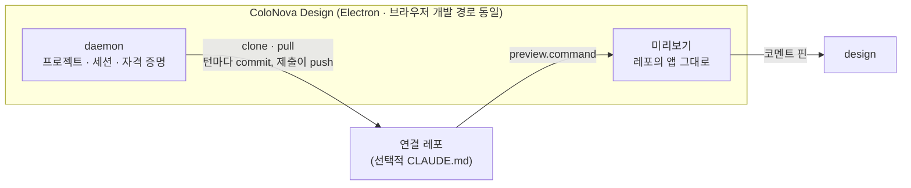

# ColoNova Design 개발자 · 운영자 안내

> 소스를 고치거나 배포하는 사람, 그리고 팀의 서비스를 ColoNova Design 에 연결하려는 개발자를 위한
> 안내다. 사용자 안내는 [README](../README.md) 와 [사용 설명서](GUIDE.md) 에 있다.

## 개발자라면 — 팀에 들이는 데 필요한 것

- **설정 파일은 없다** — `package.json` 에 `dev` 스크립트(없으면 `start` · `serve` · `preview`)와
  커밋된 락파일이면 된다. 포트도 적지 않는다 — 도구가 서버가 뜬 주소를 읽어 낸다.
- **결과는 평범한 풀 리퀘스트로 온다** — 이번 작업의 `colonova-design/<작성자>/<YYYYMMDD>-<n>-<작업ID>` 브랜치에서,
  제목에 작성자 이름을, 본문에 작성자 이름 · 바뀐 파일 · 사용자가 찍은 핀 · 자동 확인 결과 · 화면 사진을 적어서. 베이스 브랜치에는 절대 쓰지 않는다.
- **리뷰는 평소처럼** — 풀 리퀘스트에 코멘트를 남기면 AI 가 반영해 같은 요청에 다시 올린다.
- **초대는 파일 하나** — 소개 페이지의 [`초대장 만들기`](https://colosseumcoinckr.github.io/colonova-design/#invite)
  폼(연결 코드는 브라우저 메모리에만 있다)이나 `node scripts/make-invite.mjs` 로 만든다.
- **`CLAUDE.md` 다섯 줄이면 더 빨라진다** — 화면이 사는 곳 · 라우트 등록 · 목 데이터 · 자주 쓰는
  컴포넌트 · 검사 명령. AI 가 턴마다 반복하는 검색을 문서가 대신 답한다.
- **AI 도 못 푸는 문제만 개발자에게 온다** — 열린 요청이 있으면 거기에, 없으면 서비스 쪽 게시판에.

→ [연결 레포 만들기](#연결-레포-만들기) · [개발 실행](#개발-실행) · [전체 구조](#전체-구조)

## 개발 실행

```bash
pnpm install
pnpm build

# 터미널 1 — 토큰이 든 client url 을 인쇄한다
pnpm dev:daemon        # … client url: ws://127.0.0.1:7823?token=…

# 터미널 2
pnpm dev:web           # http://127.0.0.1:29173
```

client URL 을 한 번 붙여넣는다(`packages/web/src/ConnectScreen.tsx` — 개발자의 화면이다).
첫 접속은 처음 한 번의 체크리스트(`next/onboarding/FirstRun`)가 창을 쓴다 — 도구 준비 ·
AI 연결 · 초대 파일이 채워지면 저절로 작업 화면으로 넘어간다(`시작하기` 는 없다). 개발
실행도 같은 초대 파일로 시작한다 — `node scripts/make-invite.mjs --repo <GitHub
주소 또는 로컬 경로> --token <PAT> --author <이름>` 로 만들어 놓는다(가져오기는
연결 코드가 `whoAmI` 를 통과하고 푸시할 수 있는 레포가 하나 이상이어야 끝난다).
`pnpm doctor` 는 같은 검사와 활성 프로젝트의 레포 상태를 터미널에서 보고한다.

데스크톱 앱 자체를 고치거나 데스크톱 전용 면(safeStorage 키체인, 웹뷰 미리보기,
메뉴 단축키, 업데이트 다리, OS 알림·배지)을 눈으로 보려면 Electron 을 띄운다 — 위의
브라우저 경로에는 그 면들이 없다.

```bash
# 빠른 고리 — 웹은 vite 가 주고(HMR), 데몬은 앱 안에 그대로 있다.
# 이미 도는 dev:web 이 있으면 그 서버를 그대로 쓰고, 없으면 vite 를 띄운다.
pnpm dev:desktop

# 릴리스와 같은 코드 경로 — 전부 빌드해 web-dist 를 스테이징하고 띄운다
pnpm --filter @colonova-design/desktop dev
```

`pnpm dev:desktop` 은 웹 소스를 고치면 창이 즉시 바뀐다(타입 검사는 건너뛴다 —
`pnpm typecheck` 는 따로 돌린다). 데스크톱 메인 · 프리로드를 고치면 두 실행
경로 모두 다시 빌드해 앱을 재시작한다(빌드가 깨지면 지금 도는 앱을 그대로
둔다) — 데몬 · 프로토콜을 고치면 다시 실행해야 한다. 창이 다른 origin 을
여는 문은 `app.isPackaged` 가 아닌 실행에서만 열린다 — 패키징된 앱은
`COLONOVA_DESIGN_DEV_SERVER` 를 보지 않는다.

**요구 사항** — 로그인된 에이전트 CLI 하나 이상(Claude Code `claude /login` · Codex),
git, 그리고 Claude 를
쓸 때는 데몬 환경에 `ANTHROPIC_API_KEY` 가 없을 것. Node(22 이상) + pnpm 은 데스크톱
앱에 포함되어 나오고, 브라우저 개발 경로에서는 온보딩의 Node·pnpm 게이트가 검사한다.
연결 레포의 `.npmrc` 가 private 레지스트리를 가리키면 그것을 읽을 `read:packages`
인증이 기계에 필요하다 — 없으면 데몬 상태의 경고 줄이 한국어로 그렇게 말한다. 인증이 통하는지는
**그 레포가 그 스코프에서 가져오는 의존성 하나**로 시험한다(루트 `package.json` 에 그런 의존성이
없으면 시험도 경고도 없다) — 어느 레포에나 같은 패키지를 물으면 그 패키지를 안 쓰는 레포는
공개 레지스트리의 404 만 받아 거짓 경고를 얻고 제 진짜 401 은 가려진다.

**브라우저 도구 상자**(AI 에게 MCP 로 실린다)의 요약 — 스냅샷은 한 줄 표기로
읽고, 액션의 답은 바뀐 줄의 요약으로 오며, 같은 요소는 같은 ref 를 유지한다. 화면 전체를 다시 읽는 대신 찾기
(`browser_find`)로 좁히고 조사(`browser_inspect`)로 요소의 정체를 보며, 화면의
파일(`screen_files` — 레포의 파일 구조에서 주소와 같은 이름의 파일을 `(주소)` 줄로
먼저 내놓는다), 타입 진단(`repo_diagnostics`), 개발자 쪽지(`notify_developer`)도 같은
상자에 산다.

## 도구가 기계에 남기는 것

도구가 쓰는 모든 것은 홈의 숨은 폴더 하나 `~/.colonova-design/` 에 산다.

| 경로 | 무엇이 있는가 |
| --- | --- |
| `~/.colonova-design/config/` | `daemon.json` (host/port/token), `projects.json` (레지스트리) — 전부 0600, 비밀 없음(그건 OS 저장소로 간다) |
| `~/.colonova-design/logs/` | 데몬의 하루 로그(`daemon-YYYY-MM-DD.log`, 7일 보존) — 값과 문장(message) 모두에서 비밀·이메일·계정 경로를 `~/{path}` 따위로 눌러 닫는다(2026-10-02). 설정 → `개발자용` 의 `로그 폴더 열기`가 여기를 연다 |
| `~/.colonova-design/logs/turn-stats-YYYY-MM-DD.jsonl` | 턴 통계 — 한 턴의 종류(사람 말 · 핀 · 게이트) · 길이 · 도구 묶음별 호출 수 · 컨텍스트 토큰 · 첫 답까지(`firstDeltaMs`)·첫 편집까지(`firstEditMs`) · 실패 단계(`failure`) · 핀 턴의 payload 크기(`pinBytes`) · 핀 후보 적중 여부(`pinHit` — 파일 경로는 남기지 않는다) · 브라우저 도구에 쓴 시간(`browserMs`)과 op 실패 종류 수(`browserFail` — 낡은 ref · 시간 초과 · 거절 · 창 없음 · 그 밖, 0인 종류는 칸에서 뺀다). 게이트 행(`gateset`)은 판정 상세(빈 화면·휴대폰 폭 넘침(`overflow`)·새 접근성 문제(`a11y`)·콘솔 오류·실패한 요청 수, `rescued`)와 돌지 못한 이유(`skipped`), 바뀐 파일에서 되짚은 화면 수(`fallback`)와 타입 검사(`typeErrors` · `typeMs` — 이번에 바뀐 파일의 오류 수와 검사 시간, 검사가 끝났으면 0도)를 더 남긴다. 턴 행은 그 턴의 토큰(`tokens` — 캐시를 뺀 새 입력 · 출력 · 캐시 읽기 · 캐시 쓰기) · 추정 비용(`costUsd`, 정가 기준 — Claude 만) · 캐시 적중률(`cacheHitRate`)도 싣는다(2026-10-02) — 프로바이더가 알려 주지 않은 턴은 null 이지 0 이 아니다. 무엇이 턴을 느리게 하고 비싸게 하는지 재는 잣자리로, 사용자의 말도 화면도 남기지 않는다(7일 보존) |
| `~/.colonova-design/projects/<slug>/screen-map.jsonl` | 라우트↔파일 관찰 지도 — 그 화면을 고친 커밋이 건드린 파일(sha 와 함께). 정체 검색이 빈손인 핀의 마지막 후보 길이다(500행 상한) |
| `~/.colonova-design/projects/<slug>/tsc.tsbuildinfo` | 증분 타입 검사(`tsc --noEmit --incremental`)의 빌드 정보 — 클론 밖에 두어 `git status` 를 깨끗하게 한다. 편집 사이사이의 몇 초 답(`repo_diagnostics`)과 게이트의 타입 절이 함께 쓴다 |
| `~/.colonova-design/projects/<slug>/cycle.json` | 사이클 원장 — 제출 의도 · 푸시 밀림 · 코멘트 장부 · 예산 · 끝난 요청. 어디서 끊겨도 다음 시작이 이어받는다 |
| `~/.colonova-design/projects/<slug>/repo/` | 그 프로젝트의 연결 레포 클론 |

설정의 `개발자용` 쪽 → `폴더 열기` 가 이 폴더를 연다(F1) — 진단 도구는 왼쪽 목록의
맨 아래에 따로 앉아 있어 기본으로 열리는 쪽이 아니다.

데스크톱의 설정 → 연결 → `전체 초기화…`는 기본 확인 창의 동의를 받아 앱을 정상 종료하고, 다음 실행에서 데몬을 시작하기 전에 초기화한다. 지우는 것은 `~/.colonova-design/` 전체다 — 해당 클론의 Claude·Codex 대화, Electron의 설정·연결 코드·브라우저 저장 데이터를 포함한다. 원격 저장소·PR과 AI 로그인은 유지된다. 완료 전에는 `userData/reset-pending`을 남겨 실패한 정리를 다음 실행에 다시 시도한다. 별도 프로젝트 위치나 연결 정보를 환경 변수로 지정한 개발 실행은 초기화를 거절한다.

**0.4.0 의 개명은 완전 단절이다.** Colo Design(0.3.x)의 데이터를 읽거나 옮기지
않는다 — 데이터 폴더는 `~/.colonova-design/` 에서, userData 는 `…/ColoNova Design` 에서
새로 시작한다. Windows 설치 정체성(appId)이 바뀌므로 NSIS
include(`packages/desktop/build/installer.nsh`)가 옛 GUID 설치를 설치 맨 앞에서
지운다 — 병설이 아니라 정리된 교체다. 쓰기 값(마커 · 브랜치 · 키 · 채널 · 환경
변수)이 하나의 이름만 쓰는지는 `colonova-names` 시험이 지킨다.

* 초대 파일은 새 확장자 `*.colonova-invite` 만 받는다 — 옛 `*.colo-invite` 초대장은 다시 만들어 보내야 한다.

쓸 만한 환경 변수 오버라이드(모두 선택, 모두 테스트로 검증됨):

| 환경 변수 | 기본값 | 역할 |
| --- | --- | --- |
| `COLONOVA_DESIGN_DATA_DIR` | `~/.colonova-design` | 모든 데이터의 뿌리(2026-10-02 표에 더했다). 아래 대부분 기본값의 앞머리다 |
| `COLONOVA_DESIGN_PROJECTS_SETTINGS` | `~/.colonova-design/config/projects.json` | 프로젝트 레지스트리 파일 |
| `COLONOVA_DESIGN_PROJECTS_DIR` | `~/.colonova-design/projects` | 프로젝트 폴더의 위치 |
| `COLONOVA_DESIGN_REPO_DIR` | `<project>/repo` | **활성** 프로젝트의 클론 디렉터리 |
| `COLONOVA_DESIGN_REPO_URL` | 레지스트리 | **활성** 프로젝트의 레포 url(테스트는 fixture 원격을 쓴다) |
| `COLONOVA_DESIGN_OPEN_BIN` | `open`/`xdg-open`/`explorer` | 사이드바 프로젝트 카드의 `폴더 열기`가 쓰는 프로그램(테스트는 기록 스텁을 쓴다) |
| `COLONOVA_DESIGN_CLAUDE_BIN` · `…_CODEX_BIN` | 자동 탐지 | 구동할 각 에이전트 CLI 바이너리 |
| `COLONOVA_DESIGN_GITHUB_FIXTURE` | unset | 녹화된 GitHub REST 짝(오프라인 넘기기 테스트) |
| `COLONOVA_DESIGN_GITHUB_SLUG` | 레포 url 에서 | 넘기기가 겨눌 `owner/repo`; 테스트는 로컬 bare 원격을 클론하니 url 에 GitHub 프로젝트가 없다 |
| `COLONOVA_DESIGN_CREDENTIAL_STORE` | 플랫폼 기본 | `memory` (테스트) 또는 `keychain` |
| `COLONOVA_DESIGN_EXTRA_PATH` | unset | repo 명령의 PATH 접두어(데스크톱이 설정한다) |
| `COLONOVA_DESIGN_COMMAND_STALL_MS` | `300000` | 레포 명령이 아무 말도 하지 않아도 기다리는 시간(설치 정지 감시) |
| `COLONOVA_DESIGN_ENFORCE_REPO_SETTINGS` | unset(신뢰) | `1`(또는 `true`)이면 연결 레포가 실어 보낸 에이전트 설정(Claude Code)의 권한 확장 키를 절단하고 검역 기록과 함께 경고한다 — 외부 레포를 받는 배포용. 기본은 레포 파일을 그대로 두고 절단도 경고도 하지 않는다 |
| `COLONOVA_DESIGN_DEV_AGENTS` | unset(끔) | `1` 이면 개발 실행으로 선다(`DaemonStatus.dev` — 개발 전용 면). 프로바이더 목록과는 무관하다. `pnpm dev:daemon` 이 켜고, 데스크톱은 `app.isPackaged` 가 아닌 실행에서 스스로 켠다(패키징된 앱은 절대) |
| `COLONOVA_DESIGN_CLAUDE_INSTALL_CMD` | unset | 설치 스크립트 대신 이 명령을 셸로 돌린다 — 검증용(성공·실패·느린 진행을 흉내 낸다) |
| `COLONOVA_DESIGN_CODEX_RELEASE_API` | unset | Codex 릴리스 API 주소 — 검증용(로컬 서버가 JSON 을 내어 준다). 설치와 업데이트 확인이 함께 쓴다 |
| `COLONOVA_DESIGN_CLAUDE_LATEST_API` | downloads.claude.ai 의 `latest` | Claude Code 최신 버전을 읽는 주소 — 검증용(업데이트 줄의 `→ 새 버전 있어요`) |
| `COLONOVA_DESIGN_PORT` | 임시 포트 | 데몬이 들 포트 — 포트가 막혔을 때 데몬의 안내 문구도 이 이름을 말한다 |
| `COLONOVA_DESIGN_DEV_SERVER` | unset | 데스크톱 HMR 고리(`pnpm dev:desktop`)가 여는 vite 주소 — 패키징된 앱은 보지 않는다 |
| `COLONOVA_DESIGN_BENCH_ENDPOINT` | unset | 개발 실행의 데스크톱이 재생 벤치의 접속 파일(ws 주소 · pid)을 적는 자리 — 패키징된 앱은 절대 보지 않는다 |
| `COLONOVA_DESIGN_GIT_BIN` | 자동 탐지 | git 바이너리를 이 경로로 고정한다 — 탐색을 통째로 건너뛴다(테스트는 스텁을 겨눈다) |
| `COLONOVA_DESIGN_GIT_GUARD_DIR` | `~/.colonova-design/tools/git-guard` | git 쓰기 가드(hooks)의 설치 자리 — AI 의 git 쓰기를 막는다 |
| `COLONOVA_DESIGN_LANE_STRICT` | unset(경고) | `1` 이면 차선 밖 git 쓰기를 경고 대신 던진다(시험·개발) |
| `COLONOVA_DESIGN_REPO_PAT` | OS 저장소 | 기계 전체의 GitHub 토큰 — 자격 증명 저장소보다 앞선다 |
| `COLONOVA_DESIGN_GITHUB_API` | `https://api.github.com` | GitHub REST 주소(테스트는 로컬 서버로) |
| `COLONOVA_DESIGN_READY_TIMEOUT_MS` | `120000` | 미리보기가 준비될 때까지 기다리는 벽시계 상한 |
| `COLONOVA_DESIGN_LOG_DIR` | `~/.colonova-design/logs` | 하루 로그와 턴 통계가 적히는 폴더 |
| `COLONOVA_DESIGN_PIN_EFFORT` | unset(끔) | 핀으로 시작하는 턴의 첫 노력 자세 — 턴 통계가 재는 실험줄. 없으면 아무 일도 일어나지 않는다 |
| `COLONOVA_DESIGN_REPO_SETTINGS` · `…_NPMRC` · `…_RUN_DIR` · `…_UNDO_LOG` · `…_PERMISSION_LOG` · `…_PLAN_USAGE` | 기본 자리 | 각 저장 파일(repo.json · 사용자 `.npmrc` · run · undo · 권한 반복 · 계획 사용량)의 자리 — 테스트가 일회용 파일로 가리킨다 |

## 상세 동작

### 만들고 고치는 루프

화면을 만드는 것과 고치는 것은 같은 턴이다. 새 대화는 사이드바의 `새 대화` · 팔레트 ·
⌘T 어디로든 열린다. 코멘트 핀은 ⌥+클릭으로 언제든 찍고, 보낸 핀은 턴이 끝나면 화면을
떠난다. 사람이 누르는 배치 동작은 **제출** 하나다 — 보관(커밋)은 답을 낸 턴마다 도구가
스스로 한다. 제출 버튼은 상태 줄에 언제나 그려지고, 잠겼을 때 누르면 이유가 버튼 아래
한 줄로 선다(`journey.submit.reason`). 변경 건수는 클론 준비 · 화면 턴 종료 · 보관 완료
세 트리거로 갱신된다 — 폴링 없음.

대화 칸 맨 아래의 진행 줄(`chat/RunLine.tsx`, `role="status"`)은 단계 말 · `k/n 단계` · 시계를 싣는다(2026-10-06 UX 점검). 단계 말은 `lib/making.ts` 의
`makingPhase`(마지막 사용자 말 뒤에서 아직 도는 도구의 묶음 — 없으면 그 턴의 마지막 도구)가 고르고 `makingWordOf` 가 `L.journey.making*` 의 말로 옮긴다. 상태 줄의 알약과
같은 규칙이라 둘 다 `use-held-phase.ts` 의 `useHeldPhase` 를 쓴다 — 말은 `MAKING_HOLD_MS`(1.5초) 이상 살고, 시간이 차면 지금의 묶음으로 곧장 갈아입는다(그 사이는 건너뛴다).
꺼진 동안은 말을 얼려 두고(알약의 체크 600ms), 켜지는 렌더에서 곧장 비운다 — 지난 턴의 말이 새 턴의 첫 화면에 비치지 않는다.
`k/n` 은 `lib/todo-plan.ts` 의 `currentTodoProgress` 가 센다 — **마지막 사용자 말 뒤의 TodoWrite 만** 보고(지난 턴의 `5/5` 가 이번 턴에 서면 거짓), 하위 에이전트의 목록은 빼며
(제 일의 목록이라 숫자가 뒤로 간다), 새 목록의 입력이 덜 와서 읽히지 않으면 앞의 목록을 쓴다. 목록이 `MIN_TODO_STEPS`(2) 보다 짧으면 null — 단계로 말하지 않는다.
화면에는 숫자만 오고 항목의 글은 오지 않는다(AI 의 항목에는 개발 말이 섞이기 쉽다). 견본은 `thread-fixture.html?scene=working`.

답이 어긋나면 정산 줄의 `여기서 새 대화` 로 갈라 선다 — 이 답까지를 남기는 포크다.
절단 재개가 가능한 프로바이더(Claude · Codex)에서만 단추가 보이고, 원래 대화는
지워지지 않으며, 파일은 되돌리지 않는다(줄 위의 한 문장이 그렇게 말하고, 같은 줄의
`작업 기록에서 되돌리기` 가 화면을 되돌리는 문이다). 반영되면 그 사이클의 작업 기록은
사라진다 — 머지를 거슬러 되돌아갈 수 없으므로. 대화 내보내기(`lib/transcript-export.ts`의 markdown)는 사이드바 대화 행 메뉴에서 연다.
핀 질문과 자동 검사 요청도 원래 순서대로 함께 내보낸다.

### 첨부

입력창은 그림 외의 파일도 받는다 — 한 건 8MB, 대기열 저장소의 항목 예산과 같은 값.
배달은 mediaType 이 정한다: `image/*` 는 비전 블록, 디코드되는 텍스트는 턴의 말에
`<attachment>` 섹션으로 인라인된다. 예산(256KB) 안이면 전문이고, 넘으면 앞부분만
실리고 `잘렸다 — 나머지는 이 경로의 파일로 이어 읽으라` 는 표식과 절대 경로가 함께
간다(모델이 스스로 파일을 열어 이어 읽게 하는 resultBudget 방식). 그 밖의 것
(PDF · 압축 파일)은 디스크에 적힌 뒤 절대 경로가 같은 섹션으로 건네진다 — 어느 SDK 도
임의 바이너리 블록을 받지 않으므로, 파일 도구를 가진 에이전트가 직접 읽는 길이 전
프로바이더에서 동작한다. 적히는 곳은 클론의 `.git` 안(`git status` 가 보지 않는 유일한
공간)이고, 적은 지 7일이 지난 파일은 다음 적기 때 거둔다. 대기줄과 잃어낸 보내기는
그림과 파일을 따로 세고(`이미지 2장 · 파일 1개`), 다시 보내는 턴은 첨부를 그대로
되살린다. 대화록 카드와 내보낸 markdown 은 파일 이름을 나열한다 — 그림 썸네일과 같은
자리다.

### 자동 보관 · 제출 · 반영됨

사용자가 읽는 말은 **제출**과 **반영됨** 둘이다. 브랜치, 커밋, 푸시, PR, 머지는
읽지 않는다 — `저장` · `넘기기` 라는 중간 단어도 없앴다.

- **자동 보관(커밋)** — 답을 낸 턴이 끝날 때마다 데몬이 스스로 커밋한다. 첫 커밋이
  이번 사이클의 `colonova-design/<작성자>/<YYYYMMDD>-<n>-<작업ID>` 브랜치를 만든다.
  작성자는 설정의 이름에서 금칙 문자를 정리한 값이고, 비면 `user`다. 작업ID는
  새 작업마다 생성하는 무작위 16자리 16진수로 동명이인과 동시 작업의 충돌 가능성을
  낮춘다. 날짜는 로컬 날짜이며, 번호는 로컬 · 원격에 같은 이름이 있으면 올린다.
  원격 조회가 실패하면 첫 후보를 건너뛰고 로컬만 확인한다. 이미 시작한 작업은
  기록된 이름으로 이어 간다. 베이스 브랜치에는 절대 쓰지 않는다. 커밋 제목은 **그 턴을 연
  사용자의 말** 첫 줄이다 — 제목을 받으려고 모델 턴을 하나 더 돌리지 않는다(매 턴
  돌리면 구독이 두 배로 탄다). 푸시는 백그라운드이고, 실패하면 30 초 간격 세 번 다시 민다(D6): 오프라인에서
  턴의 끝이 멈추지 않으면서 잠깐의 끊김은 스스로 아문다. 세 번 다 실패한 밀린 커밋은
  네트워크 동사(fetch · push · clone · pull · ls-remote)는 5 분의 침묵 예산을
  건다(2026-10-02) — 끊긴 소켓이 차선 전체를 영원히 붙잡지 않게. 진행
  출력(--progress)이 흐르는 동안에는 시계가 다시 찬다.
  화면 확인 게이트가 걸린 턴은 게이트의 판정이 끝난 **뒤**에 한 번만 커밋한다.
- **제출(개발자에게 넘기기)** — 남은 것까지 담고 푸시를 **기다린 뒤** 풀 리퀘스트를
  열어, 본문의 도구 구간에 작성자 이름 · 한마디 · 바뀐 파일 · 사용자가 찍은 핀 · 자동 확인 결과 · 화면 사진을 적는다(아래). 푸시 실패를 게이트로
  올리는 길은 이것뿐이다. 이후의 보관은 같은 풀 리퀘스트에 쌓인다.
  새 PR의 제목은 `feat(members): 회원 목록에 이름 검색 추가 (작성: 김기획)`처럼 `type(scope): 변경 (작성: 이름)` 형식이다. scope는 생략할 수 있고, 설정에 이름이 없으면 작성자 표기도 생략한다. AI는 요청 메모와 파일 목록, 크기를 제한한 최종 diff를 읽어 변경 이유와 결과를 설명한다. 되돌린 작업과 근거 없는 테스트·배포 결과는 적지 않도록 지시한다. 초안을 만들지 못하면 첫 커밋 제목을 쓰고, 형식이 없으면 `chore:`를 붙인다. 작성자는 도구가 붙이며 전체 제목은 최대 72자다. 작성자 자리만큼 변경 제목을 줄이고, 이름이 32자를 넘으면 앞 31자와 `…`로 표시한다. 본문에는 이름 전체를 적는다. 다시 제출할 때는 기존 제목과 도구 구간 밖의 본문을 보존한다.
  본문의 도구 구간(`<!-- colonova-design:start/end -->`)은 작성자 줄(`> 작성:`)과 한마디(`> 한마디:`) 아래에 `### 바뀐 파일` → `### 수정 요청`(핀 — 화면 id 와 메모, 요소 이름 · 경로는 쓰지 않는다 D38) → `### 확인한 것` → `### 화면 미리보기`(사진 링크) 순으로 서고, 비는 절은 없다. `### 확인한 것`(2026-10-07 UX 점검 3단계)은 이번 제출에 담긴 화면 작업(화면 지도의 보관 하나 — `summarizeChecks`)마다 그 턴의 자동 확인이 문제 없이 지났다는 기록(`GateChecked`)을 센다: 턴이 끝나 보관할 때 서버가 `autoSaveTurn` 으로 화면 지도 행(`screen-map.jsonl` 의 `checked`)에 적고, `CycleScreens` 가 `cycleScreens[].checked` 로 실어 `handoffToolBlock` 이 센다. 하는 말은 도구가 한 것(다시 열어 본 것)뿐이다 — 문제를 찾았거나 확인하지 못한 턴은 기록이 없고, 기록이 하나도 없으면 절이 없다. 접근성 · 대비는 지난번에 본 문제를 다시 말하지 않으므로 「새로 찾은 문제가 없었다」 고만 하고, 휴대폰 폭은 기록이 있는 작업이 모두 봤을 때만 말하며, 레포의 검사 · 빌드는 이 확인에 들어 있지 않다고 밝힌다. 화면 이름 · 요소 · 경로는 쓰지 않는다 — 숫자뿐이다(D38). 문제를 찾아 고침 턴이 열린 작업은 원래 턴의 보관에 기록이 없다 — 고침 턴의 보관이 따로 있으면 그것이 따로 한 건으로 세어진다(고침의 판정은 그 턴의 `requestId` 에 있고 원래 요청으로 이어 붙이지 않는다). 구간은 제출마다 새로 짜므로 기록이 없어지면 절도 거두어진다. 수정 전 사진을 본문에 싣는 일과 사진을 본문에 직접 그리는 일은 아직 하지 않는다 — 비공개 레포의 요청 본문에서 사진이 그려지는지 확인하지 못했고(깨진 그림이 모든 요청에 서는 위험), 수정 전 사진은 요청마다 따로 잡은 것이라(요청당 화면 4곳까지, 프로젝트당 40건 · 100MB 까지 두고 오래된 것부터 지운다) 비어 있을 수 있다.
  제출 확인 창은 **첫 제출에만** 이 제목과 AI 설명을 `개발자에게는 이렇게 보여요` 상자로 미리 보인다(2026-10-07 UX 점검 3단계). 재료는 `repo.handoffDraft`(짧은 AI 한 번, 8초 목줄, 보관의 끝 표식별 캐시 — 제출 때 감독자가 다시 불러도 같은 글이다)이고, 웹의 `lib/handoff-preview.ts` 가 종류 접두어 · 작성자 꼬리를 떼고 마크다운 기호를 걷어 한 덩이 글로 만든다. 읽기는 `useHandoffDraft` 가 따로 하므로 제출을 붙잡지 않고, 못 읽으면 상자가 서지 않는다. AI 가 제목을 못 쓴 초안은 데몬의 `pickHandoffTitle` 처럼 첫 보관의 제목을 대신 쓰고 그 사실을 말한다. 이미 열린 요청에 더하는 제출은 초안을 읽지 않고 `repo.handoff.title` 만 보인다(제목과 설명은 개발자의 것). 미리 본 글이 제출 때의 글과 같다는 보증은 캐시에 기댄다 — 데몬을 다시 켜면 초안이 다시 쓰여 낱말이 달라질 수 있다.
  영수증의 `보낸 화면`(2026-10-07 UX 점검 3단계)은 사용자가 제출을 누를 때 확인 창이 보인 목록이다 — `repo.submit.sent`(`screens` 1~999 · `titles` 많아야 셋, 각 60자; 선로가 막는다) → 원장의 제출 의도 `submit.sent`(`parseSent` 가 깨진 값을 버린다 — 재시작 뒤의 이어받기도 같은 영수증을 낸다) → 사건 `cycle.handed.sent` → 대화록의 영수증. 데몬은 최종 변경의 귀속(`finalOutgoingChanges`)을 몰라 웹이 정해 건넨다. 확인 창이 없는 대화 제출(`submit_for_review`)에는 이 값이 없고 영수증은 그 줄을 말하지 않는다. 도는 제출에 다시 누르면 의도는 하나 그대로 `sent` 만 새것으로 바뀐다. 막힌 제출이 길어져 그 사이 화면이 더 쌓이면 영수증은 누른 때의 목록을 말한다(실제로는 더 실렸을 수 있다). 기다림이 보이게(2026-10-07 UX 점검 3단계): 요청이 열린 때는 GitHub 의 `created_at` 이 `HandoffStatus.since`(선택 필드, ISO)로 서고 — `refOf`(읽히지 않는 값은 버린다) → 감독자가 요청을 만들 때 · 입양할 때의 `HandoffStatus` → 레지스트리(`projects.ts` 의 `parseHandoff` 가 왕복시킨다) → 선로. 이 변경 전에 열린 요청처럼 `since` 를 모르는 기록은 다음 관찰 틱이 `getPullRequest` 의 값으로 채운다(알고 있는 값은 건드리지 않는다). 웹의 `lib/waiting.ts` 가 `daysSince`(달력으로 센 날수 — 오늘이면 0, `startOfDay` 로 시간대와 서머타임을 따른다)를 계산하고, 오늘의 자정은 `useToday` 가 갈아 끼워 자정을 넘기면 숫자가 저절로 는다. 상태 줄은 `deriveJourney` 의 `waitingDays` 로 받아 **코멘트가 없고 요청이 `open` 일 때만** `· N일째`(N = 날수 + 1, 제출한 날은 붙이지 않는다)를 붙인다 — 코멘트가 오면 그 수가 더 급한 말이고(코멘트 수는 장부에 쌓여 줄지 않으므로 한 번이라도 코멘트가 온 요청은 날수를 말하지 않는다), `changes_requested` 는 공이 우리 쪽이다. 그래서 날수는 요청을 연 뒤 한 번도 말이 없던 기다림, 곧 요청의 나이가 기다린 시간과 같은 경우에만 선다. 홈은 `waitingRows` 가 `open` 인 프로젝트를 오래 기다린 순으로 `지금 진행 중` 에 한 줄씩 세운다(때를 모르면 날수 없이) — 눌러서 가는 줄이라 사용자의 손이 필요한 수(`waitCount` · 사이드바 배지)에는 세지 않는다. 견본: `home-fixture` 의 `?case=g,h`, `status-fixture` 의 `?case=q`.
  받을 개발자를 확인하지 못했다는 줄(`receiptFacts.nobody`)은 첫 제출의 영수증이 **지금의 요청**을 알고 `reviewers` 가 빈 배열일 때만 선다. 데몬이 아는 것은 요청을 만들 때 응답의 `requested_reviewers`(와 도구가 직접 요청한 리뷰어)뿐이고 이후 틱은 이 값을 새로 읽지 않는다 — 리뷰를 마친 개발자는 GitHub 이 이 목록에서 빼므로 새로 읽으면 「받은 사람이 없다」 로 바뀌기 때문이다. 팀 단위 코드 소유자(`requested_teams`)나 늦게 채워지는 지정은 닿지 않을 수 있어 문장은 「없다」 가 아니라 「확인하지 못했다」 를 말하고, 모르는 값(`undefined`)이나 옛 영수증에는 말하지 않는다.
- **반영됨** — 병합이다. 클론이 베이스 브랜치로 돌아오고, 다음 커밋이 새 사이클을 시작한다. 병합된 작업 브랜치는 기본적으로 자동 삭제하며, `lifecycle.deleteMergedBranches: false`이면 원격 브랜치를 남긴다. 이월할 커밋이 있으면 새 작업 브랜치의 푸시가 성공한 뒤 옛 원격 브랜치를 정리한다.

제출 화면의 캡처는 공용 `colonova-design-assets` 브랜치의 `shots/<작업 브랜치>/`에 올리고, PR 본문은 해당 캡처 커밋을 링크한다. 이 브랜치와 캡처는 작업 종료 후에도 자동 삭제하지 않는다. 용량은 기록만 하며, 보관 기한에 따른 정리는 아직 없다. 따라서 작업 브랜치가 지워져도 캡처는 별도로 남고, main에는 합치지 않는다.

레포의 `check` · `build` 는 이 중 어느 것도 막지 않는다 (실사: 레포 검사에 걸린
보관은 사용자가 올릴 수 없는 일감을 남겼다). 타입 오류도 같다 — 게이트가 고침
턴으로 AI 에게 돌려줄 뿐 보관 · 제출은 막지 않는다. 문제는 제출이 여는 풀
리퀘스트에서 개발자가 잡고, AI 는 턴 안에서 스스로 그 명령을 돌릴 수 있다 — 도구가
그 명령을 아는 이유는 둘이다: Bash 한 줄을 `레포 검사` 로 이름 붙이기 위해서, 그리고
그 이름이 확인 카드의 머리줄이 되기 위해서다.

### 레포 최신화

개발자가 반영한 내용은 감독자가 받아 온다(E1) — 활성 프로젝트는 2 분, 그 외는
10 분 간격으로 관찰하고, 창이 앞으로 오면 그 자리에서 확인한다. 말이 나가기 직전에도
한 번 본다(20 초 안에 못 끝내면 말이 먼저 나가고 받아오기는 뒤에서 이어된다). 아직 커밋되지 않은 변경이 있으면 임시 보관한 뒤 클론을 최신으로 옮기고 그 위에
얹는다 — 겹치지 않는 편집은 git 의 기계적 병합이 혼자 합친다. git 이 혼자 못 합치는
진짜 충돌만 AI 의 첫 과제가 된다(게이트 카드로 대화에 떨어진다). 열린 대화가
없으면 한국어 이유가 재시도 패널에 남는다. 베이스 브랜치의 원격 기록과 갈라진 커밋은
절대 덮어쓰지 않고 이름을 밝힌다. 도구가 임시 보관과 얹기 사이에 죽어서 변경이
보관에 남았으면, 다음 시작이 그것을 저절로 클론에 되돌려 놓는다 — 그 사용자가 손으로
만든 stash 는 건드리지 않는다.

### 프로젝트와 목록

프로젝트는 연결 레포 하나다. 다른 모든 말이 여기에 묶인다 — AI 가 고치는 클론,
도는 미리보기 서버, 그리고(SDK 가 디렉터리별로 대화를 저장하므로) 세션 목록. 왼쪽
사이드바에 연결 레포가 줄을 서고, 하나를 고르면 그 레포의 대화 · 미리보기 · 변경
사항이 오른쪽에 뜬다. 한 대의 기계는 사용자가 작업하는 만큼 가지고, 정확히 하나가
활성이다. 미리보기 서버는 활성 프로젝트만 새로 띄울 수 있지만, 떠난 프로젝트의 서버는
따뜻하게 남는다 — 돌아오면 준비 단계 없이 곧바로 `ready` 고(레포 최신화는 서버를
건드리지 않는 조용한 pull), 데스크톱은 그 프로젝트의 페이지를 숨겨 두었다가 보던 자리
그대로 다시 보여 준다(reload 없음). 전환의 울타리는 하나다: 따뜻한 서버는 최근 두
개까지만 남고, 그 너머는 오래된 것부터 멈춘다. 들어오는 프로젝트의 개발 서버는 빈
포트를 스스로 고르므로 따뜻한 서버와 부딪히지 않는다. 페이지 쪽도 상한(여덟 장)을
두고, `RepoStatus.previewEpoch`(서버 시작마다 새 번호)가 바뀐 페이지는 낡은 앱을
보이지 않도록 돌아올 때 다시 읽는다.
사이드바 머리는 고르는 상자 하나(`ProjectSwitcher`)다 — 누르면 목록이 내려오고 프로젝트마다
상태 점 · 기다리는 숫자 · `처음 열 때 준비해요` 가 선다. 목록 맨 아래의 두 줄은 지금
프로젝트의 카드(`프로젝트 정보` — 저장소 · 미리보기 · `지켜 줄 것` · 삭제)와 새 프로젝트
들이기(`초대 파일로 프로젝트 추가…`, `requestInvitePicker`)다. 머리가 이름 누름(카드)과
셰브론 누름(목록)으로 갈라져 어느 쪽이 무엇을 여는지 겉으로 알 수 없던 것을 2026-10-06
하나로 합쳤다. 그 아래 **다른 프로젝트 줄**이 활성이 아닌 프로젝트마다 가장 급한 것 하나를
말한다(`projectNote`, 전부 `ProjectSummary` 에서). 브랜치와 클론 경로는 개발자의
어휘라 어디에도 서지 않는다(E10).
도구가 스스로 연 대화(연결 준비 · 리뷰 반영 · 최신화/저장/넘기기 문제 해결)는
목록 맨 아래 `도구가 한 일` 접힌 그룹에 산다 — 펼치면 보고, 누르면 열린다. 사람의
대화 목록이 도구의 작업 기록으로 덮이지 않는다(B7).
사람의 대화는 `lib/thread-groups.ts` 가 `오늘 · 어제 · 지난 7일 · 이전` 으로 묶는다 — 이 컴퓨터의
달력과 `ThreadSummary.updatedAt` 기준이고, 데몬이 새것부터 내려 주지만 같은 묶음이 두 번 서지
않게 한 번 더 정렬한다. 자정이 지나면 `useToday` 가 날짜를 갈아 끼워 묶음이 저절로 밀린다.
줄의 `···` 는 줄 위에 얹혀(`position: absolute`) 쉬는 동안 제목의 너비를 떼어 가지 않고, 손이
닿으면 제목의 오른쪽 끝이 마스크로 옅어진다. 메뉴는 `Popover float` 라 굴러가는 목록의 끝에
잘리지 않고, 우클릭 · 메뉴 키(`contextmenu`)도 같은 메뉴를 같은 자리에 연다. ↑ ↓ Home End 는
줄과 `도구가 한 일` 머리를 오가고(닫힌 묶음 안의 줄은 건너뛴다), 열린 대화가 목록 밖에 있으면
저절로 보이는 자리로 올라온다.
사이드바 폭은 설정의 `layout.sidebarWidth`(null 은 끌어 본 적 없음 = 264px)에 남고
`SIDEBAR_WIDTH_BOUNDS`(220~420)가 절대 한도다. `lib/shell-metrics.ts` 가 창 폭에 맞춘
상한(대화 칸 320 + 미리보기 360 이 쓸 자리를 뺀 만큼)을 재고, `lib/use-sidebar-width.ts` 가
끌기(놓을 때 한 번 저장) · 키보드 · 되돌림을 맡는다. 셸 뿌리의 `--nx-side-w` 가 열 폭과 사이드바
폭을 정하고, 경계는 대화 · 미리보기 사이와 같은 `Splitter` 다. 좁은 창의 서랍은 284px 로 고정이다.
서랍의 스크림은 늘 마운트돼 `.nx--drawer` 에서만 보이며(`--scrim` + 흐림) 닫힐 때 불투명도로 걷힌다 — ✕ 가 있고
설정을 열면 서랍이 먼저 닫힌다. `nav.switchProject` 는 옮겼는지(`Promise<boolean>`)를 돌려 줘 부르는
줄(전환기 · 찾기 · 홈 칩)이 도는 표시를 세운다. 다른 프로젝트 줄은 `pickOthers` 가 급한 셋으로 거르고 나머지는
전환기의 `더 보기` 가 연다. 대화 `···` 의 `Popover float` 는 우클릭 · 메뉴 키 · Shift+F10 에서 먼저 `···` 에
초점을 주고(키보드 진입이 앵커의 `:focus-visible` 일 때만 켜져서), 메뉴가 확인 카드로 바뀔 때 `resize`
로 다시 자리 잡는다. 찾기(`palette-match.ts`)는 마지막 글자를 조합 중으로 보고(`결ㅈ` → 결제 — 받침이
다음 글자의 초성으로 넘어가는 순간과 겹모음 · 겹받침이 자라는 순간까지) 홀로 선 자음은 초성으로 맞춘다
(`ㄱㅈ` → 결제). 한글 낱자는 `labels.ts` 밖에 한글 리터럴을 둘 수 없어 코드 포인트 표로 적고, 맞은 자리는
늘 글자 경계다.

홈(`next/home/`)의 받은 편지함은 `lib/home-feed.ts` 의 `buildHomeFeed` 한 곳에서 나온다 — 활성
프로젝트의 대화를 `visibleThreads`(지워 낸 대화를 데몬의 목록이 따라오기 전에도 거둔다)로 걸러
`asking` · `running` · `done` · `resume` 으로 접고, 제목은 사이드바와 같은 `titleFor`(사용자가 바꾼
이름)를 따른다. 도구가 스스로 연 대화(`SYSTEM_THREAD_TITLES`)가 조용히 끝난 것은 `done` 에 서지 않는다 —
`답이 왔어요 — 확인해 보세요` 가 거짓이 되고, 못 끝낸 것(`error`)만 남는다. `resume`(`lib/home-resume.ts`)은
새것부터 세 개이고 다른 묶음에 이미 선 대화 · 도는 중 · 답을 기다리는 대화 · 도구의 대화를 뺀 나머지다.
비어 있는 묶음은 그리지 않는다 — 빈 문장(`도는 작업이 없어요` · `아직 있던 일이 없어요`)은 지웠고, 모두
비면 `기다리는 일이 없어요` 한 줄만 남는다. 줄은 `Row`(앞 그림 · 제목 · 아래 한 줄 · 오른쪽 말) 하나로
그린다.
입력창 아래의 시작점 칩은 순수 모듈 `lib/home-starters.ts` 가 문장을 짓는다(`startersOf` — 이번 작업의
`cycleScreens` 중 가장 나중의 제목이 `recentScreenName` 으로 이름이 된다). 누름은 보내지 않고 `Composer` 의
`prefill` 로 담긴다. `prefill.select` 는 화면 이름 자리를 고르는데, 값을 쓰는 순간 브라우저가 커서를 끝으로
옮기므로 그림이 그려진 뒤의 layout effect 가 고른다(rAF 에서 고르면 지는 일이 있다). 입력창은
`onContentChange` 로 비었는지 알리고, 말이 생기면 칩이 접힌다(`inert` — 접힌 칩이 초점을 받지 않게). 파일
끌어다 놓기는 `HomeView` 가 홈 전체에서 받아 `Composer` 의 `registerHandle` 로 첨부한다 — 입력창 자신의
드롭 처리는 없앴다(둘이 함께 있으면 입력창 위에 놓은 파일이 두 번 붙는다). 글이나 링크를 끌 때는 덮개를
펴지 않는다(`dataTransfer.types` 에 `Files` 가 있을 때만).
홈 견본은 `dev/home-fixture.html` 이다 — 스크린샷 그대로 · 붐비는 홈 · 처음 · 연결 끊김 · 긴 글 · 이번 작업이
있는 홈의 여섯 상태를 가짜 데몬으로 그린다(`?case=b` · `?theme=dark` · `?w=420` · `?h=900`).

AI 세션은 죽지 않는다 — 다른 프로젝트에서 도는 턴은 끝까지 돌고, 다른 프로젝트
줄(`만드는 중`)과 OS 알림이 그것을 말한다. 소켓이 끊겨 다시 붙어도 잃는
것이 없다 — 대기 중이던 확인 카드는 새 소켓에만 다시 내려앉아 이중으로 쌓이지
않고, 멈춰 있던 턴의 상태도 그대로 돌아온다.

**지켜 줄 것** — 이 프로젝트에서 AI 가 늘 따랐으면 하는 규칙을 사용자의 말로 적는
상자다. 적은 내용은 `~/.colonova-design/config/projects.json` 의 그 프로젝트에 저장되고,
**새로 시작하는 대화부터** 세션의 시스템 프롬프트 끝에 붙는다. 프로젝트 정보 카드의 `지켜 줄 것`에서 편집한다.

### 코멘트 핀

도구의 미리보기 오버레이는 화면을 **가리키는** 도구다 — 핀 모드, 호버 강조(이름표
아래에 태그 · 크기 · 색 · 배경 · 글꼴 패널), 번호
배지. ⌥+클릭한 요소는 DOM 에서 정체(태그 이름, `body` 부터의 CSS 경로와 XPath,
React 파이버 owners — 개발 빌드, 자기 텍스트(요소의 직접 텍스트 노드만이고, 그 사이에 `<br>` 같은 요소가 끼면 띄어서 잇는다 — `서비스를<br>선택하세요` 는 `서비스를 선택하세요`, 2026-10-06), testid, 링크 · 입력 속성, 주변 글자,
rect)와 그 순간의 crop 을 실어 컴포저의
첨부가 된다. 핀의
상태는 웹이 쥔다 — 화면·라우트 전환과 새로 고침에 살아남고, 오버레이의 배지는 그
투영이다. 찍는 순간 앱 쪽 레이어에 말풍선이 뜨고(게스트 안에 입력칸을 두지 않는다 —
한글 입력과 포커스가 웹뷰로 넘어가지 않게), 적은 메모는 입력창의 같은 번호 칩에 비친다.
보내면 문장과 핀 목록이 구조화된 한국어 턴 하나가 되고, 핀은 입력창에서
비워지며 `comments.json` 에 전달 기록으로만 남는다. 전달이 곧 정리다(자동 정리) —
해결 토글 · 다시 요청 단추는 없다; 다음 요청은 대화에서 말하는 것이 다른 메시지와
같은 길이다. 저장소는 쓰기 전용이다 — 코멘트는 대화에서 소비되므로 도구는 그것을
다시 목록으로 그리지 않는다. 한 명의 독자만 남는다: 그 대화를 보지 못하는 개발자,
즉 넘긴 요청 본문의 `### 수정 요청` 절이다.
핀은 어느 페이지에나 찍힌다 — 이 도구로 만지지 않은 레포의 원래 화면에서도
⌥+클릭이 핀을 남기고, 그 페이지의 경로(앞 슬래시 없는 id, 루트는 `index`)가 화면
id 가 된다. 코멘트 → 수정의 고리는 처음부터 열려 있다.
⌥+클릭은 요소를, ⌥+드래그는 **영역**을 가리킨다(요소가 없는 빈 자리 · 여백도 짚을 수
있다). 핀 모드는 `⌘⇧P` 로도 켜고 끈다. 뜻은 문장이 정한다 — "고쳐 줘" 로 보내면
고치고 "이게 뭐야?" 로 보내면 설명이 온다. 고르는 칸은 없다(C1). 보낸 핀은 턴이
도는 동안 회색 배지로 남아 무엇이 나갔는지 보여 주고, 턴이 끝나면 사라진다. 요소 핀은 HTML · 계산된 스타일 · 접근성(선언된
role, 없으면 태그가 암시하는 role)과 이름 · XPath · 주변 글자 · 링크 · 입력 속성 ·
React 컴포넌트 이름을 함께 싣는다. 정체는 오버레이가 스스로 뽑는다 — 레포가 표식을 남길 필요는 없다(2026-09-21
레포 마커 철거).
오버레이가 보낸 봉투는 메인이 한 번 읽는다(`pin-envelope.ts` 의 `readPinEnvelope`) — 연결 레포의 페이지
스크립트도 그 다리를 부를 수 있어서다. **필수 칸**(종류 · id · 컴포넌트 · 경로 · 좌표)의 모양이 어긋나거나
오버레이가 사진을 실었으면 버리고, **보강 칸**(스타일 · 접근성 · 속성 · 주변 글 · HTML · XPath)은 크다고
버리지 않고 한계에서 자른다 — 보강 칸의 실패가 핀을 죽이지 않는 것이 오버레이의 원칙이다. 돌려주는 봉투는
알려진 칸만 새 객체에 옮긴 것이다. 옛 문지기는 `attrs.classes`(문자열 배열)를 문자열만 받는 칸으로 읽어
클래스가 하나라도 있는 요소의 핀을 말없이 버렸다(2026-10-06 UX 점검에서 재현). 버릴 때는 데몬의 기록에
`핀 봉투를 버렸습니다`(`reason` 종류와 `count` 만 — 사용자의 말 · 경로 · 값은 없다)를 남기고, 렌더러가
`이 자리는 담지 못했어요` 한 줄을 띄운다. 시험은 손으로 쓴 봉투가 아니라 오버레이의 진짜 함수
(`describeElementInPage`) 출력을 문지기에 먹인다(`pin-envelope-overlay.test.ts`).
핀 턴이 나가기 전에 데몬이 한 일 더 한다 — 핀이 실은 정체(testid · React 컴포넌트
이름 · 요소의 글자)로 클론을 훑어 그 요소가 살 것 같은 파일 세 개를 `파일 후보:` 줄로
블록마다 얹는다. 에이전트가 첫 tool call로 반복할 검색을 토큰 없이 대신하는 자리다.
후보를 못 찾으면 조용히 줄만 없을 뿐 턴은 그대로 간다. 정체(testid·컴포넌트·글자)가
빈손인 핀은 두 길을 차례로 본다 — 핀의 화면 주소로 레포의 파일 구조에서 주소와 같은
이름의 파일을 찾는 길(`(주소)` 표식)이 먼저고, 없으면 관찰 지도(`screen-map.jsonl` —
그 화면을 고친 커밋이 건드린 파일의 기록, `(관찰)` 표식)가 뒤를 잇는다. 말풍선과
입력창의 칩은 찍는 순간 정체(컴포넌트 이름, 없으면 testid)를 한 조각 보여 준다.

말풍선(`PinBubble`)은 자리를 연 순간만 재지 않는다 — `ResizeObserver` 가 높이가 변할 때(요소 정보 펼침 ·
메모가 늘어남) `bubblePlacement` 를 다시 불러 위로 연 것은 아랫끝에 붙들고, 칸보다 길면 안쪽이 굴러간다.
메모는 네 줄까지 자라는 `textarea` 다(↵ 담기 · ⇧↵ 줄바꿈 · ⌘↵ 보내기, 한글 조합 중 ↵ 무시).

### 사용자가 치지 않은 턴
코멘트 묶음, 화면 스레드를 여는 브리프, 실패한 게이트, 미리보기 오류를 맡긴 고침,
리뷰 반영, 지금 보내기의 끊김 알림 — 모두 AI 를 위해 AI 의 어휘로 쓰인다. 첫 줄에 표식(`<!-- colonova-design:<kind> {…} -->`,
AI 가 지나쳐 읽는 HTML 주석 — 종류는 `comments` · `brief` · `gate` · `error` · `review` · `notice`)을 달고,
대화록은 그것을 카드로 그린다. 무엇을 물었는지가 사용자의 말로,
AI 가 실제로 받은 본문은 한 겹 접혀 있다. 표식은 SDK 가 이미 저장하는 문자열의
앞첨자라, 이어 든 스레드가 같은 카드를 다시 띄우며, 동기 맞출 별도 파일(sidecar)도
없다. 표식이 붙은 턴은 자기가 내려앉는 스레드의 이름을 절대 밝히지 않는다. 모두
같은 방식으로 답하라고 배운다 — 파일 경로 없이, 컴포넌트 · prop 이름 없이, 화면은
제목으로. `notice`(지금 보내기가 돌아가던 답을 자를 때)는 행동을 부르지 않는
알림이라 세션의 감독 구조(lastDelivered · 인플라이트 복제)에도 대기 방에도
들어가지 않고, 끝의 기준 한 줄로 "이어 하지 말라"를 지시한다(2026-10-04 ux-plan PR1).

### 턴 끝의 화면 확인

파일 내용이 실제로 바뀐 턴이 끝나면 도구가 **그 턴이 열어 본 화면들을 다시 열어 본다**.
전송 직전과 답변 직후의 변경 파일 내용을 비교하므로 이전부터 남아 있던 미보관 편집은
설명 요청의 수정 근거가 되지 않는다. 변경 없는 요청은 자동 수정과 자동 보관을 시작하지 않는다.
자동 수정 답변은 한 번 더 검사하며, 수정 없음·검사 실패·중단·남은 문제·검사 통과를 구분한다. 보는 것은
셋이다 — 문서가 완전히 로드됐는지, 콘솔의 오류 · 실패한 요청, 그리고 다 로드됐는데
글자도 그림도 없는 빈 화면. 경고는 세지 않는다(레포 개발 빌드의 기본 소음이라 게이트가
그것으로 울면 매 턴이 멈춘다). 문제가 있으면 완료 알림 대신 `화면 확인` 게이트 카드가 뜨고
같은 대화가 그대로 이어져 AI 가 고친다 — 문제 화면의 그림이 브리프에 함께 가므로
AI 가 눈으로 보고 고친다(상한 3장). 실패한 요청은 **미리보기 서버의 것만** 문제로
센다 — 외부 이미지·폰트의 실패는 이 화면의 결함이 아니므로 잡음으로 치지 않는다.
사용자가 할 일은 없다 — 오류를 먼저 발견하는 쪽이 비개발자여서는 안 되기 때문이다.

휴대폰 폭도 한 번 본다 — 데스크톱 폭에서 멀쩡한 화면을 휴대폰 폭(390px)으로 한 번 더
열어 문서 전체가 옆으로 밀리는지 잰다(값은 화면당 열기 한 번). 문서가 화면 폭보다 2px
넘게 넓고 사용자가 실제로 밀 수 있을 때만 문제다 — 표가 제 안에서 가로로 스크롤되는
것, 뷰포트가 넘침을 가리는 `overflow-x: hidden`, `position: fixed` 는 세지 않는다.
브리프는 폭과, 화면 밖으로 삐져나온 바깥쪽 원인(상자 · 길게 이어진 글자, 최대 셋)과
고치는 방향(PC 화면은 그대로 두고, `overflow-x: hidden` 으로 가리지 않기)을 말하고,
그림은 휴대폰 폭으로 찍힌다. 데스크톱 판정에서 이미 문제인 화면은 다시 열지 않고,
휴대폰 폭에서만 나는 콘솔 오류 · 빈 화면은 이 게이트의 판정이 아니다. 재는 것은 데스크톱의
`overflow-probe.ts`(페이지 안에서 도는 자기완결 함수)이고 문턱은 데몬의 `overflowOf` 다.
알려진 한계: viewport 메타가 없는 페이지는 휴대폰에서도 980px 로 그려져 밀림으로 잡히지
않는다.

접근성도 본다 — 이름 없는 컨트롤 · 그림과 너무 흐린 글자. 소음이 이 게이트의 가장 큰
위험이라 좁게 센다. 이름은 **브라우저의 접근성 트리가 계산한 이름이 빈** 버튼 · 링크 ·
입력칸 · 체크박스 따위만이다(aria-label · label · title · placeholder 를 우리가 흉내 내지
않는다). 그림은 접근성 트리에서 장식용 `<svg>` 까지 이름 없는 그림으로 나와 소음이 되므로
페이지 안에서 `alt` 가 아예 없는 `` 와 이름 없는 `role="img"` 만 직접 본다. 대비는
글자와 그 **가장 나쁜 배경**의 비율(글자색의 알파 · 조상의 불투명도 포함)이 3:1 미만인
글자만 센다 — WCAG AA 는 보통 글자에 4.5:1 이지만 레포가 정한 색(토큰 · 테마)이 살짝
못 미치는 것까지 AI 에게 고치라 하면 레포의 규칙을 덮어쓰게 된다. 비활성 컨트롤(WCAG 가 면제한다) ·
숨김 · 화면 낭독기 전용 글자 · 움직이는 중인 요소 · 배경을 잴 수 없는 글자(이미지 위)는 뺀다.
배경은 브라우저가 페인트한 화면에서 잰다(`CSS.getBackgroundColors` — 실험 API 라
없어지면 대비만 조용히 빠지고 이름 점검은 산다). 색이 같은 요소는 한 조합으로 묶어 대표
하나만 묻고, 이름 없는 것은 라벨(태그 · id · class · type · testid)이 같으면 곳 수로 묶는다.

**같은 화면에서 지난번에 이미 본 문제는 다시 말하지 않는다** — 레포가 원래 갖고 있던
문제(공용 컴포넌트 · 테마가 낳은 것 포함)가 턴마다 고침 턴을 여는 일을 막는다(`freshA11y`). 기억은 화면 주소별 지문 집합이고
프로젝트마다 하나이며(`PreviewDrivers`), 이번 점검의 지문으로 **갈아 끼운다** — 고쳐서 사라졌다가
되돌아온 문제는 다시 새것이다. 브라우저가 답하지 못한 점검은 기억을 건드리지 않고(못 잰 것을
"문제 없음"으로 적으면 다음 점검이 옛 문제를 되풀이한다), 데스크톱 판정에서 이미 문제인
화면은 보지도 기억하지도 않는다. 데몬이 살아 있는 동안만 산다 — 다시 켜면 화면마다 한 번은
원래 있던 문제도 말하고, 그 한 번은 브리프가 "이번 턴에 만들거나 고친 요소의 문제만
고치라"고 범위를 좁힌다. 접근성은 데스크톱 폭의 열기에서 함께 재므로 여는 값은 늘지
않는다(작은 페이지에서 열기당 +5~15ms, 화면당 4초 시한). 그림은 붙이지 않는다 — 요소 줄이
그림보다 정확하고 그림 예산은 넘침이 쓴다. `gateset` 행의 `a11y` 가 새 문제가 있던 화면 수
이므로, 소음이 실제로 얼마인지는 이 숫자로 잰다.
다크 모드는 게이트가 보지 않는다 — 다크로 한 번 더 열면 여는 값이 늘고 다크를 지원하지 않는
화면이 대부분이라 소음만 된다. AI 가 부탁할 때(`screen_check` 의 `colorScheme`)만 본다.

**레포의 규칙이 먼저다.** 이 도구의 목표는 연결 레포가 정한 규칙(컴포넌트 · 토큰 · 관례)으로
화면을 만드는 것이지 특정 디자인 시스템을 씌우는 것이 아니다 — 레포가 무엇을 쓰든(회사의
디자인 시스템이든 유틸리티 CSS 든 제 손으로 쓴 스타일이든) 도구는 그것을 전제하지 않는다.
그래서 접근성 · 반응형 브리프는 고치는 방향을 말할 때마다 "이 레포가 그 방식을 이미 갖고
있으면 그것을 따르라"(이름을 다는 방식 · 색을 정하는 방식 · 반응형을 다루는 방식)를 함께
말하고, 레포의 규칙이 정해 둔 색이라 바꿀 수 없으면 바꾸지 말고 답에 그 사실만 남기게 한다.
일반 규칙이 레포의 규칙을 덮어쓰지 않는다.

타입 검사도 같은 자리에 끼어 있다 — 이번 턴이 고친 TypeScript 파일의 오류가 브리프의
`### 타입 검사` 절로 실리고, 화면이 없어도 그 절만으로 게이트가 선다. 검사는 클론
밖의 빌드 정보 파일을 쓰는 증분(`tsc --noEmit --incremental`)이라 편집 사이사이의
몇 초 답(`repo_diagnostics`)과 같은 몸이다.

판정의 범위는 기본이 "이 턴이 연 화면"이다. 가리킨 화면이 없을 때만 바뀐 파일에서
되짚는다 — 관찰 지도에 그 파일을 고친 화면이 있거나, 그 파일이 Next.js 의 고정 경로
page 파일일 때의 두 길뿐이다. 파일 이름에서 주소를 짓지 않는다 — 짜낸 주소를 열면
404 가 "문제"로 잡혀 AI 가 없는 화면을 고친다. 선언된 화면 전부를 쓸면 이번 턴과
무관한 화면의 문제까지 AI 에게 떠넘기게 된다. 게이트는 **사용자의 한 턴에 한 번만**
걸린다 — 기계 둘이 서로 답하며 구독을 태우지 않도록, 두 번째 문제는 사람의 다음
턴이 본다. 미리보기 창이 없는 브라우저 개발 경로에서는 게이트도 조용히 없다.

게이트와 같은 판정을 AI 가 턴 안에서도 부를 수 있다 — 브라우저 도구의 `screen_check`.
주소를 받아 검증 창에서 그 화면을 열어 보고 문서 완료 로드 · 콘솔 오류 · 빈 화면
판정을 돌려준다 — 주소는 한 번에 여럿을 겨눌 수 있고(`routes`, 최대 6), 폭도 고른다
(`viewport` — 휴대폰 폭에서만 깨지는 화면을 잡는다. `mobile` 이면 문서가 옆으로 밀릴 때
`overflow` — 화면 폭 · 문서 폭 · 삐져나온 요소 — 도 돌려준다). `a11y: true` 면 이름 없는
컨트롤 · 그림과 너무 흐린 글자를 `a11y` 로 돌려주고 — 깨끗하면 빈 목록, 못 쟀으면 칸이 없다 —
게이트와 달리 지난번과의 차를 빼지 않는다(AI 가 고친 것을 확인하려고 묻는 것이므로 지금 있는
것 전부를 본다). `colorScheme: "dark"` 로 다크 모드도 본다. 문제가 있는 화면은 그림을 한
장씩 돌려준다(`capture`)
(스냅샷 없음 — 확인 한 번에 수천 토큰을 태우지 않는다). 공통 규칙이 화면을 고친 뒤
답하기 전에 이 도구를 부르라고 가르치므로, 게이트가 실패로 새 턴을 여는 일이
턴 안에서 이미 좁혀진다. 사용자가 보는 미리보기 창은 건드리지 않는다.

**공통 규칙과 도구 설명의 분담**(2026-10-02, claude.dev 「The new rules of context
engineering for Claude 5」를 따라). 모든 세션에 붙는 공통 규칙(`common-instructions.ts`)은
제품의 자리(누가 읽는가 · 답변의 틀과 어휘 · 화면 확인의 고리 · 안전 규칙)만 말하고, 도구를
**어떻게** 쓰는지(인자 · 언제 부르는지 · 무엇을 돌려주는지)는 그 도구의 설명 한 곳에만
둔다 — 같은 말이 시스템 프롬프트와 도구 설명에 두 번 있으면 모델이 둘을 맞춰 읽느라 비용을
치르고, 도구 설명은 도구가 실릴 때만 함께 실리므로 쓸 수 없는 도구의 안내가 떠돌지 않는다.
그래서 공통 규칙은 `screen_check`(턴 끝 재검사와 짝인 고리)와 `notify_developer`(락파일의
길)만 이름으로 가리키고, 나머지 도구 이름은 쓰지 않는다 — `common-instructions.test.ts` 가 이
분담을 지킨다. 게이트 브리프는 끝의 기준 한 줄(`GATE_FINISH_LINE` — 다시 확인했을 때 같은
문제가 없을 것, 그 밖은 손대지 말 것)로 닫는다.

**통과한 확인의 흔적**(2026-10-06 UX 점검). 예전에는 확인이 문제를 찾았을 때(`화면 확인` 카드)만 사용자에게 닿고, 문제 없이
통과한 확인은 통계 한 줄 말고는 흔적이 없어서 「끝났다」 가 확인된 말인지 알 수 없었다. 이제 `runGate` 의 `ok` 가
실제로 열린 화면의 수(`opened`)와 그 화면이 모두 휴대폰 폭으로도 열려 넘침까지 봤는지(`phone` — 휴대폰 폭으로 못 연
화면은 문제로 세지 않고 건너뛰므로 이것 없이는 「휴대폰에서도 괜찮다」 가 사실보다 크다)를 싣는다. 서버는 `ok` 이고 하나라도
열렸을 때만 `GateChecked { screens, phone }` 을 쥐고 있다가 자동 보관이 서는 순간 `screens.saved` 와 대화록(`user.echo`
의 `checked`)에 싣는다 — 보관이 없는 턴에서도 다음 턴으로 새지 않게 `runAutoSave` 가 비운다. 웹은 `RequestResult.checked` 로
받아 결과 카드 아래 한 줄로 말한다. 문제를 찾았거나 확인하지 못한 턴(`trouble` · `broken` · `skipped`)에는 없다.

**수정 전·후 사진**(`screen-comparisons.ts`). 말이 CLI 로 나가기 직전(`beforeDeliver`)에 수정 전 사진을 찍고
(요청마다 앞 네 길, 6초 예산), 보관이 서면 바뀐 화면의 수정 후 사진을 찍어 같은 경로로 짝짓는다. 찍는
차례는 `beforeRoutes` 다 — 사용자가 가리킨 화면(핀) · **지금 보던 화면**(`session.send` 의 선택 필드
`viewing`, 2026-10-06) · 관찰 지도의 최근 화면 · 루트. 예전에는 보던 화면이 없어서 처음 만지는 화면을 말로만
부탁하면 그 화면의 수정 전 사진이 비었다. `viewing` 은 사진의 재료일 뿐 게이트 입력이 아니다 — 게이트는 핀 ·
화면 캡처 · AI 가 확인한 화면만 다시 연다. 웹은 쿼리와 해시를 뗀 경로만 보낸다(`finish` 가 쿼리 없는 경로로
짝짓고, 쿼리의 값이 선로에 나가지 않는다). 선택 필드라 선로 버전은 그대로이고, 대기 방의 디스크 판에는 싣지
않는다(재시작을 건너면 사진 한 장의 단서를 잃을 뿐이다).

### 화면 축

화면은 주소(경로)다. 레포가 화면에 무슨 표식을 남길 필요는 없다(2026-09-21 레포
마커 철거) — 화면의 신원은 주소창의 경로(앞 슬래시 없는 id, 루트는 `index`)가 전부고,
경로를 치면 그 화면으로 이동한다. 상태를 고르는 주소 문법은 없다(2026-09-21 상태 축
철거) — 화면은 풀 인터랙션
목업이므로, 모든 컨트롤(검색 · 버튼 · 폼)은 실제 목 데이터와 동작하고 빈 상태 같은
것도 화면을 비우는 조작으로 닿는다. 이 규칙은 공통 지침(모든 세션의 시스템 프롬프트
끝에 붙는다)이 AI 에게 가르친다. 화면의 상태(`제출 전` / 넘김 / 반영됨)는 이번 사이클의 커밋과
풀 리퀘스트에서 기계적으로 파생된다. 화면이 말한 대로 만들어졌는지가 이 도구가
하지 않는 유일한 판단이다 — 그 답은 미리보기를 보는 사람에게 있고, 대신
판정하는 것은 이 도구의 일이 아니기 때문.

### 내장 브라우저

데스크톱의 미리보기 칸은 앱이 관리하는 `<webview>` 게스트다 — 화면 UI 의 DOM 위에
떠 있지 않아 모달·팝오버가 그 위에 그대로 그려지고, 게스트는 별 프로세스라 레포 앱이
멈춰도 도구는 산다. 주소창(미리보기 안의 경로만 보여 주고 받는다 — 외부 주소는 한 문장으로
거절한다), 뒤로 · 앞으로, 새로 고침(보고 있는 자리 그대로), 모바일 · 태블릿 실제
에뮬레이션. 오류 배너는 없다 — 게스트가 보고한 오류는 검증 창이 그 화면을 다시 열어
판정하고, 살아 있는 오류만 AI 의 고침 턴이 된다(오류 하나에 두 번까지, 한 번에 한 턴).
30 초 넘게 뜨지 않는 화면은 도구가 한 번 새로 고치고, 그래도 멈추면 같은 판정으로
넘긴다. 서버가 저절로 꺼지면 도구가 먼저 두 번 다시 켠다(C5) — 그 사이 카드는
`화면을 다시 켜는 중` 으로 말하고, 두 번 다 실패하면 그때부터 AI 가 고친다(서버의
마지막 출력은 화면에 올리지 않는다). 코멘트 핀 오버레이도 도구의 preload 가 주입한다 — 어떤 연결 레포에서나
동작하고, 레포가 그 코드를 지울 수 없다. 프로젝트를 떠나도 게스트는 살아 있어
돌아오면 그 자리 그대로다. 브라우저 개발 경로는 iframe 을 유지하며 주소 이동만
있다(개발자 전용).

### 겹판 — 팝업 · 모달의 공용 틀

팝업 · 모달 서른 곳 가까이가 같은 틀을 쓴다(2026-10-06 겹판 손질 — 전수 조사와 표면별 결과는
`docs/overlay-review-2026-10-06.md`). 새 겹판은 아래 부품을 쓰고 스크림 · 그림자 · 반경 · 들어옴/나감을
다시 선언하지 않는다 — 나중에 읽힌 CSS 가 이겨 통일이 조용히 깨진다(`next-sidebar-css` ·
`next-status-css` · `next-settings-css` 시험이 몇 곳을 글자로 지킨다).

| 부품 | 맡은 일 |
| --- | --- |
| `next/ui/overlay.css` | 층 토큰(`--nx-z-pop` 60 · `modal` 70 · `palette` 75 · `toast` 95), 겹판의 길이(`--nx-t-in` 300ms · `--nx-t-out` 120ms — `onboarding/motion.ts` 의 `modalCloseMs` 와 같은 값), 스크림(`--scrim` + 흐림) · 판(테두리 · 반경 18 · `--shadow-float` · 떠오름) · 나가는 모션 · 겹판 뼈대(`.nx-modal--frame` — 머리 · 바닥은 서 있고 몸만 굴러가며 가장자리에 스크롤 그림자) |
| `next/ui/ModalFrame.tsx` | 스크림 · `role="dialog"` · 이름(제목 연결) · 초점 가두기/복귀 · Esc(맨 위 층만) · 스크림 누름 · 닫는 모션을 한 곳에서. `ModalHead` · `ModalBody` · `ModalFoot` · `useModalClose`. 닫기의 길은 하나다 — Esc · 스크림 · ✕ 가 모두 `request()` 로 모이고 모션이 끝난 뒤 `onClose`. `locked` 면 셋 다 잠긴다. 설정만 제 껍데기(`useClosing` 만 쓴다) |
| `next/lib/use-closing.ts` | 닫는 모션 타이머 한 곳(`useClosing(finish)` → `{ closing, begin }`) |
| `next/ui/Popover.tsx` | 연 방향의 모서리에서 펼침(`data-side`) · 사라질 때 복제 유령(`.nx-pop--leaving`)이 짧게 물러남 · `role="menu"` 의 ↑ ↓ Home End · 글자 건너뛰기(줄마다 `menuitem`/`menuitemradio` 는 부르는 쪽이 단다 — 체크된 줄이 첫 초점) · 키보드로 연 팝은 첫 초점 요소로 초점이 건너옴 · 닫히면 여는 요소로 초점 복귀 · 웹뷰(`<webview>`)로 초점이 가면 닫힘 · 한글 조합 중 Esc 무시 |
| `next/ui/InlineConfirm.tsx` · `.nx-btn--dng` | 되돌릴 수 없는 일(대화 지우기 · 프로젝트 빼기 · 기록으로 되돌리기)의 인라인 확인 — 제목은 일을, 본문은 영향의 크기와 남는 것을 말하고, 초점은 `그만두기` 에, Esc 는 이 확인만 접는다 |
| `next/ui/Toast.tsx` · `nav.toast` | 같은 문장이 연달아 와도 새 알림(`seq`), 손 · 초점이 얹히면 멈춤(막대도), ✕, 두 줄까지. 머무는 시간은 `Toast` 가 잰다 |
| `hooks/use-modal-focus.ts` | `useModalFocus` · `useModalEscape` · `trapYields`(초점이 다른 `aria-modal` 안에 있으면 가두기가 물러남 — 서랍 위의 비교 · 말풍선) · `overlayOpen()`(열려 있는 겹판이 있나 — 단축키 · 뒤 칸의 Esc 가 물러서는 판정, 닫는 중 `…--out` 은 닫힌 것으로 친다) |
| `next/ui/ui.css` | 공용 소단추 `.nx-btn--sm`(28px — 설정 안은 26px) · `.nx-snote` · `.nx-sr`/`.nx-vh`(낭독 전용) · `.nx-ibtn--sm` · 키캡 `.nx kbd.nx-kc` · `.nx-iconf`. 같은 이름을 다른 파일에서 다시 정의하지 않는다(예전에는 `.nx-btn--sm` 이 다섯 파일에 있어 마지막에 읽힌 설정의 26px 가 앱 전체의 소단추였다) |
| `styles.css` 의 `.nx-fs*` | 앱이 막힌 순간의 전체 화면 안내판(충돌 `CrashScreen` · 연결 `ConnectingScreen`) — 인라인에는 바탕 · 글자색만 두고 옷은 여기. 충돌은 직전 사고가 한 분 안이면(`src/lib/crash.ts` 의 `previous()` · `isRepeatCrash`) `같은 문제가 계속 생겨요` 로 바뀐다. 와치독(`public/boot-watchdog.js`)도 같은 얼굴이다 |

계약 몇 가지: ① 뿌리 클래스 이름(`.nx-modal-back` · `.nx-set-back` · `.nx-pal`)은 `MODAL_ROOT_SELECTOR` 와
`overlayOpen()` 이 기댄다 — 작업 기록 서랍의 스크림에 `.nx-modal-back` 를 쓰면 모든 단축키 · Esc 가 꺼진다 — 그래서
그 스크림은 `.nx-hist-scrim` 이다(시트일 때 늘 마운트돼 닫힐 때도 불투명도로 걷힌다 — 닫는 순간 없애면 서랍이 아직
나가는 동안 뒤 화면이 번쩍 밝아졌다, 측정: 닫은 지 46ms 에 불투명도 1 → 없음). ② **나가는 모션은 들어오는 모션의 `reverse` 가 아니라 제 키프레임**이다 — 같은 이름의
애니메이션은 방향만 바뀔 뿐 다시 돌지 않아, 이미 끝난 들어옴이 곧장 끝 상태(투명)로 건너뛴다(측정: 닫은 지
14ms 에 스크림 불투명도 0, 판만 맨 화면 위에서 사라졌다). ③ 줄을 고르는 팝은 `role="menu"`, 폼 · 카드가 든
팝은 `dialog` 다. ④ 툴팁 풍선(`Tip`)은 body 로 옮겨 그려져 `.nx` 토큰을 못 물려받아 층 숫자(80)를 직접 쓴다.
⑤ **작업 기록 서랍(`preview/HistoryDrawer.tsx`)은 모달이 아니라 칸 안의 옆 서랍이다** — 늘 마운트돼 `inert` ·
`visibility` 로 닫히고 열림 상태는 `PreviewColumn` 이 쥔다(2026-10-06 작업 기록 손질). 열고 닫는 길의 규칙:
(a) 들어옴(280ms)과 나감(200ms)은 각자 상태(`.nx-hist--open` · `.nx-hist`)가 전환을 선언해 따로 선다.
(b) **숨는 칸에서 열린 채 있지 않는다** — 열린 서랍의 `visibility` 가 `visible` 이면 숨은 조상(`.nx-offstage`,
좁은 창의 `[data-tab="chat"] .nx-preview`)의 hidden 을 이겨 눈에 안 보이는 곳에서 Tab 초점을 붙들었다(측정: 홈에서
Tab 이 보이지 않는 서랍으로 들어간다). 그래서 열림은 `visibility: inherit` 이고, 칸이 숨는 순간(`offstage` 가 거짓 →
참; 셸이 `home || (narrow && tab === "chat")` 를 건넨다)과 프로젝트가 바뀐 순간에 서랍이 접힌다. 숨은 칸에서 여는 길(좁은
창의 `작업 기록에서 되돌리기` 가 탭을 옮기며 연다)은 접지 않는다. `useModalFocus` 는 손이 닿지 않는 판(`panelReachable` —
inert 조상 · hidden)을 가두지 않고, 초점을 옮겨 보고서야 Tab 을 막으며, 닫힐 때 초점이 이미 다른 곳에 있으면 여는
요소로 돌려 보내지 않는다(`returnsFocus` — 되돌리기가 끝나 서랍이 저절로 접히는 때 타이핑 중인 입력창을 빼앗지 않게).
서랍은 `{ reenter: false }` 로 부른다: 뒤가 살아 있는 옆 서랍이라 서랍 밖의 Tab 을 끌어오지 않는다.
읽어 온 줄은 `loaded.slug` 로 프로젝트와 함께 든다(열려 있는 동안 지난 프로젝트의 줄이 비치지 않게, 닫혀 있는 동안은
나가는 서랍이 비지 않게 따지지 않는다). (c) 되돌리기가 성공하면 `onClose()` — 되돌린 화면이 서랍 뒤에 있어서다(실패면
열린 채 카드에 알림). 되돌리기는 오래 걸릴 수 있어(데몬이 AI 가 쉬길 기다린다) 시작한 판(`session` — 열림 · 닫힘 ·
프로젝트마다 오른다)이 달라졌으면 끝난 일이 지금 보는 서랍을 닫지 않고, 프로젝트가 바뀌었으면 미리보기도 다시 읽지
않으며, 실패는 카드 대신 토스트로 알린다. 되돌리는 중에 카드를 접어도 머리의 줄(`되돌리는 중…`)이 잠긴 줄의 까닭을 말한다.
(d) 여는 단추(`PreviewBar` 의 시계)는 `aria-expanded` · `aria-controls`(서랍의 `id`)이고 눌림 단추(`aria-pressed`)가
아니다 — 열리는 순간 시계 그림이 한 바퀴 되감긴다(`nx-hist-rewind`, 감싸개 `.nx-hist-ic`). 제목 초점은 두 프레임 뒤에
선다: 동작을 줄인 창은 자식마다 `visibility` 0.01ms 전환이 있어 첫 프레임에는 제목이 아직 hidden 이다. (e) 날의 머리가
위에 붙었는지(그늘 · 맨 위 날의 선)는 이름 붙은 스크롤 상태 컨테이너(`hday`)로 묻는다 — 막대의 폭 질의(`nxpv`)와 섞이지
않게(`next-preview-bar` 시험이 두 이름만 허용한다). (f) 줄 하나는 단추 하나(`button.nx-hmain`)이고 화살표 키가 줄을
훑는다 — 비교 단추는 화면마다 따로 서며, 화면이 여럿이면 눈에 보이는 말(`결제 내역 전·후 보기`)이 곧 이름이다(이름이 보이는
말을 품게). 확인을 연 동안 사라질 구간은 **불투명도가 아니라 색으로** 흐린다(불투명도 .45 는 글자가 2.0~2.8:1 이었다) —
선은 흐리지 않고 포인트색으로 이어 구분선 · 날의 머리와 어긋난 바늘땀이 서지 않는다. 서랍 안의 12px 글자색은
`--hist-accent · --hist-green · --hist-amber · --hist-quiet`(잉크를 섞어 한 단 깊게)로 여섯 팔레트에서 4.5:1 을 넘는다
(측정). (g) 결과 카드의 `방금 한 것 되돌리기`(`lib/undo-last.ts` 의 `undoTargetFor`)는 서랍을 `nx:history:open` 의
`detail: { restoreTo, count }` 로 열어 되돌아갈 줄의 확인을 미리 연다 — 되돌리는 일은 서랍의 확인이 하고 카드는
되돌리는 로직을 두 벌 두지 않는다. 단추의 조건은 마지막 턴이 낸 결과이고(`latestResult`) 그 요청의 보관(`cycleScreens` 의
`requestId` · `sha`)이 `repo.history` 맨 위부터 이어질 때뿐이다(고침 턴이 보관을 둘 남기면 둘 다 지난 곳이 돌아갈 곳이다).
`count` 는 카드가 본 그 차례 수라서 서랍이 지금 읽은 기록과 맞을 때만 확인이 `방금 한 것을 되돌릴까요?` 로 묻는다(맞지
않으면 줄의 제목으로). 서랍이 되돌리기를 마치면 `nx:history:changed` 를 보내 카드가 되돌아갈 곳을 다시 읽는다.
순수 판정(날 묶음 · 반영 차례 접힘)은 `lib/revert-summary.ts` 의 `historyDays` 다: 접힘은 반영 차례끼리만 일어나
요청 · 코멘트 · 되돌림 · 제출 구분선은 줄에서 사라지지 않는다(되돌아갈 곳이므로 — 접힘이 아무 줄이나 삼키던 틈을 닫았다).

견본은 `dev/overlay-fixture.html?case=` 한 장이다 — `sheet`(단축키) · `palette` · `crash` · `connecting` · `toast` ·
`pop`(팝 놀이터) · `settings` · `invite`(`&phase=confirm|applying|done|error`) · `inviteflow` · `compare` ·
`history`(`&hist=loading|fail|empty|now|rich` · `&working=1` · `&restore=fail|slow` · `&col=` — `홈으로` ·
`프로젝트 바꾸기` 단추로 숨은 칸 · 프로젝트 이동에서의 접힘을 본다) · `pin` · `prepare` · `ask`, `?theme=`. 표면 컴포넌트는 case 가 고른 것만 `lazy` 로 불러온다 — 한
표면의 파일이 작업 중에 깨져도 나머지 case 가 산다(정적 import 일 때는 어느 표면의 오류든 모든 case 를
죽였다). 가짜 데몬 · 사진 · 기록은 `dev/overlay-mocks.ts`(`mockDaemon(patch)`).

### 온보딩

기계 전체에 대해 한 번 답하는 게이트 셋과 초대 파일이다 — 에이전트 로그인(설정에서
고른 것), git, Node·pnpm, 그리고 초대 파일 — 처음 한 번의 체크리스트 한 장
(`도구 준비 · AI 연결 · 초대 파일`, U11)이 그린다. 각 실패는 한국어로 이유를
말하고 고치기 버튼이나 필요한 입력을 제시한다. 초대 확인판(`InviteConfirm`)은 `ModalFrame` 위에 서고
제목이 단계의 시제를 따른다(`inviteTitle(state, L)` — `이 초대 파일을 가져올까요?` → `가져왔어요` ·
`일부만 가져왔어요` · `연결하지 못했어요`). 읽기 오류는 `inviteReadError` 로 해요체로 옮기고 날것은 `자세히`
에 접는다. `retry(authorDraft?)` 는 코드 거절이면 처음부터, 일부 실패면 실패한 행만 다시 한다. 설정의 AI
카드도 `install*` · `login*` 방송을 읽는다(`lib/agent-fix.ts` 의 `fixState`) — 로그인 방송은 AI 를 싣지
않아 마지막에 시작한 AI 를 기억한다. 기능 제안은 보내기 전에 거절되면(연결 끊김 — 소켓이 열려 있지 않아
`call()` 이 곧바로 거절한다) `attempted` 를 되돌려 확인 단계로 돌아가고, 보낸 뒤의 거절만 확인 불가로 간다
(`feedback/gate.ts`).

**체크리스트 화면의 구조**(2026-10-06 온보딩 손질). `FirstRun` 은 세 항목의 통과를 `onboarding/motion.ts`
의 `gatePasses` 한 곳에서 읽고, 링(`Hero`) · 카드의 위계 · 통과의 순간이 같은 판을 본다.
`currentGate`(차례상 첫 미통과, 눌러 볼 것이 없이 기다리는 칸은 건너뛴다)가 `data-current` 를
세우면 CSS 가 그 카드만 강조하고 으뜸 단추(`nx-btn--pri`)를 허락한다 — 나머지 카드의 으뜸 단추는
보통 단추로 물러난다. 링 조각의 칠은 `ringSegments`, 기하는 `ringGeometry`(순수 — 시험이 지킨다).
앱을 켰을 때 이미 지난 항목은 `takeFreshPasses` 가 `본 것` 으로 새겨 링 · 카드가 튀지 않는다. 카드의
상태별 몸통은 `Fold`(grid-template-rows 1fr ↔ 0fr, 닫힌 몸통은 마지막 내용을 붙들고 `inert`)에 담겨
상태가 바뀌어도 높이가 튀지 않는다. 초대 파일 자리는 `InviteDrop` 한 부품을 첫 실행과 `NoProjects`
가 함께 쓰고, 창 어디엔가 파일이 끌려 들어오면(`dragover` 가 이어지는 동안) 자리가 먼저 숨 쉰다 —
컨트롤러의 전역 드롭을 건드리지 않는 관찰이다. `초대 파일이 아직 없나요?` 의 문장은 README ③ 과 같고
주소는 `next/lib/invite-site.ts` 한 곳이다(`github` 의 `git` 을 문장 시험이 읽으므로 문장 안에 두지 않는다).
창 높이 860px 이하에서는 머리가 줄고 놓는 자리가 짧은 한 줄로 접힌다. 눈으로 보는 길은
`packages/web/dev/onboarding-fixture.html`(`?case=a–t` · `?case=journey&tick=` · `?theme=` ·
`?w=` `?h=` · `?hold=1`)이고, CSS 의 조용한 실패(끝 화면의 바탕 특이성 · 통과 번쩍임의 animation
이름 · 움직임을 끈 창)는 `test/next-onboarding-css.test.ts` 가 지킨다.

**에이전트 로그인은 터미널을 열지 않는다.** 데몬이 드라이버가 선언한 로그인 명령
(`AgentDriver.loginCommand`)을 `stdio: "pipe"` 로 띄워 직접 몬다 — 출력에서 OAuth 주소를
뽑아 `agent.login.url` 로 방송하면 데스크톱이 기본 브라우저를 열고, 웹의 붙여넣기 칸이
받은 코드를 `agent.login.code` 로 자식의 stdin 에 쓴다. 스파이크로 확인한 계약:
`claude auth login` 은 주소를 stdout 에 내고 "Paste code here" 에서 stdin 을 읽는다
(`claude /login` 은 TTY 를 요구해 파이프에서 거절된다), `codex login` 은 주소를 stderr 에
내고 콜백만 기다린다. **git** 은 darwin 에서 `xcode-select --install` 을 실제로 띄우고
(OS 가 제 설치 대화상자를 연다), win32 는 번들 MinGit(`resources/bin/cmd/git.exe`)을
후보 맨 앞에 둔다. Node 는 링크로만 제시한다 — 데스크톱 앱은 포터블 런타임을 싣고
나오니 이 게이트는 번들 누락을 잡는 자리다.

**에이전트 설치를 데몬이 끝까지 지켜본다**(설치 진행기, `agent-install.ts`). 설치
스크립트는 받아 바로 실행하지 않고 **파일로 받은 뒤 실행한다** — 파이프로 흘려 받은
빈 입력을 받은 bash 도 네트워크 실패에 종료 코드 0 을 내어, 실패를 성공으로 세는
세계가 되기 때문이다. 성공은 **종료 코드 0 과 실행 파일의 실존이 함께** 판정하고(0 인데
파일이 없으면 실패), 실패는 네 가지(네트워크 · 회사 정책 · 디스크 · 그 밖)로 나눠 한국어
문장이 된다 — 정책 차단에는 IT 담당자에게 보낼 복사용 한 줄이 딸린다. 시간 상한 15 분,
진행 방송은 1 초에 한 번 이하(마지막 줄은 반드시 나간다)다. 설치가 성공하면 claude
실행 경로를 그 자리에서 다시 풀어 재시작 없이 로그인이 이어진다. **Codex 는 공식
릴리스의 단일 실행 파일**을 골라 sha256(digest) 확인 뒤 `~/.colonova-design/tools/bin`
에 둔다. 선로 메시지는 `onboarding.install.progress` · `onboarding.install.done`
둘뿐이다(프로토콜 버전은 올리지 않는다 — 앱과 데몬이 함께 배포된다).

첫 실행은 초대 파일을 요구한다 — 체크리스트의 셋째 항목이 놓는 자리다(개발 실행도
같은 길이다). 첫 가져오기의 행이 모두 새 프로젝트면 확인판 없이 곧바로 적용하고, 첫
프로젝트 위에 `초대 파일을 가져왔어요 — 휴지통에 넣기 · 나중에` 줄이 선다(데스크톱이
`invite.pathOf` 로 파일 위치를 알려 주면 `invite.discard` 가 대신 OS 휴지통에 넣는다). 다시 받기는
`새로 · 바뀜 · 그대로` 세 행의 확인판을 거친다. 초대장이 실어 온 연결 코드의
게이트는 `whoAmI` 뿐 아니라 **쓰기 가능한 레포 수**도 본다: 0 개면 "개발자에게
받은 코드가 이 레포에 닿지 않습니다 — 개발자에게 새 초대 파일을 요청하세요" 로 말한다. **이 작업에 적을 이름** 은 초대장이
실어 온다(`--author` · 페이지의 작업 이름 칸 — 페이지에서는 필수 칸이다) — 옛
초대장에 이름이 없을 때만 확인판이 선택 칸으로 묻는다(그때는 첫 가져오기도 확인판을 거친다). 봇 계정으로 열리는
새 풀 리퀘스트의 제목(`(작성: 이름)`)과 본문(`> 작성: <이름>`)에 그 이름을 쓴다.
앱이 새로 만드는 커밋의 작성자·기록자는 연결 코드의 GitHub 로그인과
`ID+LOGIN@users.noreply.github.com` 을 쓴다([GitHub 이메일 규칙](https://docs.github.com/en/account-and-profile/reference/email-addresses-reference)). 같은 연결 코드의 `/user` 성공 응답을
재사용한다. 확인 실패 때 개인 Git 설정으로 대신 기록하지 않는다. 앱 호출에서만
작성자 환경변수를 비우고 커밋·푸시 서명을 끈다. 개인 전역 설정은 바꾸지 않는다.
GitHub 통신은 HTTPS와 연결 코드를 요구한다. 개인 전역 Git 설정을 읽지 않아
HTTPS를 개인 SSH로 바꾸는 설정도 영향을 주지 않는다. 푸시 인증과 PR 생성도
같은 연결 코드를 쓴다. GitHub HTTPS의 기존 인증 헤더·인증 도우미는 앱 호출에서만
비운다. 기존 기록과 이월하는 커밋의 원래 작성자는 유지한다(2026-10-06 사용자 요청).
어느 레포로 일할지는 게이트가 아니다 — 첫
프로젝트는 초대 파일이 만들고, 더 추가하는 것은 개발자가 다시 보내는 새 초대 파일이
맡는다. 내려받기 · 설치 진행은 미리보기 칸이 그린다. 코드는 기계에 하나이고 OS
자격 증명 저장소로 간다 — 데스크톱 앱에서는 Electron `safeStorage` 경유 키체인,
그 외에는 `security` CLI — 그리고 선상에는 존재
여부만 건넨다.

**초대 파일** — 개발자가 사용자마다 한 번 만들어 주는 `*.colonova-invite`. 바깥 봉투는
v3 — 앱에 내장된 고정 키의 AES-256-GCM 으로 내용을 가린다. 키가 공개 페이지
소스와 앱에 함께 있으므로 이것은 비밀 보호가 아니라 가림이다 — 비밀은 전달
경로(사용자만 보는 곳)가 지킨다. 안쪽은 v4 — 기계 몫(연결 코드 · 작성자 ·
안내문 · Slack 알림 길)과 프로젝트 목록(리뷰어 · 지침 · 새 대화 처음 값 ·
사이클 수명)이다(옛 안쪽 v1/v2/v3 도 읽는 쪽이 연다 — 이미 보낸 초대장이
계속 열려야 하므로).

다시 받기의 규칙: 레포 주소로 짝짓는다(표기 차이는 무시), 짝이 있는 프로젝트는
기본 가지 · 리뷰어 · 명령 허용 · 새 대화 처음 값 · 사이클 수명을 갱신하고
이름과 지켜 줄 것(지침)은 사용자 몫이라 그대로 둔다. 초대장에 없는 프로젝트는 지우지 않고, 연결 코드와 작성자는
새 값으로 덮는다. 새 코드가 닿지 않는 기존 프로젝트는 경고로 알린다. 첫 실행은
첫 프로젝트만 열고 나머지는 등록만 한다(`project.create` 의 `activate: false`).
작업 화면에서도 파일을 받는 곳은 있다 — 창 전체에 끌어다 놓기 · 입력창 ·
설정 → 연결 · 토큰 만료 카드. 입력창은 초대 파일을 첨부하지 않고 가져오기로
넘긴다.

만드는 길은 둘이다 — 소개 페이지(GitHub Pages, `site/` — 상단 `개발자 초대장`으로 이동하는 `초대장 만들기`)의
폼(연결 코드 → 레포 불러오기 → 체크; 코드는 브라우저 메모리에만 있고 요청은
GitHub 에만 간다)과 `node scripts/make-invite.mjs --repo … --token … --repo …` 의
반복. 둘은 같은 형식 모듈(`site/invite-format.mjs` — 형식의 한 곳: 페이지와 터미널
생성기가 함께 읽는다)을 쓰므로 만들어지는 파일은 같다. 페이지의 미리 채움
주소 매개변수: `?repos=owner/a,owner/b` · `?reviewers=dev1,dev2` ·
`?author=이름`. `--author`/`?author=` 는 넘긴 요청의 `> 작성:` 줄에 적힐
이름이고, 리뷰어(`--reviewer` · `?reviewers=`)는 넘긴 요청의 리뷰를 부탁할
개발자들이다(E4) — 사용자가 리뷰어를 고르는 일은 없다. URL 스킴을 쓰지 않는
이유는 하나다 — `colonova-design://…?token=…` 은 토큰이 프로세스 argv 와 OS 로그에
남지만, 파일 경로만 argv 에 남는 초대 파일은 비밀이 파일 안에 있다. OS 파일
연결(단계 B)은 아직 없다.

### 데스크톱

메인 프로세스가 데몬을 in-process 로 호스팅하는 Electron 앱이다 — 임시 포트, 실행마다
바뀌는 토큰, 데몬이 스스로 서빙하는 웹 UI, 페어링 화면 없음. 포터블 node + corepack 이
extra resource 로 실려 repo 명령의 PATH 앞에 붙으므로, 사용자의 기계에는 둘 다
필요 없다. 업데이트는 앱을 켤 때 · 앱으로 돌아올 때(시간당 1회) · 하루에 한 번 저절로
확인해 OS 알림을 띄우고, 설정의 확인 버튼으로도 돌릴 수 있다 — 자가 교체는 mac·
Windows 둘 다다(mac 은 앱 번들 교체, Windows 는 NSIS 무인 재설치).
대화가 멈췄을 때(작업 완료 · AI 가 확인 대기 · 게이트 실패) 데몬이 의미를 건네면
앱이 OS 알림으로 부른다 — 창이 앞에 있을 때는 조용히 하고, 알림을 누르면 창이 앞으로
오고 그 대화를 연다(다른 프로젝트의 대화면 전환까지 한다). 개발자 쪽 사건(넘김 · 준비 끝 · 제출 막힘)은
대화가 아니라 프로젝트로 간다 — `focusProject` 가 `colonovadesign:open-project` 로 slug 를 건네면 웹
(`use-shell-nav`)이 그 프로젝트로 옮기고 홈을 연다(이미 거기면 홈으로 돌아온다). 이 구독이 `next/` 로
옮기며 빠져 알림을 눌러도 프로젝트가 그대로이던 것을 2026-10-06 에 고쳤다 — preload 의 `on*` 채널마다 웹에
받는 곳이 있어야 하고 `next-bridge-coverage.test.ts` 가 지킨다(알려진 빈 구독은 그 시험의 명단에 이유와 함께
있다). 창이 뒤에 있는 동안 도착한
것은 dock 배지가 세운다. 제출이 막힌 알림(`submit-blocked`)의 까닭은 셋이다 — `auth`(연결 코드 만료,
사람의 손) · `network`(이 기계의 인터넷, 연결되면 저절로 — 개발자에게 알렸다고 말하지 않는다, 2026-10-06) ·
`developer-notified`(그 밖의 문제로 재시도 예산을 다 써 개발자에게 알림). 문장은 `copy.ts` 의
`NOTICE.submitBlocked` 와 웹 `L.problem` 이 같은 말을 한다(`notices.test.ts` 가 짝을 지킨다).
앱을 끝낼 때(창 닫기 · ⌘Q) AI 가 일하는 중이면 한 번 묻는다 — 닫으면 그
작업이 멈춘다고, `취소` 가 기본이다.

**창 닫기와 데몬**(2026-10-06 사용자 위임 · 판단). 데몬은 앱 안에서 도니(위) 앱이 끝나면 함께 끝난다. 비-mac 의
창 닫기는 곧 종료이고(mac 은 창만 닫혀 앱이 남는다) 트레이 · 백그라운드 상주는 두지 않는다. 까닭 셋 — (1) 보이지
않는 프로세스는 비개발자에게 낯설고 Linux 는 트레이를 믿을 수 없다. (2) 모든 세션이 bypassPermissions 로 도는데
창이 없는 채로 AI 가 일하게 두면 안전과 비용이 놀란다. (3) 잃는 것이 시각뿐이다 — `will-quit` 이 차선이 빌
때까지 기다린 뒤 데몬을 내려(`repo.settle()`) 진행 중인 보관 · 제출은 끝나고, 닫혀 있는 동안의 PR 변화는 디스크의
원장(`cycle-ledger`)과 켠 뒤의 시작 틱(`tick("start")`)이 따라잡아 홈에 올린다. 그래서 종료 확인은 AI 가 도는
동안만 묻고(`guardStopUnderTurn`) 기다리는 요청 때문에는 묻지 않는다 — 며칠 기다리는 요청 앞에서 닫을 때마다 뜨는
상자는 매번 눌러 넘기는 상자가 된다. 대신 첫 제출의 영수증이 한 줄로 알린다(`L.cards.receiptAway`). 백그라운드
상주가 필요해지면 트레이 · 첫 닫기의 안내와 함께 따로 결정하고 `quit-contract.test.ts` 를 고친다.

OS 알림 · 네이티브 대화상자 · 설정이 그대로 보여 주는 오류 문장은 `desktop/src/copy.ts` 한 곳에 산다.
말투는 해요체, 어휘는 보관 · 제출 · 반영됨이며 `test/notices.test.ts` 가 막는다(옛 말 저장 · 넘기기 · 합쳤 ·
반려됨 · 최신화 · 「설정 → 문제 해결」 포함). 두 단추 상자는 안전한 쪽이 첫 단추 · 기본 · Esc 의 답이다 —
mac 은 첫 단추가 오른쪽, Windows 는 왼쪽이라 순서가 상자마다 뒤집히면 한 앱 안에서 손이 헷갈린다. 시작 실패
상자는 `기록 폴더 열기` · `끝내기` 이고 날 오류는 접힌 detail 이다. 웹 문장(`labels.ts`)에서 옮겨 적은 문장은
시험이 어긋남을 잡는다.

⌘= · ⌘- · ⌘0 은 앱 전체(사이드바 · 대화 · 상태 줄 · 미리보기 게스트)의 배율을
움직인다(U19) — 미리보기 게스트는 자기 배율(`···` 메뉴)과 앱 배율을 곱해 렌더되고,
앱 배율은 desktop-settings.json 에 남아 다음 실행에도 그대로다.

**번들 도구 환경**(2단계). mac 은 GitHub Desktop 의 dugite-native 이동식 git 을
`resources/bin/git` 에 싣고, 데스크톱 메인이 그 `bin` 을 PATH 맨 앞에 두며
`GIT_EXEC_PATH` · `GIT_TEMPLATE_DIR` 을 번들의 것으로 세운다 — 안 세우면 이동식 git 이
exec path 를 `//libexec/git-core` 로 잡아 HTTPS 복제가
`remote-https is not a git command` 로 실패한다. 번들 git 이 맨 앞이므로
`/usr/bin/git`(CLT 설치 대화상자를 여는 가짜)이 AI 의 명령을 부르는 일도 없다.
Windows 는 MinGit 의 `usr/bin/sh.exe` 를 `bash.exe` 로 한 벌 더 두고 그 경로를
Claude CLI 의 `CLAUDE_CODE_GIT_BASH_PATH` 로 넘긴다 — bash.exe 가 없으면 Claude 의
명령 도구(BashTool)가 꺼진다(bash 는 실행 이름으로 동작하므로 복사본이 온전한 bash
다). 처음 한 번의 도구 준비가 Windows 에서 bash 를 확인하고 없으면 앱 재설치를 안내한다. 이 판단 전부는
`bundledToolEnv`(environment.ts) — 순수 함수라 테스트가 갈아끼운다.

mac 알림에는 서명이 필수다. Electron 44 의 알림은 UNNotification 위에 있고 그 API 는
서명되지 않은(=`linker-signed`) 앱의 알림을 `failed`(UNErrorDomain 1)로 거절한다 —
`pnpm dev:desktop` 이 띄우는 `node_modules` 의 `Electron.app` 이 정확히 그 상태라,
개발 실행에서는 알림이 오지 않는다(설정의 시험 알림이 그 이유를 그대로 보여 준다).
보려면 그 바이너리를 한 번 서명한다:
`codesign --force --deep --sign "<키체인의 코드서명 인증서 CN>" packages/desktop/node_modules/electron/dist/Electron.app`.
서명이 붙어도 마지막 결정은 OS 의 알림 허용 스위치다 — 한 번 거절된 앱은 설정 →
알림에서만 다시 켤 수 있고, 앱의 `시스템 알림 설정 열기` 가 그 자리로 데려간다.

## 연결 레포 만들기

준비란 거의 없다. 도구가 클론 · 설치 · 개발 서버 기동을 전부 하고, 핀과 미리보기는
어느 레포에서나 처음부터 동작한다. 요건은 셋이다.

- **GitHub 레포** — 레포는 언제나 초대 파일이 정한다. 클론 전 판정은 초대장 페이지가
  한다 — 푸시할 수 있는 레포만 목록에 보이고(읽기 전용이면 화면 작업은 되지만
  `개발자에게 넘기기`(풀 리퀘스트)가 막힌다), 개발 서버 스크립트가 없는 레포는
  배지로 알리고, 기본 가지를 채운다. 생성기는 GitHub 주소일 때 기본 가지만 묻는다.

- **도는 개발 서버** — `package.json` 의 scripts 에 `dev`(없으면 `start` · `serve` ·
  `preview` 중 하나)가 있으면 된다. 포트는 적을 필요가 없다 — 도구가 서버가 뜬
  주소를 출력과 소켓에서 읽어 내고, 그 주소를 iframe · webview 에 그대로 띄운다.
- **커밋된 락파일** — 있으면 도구가 설치를 대신 돌린다. 없으면 설치를 돌리지 않는다.

### 1. 설정 파일은 없다

아무 파일도 새로 만들 필요가 없다. 도구는 락파일과 `package.json` 의 scripts 에서
설치 · 미리보기 명령을 읽고([아래 표](#도구가-값을-읽는-곳)), 서버가 뜬 포트는
출력된 주소나 프로세스의 LISTEN 소켓에서 감지한다. `http://127.0.0.1:<port>/` 가
응답할 때까지 기다린 뒤에야 `준비됨`이라고 부른다.

서버가 주소를 출력하지 않고 소켓 스캔도 못 찾으면 준비가 멈추고, 도구가 사람의
클릭 없이 그 실패를 대화로 넘겨 AI 가 서버가 주소를 출력하게 고친다(D4). 고친 뒤에도
같은 단계에서 또 멈추면 한 번 더 넘기고, 그래도 못 넘으면 AI 를 멈추고 개발자
알림으로 한 번 알린다 — 준비가 서면 그 셈은 처음부터 다시 한다.

### 2. `CLAUDE.md` — 레포의 규칙

레포가 Claude 에게 들려주는 것도 레포가 정한다. 터미널의 Claude Code 가 읽는 것과 같은
파일을 클론에서 같은 방식으로 읽는다 — 스택, 관습, 화면이 사는 곳, 그리고 그 레포가 화면을
짓는 규칙. 예컨대 스크린 파일이 import 할 수 있는 것(공용 컴포넌트 패키지 · 같은 폴더),
데이터는 `<화면이름>.mock.ts` 에만 두는 규칙 같은 것들이 여기 적힌다. 도구는 그 규칙을
그대로 따르고, 어떤 디자인 시스템도 미리 전제하지 않는다.

다섯 줄이면 AI 의 첫 왕복 몇 개를 통째로 아낀다 — 턴마다 반복하는 검색(화면이 어디에
사는지, 주소가 어떻게 생기는지, 무엇으로 짓는지)을 문서가 대신 답하기 때문이다.
측정(`turn-stats`)의 `firstEditMs`(첫 편집까지) 가 이 문서의 성적표다. 적을 것:

1. **화면이 사는 곳** — 폴더 하나와 파일 이름 규칙.
2. **라우트 등록** — 새 화면의 주소가 어느 파일의 어떤 줄에서 생기는지.
3. **데이터 관례** — 목 데이터를 두는 곳과 그 모양.
4. **자주 쓰는 컴포넌트 다섯 개** — import 문과 쓰임 한 줄씩. 공용 컴포넌트 라이브러리(디자인
   시스템이든 레포 자체 것이든)의 전체 목록이 아니라 이 레포가 실제로 쓰는 것만.
5. **검사 명령** — 화면을 바꾼 뒤 돌려 보는 것.

**검증 스킬 하나면 더 좋다**(2026-10-02, claude.dev 「How we use skills」 — 검증(Product
Verification) 스킬이 가장 측정 가능한 효과를 냈다). 레포의 `.claude/skills/verify/SKILL.md`
에 검사 명령 · 화면이 깨지는 전형 · 그 레포만의 함정(gotcha)을 적으면, 도구가 세션에 레포의
`.claude/` 를 그대로 싣기 때문에 AI 가 화면을 고친 뒤 스스로 꺼내 읽는다. 처음은 몇 줄과
함정 하나로 시작하고, AI 가 새 함정에 걸릴 때마다 한 줄씩 더한다 — `CLAUDE.md` 에는 늘 읽을
것만, 스킬에는 필요할 때 읽을 것만.

### 3. 스스로 한 번 확인

커밋하기 전에 개발자가 직접 본다 — 도구 없이도 성립해야 하는 것들이다.

```bash
pnpm run dev                         # 뜨는 주소를 출력하거나 빈 포트를 골라야 한다 (npm·yarn·bun 도 같다)
curl -sI http://127.0.0.1:5274/      # 도구가 준비됐다고 부르는 조건 — 출력된 주소로 확인
open 'http://127.0.0.1:5274/member/MemberList'   # 라우팅
```

### 4. 앱에서 추가

GitHub 에 밀고, 초대 파일로 추가한다 — `node scripts/make-invite.mjs` 로 만들어
사용자와 같은 길로 연결한다(초대장 페이지로 만들어도 같다). 데몬이 클론하고,
설치하고, 미리보기 명령을 돌린다. 테스트가 fixture 원격으로 돌리는 것과 같은
코드 경로다.

새 대화의 처음 값(`--model` · `--effort`)은 비워 두면 CLI 의 기본(생각 시간 medium)이다.
claude.dev(2026-10-02)의 권고는 이 도구의 작업 — 화면 하나를 말로 고치는 잘 정의된 반복
편집 — 에 Sonnet 5.5 와 medium 이다(「Building with Sonnet 5.5」 · 「Spending your
effort」). 다만 수치가 먼저다: 재생 벤치를 두 모델로 `--repeat 3` 돌려 통과 수가 같고
비용이 낮은 쪽을 초대장에 적는다. Sonnet 에는 빠르게가 없다 — 칩이 스스로 가린다.

### 도구가 값을 읽는 곳

| 값 | 어디서 읽는가 |
| --- | --- |
| 패키지 매니저 | 커밋된 락파일 — `pnpm-lock.yaml` · `package-lock.json` · `yarn.lock` · `bun.lock(b)` |
| `install` | 그 락파일이 정한다(`pnpm install` · `npm ci` · `yarn install` · `bun install`). 락파일이 없으면 설치는 돌지 않는다 — 없는 락파일을 만드는 변경을 사용자의 커밋에 몰래 올리지 않는다 |
| `check` · `build` | `package.json` 의 scripts 에 그 이름이 있으면 `<pm> run check` · `<pm> run build`. 없으면 도구가 그 명령을 모른다 |
| `preview.command` | scripts 의 `dev` → `start` → `serve` → `preview` 중 처음 있는 것 |
| `registry` | 레포가 커밋한 `.npmrc` 의 `@scope:registry=` 줄. GitHub 패키지 호스트만 받는다 — 이 값이 기계의 PAT 를 겨눈다. 인증 시험(`pnpm view`)도 이 스코프의 의존성 하나로 한다(`DaemonStatus.registryAuth`) |

- `install` 은 매니페스트/락파일 해시가 움직일 때 돈다 — 도구가 스스로 돌리는 명령은
  이것과 `preview.command` 둘뿐이다.
- `check`/`build` 는 도구가 돌리지 않는다 — AI 가 턴 안에서 돌릴 때 그 Bash 줄을
  `레포 검사` · `빌드 검사` 로 이름 붙이는 데 쓰인다.
- 처음 연결하는 레포의 `install` · `preview` 명령은 사용자의 승인 한 번 뒤에만
  돈다 — `프로젝트 만들기` 를 누르는 것 자체가 첫 승인이고(A2), 승인 없이 멈춘 준비
  화면의 `준비 시작` 버튼이 그 자리를 지킨다. 승인은 프로젝트 레지스트리에 남아 다시
  묻지 않는다. 승인 카드는 돌릴 명령을 문장으로 보여 준다.

## 전체 구조



| 패키지 | 하는 일 |
| --- | --- |
| `packages/protocol` | v19 선로 계약(zod 로 검증되는 클라이언트 메시지), 공유 업데이트 확인 로직(자동 확인과 설정의 버튼이 함께 쓴다), 기계가 쓴 턴을 카드로 그리게 하는 턴 마커. |
| `packages/daemon` | 프로젝트 레지스트리, 세션, 레포 워크스페이스(clone · 턴마다의 자동 보관 · 제출의 네 단계), 감독자(`cycle-supervisor` — 관찰 → 판정 → 조치, `cycle.json` 원장과 예산을 곁들임), git 차선(`git-lane` — 쓰기 git 을 한 줄로 세움), AI 의 git 쓰기 가드(PreToolUse 훅 + `core.hooksPath` 두 겹), 개발자 알림(`developer-notice` — GitHub PR 코멘트 · 이슈가 먼저고 슬랙은 보조), 온보딩 검사와 에이전트 로그인 몰기, 자격 증명 저장, 데스크톱을 위한 정적 웹 서빙. |
| `packages/web` | 사용자(비개발자) UI — 셸은 `src/next/`(PLAN-UI): 처음 한 번 체크리스트, 사이드바(전환기 · 다른 프로젝트 줄), 홈(큰 입력창 + 시작점 칩 + 받은 편지함), 상태 줄(여정 · 제출 확인 · 이번 작업) · 문제 문장, 대화, 미리보기(주소창 · 찍기 · 말풍선 · 작업 기록 서랍), 설정(왼쪽 목록 + 오른쪽 여섯 쪽 — 테마 포함). 사용자 문장은 `next/labels.ts` 한 곳에(아래). |
| `packages/desktop` | Electron 메인(데몬 in-process, safeStorage 저장소, 동반 런타임, 업데이트 브리지) + electron-builder 구성. |

데몬과 UI 사이의 선은 `packages/protocol` (v19) 이다. zod 로 검증되는 클라이언트
메시지, 평범한 타입의 서버 메시지, 접힌 이벤트로 스트리밍되는 세션. 클라이언트
명령의 `id` 는 응답 상관을 겸하는 **멱등 키**다 — 데몬은 같은 id 의 실행을 한 번만
하고(`command-dedupe.ts`, 정산 답 512개·하루 보관), 끝난 답은 ok·error 다 함께
재전송에 되돌려지므로 타임아웃 뒤의 다시 보내기가 같은 명령을 두 번 실행하지 않는다.
모든 메시지는
활성 프로젝트 — 연결 레포 하나 — 스코프다. 어떤 메시지도 디렉터리를 이름하지 않고,
"그 레포"는 늘 활성 프로젝트의 것이며 `project.activate` 가 그 겨냥을 옮긴다. 세션은
프로젝트별 화면 스레드다 — SDK 는 디렉터리별로 대화를 저장할 뿐 그 이상은 모른다.
브라우저 개발 경로(별도 vite 서버, ws url 붙여넣기)도 여전히 돈다 — 데스크톱은 그것을
없앨 뿐이다.

**예외 하나 — 기능 제안(`feedback.submit`, PLAN-FEEDBACK).** 사이드바 바닥의 `기능
제안`은 앱 전체 기능이라 활성 프로젝트 스코프를 벗어난다. 접수 대상은 연결 레포가
아니라 늘 고정 도구 저장소(`RELEASES_REPO`)이고, 클라이언트가 임의 저장소 · 본문
덩어리를 지정하지 못한다(입력은 요청 · 선택 맥락 두 필드뿐). 인증은 기존 데몬의
GitHub 클라이언트를 그대로 쓰고, 토큰이 없거나 권한이 부족하면 `browser` 결과로
제목 · 본문을 채운 새 이슈 URL 만 돌려준다 — 브라우저에서 마무리는 접수 성공이
아니며, 등록 여부를 못 들은 `uncertain`과 갈라 쓴다. 화면의 초안 · 전송 시작
표시는 데몬 파일이 아니라 렌더러의 `localStorage`(`colonova-design.feedbackDraft`)
에 산다. 마지막 프로젝트를 삭제한 뒤 초대 파일 화면으로 돌아갈 상태는
`colonova-design.emptyAfterProjectRemoval` 에 저장한다.

확인 방식은 고르는 자리가 없다 — 모든 대화가 `바로 진행`(bypassPermissions)으로
돈다. 어느 프로바이더든 세션은 묻는 카드 없이 시작하고, 편집이 무엇에 닿을 수
있는가는 데몬의 쓰기 정책이 in-process 로 답한다. 확인 카드의 Bash 머리줄은
레포가 정한 명령이면 그 이름(`레포 검사` · `설치 실행`)으로 읽히고, 날 명령줄은
`자세히 보기` 안에 남는다.

대화의 앱 ID와 공급자가 발급한 기록 ID는 클론의 git 메타데이터 안
`colonova-session-identities.jsonl`에 연결해 둔다. 목록에는 앱 ID 하나만 서고, 기록 읽기·재개·분기·삭제는
공급자 ID를 사용한다. 최신 모델·생각 시간 선택도 같은 기록에 보존한다. 같은 제목이나 질문으로
서로 다른 대화를 합치지 않는다. 이 연결 기록이 생기기 전에 앱이 종료된 예전 대화는 ID 대응을
추측해 복원하지 않으므로 이전 중복 행이 남을 수 있다. 기록을 쓸 수 없는 저장 공간에서도 실행은
계속되지만 다음 시작의 ID·선택 보존은 보장되지 않는다.

저장된 대화를 보기만 할 때 모델 선택자는 살아 있는 AI를 새로 열지 않고 확인된 대화 식별 기록의 마지막 선택을 반환한다. 기록이 없는 옛 대화는 선택을 알 수 없는 상태를 명시한다. 홈의 첫 보내기는 화면 상태가 갱신되기 전에도 생성이 수락된 대화 하나를 사용하고, 수락된 초안은 홈 입력창이 사라졌더라도 저장소에서 거둔다.
요청 결과 투영은 `requestId`와 기록된 `changedScreens`만 사용하며 자동 gate 턴을 원래 요청에 합친다. 핀 요청의 표시 문장은 마커의 `note` 또는 항목의 실제 댓글/이름이며 AI용 본문을 사용하지 않는다. 결과 사진은 과거 요청의 기록이고 현재 화면 이동과 구분한다. 추가 수정은 입력 초안에 화면 문맥을 덧붙일 뿐 자동 전달하지 않는다.

제출 확인 창이 열려 있는 동안 앱은 저장 기준을 지켜본다 — 모든 repo.status 수신과 앱 focus는 이전 읽기를 무효화하고 `submitPreview`를 다시 읽는다. 동일한 변경 파일 목록은 `refreshPendingChanges`가 방송하지 않아 읽기 루프가 생기지 않는다. 크기별 직접 확인 표시는 2026-10-06 사용자 요청으로 없앴다 — 사람이 알아서 다시 본다.

제출 확인은 프로젝트 전체의 최종 변경을 보여 주는 모달이다. 메모는 프로젝트별로 유지한다. `SubmitPreview.expectedPreview`는 불변 HEAD와 기준 ref SHA, 실제 binary diff를 해시한 토큰이다. `repo.submit`의 선택적 `expectedPreview`는 기존 차선 안에서 다시 검증해 HEAD가 같아도 기준이 움직인 낡은 확인을 거절한다. 옛 클라이언트의 토큰 없는 제출 계약은 유지한다.


모델 칩은 주인을 명시해 읽고 쓴다(PLAN-MODEL-CHIP D2) — `next`(다음 새 대화의
저장된 선택, `useSessions().chipTarget("next")`)와 `session`(열린 대화의 몸이 답하는
상태) 둘 중 하나이고, 홈의 입력창은 언제나 `next` 다. AI(프로바이더)는
`session.create` 에서만 정해진다 — 열린 대화의 프로바이더를 선로에서 바꾸는 명령은
없으므로 칩은 그 사실을 한 줄로 말할 뿐이다. Claude 의 모델 목록은 대화가 생기기
전에도 probe(말을 보내지 않고 `supportedModels` 만 묻는 CLI 실행)로 읽어
`DaemonStatus.modelsByProvider` 에 싣는다 — 실패 · 빈 답 뒤에는 5 분이 지나야 다시
묻는다(`CatalogGate`).

v19 에서 더한 것(PLAN-UI 3 · 8): `repo.submit { sessionId?, note? }` 와 영수증의 `note`
(PR 본문의 `> 한마디:`), `RepoStatus.cycleScreens` · `submit` · `phaseSince`,
`DaemonStatus.providers[].latestVersion` · `agentAutoUpdate` · `agentUpdates`,
`ProjectSummary.reviewers` · `commandsApproved`, 명령 `agent.update { kind }` ·
`agent.update.check` · `machine.set { agentAutoUpdate?, provider? }`, 설치 진행기의
`update-claude` · `update-codex`, `InviteRow` 의 `keep`, 데스크톱 브리지의
`invite.discard(path)` · `invite.pathOf(file)`. 데몬은 에이전트 CLI 를 띄울 때
`DISABLE_AUTOUPDATER=1` 을 건다 — 자기 업데이트를 끄고 설정의 업데이트 줄이 대신 맡는다
(둘이 서로 바꾸지 않게).

**사용자 문장의 규칙.** `packages/web/src/next/` 의 사용자 문자열은 `labels.ts` 의 `L`
(개발자용 쪽은 `DEV`)에만 산다 — 다른 파일에 한글 리터럴을 쓰지 않는다. 사용자 면의
어느 문장에도 턴 · 경로 · git · 데몬 · 커밋 · 브랜치 · PR 이 없다(U10). 셋을 시험이
지킨다: `next-labels.test.ts`(한글 리터럴 · `L` 의 금칙어 · 불리지 않는 `L` 의 칸),
`vocab-sweep.test.ts`(`src/**` 전체의 한글 문장 — 면제는 이유와 함께 그 파일에).

⌘K 팔레트는 대화 · 프로젝트 전환이라 실사용에서도 그대로 있다. 옛 입력창의 `/` 슬래시
자동완성은 옛 셸과 함께 걷혔다 — CLI 의 슬래시 명령은 터미널의 어휘다.

## 데스크톱 패키징

```bash
# 패키징된 코드 경로의 개발 실행 (HMR 고리는 위 "개발 실행" 의 pnpm dev:desktop)
pnpm --filter @colonova-design/desktop dev

# 포터블 런타임을 번들한 뒤 언팩 앱
node packages/desktop/scripts/bundle-runtimes.mjs
pnpm --filter @colonova-design/desktop pack      # release/mac-arm64/ColoNova Design.app

# 설치 파일: dmg + zip (mac, 서명 필수 — 아래), nsis (win)
pnpm --filter @colonova-design/desktop dist
```

데스크톱 앱은 appId `org.colonova-design.desktop`, 제품명 `ColoNova Design` 이다. mac 경로는
**반드시 서명되어 나간다**(`forceCodeSigning: true`) — 서명이 없으면 알림이 죽기
때문이다. 기본 identity 는 키체인의 자체 서명 인증서 `ColoNova Design Dev` 이고, 그
인증서가 없는 기계·러너는 진짜 ad-hoc 으로 짓는다:
`pnpm --filter @colonova-design/desktop exec electron-builder -c.mac.identity=-`. 둘 다
UNNotification 이 받아들이며, 차이는 cdhash 의 안정성이다 — ad-hoc 은 빌드마다 값이
바뀌어 업데이트할 때마다 키체인(Safe Storage) 허용을 다시 묻는다. **릴리스 CI 는
언제나 ad-hoc 으로 짓는다**: 인증서를 시크릿으로 두던 길은 p12 암호가 어긋나면
릴리스 전체를 막았고(v0.3.8), 그 한 번의 키체인 허용이 막힌 릴리스보다 싸다.
공증은 없다.
`codesign -v` 가 깨끗하고, 패키징된 바이너리가 dev 와 같은 스모크를 통과한다.
Windows 대상(NSIS, MinGit 동반)은 CI 가 릴리스마다 빌드한다. 자가 업데이트는 두
플랫폼 모두 `app.isPackaged` 가드 안에서 돈다 — mac 은 zip 내려받기 → sha256 →
`/Applications/ColoNova Design.app` 교체, Windows 는 설치 파일 내려받기 → sha256 →
앱 종료 대기 → NSIS 무인 설치(`/S --force-run`) → 다시 실행.

## 릴리스

태그 하나를 밀면 양 플랫폼을 모두 빌드해 릴리스 페이지를 연다.

```bash
# 1. packages/desktop/package.json 의 "version" 이 릴리스 버전이다 — 먼저 올린다.
# 2. 태그는 버전과 같아야 한다(워크플로우가 검사한다). 주석(annotated tag)
#    본문이 릴리스 노트가 된다.
git tag -a v0.4.0 -m "이름이 ColoNova Design 으로 바뀐다"
git push origin v0.4.0
# 3. .github/workflows/desktop-release.yml → mac(macOS dmg+zip)·win(NSIS exe)
#    빌드 → 릴리스 페이지에 4개 에셋 첨부(dmg, zip, exe, latest.json)
```

- 수동 실행(`workflow_dispatch`)은 빌드만 돌린다 — 릴리스는 만들지 않고, 실행
  페이지의 artifacts 에서 설치 파일을 검수한다.
- 에셋 이름은 `electron-builder.yml` 의 `artifactName` 에 고정돼 있다 —
  `colonova-design-<v>-mac-arm64.dmg`, `colonova-design-<v>-mac-arm64.zip`,
  `colonova-design-Setup-<v>-win-x64.exe`.
  `latest.json`(`version`/`notes`/`url`/`sha256`/`winUrl`/`winSha256`)은 앱의 업데이트
  확인이 읽는 피드다 — `url`·`sha256` 은 mac zip, `winUrl`·`winSha256` 은 Windows
  설치 파일이고 둘 다 자가 교체의 검증값이다.
- 앱의 업데이트 확인(`packages/protocol/src/update.ts`)은
  `colosseumcoinckr/colonova-design` 의 릴리스를 읽는다. 확인 요청은 무인증
  fetch 라 **소스가 private 인 것은 상관없지만 설치 파일을 올린 릴리스는
  공개**여야 읽힌다.
- 미서명 배포 — Windows 는 SmartScreen 의 추가 정보 → 실행, macOS 는 시스템 설정 →
  개인정보 보호 및 보안 → 확인 없이 열기(Sequoia 이상에선 우클릭 → 열기가 없다).
  이 안내는 워크플로우가 릴리스 노트에 자동으로 넣는다.

### 깨끗한 기계 점검

릴리스마다 한 번, **아무것도 깔리지 않은 기계**에서 처음부터 끝까지 밟는다 —
Windows 11 일반 사용자 계정(관리자 아님)과 mac 새 사용자 계정에서 각각:

1. 설치 파일 받기 — 릴리스 페이지에서 기계에 맞는 파일이 내려받아 설치된다.
2. 첫 실행 허가 — Windows 는 `추가 정보` → `실행`, mac 은 시스템 설정 → 개인정보 보호 및
   보안 → `확인 없이 열기` 로 앱을 연다.
3. 준비 화면 — Claude Code 설치 버튼이 진행 줄을 흐르게 하고, 로그인은 브라우저에서
   마치면 저절로 다음 항목으로 넘어간다. `시작하기` 는 없다 — 셋째 항목이 초대 파일을 기다린다.
4. 초대 파일 놓기 — 창에 끌어다 놓으면 프로젝트가 만들어지고 첫 프로젝트가 열린다.
5. 첫 대화 — 아무 화면 하나를 시켜 AI 가 명령을 실제로 돌리는지 본다(Windows 는
   bash — BashTool 가 켜져 있는지가 이 기계의 핵심).
6. 다시 켜기 — 앱을 끄고 다시 켜면 준비 없이 바로 작업 화면이 열린다.
7. 말풍선으로 적기 — 미리보기의 `찍기` 를 켜고 요소 하나를 누른다. 그 자리에 말풍선이 뜨고,
   한글로 메모를 적어 ↵ 하면 입력창의 같은 번호 칩에 그대로 비친다. 휴지통은 그 핀을 뺀다.
   `찍기 켜짐` 알약은 떠 있을 뿐 화면을 밀지 않는다.
8. 제출 확인 — 상태 줄의 `제출` 을 누르면 확인 한 장(제출할 화면 · 개발자에게 한마디 · 받을
   개발자 · `그만두기` · `제출`)이 선다. Enter 로 제출하면 버튼이 `제출하는 중…` → `제출됐어요` 로
   답하고, 대화에 영수증(내 한마디 포함)이 선다.
9. 업데이트 버튼 — 설정 → 업데이트의 `지금 확인` 을 누른다. 새 버전이 있으면 그 줄의 `업데이트`
   가 줄 안에서 진행을 흘린 뒤 `<버전> · 최신이에요 · HH:MM에 업데이트했어요` 가 되고, 다음 새
   대화가 그 버전을 쓴다(없으면 줄이 처음부터 `최신이에요`).
10. 작업 도중 멈추기 — AI 가 명령을 도는 중에 Stop · 창 닫기 · 강제 종료 각각의 앞에
    `node scripts/orphan-check.mjs before`, 뒤에 `after` 를 돌려 0줄인지 본다
    (Stop · 창 닫기 · 강제 종료 세 시나리오).
11. 수치 한 벌 — 재생 벤치를 fixture 시나리오로 `--repeat 3` 돌려 통과 수 · 총 시간 · 첫
    편집 · 비용 · 캐시의 중앙값을 지난 릴리스의 결과 파일과 `compare` 한다(2026-10-02,
    claude.dev 「3x faster」의 래칫 — CI 는 구독이 없어 못 돌리므로 이 자리가 그것이다).
    통과가 줄거나 비용이 눈에 띄게 늘었으면 그 릴리스의 지침 · 도구 변경을 의심한다.

## 테스트

CI(릴리스 워크플로우가 돌리는 것과 같은 트리)는 `build`(tsc 라 타입 검사를
겸한다) · biome 전수 · **순수 시험**(프로세스를 띄우지 않는 시험만)을 검증한다.
빌드가 깨지면 에셋이 못 나오므로 태그를 밀기 전에 이 문이 잡고, biome 문은
pre-commit 이 스테이징 파일만 보는 사이에 쌓이는 포맷 부채를 막는다.

2026-09-21 테스트 레인은 운영 판단으로 통째로 걷어냈다 — 러너(Linux)와 실제
배포 플랫폼(mac·Windows)의 환경이 어긋나, 제품이 아니라 러너를 탓하는 빨간
신호가 릴리스 2건(v0.3.10·v0.3.11) 동안 지속됐기 때문이다. 그 창구에서 발견된
제품 결함은 수정해 main 에 들어갔다(미리보기 포트 스캔이 자식이 물려받은 부모
소켓을 잡던 것 — `daemonOwnedPorts`). 2026-10-02 그 결정을 좁혀 되살렸다 —
플랫폼을 전혀 만지지 않는 순수 시험과 biome 은 러너와 무관하다. 프로세스를
띄우는 시험(cycle-* · git-* · agent-install · type-check)은 여전히 로컬
`pnpm test` 의 몫이다.

```bash
pnpm test                   # 빌드 뒤 단위 시험 — 데몬(명령 멱등 · 실패 분류 · 턴 통계 · 로그 새니타이저 · 게이트의 문턱 · 대비 계산) · 데스크톱의 순수 부품(접근성 트리에서 이름 없는 컨트롤 고르기) · 웹의 순수 판정(턴이 말한 화면 · 여정 · 제출 문장 · 되돌리기 문구 · …) · 문장 규칙(labels · 어휘 검사)
pnpm typecheck              # 타입 검사 — CI 와 같은 문
pnpm build                  # 빌드 — 릴리스와 같은 경로
pnpm dev:desktop            # 눈으로 보는 검증
node scripts/orphan-check.mjs before|after   # 작업 도중 멈춘 뒤 남은 프로세스 — 깨끗한 기계 점검 10번
```

재생 벤치(`scripts/bench/`)는 화면 작업의 효과를 숫자로 잰다 — 데스크톱 개발 실행을
접속 파일과 함께 띄우면(`COLONOVA_DESIGN_BENCH_ENDPOINT=/tmp/colonova-bench.json
pnpm dev:desktop`) 시나리오를 실제 세션으로 돌려 턴 통계와 바뀐 파일로 판정하고,
두 결과를 비교한다. 표에는 통과 · 시간 · 첫 편집 · 컨텍스트와 함께 시나리오당 비용과
캐시 적중률이 선다(2026-10-02) — 모델 · 노력 · 지침을 바꾼 앞뒤를 "같은 품질에 더 싸게"로도
잴 수 있게. 같은 시나리오를 `--repeat` 로 서너 번 돌린 중앙값이어야 한 번의 요동을 바꿈으로
읽지 않는다.

```bash
pnpm bench run --endpoint /tmp/colonova-bench.json --project colonova-beta-fixture \
  --scenarios scripts/bench/scenarios/fixture.json --provider claude --model opus --effort high --label before
pnpm bench compare bench-results/<앞>.json bench-results/<뒤>.json
```

벤치는 실제 세션을 돌린다 — 구독이 타고 클론에 커밋이 쌓인다. 쓰는 법 전부는
`scripts/bench/README.md` 다.

데몬 없이 칸 하나만 눈으로 볼 때는 `packages/web/dev/` 의 견본 페이지를 쓴다(`vite build` 에
실리지 않는다). 상태 줄 견본은 상태 열한 벌(제출 전 · 만드는 중 · 개발자 확인 · 반영됨 · 막힘 ·
중간 폭 · 좁은 창)을 한 장에 그린다 — `?sweep=1` 은 같은 상태를 막대 폭 아홉 가지로,
`?theme=dark` 는 테마를 바꾼다.

```bash
pnpm --filter @colonova-design/web exec vite --port 29187 --strictPort
# http://127.0.0.1:29187/dev/status-fixture.html
```

상태 줄 오른쪽 묶음(`.nx-project-work`)은 컨테이너 질의의 컨테이너다 — 제 폭을 갖도록
`flex: 1 1 0` 으로 둬야 한다. `container-type: inline-size` 는 내용이 정하는 폭을 0 으로
만들어, 내용에 맡기면 질의가 늘 가장 좁음으로 읽히고 `만드는 중` 과 앞으로 올 점의 글자가
오류 없이 사라진다(2026-10-06 — 앞선 변경이 이렇게 나갔다). `next-status-css` 시험이 지킨다.

사이드바 견본(`dev/sidebar-fixture.html`)은 사이드바를 여덟 상태(스크린샷 그대로 · 대화 열여섯과 날짜
묶음 · 프로젝트 여럿 · 빈 상태 · 도구의 대화만 · 홈 보기와 긴 이름 · 서랍 · 너비 조절)로 한 장에 그린다.
`?case=b` 는 한 상태만, `?theme=dark` 는 테마를, `?h=700` 은 틀의 높이를, `?w=320` 은 사이드바 폭을,
`?active=m16` 은 처음 켜 둘 대화를 고른다. 대화를 누르면 켜지고 메뉴 · 전환기 · 키보드 이동도 눌러 볼
수 있다(데몬 없이 가짜 데몬으로 돈다).

`.nx-` 클래스는 파일 사이에서 전역이다 — 같은 이름을 둘이 쓰면 나중에 불린 CSS 가 덮는다. 사이드바의
내 머리글자는 한동안 대화 칸의 AI 얼굴과 같은 `.nx-av` 라 chat.css 가 덮어, 둥근 잉크 점이 포인트
색 네모로 보였다(2026-10-06). 지금은 `.nx-me-av` 다 — 새 클래스에는 자기 영역의 이름을 붙인다.
같은 까닭으로 홈 입력창의 `.nx-composer--home`(home.css)은 chat.css 의 `.nx-composer` 와 특이도가 같고
나중에 불려 통째로 죽어 있었다 — 홈의 입력창이 대화 칸과 같은 크기로 서 있었다. 지금은
`.nx .nx-composer--home` 로 이긴다(2026-10-06). 한 클래스짜리 규칙이 다른 파일의 같은 부품 규칙을 덮어야 하면
`.nx` 를 앞에 세우고, 실제로 서는지 브라우저에서 계산된 값으로 확인한다.

대화록 견본(`dev/thread-fixture.html`)은 사람의 말 · 핀 묶음 · `고친 화면` 카드(사진이 있는 ·
없는 · 읽다 실패한 · 읽는 중인 네 모양) · 실패 카드를 한 장에 그린다. `?w=387` 은 대화 칸의
폭을, `?theme=dark` 는 테마를 바꾸고, `?scene=repro`(베타 테스트에서 찍힌 대화 그대로) ·
`?scene=queue`(줄에 선 말)는 한 장면만 그린다. 터치처럼 호버가 없는 모습은 브라우저를
`--blink-settings=primaryHoverType=1,availableHoverTypes=1` 로 띄워 본다.

미리보기 막대 견본(`dev/preview-fixture.html`)은 막대를 열여섯 상태(스크린샷 그대로 · 이 대화에서 만든
화면 · 찍기 켜짐과 숫자 · 불러오는 중 · 잠김 · 기록 열림과 배율 · 주소 목록 · 폭 780 → 380 · 태블릿 ·
휴대폰 틀 · 가장 나쁜 경우)로 한 장에 그린다. 기록이 열린 사례(g · l · p)는 서랍(`HistoryDrawer`)도 함께 올려
단추와 서랍이 만나는 모습을 본다. `?case=a,c` 는 사례만, `?theme=dark` 는 테마를,
`?sweep=1` 은 같은 상태를 막대 폭 여덟 가지로 그린다. 새로 고침은 3초 불러오는 중이 된다. 아래 가짜
무대는 연결 서비스의 화면을 흉내 낸 것이다 — 막대와 무대가 만나는 모습만 본다.

막대는 폭(`.nx-preview` 가 `nxpv` 컨테이너다)에 따라 덜 급한 것부터 접힌다: 780px 에서 `작업 기록`의
글자와 주소 알약의 단축키, 700 에서 배율 알약, 560 에서 찍기의 글자(숫자는 단추 모서리의 배지로 옮겨
앉는다), 480 에서 앞으로 단추와 손의 크기, 400 에서 주소 알약의 점. 칸은 360px(`PREVIEW_MIN`)까지
좁아지므로 가장 나쁜 경우(찍기 켜짐 열두 곳 + 기록 열림 + 배율 80%)를 360–1000px 로 쓸어 넘침이
없는지 본다. 질의 안의 선택자는 `.nx ` 로 시작해 위 규칙보다 얇지 않게 쓴다 — 얇으면 `.nx .nx-seg
{ display: flex }` 에 져서 접힘이 오류 없이 일어나지 않는다(옛 `.nx-seg { display: none }` 이 이렇게
한 번도 먹지 않았다 — 500px 칸에서 계산값이 그대로 `flex` 다, 2026-10-06). `next-preview-bar` 시험이
질의의 이름 · 선택자 두께 · 기준 폭의 순서와 풍선의 단축키 열쇠(`APP_SHORTCUTS` 의 id)를 지킨다.
무대가 150ms 를 넘겨 불러오면 `PreviewHost` 가 `onBusy` 로 알려 새로 고침 그림이 돈다 — 무대 가장자리의
흐르는 선과 같은 신호다.

겹판(팝업 · 모달)은 `dev/overlay-fixture.html?case=` 한 장에서 본다(위 「겹판」 절의 목록). 그 밖에 상태
줄 견본은 `?case=` · `?submit=ready|loading|fail|changed|sendfail`(제출 확인) · `?ledger=`(이번 작업, `hook-*`
는 진짜 `useWorkLedger` 를 돌린다)를, 모델 칩 견본(`dev/chip-fixture.html`)은 `?case=&usage=&ai=&models=` 를,
대화록 견본은 `?fork=0`(갈래를 못 내는 AI)을 받는다. 겹판 손질의 새 시험: `next-modal-escape`(`trapYields`) ·
`next-shortcut-sheet` · `next-crash`(되풀이) · `next-submit-view` · `next-work-ledger` · `next-agent-fix` ·
`next-settings-close` · `next-settings-reset` · `next-settings-css` · `next-update-row` · `next-compare-zoom` ·
`next-preview-overlays` · `next-revert-summary` · `next-roving` · `next-chat-popups` · `next-feedback-gate` ·
`next-feedback-css` · `next-invite-css` · `next-sidebar-css` · `palette-match`(한글 자모) · `desktop/test/notices`.

## 정책

Anthropic 의 약관은 바이너리를 고치지 않고 최종 사용자 각자가 자기 자격 증명으로
인증할 때 제품이 Claude Code 를 구동하는 것을 허용한다. 나가는 것이 정확히 그것이다 —
데몬(과 그것을 감싼 데스크톱 앱)은 사용자 자기 설치 CLI 를 돌리고, 로그인은
Anthropic 자기 흐름을 거치고, 어떤 토큰도 우리가 수집 · 저장 · 전달하지 않는다.

Agent SDK 문서는 사전 승인 없이 서드파티 앱이 자기 앱에서 claude.ai 로그인을
제공하지 말라고 한다. 그 문장은 외부 고객에게 제공되는 제품을 겨눈 것이고 이건
내부 도구지만, 그 구분은 롤아웃 전에 Anthropic 담당자와 서면으로 확인해야 한다.

같은 원칙이 다른 에이전트에도 그대로다 — Codex 도 각 사용자가
자기 기계에 설치한 CLI 를 자기 로그인으로 구동하며, 어떤 자격 증명도 이 도구가
수집 · 저장 · 전달하지 않는다. 각 CLI 의 이용 약관은 그 벤더와 사용자 사이의
관계이며, 이 도구는 그 이용을 대행하지 않는다.

## 이름

ColoNova Design 이 이 도구의 이름이다. 이 도구는 사용자의 말과 문서를 **연결한 레포가 정한
규칙**(컴포넌트 · 토큰 · 관례 — `CLAUDE.md` 와 레포의 기존 화면이 말하는 것)으로 짜인
화면으로 바꾼다. 특정 디자인 시스템을 전제하지 않는다 — 회사의 디자인 시스템(CDS,
`@colosseumcoinckr/cds`)을 쓰는 레포에서는 그것이 그 레포의 규칙일 뿐이다.

* 이 도구는 0.4.0 까지 Colo Design 이라는 이름이었다.
