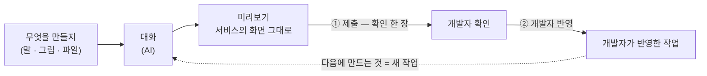

# ColoNova Design 사용 설명서

> 처음이라면 [README](../README.md) 부터 — 세 걸음이면 시작한다. 이 문서는 화면 하나하나,
> 버튼 하나하나를 적은 전체 안내다. 개발자 · 운영자 안내는 [DEVELOPERS.md](DEVELOPERS.md) 에 있다.

**목차** — [알아 둘 말](#알아-둘-말은-둘뿐이다) · [한 바퀴](#작업은-한-바퀴로-흘러간다) ·
[처음 한 번](#1-처음-한-번--체크리스트-한-장) · [틀](#2-틀--사이드바--상태-줄--대화--미리보기) ·
[홈](#3-홈--큰-입력창과-받은-편지함) · [준비](#4-처음-여는-프로젝트--준비) ·
[화면 만들기](#5-화면-만들기--말로) · [미리보기](#6-미리보기에서-확인) ·
[찍기](#7-고칠-곳은-찍어서--말풍선) · [제출](#8-제출--확인-한-장) ·
[코멘트](#9-개발자-코멘트--ai-가-반영한다) · [반영된 뒤](#10-반영된-뒤--받아오기는-도구가-먼저-한다) ·
[작업 기록](#마음이-바뀌면--작업-기록-서랍) · [설정](#설정--여섯-쪽) ·
[문제 문장](#화면의-문제-문장) · [알아두면 편한 것](#알아두면-편한-것) ·
[자주 묻는 질문](#자주-묻는-질문)

## 알아 둘 말은 둘뿐이다

배치는 Claude Desktop 과 같다 — 왼쪽에 대화, 오른쪽에 결과물. 다른 점은 결과물 자리에
**서비스의 실제 화면**이 서고, 그 위에 **상태 줄 하나와 `제출` 하나**가 얹힌다는 것뿐이다.
Claude 를 써 본 사람이 새로 배울 것은 상태 줄, 화면에서 수정할 곳 선택하기, 작업 기록이다.

대화는 설명을 주고받는 자리이고, 화면과 제출은 **프로젝트 전체 작업**이다.
새 대화를 열어도 현재 화면은 그대로 이어진다. 다른 대화에서 만든 변경도 함께 제출된다.

- **제출** — 만든 것을 개발자에게 보낸다. 개발자에게 가는 일은 전부 이 말로 부른다.
  (AI 에게 말을 전하는 것은 `보내기` 다 — 두 뜻에 같은 말을 쓰지 않는다.)
- **개발자 반영 완료** — 개발자가 작업을 합쳤다. 실제 서비스 공개 여부는 담당자에게 확인한다.

**저장이라는 말은 없다** — AI 가 한 차례 답할 때마다 도구가 스스로 그 시점을 보관하므로,
누를 것은 `제출` 하나뿐이다. 보관된 차례들은 `작업 기록`에서 다시 보고 되돌릴 수 있다.

## 작업은 한 바퀴로 흘러간다

대화와 미리보기 위에 걸친 **상태 줄**이 지금 어디쯤인지 말한다. 왼쪽은 대화 제목이다 —
눌러서 그 자리에서 이름을 바꾼다(Enter 는 저장, Esc 는 그만두기. 사이드바가 접혀 있어도
된다). 오른쪽은 `프로젝트 이름 · 프로젝트 전체 작업`, 세 점의 여정, 그리고 `제출`. 여정은
`제출 전 ─ 개발자 확인 ─ 개발자 반영` 이고 지금 점이 국면의 색을 옅게 깐 알(제출 전은 파랑 ·
개발자 확인은 호박색 · 반영은 초록, 막히면 빨강)로 서서 여기라고 말한다. 판정은 전부 기계적
신호(이번 작업에 보관된 것이 있는지, 개발자 쪽에서 보고하는 요청 상태)라 사람이 임의로 바꿀
수 없다.

| 지금 | 첫 점 | 둘째 점 | 셋째 점 |
| --- | --- | --- | --- |
| 아직 제출 전 | `제출 전 · 화면 N개` (막히면 `제출 전 · 제출하지 못했어요`) | `개발자 확인` | `개발자 반영` |
| 개발자에게 가 있음 | `제출됨` | `개발자 확인을 기다려요 · 코멘트 N` | `개발자 반영` |
| 합쳐짐 | `제출됨` | `확인됨` | `개발자 반영 완료` |

개발자 확인을 기다리는 동안 코멘트가 아직 없으면 둘째 점에 며칠째인지가 붙는다 — `개발자 확인을 기다려요 · 2일째`.
제출한 날이 1일째이고 자정이 지나면 하루씩 늘며, 제출한 날에는 아무것도 붙지 않는다. 코멘트가 오면 코멘트 수가 대신
서고, 개발자가 변경을 청한 요청이나 닫힌 요청에는 붙지 않는다. 가장 긴 문장(`· 코멘트 N`)보다 짧아 좁은 창의 접힘
순서는 그대로다(2026-10-07 UX 점검 3단계).

AI 가 도는 동안은 여정 앞에 `만드는 중 · 12초` 가 붙는다(시계는 앱이 아니라 도구의
것이라, 창을 새로 열어도 실제 시작부터 이어 센다). 이때 여정의 테두리가 테마의 포인트
색으로 물들고 아래 끝을 따라 얇은 빛이 지나간다 — 글자를 읽기 전에 도는 중임이 보인다.

창이 좁아지면 오른쪽이 정해진 순서로 접힌다 — `프로젝트 전체 작업` → 프로젝트 이름 → 앞으로
올 점의 글자 → (만드는 중이면) 지금 점의 글자와 시계. 지금 점의 알과 `제출` 은 끝까지
남고, 접힌 글자는 `이번 작업` 에 모두 있다. 900px 보다 좁은 창에서는 제목도 빠진다.

여정을 누르면 **`이번 작업`** 이 열린다 — 바뀐 화면(제목 · 한 줄 · 시각), 제출(시각 ·
작성자 · 받은 개발자 · `제출한 내용 열기` · 최근 제출 기록), 개발자 코멘트(사람 · 글 ·
`개발자 반영`/`고치는 중`), 그리고 `작업 기록 열기`. 아직 제출 전이고 바뀐 화면이
없으면 바뀐 화면 칸은 닫혀 `아직 제출하지 않았어요` 한 문장만 선다. 머리와 바닥은 서 있고
몸만 굴러간다 — 화면은 네 줄까지 먼저 보이고 나머지는 `바뀐 화면 N개 더 보기` 로 펼친다.
화면 줄을 누르면 그 화면으로 간다. 기록을 읽는 중이면 뼈대가, 읽지 못했으면 `읽지 못했어요 ·
다시 시도` 가 선다(없는 척 `아직 없어요` 를 말하지 않는다). 개발자에게 한마디를 쓰던 중에
Esc 는 상자만 접고 쓴 글은 남는다. 막혔을 때는 `담당자에게 보낼 내용 복사` 가 이 팝에도 선다.

## 사용 안내

### 설치 전에 체험하기

[소개 페이지](https://colosseumcoinckr.github.io/colonova-design/)에서 `말하기` · `찍기` · `제출` 장면을 고른다. `재생`을 누르면 순서대로 보여 주고, `일시정지`로 멈춘다. 예시 데모라 실제 서비스는 바뀌지 않는다.

`직접 체험`에서는 문서 놓기 · 검색 · 찍기 · 제출 · 작업 기록을 눌러 본다. 추가 기능과 이전 방식 비교는 펼쳐서 본다. `앱 내려받기`는 준비물과 컴퓨터별 설치 파일이 있는 `시작하기`로 이동한다. 휴대폰에서는 상단 `메뉴`로 구역을 고른다. 개발자는 상단 `개발자 초대장`으로 초대 파일을 만든다. 서비스 준비 조건은 폼 위의 개발자 안내를 펼쳐서 읽는다.

### 1. 처음 한 번 — 체크리스트 한 장

앱을 처음 열면 마법사 대신 체크리스트 한 장이 선다 — **도구 준비 · AI 연결 · 초대
파일**. 항목은 스스로 채워지고, 셋이 다 채워지면 누를 것 없이 작업 화면으로 넘어간다
(`시작하기` 버튼은 없다). 터미널은 열지 않는다.

머리의 **진행 링**이 지금 어디쯤인지 한눈에 말한다 — 로고를 두른 링이 세 조각이고, 지난
항목의 조각은 초록으로 차오르고 지금 할 항목의 조각은 숨 쉰다. 셋이 다 차면 링이 닫히고
로고에 체크가 앉는다(`준비됐어요`). 카드에도 위계가 있다 — 지난 항목은 한 줄로 가라앉고,
**지금 손이 갈 항목 하나**만 강조되며(으뜸 단추는 그 카드에만 선다), 나머지는 평평히
기다린다. 순서를 강요하지는 않는다 — 초대 파일은 AI 연결 전에 놓아도 된다. 항목 오른쪽의
알약이 지금 상태(`설치가 필요해요` · `브라우저에서 로그인` · `필요한 도구 확인됨` …)를 말한다.

- **도구 준비** — 앱이 싣고 온 도구를 확인한다(`필요한 도구 확인됨`).
- **AI 연결** — Claude Code 는 이 앱이 AI 를 부르는 데 쓰는 프로그램이다(설치 전부터 카드가
  그렇게 말한다). 설치 버튼 하나로 사용자 폴더에 깔리고, 설치가 도는 동안 `내려받기 · 설치 ·
  확인` 세 칸 막대가 단계를 따라 차오르며 단계 말(`설치하는 중…`)이 바뀐다. 끝나면 `곧
  브라우저가 열려요` 한 줄이 선 뒤 브라우저가 열리고 — 그동안 카드의 지구본이 기다림을 말한다 —
  내 Claude 계정으로 로그인하면 저절로 돌아온다(브라우저가 안 열리면 `브라우저가 열리지
  않았나요?` 안에 주소와 코드 붙여넣기 칸이 있다). 회사 정책이 설치를 막으면 빨간 안내와
  함께 IT 담당자에게 보낼 문장이 서고, `문장 복사` · `다시 시도` 가 옆에 있다.
  `Codex 도 쓰시나요?` 줄은 `건너뛰기` 로 넘겨도 된다.
- **초대 파일** — 개발자에게 받은 `*.colonova-invite` 를 셋째 항목 안의 자리에 놓거나
  `파일 고르기` 로 고른다. 파일을 끌고 창에 들어서면 놓는 자리가 먼저 숨 쉬며 알려 주고(창
  어디에 놓아도 받는다), 자리 위에 오면 실선으로 선다. 초대장에 실린 프로젝트가 모두
  등록되고 첫 프로젝트가 먼저 열린다. **파일이 아직 없다면** `초대 파일이 아직 없나요?` 를
  누른다 — 개발자에게 보낼 요청 문장(초대장을 만드는 페이지 주소가 들어 있다)이 펼쳐지고
  `문장 복사` 로 복사한다.

창이 낮으면(높이 860px 이하) 머리가 작아지고 놓는 자리가 그림 · 글 · 단추의 짧은 한 줄로
접혀 한 화면에 셋이 들어온다. 동작 줄이기를 켠 창은 링 · 카드가 움직임 없이 같은 모양으로
선다. 마지막 프로젝트를 지운 뒤에 서는 `프로젝트가 없어요` 도 같은 링과 놓는 자리를 쓴다 —
도구 · AI 는 그대로라 링의 두 조각은 이미 차 있다(2026-10-06 온보딩 손질).

첫 작업 화면 위에는 `초대 파일을 가져왔어요 — 휴지통에 넣기 · 나중에` 한 줄이 선다. 파일에
연결 코드가 들어 있어서다 — `휴지통에 넣기` 를 누르면 앱이 대신 파일을 OS 휴지통에 넣는다(지우지는
않는다 — 필요하면 휴지통에서 꺼낼 수 있다).

### 2. 틀 — 사이드바 · 상태 줄 · 대화 · 미리보기

왼쪽 사이드바는 위에서부터 `새 대화 · 홈 · 찾기`, 프로젝트 전환기, **다른 프로젝트
줄**, 날짜 머리 아래의 대화 목록, 접힌 `도구가 한 일`, 바닥의 `기능 제안`과 `설정` 이다.
`새 대화` 는 브랜드 색이 든 알약이 앞에 서서 다른 두 줄과 갈린다. `기능 제안`은
이 앱 자체에 바라는 것을 제작팀의 게시판에 올리는 창이다 — 지금 프로젝트나 도는
작업과 상관없이 쓸 수 있고, 적은 내용과 앱 버전 · 운영체제만 나간다. 접수가
확인되면 보낸 제안의 링크가 서고, 브라우저에서 마무리하거나 접수 여부를 확인하지
못했을 때는 화면의 안내가 다음 일을 말한다. 창 머리의 세 점(`쓰기 · 확인 · 접수`)이 지금
단계를 말하고, 확인 단계에는 `누구나 볼 수 있는 게시판에 올라가요` 고지가 선다(⌘↵ 로
확인으로 넘어간다). 연결이 끊겨 있으면 `제안 보내기` 가 잠기고 쓴 내용은 남는다. 보내는
중에 창을 닫아도 계속 보내며, 접수 소식은 알림 한 줄로 온다. 대화가 아직 하나도 없으면 목록 자리에
`아직 대화가 없어요` 한 줄이 선다.

- **프로젝트 전환기** — 사이드바 머리의 고르는 상자 하나. 누르면 목록이 내려온다:
  프로젝트마다 상태 점과 기다리는 숫자가 서고, 지금 프로젝트에는 체크가 붙고, 아직 열지
  않은 프로젝트에는 `처음 열 때 준비해요` 가 붙는다. 목록 맨 아래의 `프로젝트 정보` 는
  지금 프로젝트의 정보 카드를 연다 — 저장소 · 미리보기 열기, `지켜 줄 것`, 그리고
  `목록에서 빼기`: 확인 카드가 「대화와 작업 파일은 이 컴퓨터에 그대로 있어요」 라고 말한다 —
  단, 설정의 `전체 초기화…` 를 하면 남은 파일도 지워진다 —. AI 작업이나 제출이 도는 동안에는
  빼기가 잠기고 그 이유가 카드 위에 선다. 마지막 프로젝트를 빼면 초대 파일을 다시 열 수 있는
  화면이 선다. `초대 파일로 프로젝트 추가…` 는 개발자가 보낸 초대 파일을 열어 새 프로젝트를
  들인다. 목록은 ↑ ↓ 로 걷고, 다른 프로젝트를 고르면 그 줄에서 도는 표시가 서며 옮기지 못하면
  알림이 말한다.
- **대화 목록** — 새것부터 `오늘 · 어제 · 지난 7일 · 이전` 머리 아래에 선다. 기준은 이
  컴퓨터의 달력이라 자정이 지나면 저절로 한 칸씩 밀리고, 목록을 굴려도 머리는 위에 붙어
  지금 어느 날을 지나는지 말한다. 도는 대화에는 돌림 표시가, 답을 기다리는 대화에는
  호박색 점이, AI 가 답을 못 한 대화에는 빨간 점이 줄 끝에 선다. 지금 열린 대화는 포인트
  색 막대와 진한 글씨로 서고, 목록 밖으로 굴러가 있으면 저절로 보이는 자리로 올라온다.
  긴 제목은 줄에서 잘리니 마우스를 올리면 전체 이름이 뜬다. ↑ ↓ 로 줄 사이를 오가고
  Home/End 는 처음 · 마지막 줄로 간다. 줄에 마우스를 올리면(또는 우클릭 · 메뉴 키) `···`
  메뉴가 뜬다: `이름 바꾸기` · `내보내기`(마크다운 파일로) · `지우기`. 지우기는 확인 카드를
  거친다 — 이 대화의 말과 답이 이 컴퓨터에서 영구히 지워지고 되돌릴 수 없으며, 대기 중인
  말도 함께 사라진다(지금 답하는 중이면 멈추고 지운다는 줄이 더 선다). 초점은 `그만두기` 에
  서고, 지운 뒤에는 이웃 줄로 초점이 가며 알림이 선다. 이 대화에서 만든 화면 작업은 그대로
  남는다. 우클릭 · 메뉴 키 · Shift+F10 으로 연 메뉴도 ↑ ↓ 로 걷는다.
- **다른 프로젝트 줄** — 지금 열려 있지 않은 프로젝트마다 한 줄, 이름과 가장 급한 것
  하나: `준비 중` > `만드는 중` > `답을 기다려요 N` > `코멘트가 왔어요` > `개발자 반영 완료` > 작업 상태.
  누르면 그 프로젝트로 옮긴다. 급한 것부터 셋까지만 서고 나머지는 `프로젝트 N개 더 보기` 가
  전환기를 연다. 코멘트 수는 그 프로젝트의 대화 안에서 확인한다.
  (`AI가 답을 못 했어요` 는 그 프로젝트의 대화 안에서 카드로
  기다린다 — 여기에는 서지 않는다.)
- **도구가 한 일** — 도구가 스스로 연 대화(준비 · 코멘트 반영 · 문제 해결)는 이 접힌 묶음에
  산다. 사람의 대화 목록이 도구의 기록으로 덮이지 않는다. 접혀 있어도 묶음 안에
  실패한 대화가 있으면 이름 옆에 빨간 점이 센다.
- **찾기(⌘K)** — 대화 · 프로젝트를 이름으로 찾아 연다. 아래 칩으로 `새 대화` · `홈` ·
  `설정` 에도 닿는다 — ↑ ↓ 로 훑다 마지막 줄 다음에는 칩이 이어 서고(칩 위에서는 ← →),
  Home/End 는 맨 처음 · 마지막 줄로 옮긴다. Enter 로 연다. 칩 이름을 쳐도 그 칩이 걷는 자리에 서서 Enter 한 번이면 된다. 한글은 쓰는 중에도
  맞는 줄이 사라지지 않고(`결ㅈ` → 결제) 초성(`ㄱㅈ`)으로도 찾는다 — 맞은 글자는 칠해 보이고,
  다른 프로젝트의 대화에는 프로젝트 알약이 붙는다. 맞는 것이 없으면 칩이 그대로 남아 길이 되고,
  프로젝트를 옮기는 중에는 그 줄에 도는 표시가 서며 못 옮기면 판 안에 말이 선다. 판은 닫힐 때도
  다른 창들과 같은 박자로 물러난다. 새 대화는
  ⌘T, 설정은 ⌘, 사이드바를 접고 펴는 것은 ⌘B 다(Windows 는 Ctrl — 화면의 표기도 그렇게
  바뀐다). 단축키의 목록은 ⌘/ 로 언제든 열어 본다 — 하는 일별(앱 · 입력창 · 핀 · 미리보기)로 묶이고 키는 한
알씩 키캡으로 보인다(2026-10-04 ux-plan · 2026-10-06 겹판 손질).

창이 900px 보다 좁아지면 사이드바는 `≡` 뒤로 들어가고, 대화와 미리보기는
`대화 | 화면 · <이름>` 두 탭이 된다. 찍은 곳의 수가 화면 탭에 선다. 사이드바 서랍에는 ✕ 가
있고, 설정을 열면 서랍이 먼저 닫힌다(뒤는 겹판처럼 흐려진다).

넓은 창에서는 대화와 미리보기 사이의 경계를 끌어 폭을 바꾼다 — 대화는 320~640px 안에서
움직이고(미리보기가 360px 밑으로 좁아지지 않게 창이 좁으면 상한이 함께 내려온다), 경계에서
←/→ 는 24px 씩, Enter 는 원래 폭으로 돌아오고 Home/End 는 가장 좁게 · 가장 넓게 움직인다.
마우스로는 경계를 두 번 클릭하면 원래 폭으로 돌아온다. 고른 폭은 다음에 켤 때도 그대로다.
사이드바와 본문 사이의 경계도 같은 식으로 끈다 — 사이드바는 220~420px 안에서 움직이고
(대화와 미리보기가 쓸 자리를 남기려고 창이 좁으면 상한이 내려온다), 경계에서 ←/→ 는
24px 씩, Home/End 는 가장 좁게 · 가장 넓게, Enter 와 두 번 클릭은 원래 폭(264px)으로
돌려 놓는다. 이것도 다음에 켤 때 그대로다. 긴 대화 제목이 잘려 답답하면 넓혀 본다.

화면이 작으면 ⌘= · ⌘- · ⌘0 으로 앱 전체를 키우고 줄인다 — 사이드바 · 대화 ·
상태 줄 · 미리보기가 함께 커지고, 다음에 켤 때도 그대로다. 설정 → 테마의 `글자 크기` 줄에도
같은 안내가 있다.

### 3. 홈 — 큰 입력창과 받은 편지함

사이드바의 `홈` 은 `<이름>님, 무엇을 만들까요?` 와 큰 입력창으로 시작한다. 여기서 보내면
지금 프로젝트의 새 대화가 열리고 작업 화면으로 넘어간다. 입력창은 열리자마자 초점을 받아 바로
칠 수 있고, 초점이 있는 동안 테두리가 포인트 색으로 살짝 번진다. 입력창 아래에는 안내 한 줄과
시작점 칩이 서고, 그 아래가 받은 편지함이다.

- **시작점 칩** — `문구 다듬기 · 빈 화면 안내 · 휴대폰에서 확인 · 간격 정리`. 무엇을 말해야 할지
  막막할 때 요청의 모양을 보여 준다. 누르면 보내지 않고 입력창에 고쳐 쓸 요청 한 줄이 담기고,
  마우스를 올리면 담길 문장이 뜬다. 문장 속 화면 이름 자리는 선택된 채로 담겨서, 이름을 치면 그
  자리가 바뀐다. 이번 작업이 만진 화면이 있으면 가장 나중에 만진 화면의 이름(`‘회원 목록’ 화면의
  문구를 …`)이, 없으면 `화면` · `목록` 같은 낱말이 그 자리에 선다. 입력창에 말이나 첨부가 생기면
  칩은 접혀 물러나고(쓰던 말을 덮지 않는다), 비우면 돌아온다. 연결이 끊긴 동안에도 서지 않는다.
- **끌어다 놓기** — 그림이나 문서는 홈 어디에 놓아도 입력창의 첨부가 된다. 끄는 동안 입력창이
  `여기에 놓으면 첨부돼요` 덮개를 입는다(글이나 링크를 끌 때는 펴지 않는다). 초대 파일은 첨부가
  아니라 가져오기로 넘어간다.

받은 편지함은 있는 묶음만 선다 — 비어 있는 묶음은 그리지 않고, 모두 비면 초록 표시와
`기다리는 일이 없어요` 한 줄만 남는다(연결이 끊긴 동안에는 같은 자리에 이유가 호박색으로 선다).
줄은 앞 그림(도는 표시 · AI 의 답 · 대화 · 프로젝트 표식)과 제목, 그 아래 한 줄, 오른쪽의 시각이다.
프로젝트 표식은 프로젝트가 갈리는 줄에만 서고, 손을 올리면 줄이 밝아진다.

- **답을 기다려요** — AI 가 물어보거나 허락을 구하는 카드. 홈에서 바로 답한다. 홈 행의
  숫자 배지는 이것만 센다 — 내 손이 필요한 일의 수. 카드는 입력창과 같은 바탕에 포인트 색 테두리와
  왼쪽 띠를 입어 이 화면에서 가장 두드러진다.
- **지금 진행 중** — 도는 대화와 준비 중인 프로젝트, 그리고 개발자 확인을 기다리는 요청. 대화 아래에
  지금 하는 일이 한 줄 서고 오른쪽에 걸린 시간이 흐른다. 개발자 확인을 기다리는 프로젝트는 이름 아래에
  `개발자 확인을 기다려요` 가 서고 오른쪽에 며칠째인지(`3일째` — 오늘 낸 것은 `오늘 제출`)가 선다. 오래 기다린
  것이 먼저이고, 누르면 그 프로젝트로 간다. 도는 표식이 없어 AI 가 일하는 줄과 눈으로 갈리고, 내 손이 필요한
  일이 아니라서 `답을 기다려요` 의 수와 사이드바의 숫자 배지에는 세지 않는다. 개발자가 변경을 청한 요청(AI 가
  반영한다)과 반영되거나 닫힌 요청에는 서지 않는다(2026-10-07 UX 점검 3단계).
- **이어서 하기** — 이 프로젝트에서 가장 최근에 나눈 대화 세 개. 위의 묶음에 이미 선 대화와
  도구가 스스로 연 대화는 빼고, 누르면 그 대화가 열린다.
- **방금 있던 일** — 답이 온 대화, 다른 프로젝트의 소식(코멘트 도착 · 반영 · 요청 닫힘),
  그리고 도구가 AI 프로그램을 새 버전으로 바꾼 한 줄(`Claude Code 를 2.2.0 으로
  업데이트했어요`). 아래의 세 묶음을 접어 두면 홈을 나갔다 돌아와도 그 모습이
  그대로다.

대화 이름은 사이드바에서 바꾼 이름을 따르고, 지운 대화는 홈에서도 바로 사라진다. 도구가 스스로
연 대화(`리뷰 반영` 같은 것)는 조용히 끝나면 `방금 있던 일` 에 서지 않고, 끝내 못 끝낸 것만 선다
(2026-10-06 홈 개선).

### 4. 처음 여는 프로젝트 — 준비

등록만 된 프로젝트를 처음 고르면 미리보기 칸이 준비 화면이 된다 — `이 서비스를 이
컴퓨터에서 처음 켜요`, 세 단계(`내려받기 · 설치하기 · 미리보기 켜기`)와 진행 막대. 준비에
몇 분 걸리지만 기다릴 필요는 없다: **준비되는 동안 먼저 말해 두면** 대화에
`준비가 끝나면 바로 보낼게요` 로 줄을 섰다가 끝나는 대로 나간다. 답이 도는 중에
보낸 말도 줄에 섰다가 답이 끝나면 나가는데, 줄의 `지금 보내기`를 누르면 돌아가던
답을 멈추고 이 말을 먼저 보낸다 — 대화에는 `돌아가는 답을 멈추고 이 말을 먼저
보내요` 카드가 먼저 선다. 다른 프로젝트로 갔다
와도 준비는 이어지고, 뒤에서 끝나면 OS 알림이 온다. 준비 중에는 찍기가 잠긴다.

### 5. 화면 만들기 — 말로

원하는 화면을 말로 보낸다 — 그림이나 문서(한 건 8MB 까지)를 끌어다 놓거나 붙여도 된다.
입력창의 모델 칩에서 모델과 생각 시간을 고른다. 모델이 빠른 응답을 받으면(Claude 는
Opus) 칩 옆에 번개가 서서 같은 모델의 빠른 응답을 켤 수 있다 — 구독의 빠르게는 요금제
사용량이 아니라 빠르게에 쓰는 남은 양에서 같은 답에 약 2배로 빠진다. 번개에 마우스를 올리면 그
말이 뜬다. AI 는 대화를 열기 전에만 고른다 — 열린 대화의 칩은 그 대화의 AI 를 이름으로만
말한다. 모델이 많으면 `다른 모델 N개 더 보기` 를 먼저 눌러야 칩 팝의 거르는 칸이
나타나고, 거기에 이름을 치자 — `opus` 처럼 한 조각으로도
닿는다. 사용량은 한도에 가까워질 때만 모델 칩 옆에 한 단어로 선다. 칩 팝의 `사용량` 칸은 창을
모두 한 줄씩 세운다 — `이번 5시간` · `이번 주` · 모델마다 따로 있는 창(`Fable · 이번 주`),
줄마다 쓴 비율과 다시 차는 때(`10월 3일(토) 03:00에 다시 차요`). Codex 도 같다(무료 요금제는
`이번 달` 한 줄). 열린 대화가 없어도 칸을 열 때 그 AI 계정을 다시 읽으므로, 다른 곳에서 쓴
만큼도 따라온다. 확인 방식은 고를 것이 없다 — AI 는 묻지 않고 진행한다. 칩 팝은 키보드만으로 쓴다 —
Enter 로 열면 고른 칸에 초점이 오고, AI · 모델 · 생각 시간 세 줄은 각각 Tab 정지 하나이며
← → ↑ ↓ · Home · End 로 걷는다(AI 와 생각 시간은 걷는 대로 바뀌고 모델은 Enter 로 골라야 바뀐다).
사용량을 읽는 동안은 `사용량` 머리 옆에 작은 도는 표시만 서서 줄이 출렁이지 않고, 못 읽으면 머리
오른쪽에 `읽지 못했어요 · 다시 시도` 가 선다.

AI 가 도는 동안 대화 맨 아래에는 진행 줄이 한 줄 선다 — 도는 표시 · 지금 하는 일의 말 · 흐른 시간이다. 말은 `화면을 살펴보는 중` · `화면 파일을 고치는 중` · `검사를 돌리는 중` 이고, 무엇을 하는지 모를 때는 `작업 중` 이다(상태 줄의 `만드는 중` 알약도 같은 말을 쓴다). 말은 적어도 1.5초는 머문다 — 몇 초 사이에 바뀌어도 줄이 깜빡이지 않는다. AI 가 이번 요청의 할 일 목록을 냈을 때만 `2/5 단계` 가 곁에 붙는다 — 끝난 일 수와 전체 수이고, 목록의 글은 싣지 않는다. 목록이 없거나 한 줄뿐이거나 지난 요청의 것이면 숫자는 없다(꾸며서 말하지 않는다). 글이 흐르는 동안은 줄이 접혀 자리를 내준다(2026-10-06 UX 점검).

화면을 고친 답 아래에는 **`고친 화면` 카드**가 선다. 카드는 위에서부터 해당 요청의 사진 · 화면 제목과 `현재 화면 열기` · `추가 수정`과 `수정 전·후 보기`다. 수정 전 사진이 있으면 사진 위의 `수정 전 | 수정 후` 로 카드 안에서 바로 넘겨 본다(처음에는 수정 후 — 같은 자리 · 같은 크기로 바뀌어 달라진 곳이 눈에 띈다). 카드 아래에는 AI 가 끝난 뒤 도구가 스스로 한 확인이 문제 없이 지나갔을 때만 한 줄이 선다 — `화면 2곳을 다시 열어 확인했어요 · 비거나 오류가 나는 곳이 없고 휴대폰 크기에서도 옆으로 밀리지 않아요`. 세는 화면은 실제로 열린 화면이고, 휴대폰 크기는 그 점검이 돈 때만 말한다(못 돌았으면 그 말은 빠진다). 문제를 찾았거나 확인하지 못한 턴에는 이 줄이 없다 — 찾았을 때는 `화면 확인` 카드가 말한다. 카드는 요청과 설명을 되풀이하지 않는다 — 바로 위가 그 요청의 답이기 때문이다. 화면 확인이 문제를 찾아 AI 가 스스로 고친 요청에서만 카드가 `관련 요청`과 `답변에서 설명한 변경`을 다시 적는다(고침 카드가 사이에 끼어 카드가 원래 요청에서 멀어진다). 사진이나 제목을 누르면 현재 화면이 열리고(`현재 화면 열기`는 이후 변경도 포함한 실제 화면이다), `수정 전·후 보기`는 해당 요청 당시의 사진을 비교한다. 사진이 아직 오는 중이면 같은 크기의 빈 자리가 연하게 빛나고, 없거나 불러오지 못하면 그 상태를 한 줄로 말한다 — 못 불러왔을 때는 `다시 시도`가 곁에 선다. 사진이 어느 때의 모습인지는 카드마다 되풀이하지 않고 묶음 아래에서 한 번만 말한다. 방금 끝난 답의 카드는 올라오며 테두리에 포인트 색이 한 번 번졌다 가라앉는다. 답이 끝나면 미리보기가 그 화면으로 스스로 옮겨 간다(이미 보고 있으면 그대로 둔다).

답 끝에 AI가 남긴 화면 링크 줄은 이 카드가 대신하므로 글에서는 빠지고, 문장 속 링크는 그대로 남는다. 답 아래에는 구분선 없이 한 줄이 선다 — 끝났다는 초록 표시와 걸린 시간(모르면 `끝났어요`), 그리고 글자 없이 그림만 있는 복사 단추와 `···` 단추다. 복사 단추의 이름은 `이 답변만 복사`이고, 누르면 그림이 초록 확인으로 바뀌며 `복사했어요`가 곁에 선다. `···` 는 메뉴다(↑ ↓ · Home · End) — `여기서 새 대화`(대화만 이어받고 화면은 그대로) · `작업 기록에서
되돌리기` · `전체 복사`. 갈래를 못 내는 AI 에서는 `여기서 새 대화` 가 이유와 함께 흐려져 남는다. 복사했다는
말은 줄의 확인 표시 한 곳에서만 하고, 알림은 복사하지 못했을 때만 뜬다. 글이 흐르는 동안은 AI의 얼굴(반짝이)이 숨 쉬듯 돌다가 답이 끝나면 가라앉는다(2026-10-06 채팅 결과창 개선).

보낸 말의 `고쳐서 다시 보내기` 는 말풍선 왼쪽 아래에 매달린 연필 단추다 — 마우스를 올리면
진하게 뜨고(마지막 말의 것은 올리기 전에도 연하게 보인다), 터치처럼 올릴 마우스가 없는
곳에서는 모든 말에서 늘 연하게 보인다. 연필에 올리면 `이 말부터 새 대화로 갈라서 고쳐
보내요 · 화면은 그대로예요` 풍선이 뜬다. 누르면 그 말 앞까지 이어받은 새 대화를
열고 입력창에 그 말을 채운다. 화면은 지금 그대로다. 찍은 곳과 함께 보낸 말이라면
문장만 입력창에 채운다 — 보내면 찍은 곳의 기록과 그림이 원래 말에서 그대로 따라나선다.
대화가 길어져 입력창 위의
`대화가 길어졌어요` 안내가 서면 곁의 `새 대화` 로 바로 이어 갈 수 있다.
빈 입력창에서 ⌥↑ · ⌥↓ 로 보낸 말을 하나씩 거슬러 불러 다시 쓴다(Windows 는
Alt) — 제일 최신에서 ⌥↓ 를 누르면 빈 입력창으로 돌아온다(2026-10-04 ux-plan).

### 6. 미리보기에서 확인

미리보기는 그 서비스의 앱을 그대로 띄운 것이고, 화면의 모든 컨트롤(검색 · 버튼 ·
폼)은 실제 목 데이터와 동작한다. 막대 왼쪽에는 뒤로 · 앞으로 · 새로 고침과 주소창이,
오른쪽에는 화면 크기(PC · 태블릿 · 휴대폰), `수정할 곳 선택`, `작업 기록`, `···` 가 한
묶음으로 선다. `수정할 곳 선택`은 이 막대의 주 단추다 — 쉴 때도 포인트색 옅은 알약이고,
켜면 속이 차며, 입력창에 담긴 곳이 있으면 개수가 숫자로 붙는다. 화면을 불러오는 중이면
새로 고침 그림이 돌고, 단추에 마우스를 올리면 단축키가 함께 뜬다(뒤로 ⌘[ · 앞으로 ⌘] ·
새로 고침 ⌘R · 주소 ⌘L). 창이 좁아지면 덜 급한 것부터 접힌다 — `작업 기록`의 글자와
주소창의 `⌘L` 이 먼저, 이어서 `수정할 곳 선택`의 글자(개수는 단추 모서리의 숫자로 남는다),
아주 좁으면 앞으로 단추까지. 화면 크기는 언제나 아이콘 세 개로 남는다(2026-10-06).

- **주소창**은 화면 이름을 보인다. 이 대화에서 만든 화면 위에 있으면 이름 뒤에 포인트색 점이
  서고(마우스를 올리면 뜻이 뜬다), 열려 있는 동안은 포인트색 테두리가 선다. 누르면 `이
  대화에서 만든 화면` 과 `다른 화면` 이 제목으로 줄을 서고, 글자를 치면 거른다(`/` 로
  시작하면 그 주소로 간다).
- **배율 알약** — 배율이 100% 가 아닐 때만 `작업 기록` 곁에 `80%` 같은 알약이 선다(데스크톱
  앱). 누르면 실제 크기로 돌아간다 — 메뉴 안에 숨은 상태가 막대에서도 보인다.
- **`···`** — 배율(작게 · 실제 크기로 · 크게 — 미리보기 칸만 움직인다), `AI에게 이 화면
  보여 주기`(짚을 곳이 없는데 이상할 때 지금 화면을 입력창에 담는다), `제출한 때의 화면
  보기`(개발자가 받은 모습 그대로), `마지막 제출과 비교`(아래 비교 절), 단축키.

실제로 고친 요청의 결과에는 관련 요청과 답변에서 발췌한 변경 설명이 함께 나온다 — 발췌는 평문이라 강조 별표 · 표의 세로줄 · 링크 주소는 걷히고, 표와 코드는 설명이 아니라 자료라 빠지며 석 줄을 넘으면 말줄임으로 끝난다. 사진은 그 요청이 끝났을 때의 모습이며, `현재 화면 열기`는 이후 변경도 포함한 실제 화면을 연다. `추가 수정`은 기존 입력 내용을 보존하며 화면 정보와 수정 초안을 담는다. 내용을 다듬은 뒤 직접 보낸다.

화면 목록에는 `최근 수정`이 보인다 — 마지막 저장에서 실제로 바뀐 화면을 찾는 표시다.

설명이나 관찰만 요청해 파일 내용이 바뀌지 않았다면, 핀을 보냈어도 자동 수정은 시작하지 않는다.
화면을 실제로 고친 답에는 확인 결과가 남는다. 다시 검사해 문제없음을 확인한 경우에만 통과로 표시하고,
변경 없음·문제 남음·확인 실패·중단은 각각 구분한다.

화면에 오류가 나거나 앱이 뜨지 않아도 사람이 할 일은 거의 없다 — 고쳐 달라는 버튼이
뜨지는 않는다. 도구가 그 화면을 다시 열어 확인하고, 정말 깨져 있으면 AI 가 알아서
고친다(`AI가 막힌 곳을 고치고 있어요` — 고침이 2 분을 넘기면 `화면이 계속 안 뜨면 창을
다시 열어도 돼요` 안내가 덮개에 더해진다). PC 크기에서 멀쩡한 화면은 도구가 휴대폰 크기로
한 번 더 열어 보고, 화면이 옆으로 밀리면 그것도 같은 길로 AI 가 고친다. 화면 낭독기가
읽을 이름이 없는 버튼 · 입력칸이나 너무 흐려서 읽기 어려운 글자가 새로 생겨도 마찬가지다 —
같은 화면에서 이미 말한 것은 다시 말하지 않는다. 미리보기가 저절로 꺼지면 도구가 먼저
다시 켠다(`화면을 다시 켜는 중이에요`). 화면이 10 초가 넘게 뜨지 않으면 `화면이 늦게
뜨고 있어요` 가 서고, 30 초가 넘으면 도구가 한 번 다시 불러오고, 그래도 멈춰 있으면
`다시 불러 봤어요 · 그래도 안 뜨면 AI가 확인해요` 로 바꿔 말한다. 미리보기를 여는 데
실패했을 때만 `화면을 띄우지 못했어요` 카드가 서고, `다시 시도` 를 누르면 미리보기를
다시 읽는다.

### 7. 고칠 곳은 찍어서 — 말풍선

막대의 `수정할 곳 선택`(⌘⇧P)을 켜면 단추가 속이 차고 `수정할 곳 선택 중`과 선택한 개수가
보인다 — 개수는 단추에도 숫자로 붙는다. `선택 끝내기` 또는 Esc로 끈다. 처음 준비된 화면에서는 짧은 안내가 한 번 나온다. 켜지 않아도 option(⌥)+클릭은 언제든 된다. 요소를 누르면 그 자리에 핀이 찍히고,
끌면 영역을 짚는다. 누른 자리를 담지 못했을 때는 `이 자리는 담지 못했어요 · 다시 눌러 주세요` 가 한 줄로 뜬다.

찍는 순간 핀 옆에 **말풍선**이 뜬다 — 번호 · 짚은 것의 이름(버튼의 글자 같은 것, 알 수
없으면 `찍은 곳`) · 화면 이름 · 메모(네 줄까지 자란다 — ↵ 담기 · ⇧↵ 줄바꿈 · ⌘↵ 보내기). `담기`(↵)는 메모를 입력창의 같은 번호 칩에 담아
두고 더 찍게 하는 주 단추이고, `지금 보내기`(⌘↵)는 바로 보낸다. `Esc` 는 말풍선을
닫는다 — 친 메모는 칩에 그대로 남는다. 미리보기 화면 안을 짚고 있을 때에도
`Esc` 는 먹는다(2026-10-04 ux-plan).
`요소 정보` 를 펼쳐 말풍선이 길어져도 짚은 곳에서 떨어지지 않고, 칸보다 길면 안쪽이 굴러간다.
휴지통은 그 핀을 뺀다. 핀은 첨부다 — 여러 곳을 찍은 뒤 입력창에서 문장 하나와 함께
보내면 된다. 핀만 찍고 말이 어디에도 없으면(입력창도 핀 메모도 비어 있으면) 보내지 않고
`무엇을 바꿀지 한 줄 적어 주세요` 가 선다 — 말풍선의 `지금 보내기` 도 같다. 핀이 여섯 곳을 넘으면
사진은 앞 여섯 곳만 함께 가고 나머지는 자리만 간다고 핀 줄 아래에 적힌다. 보낸 핀은 답이 도는 동안 흐린 색으로 남았다가 답이 끝나면 사라진다.
보낸 말풍선에서는 핀마다 번호(사진이 있으면 사진 귀퉁이에 번호가 걸린다) 곁에 이름표와
메모가 두 줄로 서서, 좁은 대화 칸에서도 이름이 갈라지지 않는다. 이름표는 줄바꿈으로
나뉜 글(`서비스를` ↵ `선택하세요`)도 띄어서 읽는다.
뜻은 문장이 정한다 — "고쳐 줘" 면 고치고 "이게 뭐야?" 면 설명한다.

### 8. 제출 — 확인 한 장

상태 줄의 `제출`을 누르면 프로젝트 이름과 실제 제출할 변경 목록을 새로 읽는다. 확인 창의 맨 위 한 줄이
무엇이 누구에게 가는지 먼저 말하고(`바뀐 화면 N개를 …에게 제출해요`), 안내는 `제출 범위 자세히`
에 접혀 있다. 한마디 입력과 단추는 바닥에 고정돼 화면이 많아도 늘 보인다.
처음 제출하는 확인 창에는 요약 줄 아래에 `개발자에게는 이렇게 보여요` 상자가 선다 — 개발자가 처음 읽는 제목(종류 접두어와 작성자 꼬리는 뗀 문장)과 AI 가 쓴 설명의 첫 대목, 함께 가는 화면 사진 수다. 그 글은 AI 가 쓰므로 사용자가 고칠 길은 아래 `개발자에게 한마디` 뿐이고, 상자의 마지막 줄이 그 길을 가리킨다. AI 가 글을 쓰지 못하면 처음 한 말이 제목이 되고 그 사실을 말한다. 읽는 데 몇 초 걸려도 제출을 막지 않고, 못 읽으면 상자가 서지 않는다. 이미 열린 요청에 더해 제출하는 확인 창에는 `이미 열린 요청` 상자가 지금의 제목만 말한다 — 제목과 설명은 개발자의 것이라 바뀌지 않고, 바뀐 내용과 한마디만 새로 고쳐진다(2026-10-07 UX 점검 3단계).
제출한 뒤 새로 바뀐 화면을 먼저 보여 주고, 앞서 제출한 화면은 `앞서 제출한 화면 N곳`을
펼쳐 본다. 최종 변경이 남은 화면의 이름과 관련 요청, 받을 개발자를 확인하고 선택 사항인
`개발자에게 한마디`를 적어 제출한다. 다른 대화의 변경도 포함된다.
각 화면의 `현재 화면 열기`와 `수정 전·후 보기`로 살펴 볼 수 있다. 화면을 보러 확인 창을 닫았다 다시 열어도 한마디는 프로젝트별로 남는다.
화면과 연결되지 않은 변경은 `화면에 드러나지 않은 변경 N건`을 펼쳐 관련 요청과 최종 변경 파일 수를 본다.
자동 최신화 기록과 되돌려 사라진 변경은 제출 변경으로 세지 않는다. 최종 변경이 없다면
`제출할 변경이 없어요`로 표시하고 제출하지 않는다.

읽는 중이거나 읽기에 실패하면 제출할 수 없으며, `다시 확인`으로 목록을 다시 읽는다. 보내다 실패하면
목록은 그대로 두고 단추가 `다시 제출` 이 된다. 제출이 끝나면 확인 창이 물러난다.
확인한 뒤 작업이 달라져도 다시 확인해야 한다. 이미 열린 요청이 있으면
`같은 요청에 더해 제출할까요?`로 묻고 제출한 뒤 바뀐 곳을 보여 준다.
제출 후의 수정도 같은 개발자 확인 요청에 이어진다. 서비스 원본은 개발자가 반영하기 전까지 그대로다.
설정에 적은 이름은 새 요청의 제목과 설명에 작성자로 표시된다. 다시 제출할 때는 기존 제목을 유지한다.
GitHub에 기록되는 계정은 초대 파일의 연결 코드가 정한다. 컴퓨터에서 쓰던 개인 계정 설정은 바꾸지 않는다.

버튼이 스스로 답한다 — `제출하는 중…` → `제출됐어요`. 잠겨 있으면 누를 때 이유가 버튼
아래 한 줄로 서고(예: `AI가 고치는 중 — 끝나면 제출할 수 있어요`), 키보드로 버튼에 머무는
동안에는 그 줄이 사라지지 않는다. 확인 창에서 조건이 아직 못 맞은 채로 Enter 나 제출을
누르면 조용히 끝나지 않고 그 이유 줄로 눈과 초점이 옮겨간다. 제출이 끝나면 대화에
영수증이 선다 — `개발자에게 제출했어요`(오늘이 아니면 날짜까지), 보낸 화면(확인 창의 목록 그대로 —
`보낸 화면 5개 · 회원 목록 · 회원 상세 · 결제 내역 외 2곳`. 대화로 낸 제출은 확인 창이 없어 이 줄이 없다), 받을 개발자, 내 한마디.
처음 제출에는 `이제부터` 세 줄이 더 선다 — 개발자가 코멘트를 남기면 이 대화에 카드로 오고 AI 가 바로 반영해 같은 요청에 다시 제출한다는 것,
서비스 원본은 개발자가 반영하기 전까지 그대로라는 것, 그리고 소식이 오는 길(`개발자 소식은 앱이 켜져 있으면 알림으로 오고, 꺼 두면 다시 켤
때 홈에서 알려요`). 요청에 적힌 개발자를 확인하지 못했으면 호박색 줄이 `받을 개발자를 확인하지 못했어요 — 알림이 가지 않았을 수 있으니 제출한 내용의 링크를
개발자에게 전해 주세요` 를 말하고 `링크 복사` 단추가 선다 — 팀 단위 코드 소유자처럼 도구가 볼 수 없는 지정이 있으면 알림은 갔을 수 있어
「없다」 가 아니라 「확인하지 못했다」 고 말한다(2026-10-07 UX 점검 3단계). 앱은 mac 에서 창을 닫아도 켜져
있지만 Windows · Linux 에서는 창을 닫으면 끝난다 — 그동안의 일은 다시 켜면 홈에 와 있다. 보낸 한마디는 다음
제출에 다시 실리지 않게 비워진다. 제출은 대화로도 된다 —
"개발자에게 보내 줘"라고 분명히 말하면 확인 없이 AI 가 제출을 부탁한다.

제출이 잠깐 막히면 버튼이 `다시 제출하는 중…` 이 되고 도구가 다시 제출한다. 개발자가
풀어야 하는 문제면 상태 줄이 `제출 전 · 제출하지 못했어요` 가 되고, 문제 문장
`제출이 멈췄어요`가 선다. 실제 전달에 성공한 경우에만 `개발자에게 알렸어요`라고 말한다.
전달 여부를 확인하지 못했다면 `도움 요청 내용 복사`로 담당자에게 전할 내용을 복사한다.
작업은 보관돼 있고, 문제가 풀리면 도구가 다시 제출한다. 인터넷이 끊겨 막힌 것은 개발자 몫이 아니다 —
`인터넷 연결이 끊겨 멈췄어요` 라고 말하고, 담당자에게 보낼 말도 `개발자에게 알렸어요` 도 없이 연결이
돌아오면 도구가 다시 제출한다(OS 알림도 같은 말이다).

### 9. 개발자 코멘트 — AI 가 반영한다

개발자가 코멘트를 남기면 대화에 카드가 선다 — 사람 · 글 · 상태(`AI가 반영하는 중` →
`반영해 같은 요청에 다시 제출했어요`) · `답하기`. 동의 버튼은 없다: AI 가 바로 반영하고
같은 요청에 다시 실어 보낸다. `이번 작업` 의 코멘트 칸이 그 장부다.

### 10. 반영된 뒤 — 받아오기는 도구가 먼저 한다

요청이 합쳐지면 여정의 셋째 점이 `개발자 반영 완료` 가 되고, 다음에 만드는 것은 새 작업이다.
개발자가 반영한 내용은 도구가 스스로 받아 온다 — 늘 지켜보다가(지금 프로젝트는 2 분마다,
그 밖은 10 분마다) 반영을 보면 그 자리에서 받아 온다. 아직 보관되지 않은 작업이 있으면
잠시 치워 뒀다가 그 위에 다시 얹는다 — 겹치지 않는 편집은 저절로 합쳐지고, 정말 겹치는
부분만 AI 의 첫 과제가 된다. 받아오기를 기다리는 버튼은 없다.

### 마음이 바뀌면 — 작업 기록 서랍

미리보기 막대의 `작업 기록`(되감는 시계 그림)이 오른쪽에 서랍을 연다. 누르면 시계가 한 바퀴 되감기며
서랍이 들어오고, 다시 누르면 접힌다. AI 가 한 차례 답할 때마다 저절로 보관된 차례가 시간 순으로 줄을
선다 — 제목은 내가 한 말이고, 속이 빈 점이 내 요청이다. 최신 내용을 가져오거나 · 되돌리거나 · 코멘트를
반영한 일은 그림이 든 알로 서고(`의견을 반영했어요` 는 코멘트의 요지가 한 줄 붙는다), 이어서 반영된
차례들은 한 줄에 횟수를 더해 접어 보인다(`최신 내용을 가져왔어요 · 3번`, 2026-10-04 ux-plan). 둘째 줄은
시각(`방금 · 3분 전 · 14:05`)과 그 차례가 만진 화면이고, 맨 위 줄에는 `지금` 이 붙는다. 날의 머리(`오늘 ·
어제 · 10월 2일`)는 굴려도 위에 붙어 어느 날을 보는지 알려 주고, 제출한 시점은 구분선이다.

한 차례가 화면을 만졌으면 줄 밑에 `수정 전·후 보기` 가 있다(화면이 여럿이면 `회원 목록 전·후 보기` 처럼
이름이 붙는다). 줄 어디든(끝의 `여기로 되돌리기`) 누르면 프로젝트 전체의 이후 변경과 영향을 받는 화면을
확인한다 — 확인을 연 동안 그 지점보다 새로운 줄은 글자가 옅어지고 타임라인의 선이 맨 위에서 그 줄까지
포인트색으로 이어져, 되돌리면 사라질 구간이 한눈에 보인다. AI가 작업 중이면 서랍 머리에 이유가 서고, 끝난 뒤
되돌릴 수 있다. 확인은 그 줄 아래에 카드로 서고 시각이 아니라 제목으로 말한다:

> 「회원 목록에 검색창을 넣어 줘」 직후의 화면으로 되돌릴까요?
> `화면 3곳 · 변경 5가지 · 코멘트 반영 포함`
> 기록은 남아요 — 되돌린 것도 다시 되돌릴 수 있어요. 개발자에게는 다음 제출 때 전해져요.
> `그만두기` · `14:05 시점으로 되돌리기`

가장 최근 결과의 `고친 화면` 카드에는 이 서랍을 거치지 않는 지름길이 있다 — `방금 한 것 되돌리기`. 누르면 서랍이
열리며 그 요청 바로 앞의 줄에 확인이 미리 열려 있고, 제목은 `방금 한 것을 되돌릴까요?` 다. 눌러야 되돌아가며
(확인 없이 되돌아가지 않는다) 되돌려도 기록에 남아 다시 되돌릴 수 있다. 단추는 마지막 결과에만 선다 — 작업
기록의 되돌리기는 「그 시점 이후 전부」 를 되돌리므로 옛 카드에 달면 이름이 거짓이 된다. 그 요청의 보관이 기록의 맨
위가 아니면(그 뒤에 코멘트 반영 · 가져오기 · 다른 요청이 쌓였다) 단추가 서지 않고 이 서랍에서 고른다. 그 사이
쌓인 것이 있어 줄이 달라졌으면 확인은 그 줄의 제목으로 묻는다.

초점은 `그만두기` 에 서고(되돌리는 동안에도 그대로), 접히면 그 줄로 돌아온다. 읽지 못했으면 알림 옆에
`다시 시도` 가 있고, 되돌리지 못했으면 카드 안에 알림이 서서 같은 단추로 다시 해 볼 수 있다. 되돌리는 동안
서랍을 닫아도 일은 계속되고(머리에 `되돌리는 중…` 이 선다), 끝나면 토스트로 알린다. 되돌리기가 끝나면 서랍이
저절로 접혀 되돌아온 화면이 곧바로 보인다 — 되돌린 일도 기록으로 쌓이니 다시 열면 맨 위에 `이전 모습으로
되돌렸어요` 가 내려앉는다. 그새 다른 곳(입력창 …)에서 글을 쓰고 있었다면 초점은 건드리지 않는다.

서랍은 `작업 기록` 을 다시 누르거나 ✕ · Esc 로 닫는다(Esc 는 열린 확인부터 접고, 미리보기 화면 안에 초점이
있어도 닫는다). 홈으로 나가거나 좁은 창에서 대화 탭으로 가거나 프로젝트를 옮겨도 접힌다. 폭이 좁은 칸(480px
이하)에서는 서랍이 화면을 덮는 시트가 되어 왼쪽의 어두운 띠를 눌러도 닫힌다. 키보드는 `↑ ↓ · Home · End` 로
줄을 훑고 `Enter` 로 확인을 연다 — `Tab` 은 서랍 안에서 돌고, 서랍 밖(입력창 · 막대의 다른 단추)의 `Tab` 은
건드리지 않는다. 닫히면 초점이 서랍을 연 `작업 기록` 단추로 돌아온다. 움직임을 줄인 컴퓨터에서는 서랍이
미끄러지지 않고 곧바로 서며 시계도 돌지 않는다.

되돌리기도 새 기록으로 쌓이므로 역사는 지워지지 않는다. 대화만 되감고 싶으면 한 요청이
끝난 줄의 `···` → `여기서 새 대화` 로 그 답까지를 이어받은 새 대화를 연다(화면은 그대로 —
같은 메뉴에 `작업 기록에서 되돌리기` 링크가 있다). 작업이 반영되고 나면 그 작업의 기록은
사라진다 — 합쳐진 것을 거슬러 갈 수는 없으므로.

### 수정 전후를 비교하려면

`고친 화면` 카드와 작업 기록의 `수정 전·후 보기`를 누르면 같은 요청의 사진을 본다. 보는 방식은
`나란히 · 겹쳐서 · 번갈아` 셋이다 — `겹쳐서` 는 두 사진을 포개 가운데 선을 끌어(← → 로도)
훑고, `번갈아` 는 `수정 전 | 수정 후` 로 한 장씩 크게 본다. 비교 창이 좁으면(920px 미만) `번갈아` 가
먼저 열린다.
수정 전은 요청이 시작되기 전에, 수정 후는 변경이 보관된 뒤 PC 크기로 촬영한다.
화면을 새로 만들었거나 촬영에 실패한 경우에는 해당 사진이 없다고 안내한다.
요청마다 최대 4개 화면을 촬영하고, 지금 보고 있던 화면이 가장 먼저다 — 핀 없이 말로만 부탁해도 그 화면의
수정 전 사진이 남는다. 보고 있지 않던 다른 화면을 고치면 그 화면의 수정 전 사진은 없을 수 있다.
사진은 프로젝트별로 최근 40개 요청, 최대 100MB까지 보관하며 오래된 사진부터 정리한다.
촬영 기록이 없는 이전 요청이나 보관 기간이 지난 사진은 비교할 수 없다고 안내한다.

미리보기의 `···` → `마지막 제출과 비교`에서는 마지막 제출 사진과 현재 화면을 본다.
비교는 사진을 읽는 기능이며 작업을 되돌리지 않는다. `+ −` 로 크게(최대 250%) 하고 끌어서 옮기면 두
사진이 같이 움직이고, `0` 은 처음 크기다. 사진을 불러오는 동안은 같은 크기의 빈자리가 서고, 읽지 못하면
`다시 시도` 가 있다.
`고쳐서 다시 보내기`도 대화의 말을 고칠 뿐 현재 화면을 과거로 돌리지 않는다.
화면을 실제로 되돌리려면 작업 기록을 이용한다.

### 설정 — 여섯 쪽

사이드바 바닥의 `설정`(⌘,)은 왼쪽에 쪽 목록, 오른쪽에 고른 쪽 하나가 서는 창이다 —
`AI · 테마 · 알림 · 연결 · 업데이트` 다섯 쪽과, 맨 아래에 따로 앉은 `개발자용` 이다. 목록은
↑ ↓ 로도 옮기고, 고른 쪽 뒤의 알약이 미끄러져 따라간다. 새 버전이 있거나 연결이 곧 끝나는
쪽은 목록에 `새 버전` · `곧 끝나요` · `끝났어요` 알약이 서고(AI 로그인이 끝난 것은 AI 쪽에 선다),
사이드바 설정 바퀴에 점이 켜진 채 열면 `업데이트` 쪽이 먼저 열린다. 적은 이름은 창을 닫을 때
저장되고(저장 중이면 기다리고, 못 하면 열어 둔 채 이름 칸으로 간다), 이름 칸에서 Esc 는
바뀐 글을 먼저 되돌리고 한 번 더 누르면 닫는다. 창이 좁아지면 목록은 위로 올라가 가로
띠가 되고, 넘치는 쪽 이름은 다음 줄로 감겨 잘리지 않는다.

- **AI** — 다음 새 대화가 쓰는 AI 를 카드로 고른다. 이미 열린 대화는 처음 고른 AI 그대로다.
  쓸 수 없는 AI(설치가 안 됐거나 로그인이 필요한 것)는 접히지 않고 흐린 점선 카드로 같이
  서서 이유와 `설치` · `로그인` 단추를 든다. 설치 · 로그인이 도는 동안은 그 카드 안에서 단계와
  막대가 흐르고, 실패하면 빨간 한 줄과 `다시 시도` 가 선다(원문은 `자세히` 안에 접힌다). 고른
  카드에는 `다음 새 대화에 써요` 가 붙고, 고른 AI 를 지금 쓸 수 없으면 노란 띠가 이유를 말한다.
- **테마** — 화면 전체의 색깔을 고른다. 카드마다 그 테마를 입은 작은 앱 창이 미리 보인다.
  `Claude` 가 기본(지금 모습)이고 `Codex` · `밝음` · `어두움` · `GitHub 밝음/어두움` ·
  `시스템 따르기`(밝음과 어두움을 반반으로 보이고 지금이 어느 쪽인지도 말한다)가 따른다. 고르면
  바로 적용된다.
- **알림** — `다 만들었을 때` 를 `끔 · 오래 걸린 답만 · 모든 답(기본)` 세 칸에서 고르고, 소리
  스위치와 `알림이 오는지 확인`(`시험 알림`)이 아래에 있다. 고른 칸 아래에 한 줄 설명이 선다
  (`1분 넘게 걸린 답만 알려요` 처럼). 시험 알림은 보내는 중이면 단추가 잠기고 결과가 말로 선다.
  고를 수 있는 것은 `다 만들었을 때` 뿐이다 — 확인 요청 · 멈춤 · 화면 확인 실패 · 제출 막힘과 개발자 쪽 소식(반영 ·
  코멘트 · 요청 닫힘)은 언제나 알린다(`내가 봐야 할 일과 개발자 쪽 소식은 언제나 알려요`).
  시험 알림이 오지 않으면 컴퓨터가 알림을 막아 둔 것이다 — 같은 줄의 `시스템 알림 설정 열기`
  로 켠다.
- **연결** — 작업에 적을 이름(제출에 작성자로 적힌다), 연결 상태(`연결 정상 · 프로젝트
  N개` — 곧 끝나거나 끝났으면 노랑 · 빨강으로 말한다), 초대 파일(`초대 파일 열기`).
  연결이 끊겨 있으면 노란 띠가 이유를 말하고 잠긴 단추가 그 띠를 가리킨다. 데스크톱 앱의 `전체 초기화…`는 붉은 선의 위험 구역에 있고 실제 수를 먼저 말한다 — `프로젝트 N개가 지워지고 제출하지 않은 작업 M개는 사라져요 · 이미 제출한 작업과 AI 로그인은 그대로예요`. 확인 상자는 데스크톱이 열고(`취소` 가 기본이며 AI 가 일하는 중이면 그 일도 멈춘다고 알린다), 승인한 뒤 모든 로컬 프로젝트·대화·작업 기록·설정·연결 정보를 지우고 앱을 다시 연다. 프로젝트 전환기에서 `목록에서 뺀` 프로젝트의 남은 파일까지 지워지며, 제출하지 않은 작업은 복구할 수 없다. 이미 제출한 작업과 Claude·Codex 로그인은 유지된다. 다시 열린 첫 화면에 새 초대 파일을 넣으면 된다.
- **업데이트** — 앱 · Claude Code · Codex 가 한 목록이다. 맨 위 띠가 지금을 말한다 — `새 버전
  N개` · `확인하지 못한 항목이 있어요` · `모두 최신이에요` · `확인할 프로그램이 아직 없어요` —
  `마지막 확인 · 11:27` 과 `지금 확인` 이 그 띠에 있다. 앱 줄은 쪽을 열면 스스로 확인해 채운다.
  새 버전은 `2.1.4 → 2.2.0 있어요` 와 `업데이트` 버튼으로 서고, AI 줄은 누르면 그 줄 안에서
  진행 막대가 흐른 뒤 `2.2.0 · 최신이에요 · 11:27에 업데이트했어요` 가 된다. 앱 줄은 한 걸음
  더 있다 — 내려받는 중 → `내려받았어요 · 다시 시작하면 새 버전이 돼요`(`지금 다시 시작` ·
  `나중에`) → 다시 시작하는 중. 내려받기 전에는 다시 시작이라고 말하지 않는다. 확인이 끝까지
  닿지 않으면 `모두 최신이에요` 대신 띠가 `확인하지 못한 항목이 있어요` 로 말하고, 줄은 `확인하지
  못했어요` 옆의 `다시 시도` 로 다시 확인한다. `새 AI 버전은 스스로 설치해요` 가 기본으로 켜져
  있고(누르면 먼저 움직이고 못 바꾸면 되돌아온다), 도는 작업이 있으면 끝난 뒤에 설치한다.
  새 버전은 다음 새 대화부터 쓴다.
- **개발자용** — 보통은 열 일이 없다. 도구 폴더 · 하루 로그 · 진단 줄이 여기 있다.

### 화면의 문제 문장

상태 줄 바로 아래, 대화와 미리보기에 걸쳐 한 줄로 선다.

| 문장 | 뜻 | 할 일 |
| --- | --- | --- |
| `AI가 고치는 중이에요` | 준비 · 미리보기 · 화면의 문제를 AI 가 맡았다 | 없다 |
| `개발자에게 알렸어요` | 개발자에게 실제로 문제를 전달했다 | 없다 — 계속 만들어도 된다 |
| `제출이 멈췄어요` | 전달 여부를 확인하지 못했다. 작업은 보관돼 있다 | `담당자에게 보낼 내용 복사`로 담당자에게 전달 |
| `제출이 멈췄어요` · `인터넷 연결이 끊겨 멈췄어요` | 이 컴퓨터의 인터넷 문제다. 작업은 보관돼 있다 | 없다 — 연결되면 도구가 다시 제출한다 |
| `다시 연결이 필요해요` | 연결 코드가 만료됐거나 AI 로그인이 끝났다 | `초대 파일 열기` 로 새 초대 파일을 놓거나, `브라우저에서 로그인` 한 번 |

연결을 다시 하거나 도움 요청을 전달하는 경우에는 사람의 손이 필요하다. 문제는 한 줄에
하나만 선다 — 열린 문제가 더 있으면 줄 끝에 `+N` 이 더해진다. 문제 문장이 없을 때 그 자리는 방금 가져온 초대 파일의
`휴지통에 넣기 · 나중에` 줄이 쓴다. `개발자에게 알렸어요` 는 끝의 ✕ 로 닫을 수 있다 —
닫아도 문제는 개발자 몫으로 남고, 같은 문제는 다시 서지 않으며 풀렸다 새로 막히면 다시
선다(앱을 다시 켜도 다시 선다 — 알림은 잊으라고 있는 줄이 아니지만, 보고 있는 동안은
같은 말을 반복하지 않게). 복사 단추는 `복사했어요` 로 바뀌었다가 1.5초 뒤 돌아오고, 로그인을 누르면
`브라우저에서 로그인을 마치면 다시 확인해요` 가 선다.

### 알아두면 편한 것

- **스스로 다시 시도** — 보낸 말이 일시적인 문제로 답을 못 받으면 도구가 같은 말로
  조금씩 기다리며 다섯 번 다시 묻는다. 그래도 안 되면 `AI가 답을 못 했어요` 카드가
  `다시 시도` 를 기다린다 — 누르면 찍은 곳과 찍은 그림도, 붙였던 그림과 파일도 원래 말에서 살아 나간다.
  앱을 다시 켠 뒤라 붙였던 것을 되살릴 수 없으면 말만 입력창에 담기고 `첨부는 다시 붙여 주세요` 가
  뜬다 — 사진 없이 말만 가면 AI 가 없는 그림을 어림짐작하기 때문이다. 사용량이 다시 채워질 시각을
  알면 그때 이어서 한다.
- **여러 프로젝트** — 한 번에 하나가 열려 있지만, 떠난 프로젝트의 미리보기는 따뜻하게
  남는다(최근 두 개까지) — 돌아오면 보던 자리 그대로다. 다른 프로젝트에서 돌던 AI 작업은
  끝까지 돌고, 다른 프로젝트 줄이 그것을 말한다.
- **알림** — AI 가 작업을 마치거나 확인을 기다리거나 화면 확인이 대화를 다시 열었을 때 OS
  알림이 온다. 창이 앞에 있으면 조용히 하고, 알림을 누르면 그 대화가 열린다(다른
  프로젝트면 옮기기까지). 창이 뒤에 있는 동안 온 것은 dock 배지가 센다. 개발자 반영 · 코멘트 ·
  요청 닫힘 · 보관 · 제출 실패도 알림으로 온다 — 이 알림을 누르면 그 프로젝트의 홈이 열린다(다른
  프로젝트면 옮기기까지, 소식은 홈의 받은 편지함에 선다). 제목은 `<이름> · <한마디>` 이고 말은 앱 안과
  같은 한 목소리(해요체 · 보관 · 제출 · 반영됨)다. 앱을 끝낼 때 AI 가 일하는 중이면 한 번 묻고(`취소` 가
  기본), 앱이 시작하지 못하면 `기록 폴더 열기` · `끝내기` 상자가 선다.
- **개발자 알림** — AI 도 고칠 수 없는 문제(연결 코드 만료 · 제출 실패 · 두 번 고쳐도 못 넘은
  준비)는 도구가 개발자에게 알린다 — 열린 요청이 있으면 거기에, 없으면 서비스 쪽 게시판에.
  AI 가 대화 안에서 개발자에게 쪽지를 남길 수도 있다 — 프로젝트마다 하루 세 번, 사용자 화면에는
  문제 문장이 서지 않는다. 같은 문제는 한 곳에만 쌓이고, 풀리면 도구가 흔적을 남긴다.
- **미리보기 자리** — 미리보기가 쓰려는 자리를 다른 프로그램이 쓰고 있으면 도구가 그
  프로그램을 정리하고 미리보기를 띄운다.

## 자주 묻는 질문

**연결 코드와 AI 로그인은 어디에 보관되나요?**
OS 자격 증명 저장소(맥 키체인 등)에만 있다. 연결 코드는 컴퓨터에 하나뿐이고 공유 서버를
거치지 않으며, 화면 쪽 코드에는 절대 전달되지 않는다.

**도구가 내 컴퓨터에 남기는 것은 뭔가요?**
홈의 숨은 폴더 하나 `~/.colonova-design/` 전부다 — 설정 파일과 작업 중인 서비스의 복사본.
설정 → `개발자용` 의 `폴더 열기`로 열어 볼 수 있다.

* 옛 버전(Colo Design)의 `~/.colo-design/` 폴더는 0.4.0 부터 읽지 않는다 — 새로 시작하며, 폴더가 남아 있어도 지워도 된다.

**AI 가 엉뚱한 화면을 만들었어요.**
말로 고쳐 달라고 하면 된다. 말부터 다시 하고 싶으면 보낸 말의 `고쳐서 다시 보내기`,
대화만 되감으려면 `···` → `여기서 새 대화`, 화면까지 되돌리려면 `작업 기록` 서랍에서 그
시점으로 돌아간다.

**화면에 `화면에 문제가 생겼어요` 가 떴어요.**
`다시 열기` 를 누르면 된다 — 상태는 전부 도구에 있어 대화와 작업은 그대로다. 같은 문제가 한 분 안에
되풀이되면 `같은 문제가 계속 생겨요` 로 바뀌어 `담당자에게 보낼 내용 복사`(데스크톱은 `기록 폴더 열기`)가
앞에 선다 — 그 내용을 담당자에게 전해 달라.

**`아직 연결되지 않았어요` 가 떴어요.**
앱이 도구에 아직 닿지 못한 것이다. 자동으로 다시 연결하고 있으니 기다려도 되고, `지금 다시 시도` 로
바로 해 볼 수 있다. 계속 안 되면 `다시 열기` 로 앱을 다시 연다.

**AI 프로그램이 죽으면 어떻게 되나요?**
도구가 스스로 다시 일으킨다 — 새 프로그램이 같은 대화를 이어받아 방금 하던 일을 계속하고,
대화에는 그 사실이 한 줄 남는다. 10분에 세 번을 넘게 되살려야 하면 개발자에게 알리고,
화면에는 문제 문장 한 줄만 선다.

**인터넷이 끊기거나 앱을 다시 켜도 되나요?**
연결이 끊겨 다시 붙어도 잃는 것이 없다 — 기다리던 확인 카드는 이중으로 쌓이지 않고,
멈춰 있던 작업의 상태도 그대로 돌아온다.

**터미널이나 프로그램을 직접 설치해야 하나요?**
아니요. 앱이 필요한 도구를 싣고 오고, AI 프로그램의 설치 · 로그인 · 업데이트도 앱 안에서
끝난다. 회사 정책이 설치를 막는 경우에만 IT 담당자에게 보낼 문장을 복사해 준다.

**우리 서비스를 이 도구에 연결하려면요?**
개발자가 소개 페이지의 `초대장 만들기` 폼으로 초대 파일을 만들어 보내면, 사용자는 그 파일을
처음 화면에 놓는 것만으로 연결된다. 자세한 동작은 [연결 레포 만들기](DEVELOPERS.md#연결-레포-만들기)에.

**연결 코드가 만료됐다고 나와요**
문제 문장 `다시 연결이 필요해요` 의 `초대 파일 열기` 로, 개발자에게 받은 새 초대 파일을
놓아 주세요 — 대화와 보관된 작업은 그대로 남아 있어요.
